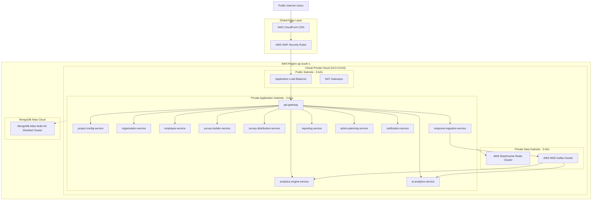

# Talnova Enterprise Survey Platform (TESP)

[](docs/DOC-001-PROJECT-BLUEPRINT.md)
[](docs/DOCUMENT_INDEX.md)
[](docs/DOCUMENT_INDEX.md#jira-engineering-backlog-registry-backlog-series)
[](#)

> **Enterprise-Grade Multi-Tenant Surveying, Real-Time People Analytics & AI-Driven Remediation Platform**

The **Talnova Enterprise Survey Platform (TESP)** is an enterprise employee engagement, pulse surveying, and people analytics platform engineered to process high-volume survey launches, perform multi-dimensional demographic slicing, and drive closed-loop organizational remediation. Built for large enterprise groups, multinational conglomerates, and Daash Global consulting practices, TESP combines strict security (MongoDB Client-Side Field Level Encryption), high-burst reactive ingestion (5,000 req/sec WebFlux), 2D organizational heatmaps, differential privacy guards ($N < 5$), and AI-powered NLP sentiment analysis.

---

## 🏛️ Platform Architecture Overview

TESP is architected as an event-driven, multi-tenant microservices topology deployed on **AWS ECS Fargate**, backed by **MongoDB Atlas**, **AWS ElastiCache Redis**, and **Apache Kafka**.



---

## 🚀 Key Technical Innovations

- **Materialized Path Hierarchy Engine**: Hierarchical organizational structure modeled via String Materialized Paths (e.g., `,ROOT,N-101,N-201,`), enabling instantaneous sub-tree queries using indexed regex patterns (`^,N-101,`) with atomic re-parenting transactions.
- **Client-Side Field Level Encryption (CSFLE)**: Employee PII (`email`, `fullName`, `phoneNumber`) is encrypted client-side using AWS KMS Data Encryption Keys before persistent storage in MongoDB Atlas.
- **High-Burst Reactive Ingestion & Atomic Token Burn**: Processing up to 5,000 submissions/sec via Spring WebFlux & Netty, using atomic Redis Lua scripts (`DEL tesp:tokens:<token>`) for single-use token invalidation in $< 1.5\text{ ms}$.
- **Differential Privacy & Anonymity Suppression**: Automatic obscuration of scores for small teams ($N < 5$), returning `status: "SUPPRESSED"` across analytics API responses, heatmaps, PDF reports, and Excel exports.
- **AI-Powered Sentiment & PII Sanitizer**: Multi-lingual NLP sentiment analysis (OpenAI GPT-4o / Gemini 1.5 Pro / vLLM Llama 3) with an in-memory PII Regex/NER scrubber protecting employee identities.
- **Bi-Directional Remediation Task Sync**: Closed-loop action planning module featuring an interactive drag-and-drop Kanban board with bi-directional sync to Jira Cloud REST API and Microsoft Planner Graph API.

---

## 🛠️ Technology Stack

| Layer | Primary Technologies |
|---|---|
| **Frontend Web Application** | React 19+, Vite, TypeScript, Tailwind CSS, TanStack Query, TanStack Table / Virtual, `@hello-pangea/dnd`, Recharts, Vitest |
| **Backend Microservices** | Spring Boot 3.3+ (Java 21 Virtual Threads & WebFlux), Spring Cloud Gateway, Netty |
| **Database & Cache** | MongoDB Atlas (Multi-AZ Sharded Cluster + CSFLE), AWS ElastiCache Redis 7.x |
| **Event Streaming & Messaging** | Apache Kafka (AWS MSK Cluster) + Transactional Outbox Pattern |
| **Security & Identity** | OpenID Connect (OIDC) / SAML 2.0, AWS KMS, AWS WAF, Spring Security |
| **Cloud Infrastructure** | AWS ECS Fargate, CloudFront CDN, Application Load Balancer, Terraform |
| **Third-Party Integrations** | Workday, SAP SuccessFactors, AWS SES, Twilio, MS Teams, Slack, Jira Cloud, MS Planner |

---

## 📚 Master Documentation Index

All architectural specifications, feature requirements, and Jira engineering backlogs are maintained in the [`/docs`](docs/DOCUMENT_INDEX.md) directory.

### 1. Master Architecture Registry (DOC Series)

| Document ID | Title | Category | Description | Document Link |
|---|---|---|---|---|
| **DOC-001** | Project Blueprint & Platform Master Architecture | Blueprint | Master system vision, non-functional requirements, tenant model. | [DOC-001](docs/DOC-001-PROJECT-BLUEPRINT.md) |
| **DOC-002** | Service Architecture Specification | Architecture | Microservices topology, inter-service gRPC/REST & Kafka events. | [DOC-002](docs/DOC-002-SERVICE-ARCHITECTURE.md) |
| **DOC-003** | Database Philosophy & Metamodel Specification | Database | MongoDB collections, indexing strategy, CSFLE encryption setup. | [DOC-003](docs/DOC-003-DATABASE-PHILOSOPHY-AND-METAMODEL.md) |
| **DOC-004** | Organization & Hierarchy Domain Specification | Domain Spec | Materialized path tree algorithm & atomic re-parenting engine. | [DOC-004](docs/DOC-004-ORGANIZATION-AND-HIERARCHY-DOMAIN.md) |
| **DOC-005** | Survey Engine Architecture Specification | Backend | Survey JSON AST, state machine, and scoring enums. | [DOC-005](docs/DOC-005-SURVEY-ENGINE-ARCHITECTURE.md) |
| **DOC-006** | Analytics Engine Architecture Specification | Analytics | Faceted aggregation pipelines, 2D heatmaps, and privacy rules. | [DOC-006](docs/DOC-006-ANALYTICS-ENGINE-ARCHITECTURE.md) |
| **DOC-007** | AI Analytics & NLP Architecture Specification | AI/NLP | Multi-lingual sentiment, PII masking, and LLM adapter pattern. | [DOC-007](docs/DOC-007-AI-ANALYTICS-AND-NLP-SPECIFICATION.md) |
| **DOC-008** | Reporting Engine Architecture Specification | Reporting | Headless Chromium PDF & streaming POI Excel export pipelines. | [DOC-008](docs/DOC-008-REPORTING-ENGINE-ARCHITECTURE.md) |
| **DOC-009** | Action Planning Architecture Specification | Workflow | Remediation state machine & bi-directional Jira/Planner sync. | [DOC-009](docs/DOC-009-ACTION-PLANNING-ARCHITECTURE.md) |
| **DOC-010** | User Roles, RBAC & Security Specification | Security | ABAC permissions, JWT claims, KMS keys, and GDPR compliance. | [DOC-010](docs/DOC-010-USER-ROLES-RBAC-AND-SECURITY.md) |
| **DOC-011** | Deployment & Cloud Infrastructure Specification | DevOps | AWS ECS Fargate, Terraform modules, VPC Peering, and CI/CD. | [DOC-011](docs/DOC-011-DEPLOYMENT-AND-CLOUD-INFRASTRUCTURE.md) |
| **DOC-012** | Quality Assurance, Testing & Validation Specification | Testing / QA | Vitest, Playwright E2E, k6 load testing, and test matrices. | [DOC-012](docs/DOC-012-QUALITY-ASSURANCE-AND-TESTING.md) |

---

### 2. Feature Documentation Library (FEAT Series)

| Feature ID | Feature Title | Domain Area | Key Capabilities | Specification Link |
|---|---|---|---|---|
| **FEAT-001** | Project & Workspace Configuration Engine | Governance | Multi-tenant workspace settings, branding, locales, custom attributes. | [FEAT-001](docs/features/FEAT-001-PROJECT-CONFIGURATION.md) |
| **FEAT-002** | Dynamic Organizational Hierarchy Management | Structure | Drag-and-drop hierarchy tree, node re-parenting, bulk CSV import. | [FEAT-002](docs/features/FEAT-002-ORGANIZATION-HIERARCHY.md) |
| **FEAT-003** | Employee Roster & Demographic Management | Identity | CSFLE PII encryption, 100k employee virtualized grid, Workday sync. | [FEAT-003](docs/features/FEAT-003-EMPLOYEE-MANAGEMENT.md) |
| **FEAT-004** | Survey Construction & Logic Builder | Survey Engine | Drag-and-drop canvas, 10+ question types, JSON logic AST, versioning. | [FEAT-004](docs/features/FEAT-004-SURVEY-BUILDER.md) |
| **FEAT-005** | Multi-Channel Survey Distribution Engine | Campaigns | Email, SMS, Kiosk PIN, MS Teams, Slack, single-use token vaulting. | [FEAT-005](docs/features/FEAT-005-SURVEY-DISTRIBUTION.md) |
| **FEAT-006** | Anonymous & Authenticated Response Intake | Ingestion | 5,000 req/sec WebFlux player, atomic Redis token burn, offline PWA. | [FEAT-006](docs/features/FEAT-006-RESPONSE-INTAKE.md) |
| **FEAT-007** | Real-Time Engagement Analytics & Heatmap Engine | Analytics | eNPS calculation, 2D heatmaps, sample size suppression ($N < 5$). | [FEAT-007](docs/features/FEAT-007-ANALYTICS-ENGINE.md) |
| **FEAT-008** | AI-Powered NLP Sentiment & Executive Insights | AI | PII text scrubber, multi-lingual sentiment, AI executive summaries. | [FEAT-008](docs/features/FEAT-008-AI-ANALYTICS.md) |
| **FEAT-009** | White-Label Reporting & PDF/Excel Export | Reporting | White-labeled 10-page executive PDFs, 50k row XLSX streams, S3 links. | [FEAT-009](docs/features/FEAT-009-REPORTING-ENGINE.md) |
| **FEAT-010** | Closed-Loop Action Planning & Remediation | Workflow | Low-score triggers, Kanban board, Jira/Planner sync, ROI verification. | [FEAT-010](docs/features/FEAT-010-ACTION-PLANNING.md) |

---

### 3. Jira Engineering Program Backlog Registry (BACKLOG Series)

| Backlog ID | Feature Title | Epics | Story Points | Sprint Target | Backlog Link |
|---|---|---|---|---|---|
| **BACKLOG-FEAT-001** | Project Configuration Engine Backlog | 9 Epics | 58 Points | Sprints 1.1 – 1.3 | [BACKLOG-001](docs/backlogs/FEAT-001-PROJECT-CONFIGURATION-BACKLOG.md) |
| **BACKLOG-FEAT-002** | Dynamic Organization Hierarchy Backlog | 9 Epics | 68 Points | Sprints 1.3 – 2.2 | [BACKLOG-002](docs/backlogs/FEAT-002-ORGANIZATION-HIERARCHY-BACKLOG.md) |
| **BACKLOG-FEAT-003** | Employee Roster & Demographics Backlog | 9 Epics | 75 Points | Sprints 2.1 – 3.1 | [BACKLOG-003](docs/backlogs/FEAT-003-EMPLOYEE-MANAGEMENT-BACKLOG.md) |
| **BACKLOG-FEAT-004** | Survey Builder & Logic Engine Backlog | 9 Epics | 70 Points | Sprints 2.3 – 3.2 | [BACKLOG-004](docs/backlogs/FEAT-004-SURVEY-BUILDER-BACKLOG.md) |
| **BACKLOG-FEAT-005** | Multi-Channel Survey Distribution Backlog | 9 Epics | 80 Points | Sprints 3.1 – 4.1 | [BACKLOG-005](docs/backlogs/FEAT-005-SURVEY-DISTRIBUTION-BACKLOG.md) |
| **BACKLOG-FEAT-006** | Response Intake Engine Backlog | 9 Epics | 80 Points | Sprints 3.2 – 4.2 | [BACKLOG-006](docs/backlogs/FEAT-006-RESPONSE-INTAKE-BACKLOG.md) |
| **BACKLOG-FEAT-007** | Analytics & Heatmap Engine Backlog | 9 Epics | 82 Points | Sprints 4.1 – 5.1 | [BACKLOG-007](docs/backlogs/FEAT-007-ANALYTICS-ENGINE-BACKLOG.md) |
| **BACKLOG-FEAT-008** | AI Analytics & NLP Sentiment Backlog | 9 Epics | 85 Points | Sprints 4.2 – 5.2 | [BACKLOG-008](docs/backlogs/FEAT-008-AI-ANALYTICS-BACKLOG.md) |
| **BACKLOG-FEAT-009** | Reporting & Export Engine Backlog | 9 Epics | 85 Points | Sprints 5.1 – 6.1 | [BACKLOG-009](docs/backlogs/FEAT-009-REPORTING-ENGINE-BACKLOG.md) |
| **BACKLOG-FEAT-010** | Closed-Loop Action Planning Backlog | 9 Epics | 82 Points | Sprints 5.2 – 6.2 | [BACKLOG-010](docs/backlogs/FEAT-010-ACTION-PLANNING-BACKLOG.md) |
| **TOTAL PROGRAM** | **Master Engineering Backlog** | **90 Epics** | **765 Points** | **Sprints 1.1 – 6.2** | [DOCUMENT_INDEX.md](docs/DOCUMENT_INDEX.md) |

---

## 📂 Directory Structure

```
talnova-enterprise-survey-platform/
├── README.md                           # Master Repository Readme (This Document)
└── docs/                               # Master Documentation Root
    ├── DOCUMENT_INDEX.md               # Master Registry & Status Tracker
    ├── DOCUMENT_DEPENDENCY_GRAPH.md    # Mermaid Architectural Visual Dependency Graph
    ├── AGENTS.md                       # Platform Agent Priority Order & Execution Guidelines
    ├── AI_GENERATION_RULES.md          # Engineering Document Standards & Structure Rules
    ├── ARCHITECTURE_PRINCIPLES.md      # Core Platform Design Principles
    ├── PROJECT_GLOSSARY.md             # Standard Domain Terminology & Enums
    ├── project-overview.md             # Executive Project Context & Scope
    ├── DOC-001-PROJECT-BLUEPRINT.md    # Blueprint & Master Architecture
    ├── DOC-002-SERVICE-ARCHITECTURE.md # Microservices & Event Architecture
    ├── DOC-003-DATABASE-PHILOSOPHY-AND-METAMODEL.md # Mongo Schemas & CSFLE
    ├── DOC-004-ORGANIZATION-AND-HIERARCHY-DOMAIN.md # Org Tree Domain Architecture
    ├── DOC-005-SURVEY-ENGINE-ARCHITECTURE.md # Survey Engine Architecture
    ├── DOC-006-ANALYTICS-ENGINE-ARCHITECTURE.md # Analytics & Privacy Specs
    ├── DOC-007-AI-ANALYTICS-AND-NLP-SPECIFICATION.md # AI NLP & PII Scrubber Specs
    ├── DOC-008-REPORTING-ENGINE-ARCHITECTURE.md # PDF & XLSX Export Specs
    ├── DOC-009-ACTION-PLANNING-ARCHITECTURE.md # Remediation & Sync Specs
    ├── DOC-010-USER-ROLES-RBAC-AND-SECURITY.md # Security, RBAC & KMS Keys
    ├── DOC-011-DEPLOYMENT-AND-CLOUD-INFRASTRUCTURE.md # AWS ECS & Terraform
    ├── DOC-012-QUALITY-ASSURANCE-AND-TESTING.md # QA, Vitest, Playwright, k6
    ├── features/                       # Feature Specifications Library (FEAT-001 to FEAT-010)
    │   ├── FEAT-001-PROJECT-CONFIGURATION.md
    │   ├── FEAT-002-ORGANIZATION-HIERARCHY.md
    │   ├── FEAT-003-EMPLOYEE-MANAGEMENT.md
    │   ├── FEAT-004-SURVEY-BUILDER.md
    │   ├── FEAT-005-SURVEY-DISTRIBUTION.md
    │   ├── FEAT-006-RESPONSE-INTAKE.md
    │   ├── FEAT-007-ANALYTICS-ENGINE.md
    │   ├── FEAT-008-AI-ANALYTICS.md
    │   ├── FEAT-009-REPORTING-ENGINE.md
    │   └── FEAT-010-ACTION-PLANNING.md
    └── backlogs/                       # Jira Engineering Backlogs Library (BACKLOG-FEAT-001 to 010)
        ├── FEAT-001-PROJECT-CONFIGURATION-BACKLOG.md
        ├── FEAT-002-ORGANIZATION-HIERARCHY-BACKLOG.md
        ├── FEAT-003-EMPLOYEE-MANAGEMENT-BACKLOG.md
        ├── FEAT-004-SURVEY-BUILDER-BACKLOG.md
        ├── FEAT-005-SURVEY-DISTRIBUTION-BACKLOG.md
        ├── FEAT-006-RESPONSE-INTAKE-BACKLOG.md
        ├── FEAT-007-ANALYTICS-ENGINE-BACKLOG.md
        ├── FEAT-008-AI-ANALYTICS-BACKLOG.md
        ├── FEAT-009-REPORTING-ENGINE-BACKLOG.md
        └── FEAT-010-ACTION-PLANNING-BACKLOG.md
```

---

## 🚦 Navigation & Execution Guide

### For Software Engineers
- Refer to `DOC-002` (Service Architecture), `DOC-003` (Database Metamodel), and target `FEAT-xxx` specifications before beginning code implementation.
- Execute tasks according to the corresponding `BACKLOG-FEAT-xxx` epic breakdown, following sprint sequencing.

### For Solution Architects & Security Teams
- Review `DOC-001` (Project Blueprint), `DOC-004` (Organization Domain), `DOC-010` (RBAC & KMS Security), and `DOC-011` (Infrastructure).

### For QA & DevOps Engineers
- Refer to `DOC-011` (Deployment & Terraform) for infrastructure provisioning.
- Follow `DOC-012` (QA & Testing) for Vitest unit tests, Playwright E2E suites, and k6 load performance benchmarks.

---

## 🔒 Security & Data Privacy

TESP is built strictly following enterprise security standards:
- **Zero Raw PII Storage**: Client-Side Field Level Encryption (CSFLE) ensures sensitive employee attributes are encrypted before reaching persistent disk.
- **Anonymity Vault Isolation**: Identity mapping tables are isolated in separate databases (`tesp_vault_db`) inaccessible to analytics users.
- **Differential Privacy**: Minimum sample size threshold ($N < 5$) suppresses small team data across UI, API, PDF, and Excel reports.
- **Zero Third-Party AI Data Retention**: PII text scrubber masks personal data prior to external LLM processing under strict zero-retention enterprise API agreements.

---

## 📄 License & Ownership

Copyright © 2026 **Talnova Enterprise Survey Platform**. All rights reserved.  
Designed in collaboration with **Daash Global** Organizational Consulting Practice.
