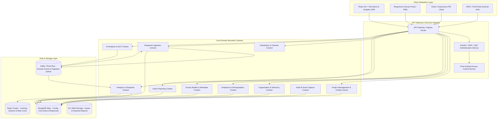

# DOC-001: Project Blueprint & Platform Master Architecture

| Metadata Field | Value |
|---|---|
| **Document ID** | DOC-001 |
| **Title** | Project Blueprint & Platform Master Architecture |
| **Version** | 1.0.0 |
| **Status** | Approved |
| **Owner** | Principal Software Architect |
| **Last Updated** | 2026-08-05 |
| **Dependencies** | `project-overview.md`, `ARCHITECTURE_PRINCIPLES.md`, `PROJECT_GLOSSARY.md` |
| **Related Documents** | `DOCUMENT_INDEX.md`, `DOCUMENT_DEPENDENCY_GRAPH.md` |
| **Implementation Phase** | Phase 1 (Foundation) |

---

## Purpose

This document establishes the master architectural blueprint and foundational domain model for the Talnova Enterprise Survey Platform (TESP). It defines the high-level platform topology, module boundaries, core system abstractions, cross-cutting technical requirements, and project-based configuration paradigm required to support enterprise-scale employee survey, engagement, analytics, and organizational insight workflows. It serves as the primary implementation contract for all subsequent technical architecture, database schema, API service, UI/UX, infrastructure, and QA specifications.

---

## Scope

This blueprint applies to the entire TESP system lifecycle, encompassing:
- Platform isolation and Project configuration metamodel.
- High-level domain decomposition and sub-system interaction patterns.
- Core organizational, survey, response, distribution, analytics, and action planning modules.
- System-wide security, audit, versioning, and privacy frameworks.
- Infrastructure, deployment, scale, and integration principles.

Out of direct scope for this document (covered in downstream specific technical design documents):
- Concrete MongoDB collection JSON schemas (covered in `DOC-003: Database Philosophy & Metamodel`).
- Specific REST/gRPC endpoint specifications (covered in `DOC-002: Service Architecture`).
- Concrete React UI component implementations (covered in Frontend design specs).

---

## Dependencies

This document depends strictly on the following foundational documents:
- `project-overview.md`: Business drivers, high-level vision, target customer tiers, and module inventory.
- `ARCHITECTURE_PRINCIPLES.md`: Non-negotiable technical constraints (Metadata Driven, Configuration over Code, Zero Hardcoded Hierarchies, CQRS Ready, Event Driven, Everything Versioned, Everything Auditable).
- `PROJECT_GLOSSARY.md`: Canonical domain terminology.

---

## Definitions

The following terms are defined in alignment with `PROJECT_GLOSSARY.md` and are mandatory across all platform implementations:

| Term | Implementation Definition |
|---|---|
| **Platform** | The core multi-tenant runtime engine and infrastructure hosting all isolated Project environments. |
| **Project** | An isolated, fully configurable enterprise deployment representing a single enterprise client implementation with dedicated configurations, dataset schemas, user roles, branding, and surveys. |
| **Organization Node** | A dynamic node in an arbitrary, n-depth hierarchical tree representing an organizational unit (e.g., Company, Sector, Division, Branch, Department, Team). |
| **Hierarchy** | The directed acyclic graph (DAG) or tree structure composed of parent-child Organization Nodes defining enterprise structure. |
| **Survey** | A versioned, metadata-driven questionnaire definition consisting of Pages, Sections, Questions, Logic, and Validation Rules. |
| **Survey Campaign** | An active or scheduled distribution instance of a Survey target to a specified set of participants across specific distribution channels. |
| **Question** | The atomic unit of data collection within a Survey, defined by a specific type (e.g., Likert, NPS, Matrix, Short Text), scoring configuration, and localization strings. |
| **Question Library** | A centralized catalog of reusable, standardized Question templates and measurement instruments. |
| **Question Group** | A thematic cluster of Questions mapped to specific analytical dimensions or engagement indices (e.g., Leadership, Work Environment). |
| **Response** | The immutable set of answers submitted by a participant for a specific Survey Campaign instance. |
| **Snapshot** | An immutable analytical aggregation state captured at a point in time for historical reporting and trend benchmarking. |
| **Distribution** | The execution mechanics and payload delivering Survey invitations via configured channels (Email, SMS, PIN, Kiosk, Teams, Slack). |
| **Dashboard** | A role-tailored dynamic composition of analytical Widgets visualising metrics, response rates, heatmaps, and sentiment. |
| **Insight** | An AI-generated or algorithmic finding derived from response sentiment, text clustering, or demographic variance. |
| **Action Plan** | A structured, trackable improvement initiative created in response to survey findings with assigned owners, milestones, and status. |
| **Metadata** | Dynamic key-value attributes attached to Projects, Organization Nodes, Employees, or Responses without database schema modification. |
| **Template** | Reusable structural configurations for Surveys, Reports, Dashboards, and Workflows. |

---

## Architecture

### System Topography & Bounded Contexts

TESP is architected around Domain-Driven Design (DDD) principles with clear bounded contexts communicating asynchronously via an Event Bus for command-query responsibility segregation (CQRS) and synchronously via internal REST APIs for transaction processing.

### Subsystem Interaction Matrix

| Initiating Module | Target Module | Interaction Pattern | Trigger / Payload | Purpose |
|---|---|---|---|---|
| **Project Management** | All Modules | Synchronous Config Sync | Project Id, Tenant Context | Initialize project runtime parameters & feature flags. |
| **Organization Management** | Employee Management | Event-Driven / Sync REST | `OrgNodeCreated`, `OrgNodeMoved` | Update employee hierarchy links & aggregate nodes. |
| **Survey Distribution** | Notification Engine | Asynchronous Event | `DispatchCampaignEvent` | Trigger emails, SMS, Teams alerts, or PIN generations. |
| **Response Ingestion** | Event Bus | Asynchronous Stream | `SurveyResponseSubmittedEvent` | Publish raw immutable response for downstream ingestion. |
| **Event Bus** | Analytics Engine | Asynchronous Worker | Stream Consumption | Compute real-time response counters & queue snapshot recalculation. |
| **Analytics Engine** | AI Analytics | Job Trigger / REST | `AnalyzeSentimentCommand` | Perform sentiment scoring & theme clustering on text responses. |
| **Analytics Engine** | Action Planning | Sync REST / Event | `LowScoreThresholdBreached` | Flag areas requiring remedial Action Plans. |

---

## Functional Requirements

Requirements are categorized by functional domain and assigned unique immutable identifiers.

### Platform & Project Configuration Subsystem

| ID | Requirement Title | Technical Specification & Description | Priority |
|---|---|---|---|
| **FR-PLT-001** | Project Isolation Context | The platform must enforce complete data and execution isolation between Projects via a mandatory `projectId` context key attached to all operations. | Critical |
| **FR-PLT-002** | Metadata-Driven Configuration | The system must allow configuring Project settings (branding, theme, supported locales, distribution rules, authentication modes) purely via JSON configuration files without code redeployment. | Critical |
| **FR-PLT-003** | Dynamic Feature Flags | Modules (Action Planning, AI Analytics, Kiosk Mode) must be toggleable per Project using declarative metadata switches. | High |
| **FR-PLT-004** | Localization Framework | System UI, survey questions, notifications, and reports must support multi-language strings with fallback locale resolution per Project. | Critical |

### Organization & Employee Subsystem

| ID | Requirement Title | Technical Specification & Description | Priority |
|---|---|---|---|
| **FR-ORG-001** | Arbitrary Hierarchy Depth | The platform must support organization trees of unlimited depth using a closure table or materialized path pattern in MongoDB. | Critical |
| **FR-ORG-002** | Configurable Node Types | Node types (e.g., Sector, Branch, Department, Team) must be dynamic per Project with custom validation rules. | Critical |
| **FR-ORG-003** | Schema-Flexible Employee Attributes | Employee profiles must support dynamic demographic and employment attributes via key-value custom attribute maps without relational schema migrations. | Critical |
| **FR-ORG-004** | HRIS & Bulk Synchronization | System must ingest employee data via CSV upload and automated REST APIs (e.g., Workday, SAP SuccessFactors) with delta-matching logic. | High |

### Survey & Response Subsystem

| ID | Requirement Title | Technical Specification & Description | Priority |
|---|---|---|---|
| **FR-SRV-001** | Metadata Survey Definition | Surveys must be stored as JSON schemas supporting Pages, Sections, Questions, Question Groups, Validation Rules, and Display Logic. | Critical |
| **FR-SRV-002** | Immutability & Versioning | Published Surveys must be immutable. Modifying an active survey creates a new minor/major version string, preserving historical Response fidelity. | Critical |
| **FR-SRV-003** | Multi-Channel Distribution | Distribution Engine must dispatch surveys via Email, SMS, QR Codes, PIN Kiosks, Slack, and Microsoft Teams with token tracking. | Critical |
| **FR-SRV-004** | Multi-Tier Anonymity | Responses must support Authenticated, Semi-Anonymous (one-time token), Fully Anonymous (PIN), and Kiosk modes with cryptographic decoupling of identity. | Critical |
| **FR-SRV-005** | High-Throughput Response Processing | Response submission API must handle high bursts (5,000 requests/sec) by writing directly to an event log/queue before async DB persistence. | Critical |

### Analytics, Reporting & Action Planning Subsystem

| ID | Requirement Title | Technical Specification & Description | Priority |
|---|---|---|---|
| **FR-ANL-001** | Multi-Dimensional Analytics | Analytics Engine must calculate eNPS, overall engagement scores, category averages, and participation rates sliced by any organizational node or demographic attribute. | Critical |
| **FR-ANL-002** | Analytical Snapshots | System must allow freezing analytical states into point-in-time Snapshots for historical trend comparisons across campaigns. | High |
| **FR-ANL-003** | AI Sentiment & Theme Analysis | System must process open-ended text answers through an AI module to extract sentiment polarities (positive, neutral, negative) and key topic clusters. | High |
| **FR-ANL-004** | Action Plan Lifecycle | System must enable assigning, tracking, and auditing remedial Action Plans linked directly to specific survey themes or low-performing organizational nodes. | High |

---

## Business Rules

| Rule ID | Domain | Business Rule Statement | Enforcement Logic |
|---|---|---|---|
| **BR-PLT-001** | Project Scope | No database query or mutation may execute without an explicit, validated `projectId` parameter. | Ingress API interceptor validates token `projectId` claim. |
| **BR-ORG-001** | Tree Integrity | An Organization Node cannot be its own parent or cause circular reference loops in the hierarchy tree. | Graph validation check during node re-parenting operations. |
| **BR-ORG-002** | Node Deletion Guard | An Organization Node containing active child nodes or assigned active employees cannot be deleted. | Referential integrity pre-delete check. |
| **BR-SRV-001** | Survey Lifecycle | A Published Survey cannot have questions deleted or question types altered; changes require instantiating a new survey version. | State machine guard on Survey modification requests. |
| **BR-SRV-002** | Response Anonymity Threshold | Analytical reports for anonymous surveys must suppress data slices where total responses are below a configurable threshold (e.g., N < 5). | Analytics Engine query aggregator automatically applies minimum group filter. |
| **BR-ACT-001** | Action Plan Ownership | An Action Plan must have exactly one designated primary owner and at least one target due date. | Form validation rule in Action Planning module. |

---

## Technical Considerations

### Technology Stack Specifications

| Layer | Standard Specification | Rationale & Guidance |
|---|---|---|
| **Frontend UI** | React 19+ (Vite, TypeScript, Tailwind CSS) | Fast HMR build performance, component ecosystem, responsive SPA architecture. |
| **Backend Services** | Spring Boot 3.5+ (Java 21 LTS, Reactive WebFlux where applicable) | Robust enterprise integration, strong concurrency, ecosystem maturity. |
| **Primary Database** | MongoDB Atlas (Replica Set / Sharded Cluster) | Metadata-driven flexibility, dynamic document schemas, rich aggregation pipeline. |
| **Caching Layer** | Redis 7+ Cluster | Fast session handling, distribution rate limiting, widget output caching. |
| **Message & Event Broker** | Apache Kafka / AWS EventBridge | High-throughput asynchronous response ingestion and CQRS event distribution. |
| **Blob & File Storage** | S3-Compatible Storage | Scalable storage for exported PDF/Excel reports, logos, and static assets. |
| **Deployment Model** | Docker Containers on AWS ECS / Kubernetes | Portable, cloud-native containerized execution with auto-scaling triggers. |

### Architectural Patterns

1. **Configuration Over Code**: Core platform operational characteristics are controlled via configuration structures rather than software rebuilds.
2. **Metadata-Driven Execution**: UI components, survey forms, and reporting engine components render dynamically based on JSON metadata specifications.
3. **CQRS (Command Query Responsibility Segregation)**: High-rate response collection operates on an event-driven command pipeline, while complex analytics run against optimized snapshot read models.

---

## Security Considerations

| Security Aspect | Architectural Rule & Implementation |
|---|---|
| **Authentication** | Support OpenID Connect (OIDC), OAuth 2.0, SAML 2.0 Enterprise SSO, and local encrypted credentials. |
| **Authorization (RBAC)** | Role-Based Access Control (RBAC) combined with Attribute-Based Access Control (ABAC) to restrict access by role AND organizational node scope. |
| **Data Encryption at Rest** | AES-256 encryption applied to all MongoDB databases, Redis caches, and S3 storage buckets. |
| **Data Encryption in Transit** | Mandatory TLS 1.3 for all internal service communication, gateway traffic, and external integrations. |
| **Anonymity Protection** | Cryptographic hash separation between respondent identity token and submitted survey answers in anonymous campaign modes. |
| **Audit Logging** | Every administrative action, schema change, privilege modification, and report export must emit an immutable log to an Audit collection. |

---

## Scalability & Performance

### Throughput Targets & Targets Matrix

| Metric | Target SLA / Capacity | Engineering Approach |
|---|---|---|
| **Response Submission Throughput** | 5,000 submissions / second | Async queuing via Kafka; response gateway writes to memory/queue prior to MongoDB batch flush. |
| **Dashboard Page Load SLA** | < 1.5 seconds (p95) | Redis widget caching and pre-computed analytical snapshot collections. |
| **Organization Tree Depth** | Unlimited levels (tested to 25 levels) | Materialized path + array index structure in MongoDB documents. |
| **Employee Roster Capacity** | Up to 500,000 active employees per Project | Sharded MongoDB employee collections indexed by `projectId` + `employeeId`. |
| **Concurrent Survey Conductors** | 100,000 simultaneous active sessions | Stateless backend service deployment with horizontal container auto-scaling. |

---

## Future Extensions

1. **Multi-Tenant Self-Service SaaS Onboarding**: Automated tenant workspace creation and domain setup wizard.
2. **Real-Time LLM Action Item Generation**: Direct automated conversion of low sentiment clusters into actionable tasks via AI agents.
3. **Cross-Project Anonymous Benchmarking Engine**: Opt-in aggregated industry benchmark comparisons across multiple enterprise projects.

---

## References

- `project-overview.md`: High-level system overview and business objectives.
- `ARCHITECTURE_PRINCIPLES.md`: Core system design principles and constraints.
- `PROJECT_GLOSSARY.md`: Canonical glossary of domain terms.

---

## Related Documents & Future Impact

| Relationship Type | Document ID | Title |
|---|---|---|
| **Upstream Dependencies** | `project-overview.md` | Comprehensive Project Overview & System Architecture |
| **Upstream Dependencies** | `ARCHITECTURE_PRINCIPLES.md` | Architecture Principles |
| **Upstream Dependencies** | `PROJECT_GLOSSARY.md` | Project Glossary |
| **Downstream Impacted** | `DOC-002` | Service Architecture Specification |
| **Downstream Impacted** | `DOC-003` | Database Philosophy & Metamodel |
| **Downstream Impacted** | `DOC-004` | Organization & Hierarchy Domain Architecture |
| **Downstream Impacted** | `DOC-005` | Survey Engine & Metadata Architecture |

---

## Open Questions

| Question ID | Topic | Description & Options | Impact |
|---|---|---|---|
| **OQ-PLT-001** | Multi-Tenancy Ingestion | Should future SaaS deployment share MongoDB databases with logical `tenantId` separation or use separate database instances per enterprise Project? (Current decision: Single MongoDB Atlas cluster with logical `projectId` separation). | Database topology and isolation model. |
| **OQ-ANL-001** | Real-Time Sentiment Streaming | Should AI sentiment scoring run synchronously during response ingestion or asynchronously via background queue workers? (Current decision: Asynchronous via Kafka queue workers to ensure low response latency). | Response API latency and compute cost. |

---

## Document Status

| Field | Value |
|---|---|
| **Document Status** | Approved / Implementation-Ready |
| **Dependencies Satisfied** | `project-overview.md`, `ARCHITECTURE_PRINCIPLES.md`, `PROJECT_GLOSSARY.md` |
| **Documents Affected** | `DOCUMENT_INDEX.md`, `DOCUMENT_DEPENDENCY_GRAPH.md` |
| **Next Recommended Document** | `DOC-002: Service Architecture Specification` |
