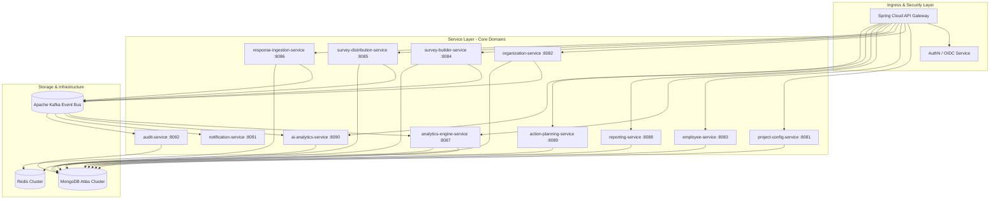
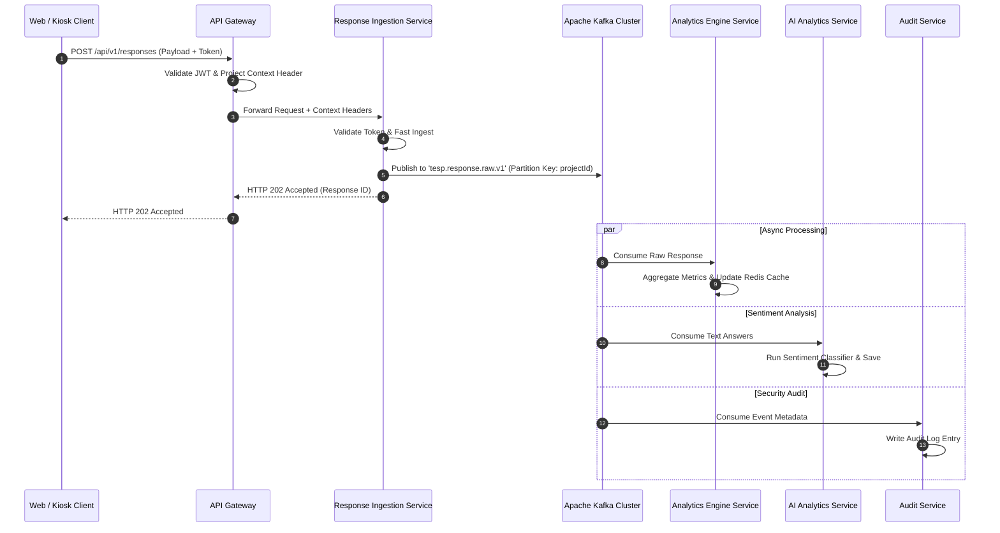

# DOC-002: Service Architecture Specification

| Metadata Field | Value |
|---|---|
| **Document ID** | DOC-002 |
| **Title** | Service Architecture Specification |
| **Version** | 1.0.0 |
| **Status** | Approved |
| **Owner** | Principal Software Architect |
| **Last Updated** | 2026-08-05 |
| **Dependencies** | `project-overview.md`, `ARCHITECTURE_PRINCIPLES.md`, `PROJECT_GLOSSARY.md`, `DOC-001-PROJECT-BLUEPRINT.md` |
| **Related Documents** | `DOCUMENT_INDEX.md`, `DOCUMENT_DEPENDENCY_GRAPH.md` |
| **Implementation Phase** | Phase 1 (Core Services Foundation) |

---

## Purpose

This document provides the definitive implementation specification for the microservice topology, service boundaries, inter-service communication protocols, event-driven messaging patterns, API gateway ingress controls, and resiliency mechanisms of the Talnova Enterprise Survey Platform (TESP). It translates the master domain context mapped in `DOC-001` into concrete engineering specs for Spring Boot service deployment.

---

## Scope

This specification governs all backend service development, including:
- Service inventory, boundaries, and internal responsibilities.
- Synchronous REST/gRPC inter-service interfaces and asynchronous Kafka topic topologies.
- API Gateway routing, request context propagation (`projectId`), authentication, and rate limiting.
- Data consistency patterns (Transactional Outbox, Eventual Consistency, CQRS).
- Resilience policies (Resilience4j circuit breakers, retries, dead-letter queues).

Out of scope for this document:
- Concrete MongoDB collection schema layouts (covered in `DOC-003: Database Philosophy & Metamodel`).
- Individual endpoint payload specs (covered in specific module API contracts).
- Infrastructure deployment manifests / Terraform (covered in Deployment specs).

---

## Dependencies

This document strictly requires and extends:
- `project-overview.md`: High-level system overview.
- `ARCHITECTURE_PRINCIPLES.md`: API First, Event Driven, CQRS Ready, Cloud Native principles.
- `PROJECT_GLOSSARY.md`: Canonical domain terminology.
- `DOC-001-PROJECT-BLUEPRINT.md`: Bounded context mapping and domain boundaries.

---

## Definitions

| Term | Technical Implementation Definition |
|---|---|
| **API Gateway** | The single ingress proxy handling routing, SSL termination, rate limiting, and JWT/Project context injection for all external API requests. |
| **Bounded Service** | An independently deployable Spring Boot container owning its specific domain data and business logic. |
| **Transactional Outbox** | A design pattern where domain events are written to an `outbox` database table within the local transaction before being asynchronously dispatched to Kafka. |
| **Eventual Consistency** | The data replication model where analytical and read-side snapshot databases update asynchronously following Kafka domain event emissions. |
| **Context Context Propagation** | The mandatory forwarding of `X-Project-ID`, `X-User-ID`, and `X-Correlation-ID` headers across synchronous and asynchronous execution threads. |
| **Dead Letter Queue (DLQ)** | A dedicated Kafka topic storing message processing failures after configured retry attempts have expired. |

---

## Architecture

### Microservices Topology

TESP backend is composed of modular, domain-aligned Spring Boot 3.5 services. Services operate independently, enforcing database-per-service isolation (logical or database level within MongoDB Atlas).

### Microservice Inventory & Specification

| Service Name | Port | Primary Responsibility | Data Store Access | Primary Communication |
|---|---|---|---|---|
| `api-gateway` | 8080 | Edge routing, JWT validation, rate limiting, request context header injection. | Redis | HTTP/2 (Spring WebFlux) |
| `project-config-service` | 8081 | Manages project metadata, tenant settings, feature flags, branding configurations. | MongoDB (`config_db`) | REST / Redis Cache |
| `organization-service` | 8082 | Manages Organization Nodes, dynamic hierarchy tree structures, closure matrices. | MongoDB (`org_db`) | REST / Kafka Events |
| `employee-service` | 8083 | Employee roster, demographic custom attributes, HRIS integration pipelines. | MongoDB (`emp_db`) | REST / Kafka Events |
| `survey-builder-service` | 8084 | Survey metadata creation, version management, logic validation, question libraries. | MongoDB (`survey_db`) | REST / Kafka Events |
| `survey-distribution-service` | 8085 | Campaign execution, token/PIN generation, scheduling, delivery queue tracking. | MongoDB (`dist_db`) | REST / Kafka Queue |
| `response-ingestion-service` | 8086 | High-speed response intake, token validation, rate-limiting, queuing to Kafka. | Redis Buffer | WebFlux / Kafka Producer |
| `analytics-engine-service` | 8087 | Asynchronous response aggregation, eNPS calculation, snapshot state generation. | MongoDB (`analytics_db`) | Kafka Consumer / REST |
| `reporting-service` | 8088 | Asynchronous PDF/Excel export generation, template layout compilation. | MongoDB / S3 Bucket | Async Worker / REST |
| `action-planning-service` | 8089 | Remedial Action Plan creation, milestone tracking, owner notifications. | MongoDB (`action_db`) | REST / Kafka Events |
| `ai-analytics-service` | 8090 | Text response sentiment processing, keyword clustering, theme extraction. | MongoDB / External AI API | Kafka Consumer / Async |
| `notification-service` | 8091 | Multi-channel message delivery (SMTP, Twilio SMS, MS Teams, Slack). | Redis Queue | Kafka Consumer |
| `audit-service` | 8092 | Centralized, append-only security and transactional audit log capture. | MongoDB (`audit_db`) | Kafka Consumer |

---

## Functional Requirements

Requirements govern service boundaries and inter-service behaviors.

### Ingress & Context Propagation Requirements

| ID | Requirement Title | Technical Specification & Description | Priority |
|---|---|---|---|
| **FR-SVC-001** | Mandatory Request Context Injection | `api-gateway` must extract JWT claims and inject `X-Project-ID`, `X-User-ID`, `X-User-Roles`, and `X-Correlation-ID` headers into downstream service requests. | Critical |
| **FR-SVC-002** | Correlation Tracking | Every HTTP request and Kafka message must carry a unique `X-Correlation-ID` string preserved across all downstream service logs. | Critical |
| **FR-SVC-003** | Service Health & Readiness Probes | Every Spring Boot service must expose `/actuator/health/liveness` and `/actuator/health/readiness` endpoints. | Critical |

### Event-Driven Messaging Requirements

| ID | Requirement Title | Technical Specification & Description | Priority |
|---|---|---|---|
| **FR-SVC-004** | Transactional Outbox Pattern | Services emitting domain events must write to a local `outbox` MongoDB collection within the database transaction before relaying to Kafka. | Critical |
| **FR-SVC-005** | Idempotent Event Consumption | All Kafka consumers must track processed `messageId` keys in Redis to guarantee idempotent execution under at-least-once delivery guarantees. | Critical |
| **FR-SVC-006** | Dead Letter Queue Handling | Messages failing processing after 3 exponential backoff retries must be routed to a topic-specific `.DLQ` with failure metadata. | Critical |

---

## Business Rules

| Rule ID | Domain | Business Rule Statement | Technical Enforcement |
|---|---|---|---|
| **BR-SVC-001** | Service Isolation | Direct cross-service database access is prohibited; services must interact strictly via REST APIs or Kafka events. | Database user credential segregation per service. |
| **BR-SVC-002** | Gateway Context Guard | Backend microservices must reject any incoming request missing a valid `X-Project-ID` header with an HTTP `400 Bad Request`. | Spring Security Filter `ProjectContextFilter`. |
| **BR-SVC-003** | Ingestion Circuit Breaking | `response-ingestion-service` must shed load and return HTTP `429 Too Many Requests` if the Redis buffer memory exceeds 85% capacity. | Resilience4j RateLimiter & Redis memory monitor. |

---

## Technical Considerations

### Event Bus Architecture & Topic Topology

Kafka topics adhere to a strict naming convention: `tesp.<domain>.<event-type>.<version>`.

### Kafka Topic Inventory

| Topic Name | Partition Key | Retention Period | Event Payload Description |
|---|---|---|---|
| `tesp.project.events.v1` | `projectId` | 365 Days | Project lifecycle events (`ProjectCreated`, `ProjectUpdated`). |
| `tesp.org.events.v1` | `projectId` | 365 Days | Organization tree changes (`OrgNodeCreated`, `OrgNodeMoved`). |
| `tesp.survey.events.v1` | `projectId` | 365 Days | Survey lifecycle events (`SurveyPublished`, `SurveyClosed`). |
| `tesp.response.raw.v1` | `projectId` | 90 Days | High-speed raw survey submission events. |
| `tesp.analytics.snapshots.v1` | `projectId` | 1095 Days | Analytical calculation snapshot completions. |
| `tesp.notifications.queue.v1` | `recipientId` | 7 Days | Queued email/SMS/Teams notification payloads. |

---

## Security Considerations

### Gateway Security & Ingress Pipeline

1. **TLS Termination**: TLS 1.3 enforced at Gateway level.
2. **JWT & Context Verification**: Gateway verifies OAuth2 JWT signatures against OpenID Provider JWKS endpoint.
3. **Rate Limiting**: Implemented via Redis-backed Token Bucket algorithm. Route thresholds:
   - Standard APIs: 100 requests/sec per IP.
   - Response Ingestion API: 5,000 requests/sec per Project workspace.
   - Public PIN APIs: 10 requests/sec per IP (Brute-force prevention).

---

## Scalability & Performance

### Horizontal Pod Autoscaling (HPA) Strategy

| Service | Scaling Metric | Scale-Out Threshold | Scale-In Cooldown |
|---|---|---|---|
| `response-ingestion-service` | CPU Utilization / Redis Queue Depth | CPU > 70% OR Queue > 10,000 | 300 Seconds |
| `analytics-engine-service` | Kafka Consumer Lag | Consumer Lag > 5,000 msgs | 600 Seconds |
| `api-gateway` | Active Connection Count | > 2,000 Connections / pod | 300 Seconds |
| All Other Services | CPU & Memory | CPU > 80% OR RAM > 80% | 300 Seconds |

---

## Future Extensions

1. **gRPC Internal Service Mesh**: Migration of high-frequency REST service-to-service calls to gRPC with HTTP/2 multiplexing.
2. **GraphQL Analytics Gateway**: Exposing a unified GraphQL query endpoint for custom dashboard widget data fetching.

---

## References

- `DOC-001-PROJECT-BLUEPRINT.md`: Master architectural blueprint.
- `ARCHITECTURE_PRINCIPLES.md`: Core non-negotiable architecture principles.

---

## Related Documents & Future Impact

| Relationship Type | Document ID | Title |
|---|---|---|
| **Upstream Dependencies** | `DOC-001` | Project Blueprint & Platform Master Architecture |
| **Downstream Impacted** | `DOC-003` | Database Philosophy & Metamodel |
| **Downstream Impacted** | `DOC-004` | Organization & Hierarchy Domain Architecture |
| **Downstream Impacted** | `DOC-005` | Survey Engine Architecture |

---

## Open Questions

| Question ID | Topic | Description | Impact |
|---|---|---|---|
| **OQ-SVC-001** | In-Memory Caching Topology | Should `project-config-service` push cached project settings directly into gateway local memory (Guava/Caffeine) or rely strictly on Redis? (Current decision: Redis Cluster with 60s TTL). | Gateway latency vs cache invalidation complexity. |

---

## Document Status

| Field | Value |
|---|---|
| **Document Status** | Approved / Implementation-Ready |
| **Dependencies Satisfied** | `project-overview.md`, `ARCHITECTURE_PRINCIPLES.md`, `PROJECT_GLOSSARY.md`, `DOC-001-PROJECT-BLUEPRINT.md` |
| **Documents Affected** | `DOCUMENT_INDEX.md`, `DOCUMENT_DEPENDENCY_GRAPH.md` |
| **Next Recommended Document** | `DOC-003: Database Philosophy & Metamodel` |
