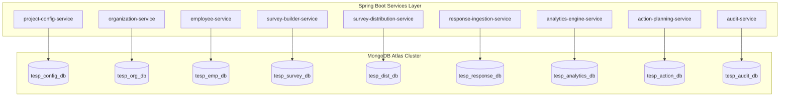

# DOC-003: Database Philosophy & Metamodel Specification

| Metadata Field | Value |
|---|---|
| **Document ID** | DOC-003 |
| **Title** | Database Philosophy & Metamodel Specification |
| **Version** | 1.0.0 |
| **Status** | Approved |
| **Owner** | Principal Software Architect |
| **Last Updated** | 2026-08-05 |
| **Dependencies** | `project-overview.md`, `ARCHITECTURE_PRINCIPLES.md`, `PROJECT_GLOSSARY.md`, `DOC-001-PROJECT-BLUEPRINT.md`, `DOC-002-SERVICE-ARCHITECTURE.md` |
| **Related Documents** | `DOCUMENT_INDEX.md`, `DOCUMENT_DEPENDENCY_GRAPH.md` |
| **Implementation Phase** | Phase 1 (Data Layer Infrastructure) |

---

## Purpose

This document specifies the database philosophy, document metamodel, collection schemas, indexing strategies, sharding models, and data lifecycle governance for the Talnova Enterprise Survey Platform (TESP). It establishes MongoDB Atlas as the primary metadata-driven document store and defines the standardized data schemas required by all microservices defined in `DOC-002`.

---

## Scope

This specification governs all data storage mechanisms in TESP:
- Primary document store layout (MongoDB Atlas collections across bounded databases).
- Standardized document Envelope Metamodel (`projectId`, audit attributes, versioning).
- Schema-flexible custom attribute modeling for Organizations, Employees, and Surveys.
- Indexing strategies (Compound, Text, Sparse, TTL) and Sharding partition keys.
- Read/Write concern guidelines and MongoDB Client-Side Field Level Encryption (CSFLE).

Out of scope:
- Specific Spring Data MongoDB Repository Java code implementations.
- Concrete Redis key naming conventions for ephemeral session state (covered in cache specs).

---

## Dependencies

This specification strictly depends on and extends:
- `project-overview.md`: High-level data requirements and business domain definitions.
- `ARCHITECTURE_PRINCIPLES.md`: Database Design Principles (Configuration over code, Dynamic schemas, Everything versioned, Everything auditable).
- `PROJECT_GLOSSARY.md`: Canonical domain terms.
- `DOC-001-PROJECT-BLUEPRINT.md`: Core system architecture and domain bounded contexts.
- `DOC-002-SERVICE-ARCHITECTURE.md`: Microservice inventory and service database isolation boundaries.

---

## Definitions

| Term | Technical Database Definition |
|---|---|
| **Document Envelope** | The mandatory top-level header structure present on every MongoDB document enforcing multi-tenant isolation, versioning, and auditability. |
| **Materialized Path** | An indexing pattern for hierarchical data where an Organization Node stores its full ancestor path as a string (e.g., `,root,node1,node2,`). |
| **Polymorphic Collection** | A collection storing structurally varied documents under a shared abstract type discriminator (e.g., Survey Questions). |
| **Client-Side Field Level Encryption (CSFLE)** | Cryptographic encryption of specific sensitive JSON fields (e.g., PII) prior to transport over network or storage on disk. |
| **Shard Key** | The immutable field combination determining document distribution across MongoDB Atlas cluster shards (`{ projectId: 1, _id: 1 }`). |
| **Capped Collection** | A fixed-size MongoDB collection that automatically overwrites oldest entries when maximum byte size is reached (used for low-level audit logs). |

---

## Architecture

### Database Topology & Service Isolation

In accordance with `DOC-002`, TESP enforces database-per-service isolation within MongoDB Atlas using dedicated logical databases or authenticated user access scopes.



---

## Core Document Envelope & Collection Specs

Every MongoDB collection document in TESP MUST implement the **Document Envelope**.

```json
{
  "_id": "ObjectId / UUID",
  "projectId": "PRJ-99201",
  "version": 1,
  "isDeleted": false,
  "createdAt": "2026-08-05T18:00:00Z",
  "createdBy": "usr_admin_001",
  "updatedAt": "2026-08-05T18:00:00Z",
  "updatedBy": "usr_admin_001"
}
```

### Collection Metamodel Inventory

| Collection Name | Database | Shard Key | Primary Indexes | Purpose |
|---|---|---|---|---|
| `projects` | `tesp_config_db` | `{ projectId: 1 }` | `projectId` (Unique) | Project master configuration, branding, locales, module flags. |
| `organization_nodes` | `tesp_org_db` | `{ projectId: 1 }` | `projectId_1_nodeId_1`, `projectId_1_path_1` | Dynamic hierarchy tree nodes (Materialized path pattern). |
| `employees` | `tesp_emp_db` | `{ projectId: 1 }` | `projectId_1_employeeId_1`, `projectId_1_email_1` | Employee master roster, demographic custom key-value attributes. |
| `surveys` | `tesp_survey_db` | `{ projectId: 1 }` | `projectId_1_surveyId_1_version_1` | Versioned metadata-driven survey questionnaires and questions. |
| `survey_campaigns` | `tesp_dist_db` | `{ projectId: 1 }` | `projectId_1_campaignId_1`, `surveyId_1` | Active/scheduled survey distribution instances and channels. |
| `survey_responses` | `tesp_response_db` | `{ projectId: 1, _id: 1 }` | `projectId_1_campaignId_1`, `responseToken_1` | Immutable raw respondent submission answers. |
| `analytical_snapshots` | `tesp_analytics_db` | `{ projectId: 1 }` | `projectId_1_campaignId_1_snapshotDate_1` | Frozen analytical score aggregations and benchmark metrics. |
| `action_plans` | `tesp_action_db` | `{ projectId: 1 }` | `projectId_1_actionPlanId_1`, `status_1` | Remedial initiatives, assigned owners, and milestone task lists. |
| `audit_logs` | `tesp_audit_db` | `{ projectId: 1, timestamp: 1 }` | `projectId_1_timestamp_1` | Immutable, append-only security and administrative audit event records. |

---

## JSON Schema Specifications

### 1. `organization_nodes` Schema

```json
{
  "$jsonSchema": {
    "bsonType": "object",
    "required": ["projectId", "nodeId", "name", "type", "path", "depth"],
    "properties": {
      "projectId": { "bsonType": "string" },
      "nodeId": { "bsonType": "string" },
      "name": { "bsonType": "string" },
      "type": { "bsonType": "string" },
      "parentId": { "bsonType": ["string", "null"] },
      "path": { "bsonType": "string", "description": "Materialized path e.g. ,ROOT,NODE_A,NODE_B," },
      "depth": { "bsonType": "int" },
      "displayOrder": { "bsonType": "int" },
      "status": { "enum": ["ACTIVE", "INACTIVE", "ARCHIVED"] },
      "attributes": { "bsonType": "object", "description": "Key-value dynamic attributes" }
    }
  }
}
```

### 2. `employees` Schema (Supports CSFLE on PII)

```json
{
  "$jsonSchema": {
    "bsonType": "object",
    "required": ["projectId", "employeeId", "nodeId", "status"],
    "properties": {
      "projectId": { "bsonType": "string" },
      "employeeId": { "bsonType": "string" },
      "nodeId": { "bsonType": "string" },
      "email": { "bsonType": "string", "description": "Encrypted via CSFLE" },
      "fullName": { "bsonType": "string", "description": "Encrypted via CSFLE" },
      "status": { "enum": ["ACTIVE", "TERMINATED", "ON_LEAVE"] },
      "attributes": {
        "bsonType": "object",
        "description": "Dynamic project-specific employee metadata (e.g., Tenure, Gender, Grade)"
      }
    }
  }
}
```

### 3. `surveys` Schema

```json
{
  "$jsonSchema": {
    "bsonType": "object",
    "required": ["projectId", "surveyId", "version", "title", "status", "pages"],
    "properties": {
      "projectId": { "bsonType": "string" },
      "surveyId": { "bsonType": "string" },
      "version": { "bsonType": "int" },
      "title": { "bsonType": "object", "description": "Locale string map e.g. { en: 'Engagement Survey' }" },
      "status": { "enum": ["DRAFT", "PUBLISHED", "ARCHIVED"] },
      "pages": {
        "bsonType": "array",
        "items": {
          "bsonType": "object",
          "required": ["pageId", "pageOrder", "sections"],
          "properties": {
            "pageId": { "bsonType": "string" },
            "pageOrder": { "bsonType": "int" },
            "sections": {
              "bsonType": "array",
              "items": {
                "bsonType": "object",
                "required": ["sectionId", "questions"],
                "properties": {
                  "sectionId": { "bsonType": "string" },
                  "questions": {
                    "bsonType": "array",
                    "items": {
                      "bsonType": "object",
                      "required": ["questionId", "type", "groupId"],
                      "properties": {
                        "questionId": { "bsonType": "string" },
                        "type": { "enum": ["LIKERT", "NPS", "MATRIX", "SINGLE_CHOICE", "MULTIPLE_CHOICE", "SHORT_TEXT", "LONG_TEXT"] },
                        "groupId": { "bsonType": "string" },
                        "prompt": { "bsonType": "object" },
                        "isMandatory": { "bsonType": "bool" },
                        "logicRules": { "bsonType": "array" }
                      }
                    }
                  }
                }
              }
            }
          }
        }
      }
    }
  }
}
```

### 4. `survey_responses` Schema

```json
{
  "$jsonSchema": {
    "bsonType": "object",
    "required": ["projectId", "campaignId", "surveyId", "surveyVersion", "respondentType", "answers"],
    "properties": {
      "projectId": { "bsonType": "string" },
      "campaignId": { "bsonType": "string" },
      "surveyId": { "bsonType": "string" },
      "surveyVersion": { "bsonType": "int" },
      "respondentType": { "enum": ["AUTHENTICATED", "SEMI_ANONYMOUS", "FULLY_ANONYMOUS", "KIOSK"] },
      "responseToken": { "bsonType": "string" },
      "nodeId": { "bsonType": "string", "description": "Associated Org Node for anonymous metadata slicing" },
      "demographicSnapshot": { "bsonType": "object", "description": "Immutable copy of demographic tags at submission time" },
      "answers": {
        "bsonType": "array",
        "items": {
          "bsonType": "object",
          "required": ["questionId", "questionType"],
          "properties": {
            "questionId": { "bsonType": "string" },
            "questionType": { "bsonType": "string" },
            "numericValue": { "bsonType": ["double", "int", "null"] },
            "textValue": { "bsonType": ["string", "null"] },
            "selectedOptions": { "bsonType": "array" }
          }
        }
      },
      "submittedAt": { "bsonType": "date" }
    }
  }
}
```

---

## Functional Requirements

| ID | Requirement Title | Technical Specification & Description | Priority |
|---|---|---|---|
| **FR-DAT-001** | Mandatory Envelope Inclusion | MongoDB repositories must automatically append and query `projectId` and `isDeleted: false` via Spring Data base repository implementations. | Critical |
| **FR-DAT-002** | Optimistic Locking | Document updates must increment the `version` field using MongoDB `$inc` operators to prevent concurrent overwrite anomalies. | Critical |
| **FR-DAT-003** | Materialized Path Hierarchy Indexing | `organization_nodes` must maintain indexed `path` strings enabling regex or prefix queries for sub-tree retrieval (`^,ROOT,NODE_A,`). | Critical |
| **FR-DAT-004** | Anonymized Response Tagging | For semi-anonymous and fully anonymous campaigns, `survey_responses` documents MUST NOT contain employee identity keys (`employeeId`, `email`). | Critical |

---

## Business Rules

| Rule ID | Domain | Business Rule Statement | Technical Enforcement |
|---|---|---|---|
| **BR-DAT-001** | Soft Delete Mandate | Application code must never issue MongoDB `remove()` commands on transactional data; records must set `isDeleted: true`. | Custom repository wrapper interceptor. |
| **BR-DAT-002** | Shard Key Immutability | The `projectId` field on all sharded collections is immutable and cannot be updated after document creation. | MongoDB Atlas Shard Key validation constraint. |
| **BR-DAT-003** | Response Immutability | Inserted `survey_responses` documents are strictly read-only and cannot be edited via any public API. | Write-once collection permissions in MongoDB. |

---

## Technical Considerations

### Indexing & Performance Optimization Matrix

| Collection | Index Fields | Index Type | Purpose |
|---|---|---|---|
| `organization_nodes` | `{ projectId: 1, path: 1 }` | Compound Prefix | Fast sub-tree hierarchy querying. |
| `employees` | `{ projectId: 1, attributes.Tenure: 1 }` | Compound Sparse | Demographic filtering performance. |
| `survey_responses` | `{ projectId: 1, campaignId: 1, submittedAt: -1 }` | Compound Sorting | Fast time-series analytical aggregation. |
| `audit_logs` | `{ timestamp: 1 }` | TTL Index (expireAfterSeconds: 31536000) | Automatic deletion of logs older than 1 year. |

---

## Security Considerations

1. **Client-Side Field Level Encryption (CSFLE)**: MongoDB CSFLE configured using AWS KMS (Key Management Service) to encrypt PII fields (`email`, `fullName`, `phoneNumber`) before sending documents over the wire to MongoDB Atlas.
2. **Database Authentication**: Microservices connect to MongoDB using x.509 client certificates or AWS IAM role authentication. Database users are granted granular roles scoped strictly to their respective service database (`tesp_org_db`, `tesp_response_db`).

---

## Scalability & Performance

### MongoDB Atlas Sharding Configuration

- **Shard Key**: `{ projectId: 1, _id: 1 }`
- **Strategy**: Ranged sharding based on `projectId`. Ensures all data for a single enterprise Project resides on a localized shard for high query performance while balancing projects across nodes.
- **Write Concern**: `w: majority, j: true` for response ingestion to prevent data loss.
- **Read Concern**: `secondaryPreferred` for `analytics-engine-service` queries to offload analytical read workloads from the primary database node.

---

## Future Extensions

1. **Automated Cold Storage Archiving**: Event-driven worker that exports `survey_responses` older than 3 years to Apache Parquet format on AWS S3 for long-term analytical storage.
2. **Timeseries Collection Migration**: Conversion of high-frequency raw response ingestion collections to MongoDB Native Time Series collections for enhanced storage compression.

---

## References

- `DOC-001-PROJECT-BLUEPRINT.md`: Master architectural blueprint.
- `DOC-002-SERVICE-ARCHITECTURE.md`: Microservices inventory and database isolation boundaries.
- `ARCHITECTURE_PRINCIPLES.md`: Core database principles.

---

## Related Documents & Future Impact

| Relationship Type | Document ID | Title |
|---|---|---|
| **Upstream Dependencies** | `DOC-001` | Project Blueprint & Platform Master Architecture |
| **Upstream Dependencies** | `DOC-002` | Service Architecture Specification |
| **Downstream Impacted** | `DOC-004` | Organization & Hierarchy Domain Architecture |
| **Downstream Impacted** | `DOC-005` | Survey Engine Architecture |

---

## Open Questions

| Question ID | Topic | Description | Impact |
|---|---|---|---|
| **OQ-DAT-001** | Demographic Snapshot Storage | Should response documents duplicate demographic tags at submission time or resolve dynamically via point-in-time employee snapshots? (Current decision: Duplicate immutable key-value tags in `demographicSnapshot` on submission). | Response document size vs point-in-time calculation complexity. |

---

## Document Status

| Field | Value |
|---|---|
| **Document Status** | Approved / Implementation-Ready |
| **Dependencies Satisfied** | `project-overview.md`, `ARCHITECTURE_PRINCIPLES.md`, `PROJECT_GLOSSARY.md`, `DOC-001-PROJECT-BLUEPRINT.md`, `DOC-002-SERVICE-ARCHITECTURE.md` |
| **Documents Affected** | `DOCUMENT_INDEX.md`, `DOCUMENT_DEPENDENCY_GRAPH.md` |
| **Next Recommended Document** | `DOC-004: Organization & Hierarchy Domain Architecture` |
