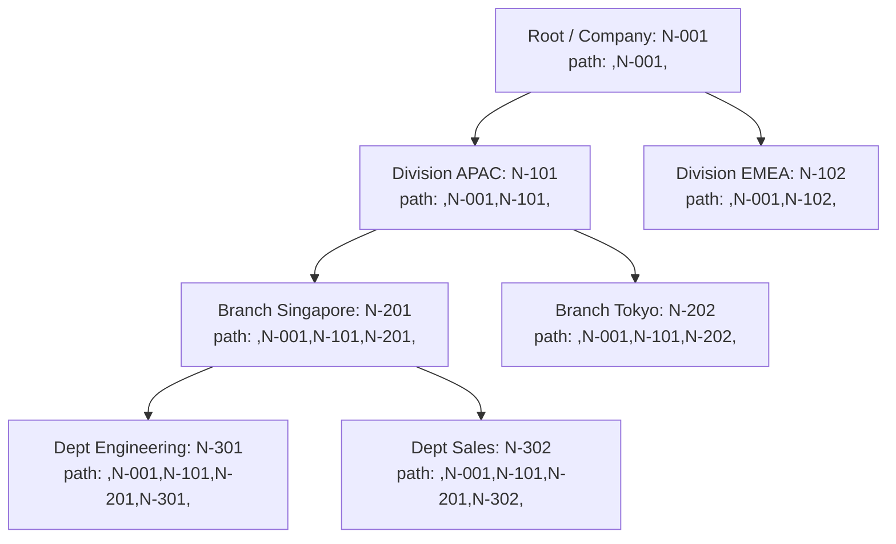
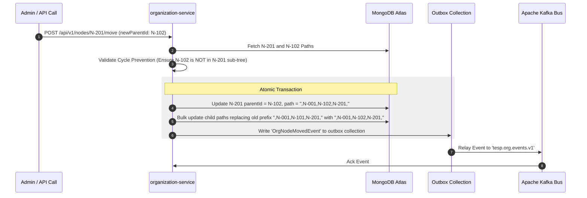

# DOC-004: Organization & Hierarchy Domain Architecture Specification

| Metadata Field | Value |
|---|---|
| **Document ID** | DOC-004 |
| **Title** | Organization & Hierarchy Domain Architecture Specification |
| **Version** | 1.0.0 |
| **Status** | Approved |
| **Owner** | Principal Software Architect |
| **Last Updated** | 2026-08-05 |
| **Dependencies** | `project-overview.md`, `ARCHITECTURE_PRINCIPLES.md`, `PROJECT_GLOSSARY.md`, `DOC-001-PROJECT-BLUEPRINT.md`, `DOC-002-SERVICE-ARCHITECTURE.md`, `DOC-003-DATABASE-PHILOSOPHY-AND-METAMODEL.md` |
| **Related Documents** | `DOCUMENT_INDEX.md`, `DOCUMENT_DEPENDENCY_GRAPH.md` |
| **Implementation Phase** | Phase 1 (Domain Services) |

---

## Purpose

This document specifies the technical architecture, data structures, algorithms, domain logic, and API contracts for the Organization & Hierarchy Subsystem. It defines how TESP models arbitrary, unlimited-depth organizational structures, manages employee demographic metadata, processes node re-parenting operations, and enforces sub-tree data access scoping across enterprise projects without hardcoding organizational levels.

---

## Scope

This specification governs the `organization-service` and `employee-service` microservice implementations:
- Dynamic node type definitions and custom attribute metamodels per Project workspace.
- Materialized Path tree representation, insertion, traversal, and re-parenting algorithms.
- Employee membership assignments, primary vs matrix reporting structures, and HRIS sync.
- Sub-tree data isolation queries for analytical access control (RBAC node scoping).
- Asynchronous domain event generation for hierarchy modifications.

Out of scope:
- Survey form branching logic (covered in `DOC-005: Survey Engine Architecture`).
- Dynamic dashboard UI widget rendering (covered in Frontend specs).

---

## Dependencies

This specification strictly depends on and extends:
- `project-overview.md`: Dynamic organizational hierarchy requirements.
- `ARCHITECTURE_PRINCIPLES.md`: Zero Hardcoded Hierarchies, Unlimited Organization Depth.
- `PROJECT_GLOSSARY.md`: Canonical domain terms (`Organization Node`, `Hierarchy`, `Metadata`).
- `DOC-001-PROJECT-BLUEPRINT.md`: Bounded context boundaries.
- `DOC-002-SERVICE-ARCHITECTURE.md`: Microservices topology and Kafka topic definitions.
- `DOC-003-DATABASE-PHILOSOPHY-AND-METAMODEL.md`: `organization_nodes` and `employees` MongoDB collection schemas.

---

## Definitions

| Term | Technical Implementation Definition |
|---|---|
| **Materialized Path** | A string field stored on an Organization Node containing comma-delimited ancestor IDs (e.g., `,ROOT,N-101,N-204,`) indexed for fast regex and prefix sub-tree queries. |
| **Node Type** | A configurable project-level classification (e.g., Company, Sector, Division, Department, Team, Store) defining valid child relationships. |
| **Re-parenting** | The atomic operation of moving an Organization Node (and all its child sub-trees) from one parent node to another within the hierarchy tree. |
| **Sub-Tree Scope** | The set of all descendant Organization Nodes derived by querying `path` prefixed with the targeted node's path. |
| **Matrix Reporting** | Secondary organizational assignments where an employee belongs to multiple Organization Nodes (e.g., Primary: HR Dept, Secondary: Agile Project X). |

---

## Architecture

### Hierarchy Tree Representation & Path Materialization

To support unlimited depth with high-speed read performance, TESP utilizes the **Materialized Path** pattern in MongoDB.



### Tree Operation Algorithms

#### 1. Sub-Tree Retrieval Algorithm
To fetch all descendant nodes under `Branch Singapore (N-201)`:
```javascript
// Target node path = ",N-001,N-101,N-201,"
db.organization_nodes.find({
  projectId: "PRJ-99201",
  isDeleted: false,
  path: { $regex: "^,N-001,N-101,N-201," }
});
```
*Performance: O(K) index scan where K is the number of matching descendant nodes.*

#### 2. Node Re-parenting Algorithm & Execution Flow
Moving node $N_{target}$ to parent $N_{newParent}$:



---

## Functional Requirements

| ID | Requirement Title | Technical Specification & Description | Priority |
|---|---|---|---|
| **FR-ORG-010** | Configurable Node Types | System must allow defining project-specific Node Types with custom attributes via `project-config-service`. | Critical |
| **FR-ORG-011** | Dynamic Node Insertion | System must calculate and append `path` and `depth` fields automatically upon creating a new Organization Node. | Critical |
| **FR-ORG-012** | Atomic Re-parenting | Moving a node must update all descendant node paths atomically within a single MongoDB session transaction. | Critical |
| **FR-ORG-013** | Ancestor Lineage Query | System must return the full ordered array of parent nodes up to the root node for any given `nodeId` in a single query. | Critical |
| **FR-ORG-014** | Employee Matrix Assignment | System must support assigning an employee to a primary `nodeId` and multiple secondary `matrixNodeIds`. | High |
| **FR-ORG-015** | HRIS Roster Delta Import | `employee-service` must ingest employee CSV files, matching records by `employeeId`, updating node assignments, and flagging missing employees as `TERMINATED`. | High |

---

## Business Rules

| Rule ID | Domain | Business Rule Statement | Technical Enforcement |
|---|---|---|---|
| **BR-ORG-010** | Zero Hardcoded Depth | Software logic must never assume a fixed hierarchy depth (e.g., hardcoded Company -> Dept -> Team); depth calculations must evaluate dynamically. | Code review check & strict dynamic path resolution. |
| **BR-ORG-011** | Cycle Prevention Rule | An Organization Node cannot be re-parented to itself or to any node contained within its own descendant sub-tree. | Cycle detection check: `newParent.path` MUST NOT contain `targetNode.nodeId`. |
| **BR-ORG-012** | Re-parenting Event Notification | Node re-parenting must publish an `OrgNodeMovedEvent` containing `nodeId`, `oldPath`, and `newPath` for downstream analytical cache invalidation. | Outbox pattern to Kafka topic `tesp.org.events.v1`. |

---

## Technical Considerations

### Data Access RBAC Scoping via Node Paths

When an enterprise manager with limited organizational scope (e.g., Manager of `Division APAC N-101`) accesses dashboard analytics, the API Gateway injects their scoped node ID (`X-User-NodeScope: N-101`).

The downstream `analytics-engine-service` appends the materialized path condition to all response aggregation queries:

```javascript
// Enforcing Data Access Scoping automatically
db.survey_responses.aggregate([
  {
    $match: {
      projectId: "PRJ-99201",
      campaignId: "CMP-5501",
      "demographicSnapshot.ancestorPaths": { $regex: "^,N-001,N-101," }
    }
  },
  { $group: { _id: "$answers.questionId", avgScore: { $avg: "$answers.numericValue" } } }
]);
```

---

## Security Considerations

1. **Hierarchy Data Scope Isolation**: Managers cannot view survey responses or aggregate scores for nodes outside their authorized sub-tree path.
2. **Employee PII Protection**: Demographic attributes flagged as PII are stored using Client-Side Field Level Encryption (CSFLE) as defined in `DOC-003`.
3. **Audit Log Captures**: Every hierarchy modification (node creation, move, archive) must generate an audit log entry detailing the user ID, timestamp, old path, and new path.

---

## Scalability & Performance

| Operation | Target SLA | Scaling Mechanism |
|---|---|---|
| **Single Node Sub-tree Fetch** | < 10 ms | Index scan on `{ projectId: 1, path: 1 }` prefix. |
| **Sub-tree Re-parenting (1,000 nodes)** | < 300 ms | MongoDB multi-document transaction with bulk `$rename` / regex replacement. |
| **Bulk Employee Sync (50,000 records)** | < 30 seconds | Batch upsert operations using MongoDB `unordered` bulk writes. |

---

## Future Extensions

1. **Temporal Organization Tree Snapshotting**: Storing point-in-time copies of the hierarchy tree to enable historical survey reporting against the exact organization structure as it existed on the survey launch date.
2. **Interactive Visual Tree Editor**: Drag-and-drop hierarchy management interface with real-time validation feedback.

---

## References

- `DOC-001-PROJECT-BLUEPRINT.md`: Master architectural blueprint.
- `DOC-002-SERVICE-ARCHITECTURE.md`: Microservice topology.
- `DOC-003-DATABASE-PHILOSOPHY-AND-METAMODEL.md`: MongoDB schema specifications for `organization_nodes` and `employees`.

---

## Related Documents & Future Impact

| Relationship Type | Document ID | Title |
|---|---|---|
| **Upstream Dependencies** | `DOC-001` | Project Blueprint & Platform Master Architecture |
| **Upstream Dependencies** | `DOC-002` | Service Architecture Specification |
| **Upstream Dependencies** | `DOC-003` | Database Philosophy & Metamodel Specification |
| **Downstream Impacted** | `DOC-005` | Survey Engine Architecture Specification |

---

## Open Questions

| Question ID | Topic | Description | Impact |
|---|---|---|---|
| **OQ-ORG-001** | Max Node Depth Guard | Should the system enforce an explicit maximum depth threshold (e.g., 50 levels) to prevent regex path overflow? (Current decision: Log warning at depth > 25; no hard limit). | Hierarchy flexibility vs query safety. |

---

## Document Status

| Field | Value |
|---|---|
| **Document Status** | Approved / Implementation-Ready |
| **Dependencies Satisfied** | `project-overview.md`, `ARCHITECTURE_PRINCIPLES.md`, `PROJECT_GLOSSARY.md`, `DOC-001`, `DOC-002`, `DOC-003` |
| **Documents Affected** | `DOCUMENT_INDEX.md`, `DOCUMENT_DEPENDENCY_GRAPH.md` |
| **Next Recommended Document** | `DOC-005: Survey Engine Architecture Specification` |
