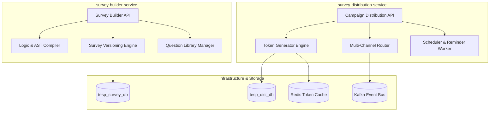
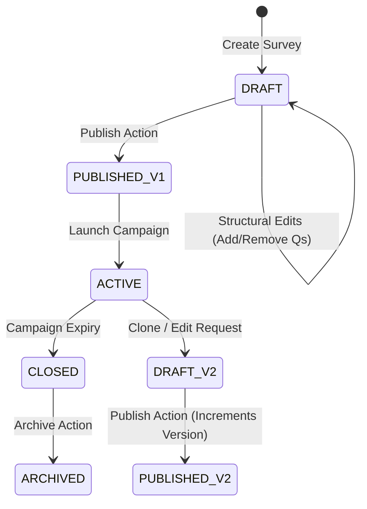
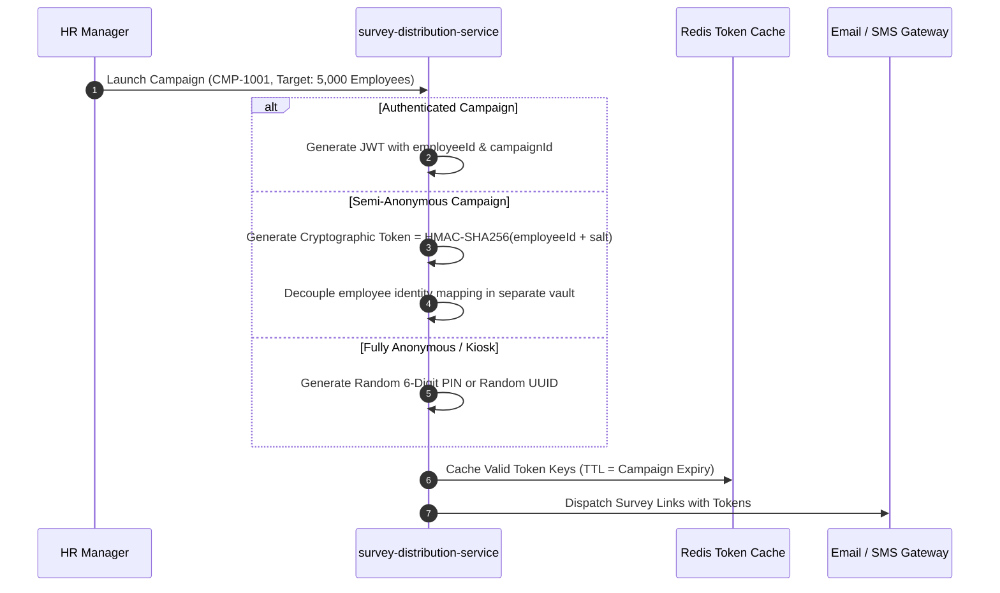

# DOC-005: Survey Engine Architecture Specification

| Metadata Field | Value |
|---|---|
| **Document ID** | DOC-005 |
| **Title** | Survey Engine Architecture Specification |
| **Version** | 1.0.0 |
| **Status** | Approved |
| **Owner** | Principal Software Architect |
| **Last Updated** | 2026-08-05 |
| **Dependencies** | `project-overview.md`, `ARCHITECTURE_PRINCIPLES.md`, `PROJECT_GLOSSARY.md`, `DOC-001-PROJECT-BLUEPRINT.md`, `DOC-002-SERVICE-ARCHITECTURE.md`, `DOC-003-DATABASE-PHILOSOPHY-AND-METAMODEL.md`, `DOC-004-ORGANIZATION-AND-HIERARCHY-DOMAIN.md` |
| **Related Documents** | `DOCUMENT_INDEX.md`, `DOCUMENT_DEPENDENCY_GRAPH.md` |
| **Implementation Phase** | Phase 1 (Core Backend Services) |

---

## Purpose

This document provides the definitive implementation specification for the metadata-driven Survey Engine within TESP. It defines the survey construction metamodel, question type behaviors, branching logic evaluation AST parser, survey versioning lifecycle state machine, scoring calculation rules, and multi-channel campaign distribution mechanics implemented in `survey-builder-service` and `survey-distribution-service`.

---

## Scope

This specification governs the full survey lifecycle:
- Metadata-driven questionnaire hierarchy (Surveys, Pages, Sections, Questions, Question Groups).
- Supported Question types (Likert Scale, NPS, Matrix, Single/Multiple Choice, Ranking, Short/Long Text, Numeric).
- Declarative Logic Engine (Conditional question/page skip, display rules, input validation AST).
- Survey Versioning and Immutability governance.
- Campaign Distribution Engine (Token generation, authentication modes, multi-channel dispatch).

Out of scope:
- Analytics aggregation algorithms (covered in `DOC-006: Analytics Engine Specification`).
- AI sentiment NLP algorithms (covered in `DOC-007: AI Analytics & NLP Specification`).

---

## Dependencies

This specification strictly depends on and extends:
- `project-overview.md`: Survey Engine, Survey Builder, and Distribution requirements.
- `ARCHITECTURE_PRINCIPLES.md`: Metadata Driven, Everything Versioned, Everything Auditable.
- `PROJECT_GLOSSARY.md`: Canonical domain terms (`Survey`, `Survey Campaign`, `Question`, `Question Group`, `Question Library`).
- `DOC-001-PROJECT-BLUEPRINT.md`: Core system architecture.
- `DOC-002-SERVICE-ARCHITECTURE.md`: Microservices topology for `survey-builder-service` and `survey-distribution-service`.
- `DOC-003-DATABASE-PHILOSOPHY-AND-METAMODEL.md`: MongoDB schema specifications for `surveys` and `survey_campaigns`.
- `DOC-004-ORGANIZATION-AND-HIERARCHY-DOMAIN.md`: Organization node demographic mapping.

---

## Definitions

| Term | Technical Implementation Definition |
|---|---|
| **Question Metamodel** | The JSON schema defining a question's type, prompts, localized strings, validation constraints, and scoring weight. |
| **Question Group** | An analytical classification mapping specific Questions to macro engagement indices (e.g., Leadership, Communication, Wellbeing). |
| **Branching Logic AST** | An Abstract Syntax Tree JSON representation of conditional visibility and jump logic evaluated dynamically during survey traversal. |
| **Survey Campaign Token** | A cryptographically secure, unique single-use string token authorizing a specific participant or session to submit a Response. |
| **NPS Calculation** | Net Promoter Score formula: `% Promoters (9-10) - % Detractors (0-6)`. |
| **Likert Index** | Scaled mean conversion of Likert responses (e.g., 5-point scale mapped to 0-100% engagement index). |

---

## Architecture

### Survey Engine Subsystem Component Topology



### Survey Versioning State Machine

Published surveys are **immutable**. Modifying an active survey generates a new version snapshot.



---

## Question Types & Scoring Specifications

| Question Type Code | Data Schema Value | Scoring Formula / Mapping | Use Case |
|---|---|---|---|
| `LIKERT` | Numeric (1 to 5 / 1 to 7) | Score % = `((value - 1) / (max - 1)) * 100` | Employee Engagement, Job Satisfaction. |
| `NPS` | Numeric (0 to 10) | 0-6: Detractor, 7-8: Passive, 9-10: Promoter | eNPS (Employee Net Promoter Score). |
| `SINGLE_CHOICE` | String (Option Key) | Discrete Weight Map per Option Key | Multiple choice single answer. |
| `MULTIPLE_CHOICE` | Array of Option Keys | Sum / Average Weight of Selected Options | Multi-select checkbox questions. |
| `MATRIX` | Map of Sub-Question Keys -> Values | Sub-question score matrix breakdown | Multi-row rating scale grids. |
| `RANKING` | Ordered Array of Option Keys | Position-based Borda Count weighting | Preference prioritization. |
| `SHORT_TEXT` | String (max 255 chars) | Unscored (Input to AI Sentiment Module) | Brief qualitative feedback. |
| `LONG_TEXT` | String (max 4000 chars) | Unscored (Input to AI Sentiment Module) | In-depth open-ended comment. |

---

## Declarative Branching Logic AST Specification

Branching rules dictate page skipping and question display conditions. Rules are defined in standard JSON AST format and evaluated client-side (React / Vite SPA) with server-side re-validation upon submission.

### JSON AST Schema Structure

```json
{
  "ruleId": "RL-901",
  "triggerQuestionId": "Q-102",
  "condition": "LESS_THAN",
  "comparisonValue": 3,
  "action": "SKIP_TO_PAGE",
  "targetPageId": "PAGE-04",
  "elseAction": "CONTINUE"
}
```

### Supported Logic Operators

- `EQUALS`, `NOT_EQUALS`
- `GREATER_THAN`, `LESS_THAN`, `BETWEEN`
- `CONTAINS`, `NOT_CONTAINS`
- `IN_SET`, `NOT_IN_SET`
- `IS_ANSWERED`, `IS_EMPTY`

---

## Campaign Distribution & Token Mechanics

### Token Generation by Anonymity Level



---

## Functional Requirements

| ID | Requirement Title | Technical Specification & Description | Priority |
|---|---|---|---|
| **FR-SRV-010** | Structural Survey Builder | API must support building Surveys composed of Pages, Sections, Questions, and Question Groups with re-ordering sequences. | Critical |
| **FR-SRV-011** | Localized Prompt Strings | Survey questions and options must support multi-language string dictionaries resolving dynamically based on respondent preferred locale. | Critical |
| **FR-SRV-012** | Immutable Version Publishing | Publishing a survey freezes version $N$; modifying a published survey creates a new draft version $N+1$. | Critical |
| **FR-SRV-013** | Branching AST Evaluation | Frontend runtime engine must parse and execute JSON logic ASTs to alter page flow without network round-trips. | Critical |
| **FR-SRV-014** | Single-Use Token Burn | Upon receiving a valid Response submission, `response-ingestion-service` must atomically invalidate the token in Redis. | Critical |

---

## Business Rules

| Rule ID | Domain | Business Rule Statement | Technical Enforcement |
|---|---|---|---|
| **BR-SRV-010** | Structural Edit Locking | Active published surveys with existing responses CANNOT have questions deleted or question types changed. | Pre-mutation validation guard in `survey-builder-service`. |
| **BR-SRV-011** | Question Group Mandate | Every quantitative question (`LIKERT`, `NPS`, `MATRIX`) must belong to exactly one valid `groupId`. | Form validation check prior to survey publishing. |
| **BR-SRV-012** | Token Expiry Enforcement | Responses submitted using an expired or already burned token must be rejected with HTTP `403 Forbidden`. | Redis token existence check in `response-ingestion-service`. |

---

## Technical Considerations

### Client-Side Logic Engine Pseudocode

```typescript
// React / TypeScript logic evaluator utility
export class SurveyLogicEvaluator {
  evaluateRule(rule: BranchingRule, answers: Map<string, any>): boolean {
    const value = answers.get(rule.triggerQuestionId);
    switch (rule.condition) {
      case 'EQUALS': return value === rule.comparisonValue;
      case 'LESS_THAN': return value < rule.comparisonValue;
      case 'IS_ANSWERED': return value !== null && value !== undefined;
      default: return false;
    }
  }
}
```

---

## Security Considerations

1. **Token Cryptographic Strength**: Single-use tokens generated using secure random bytes (`SecureRandom` / 256-bit entropy).
2. **Anonymity Vault Isolation**: For semi-anonymous surveys, the table linking `employeeId` to `surveyToken` is stored in a separate, isolated database (`tesp_vault_db`) accessible only by the distribution worker, preventing analytical queries from joining identity to responses.
3. **XSS Payload Sanitization**: Short text and long text responses must be HTML-escaped and sanitized upon ingestion.

---

## Scalability & Performance

| Operation | Target SLA | Scaling Strategy |
|---|---|---|
| **Survey Template Hydration** | < 15 ms | Redis JSON document caching of active published surveys. |
| **Campaign Token Generation (100,000 tokens)** | < 3.5 seconds | Parallel execution workers using Java Virtual Threads (Loom). |
| **Token Validation Check** | < 1.5 ms | Redis `EXISTS` key lookup in memory. |

---

## Future Extensions

1. **AI Question Improvement Advisor**: Real-time suggestion engine assessing question clarity, bias, and double-barreled phrasing during survey construction.
2. **Adaptive Survey Flow**: Computer Adaptive Testing (CAT) dynamic item selection based on previous question score variance.

---

## References

- `DOC-001-PROJECT-BLUEPRINT.md`: Master architectural blueprint.
- `DOC-002-SERVICE-ARCHITECTURE.md`: Microservices topology.
- `DOC-003-DATABASE-PHILOSOPHY-AND-METAMODEL.md`: MongoDB schema for `surveys`.
- `DOC-004-ORGANIZATION-AND-HIERARCHY-DOMAIN.md`: Organization node demographics.

---

## Related Documents & Future Impact

| Relationship Type | Document ID | Title |
|---|---|---|
| **Upstream Dependencies** | `DOC-001` | Project Blueprint & Platform Master Architecture |
| **Upstream Dependencies** | `DOC-002` | Service Architecture Specification |
| **Upstream Dependencies** | `DOC-003` | Database Philosophy & Metamodel Specification |
| **Upstream Dependencies** | `DOC-004` | Organization & Hierarchy Domain Architecture Specification |
| **Downstream Impacted** | `DOC-006` | Analytics Engine Architecture Specification |

---

## Open Questions

| Question ID | Topic | Description | Impact |
|---|---|---|---|
| **OQ-SRV-001** | Offline Survey PWA Storage | Should mobile survey forms support offline submission via IndexDB with deferred sync when connectivity resumes? (Current decision: Supported for Kiosk PWA mode only). | Frontend state sync complexity. |

---

## Document Status

| Field | Value |
|---|---|
| **Document Status** | Approved / Implementation-Ready |
| **Dependencies Satisfied** | `project-overview.md`, `ARCHITECTURE_PRINCIPLES.md`, `PROJECT_GLOSSARY.md`, `DOC-001`, `DOC-002`, `DOC-003`, `DOC-004` |
| **Documents Affected** | `DOCUMENT_INDEX.md`, `DOCUMENT_DEPENDENCY_GRAPH.md` |
| **Next Recommended Document** | `DOC-006: Analytics Engine Architecture Specification` |
