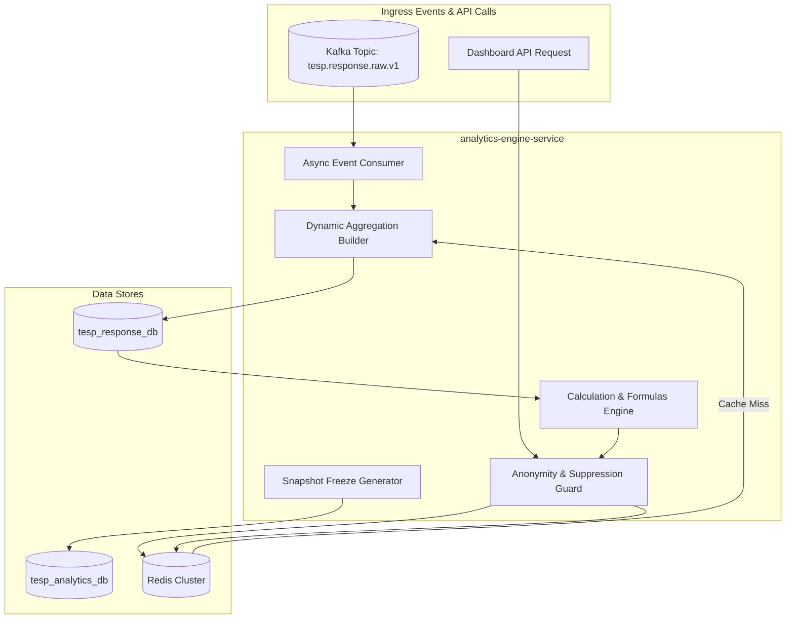
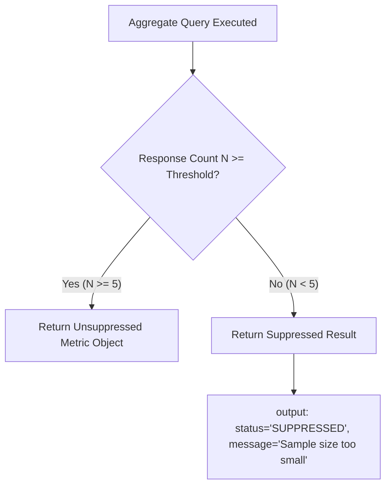

# DOC-006: Analytics Engine Architecture Specification

| Metadata Field | Value |
|---|---|
| **Document ID** | DOC-006 |
| **Title** | Analytics Engine Architecture Specification |
| **Version** | 1.0.0 |
| **Status** | Approved |
| **Owner** | Principal Software Architect |
| **Last Updated** | 2026-08-05 |
| **Dependencies** | `project-overview.md`, `ARCHITECTURE_PRINCIPLES.md`, `PROJECT_GLOSSARY.md`, `DOC-001-PROJECT-BLUEPRINT.md`, `DOC-002-SERVICE-ARCHITECTURE.md`, `DOC-003-DATABASE-PHILOSOPHY-AND-METAMODEL.md`, `DOC-004-ORGANIZATION-AND-HIERARCHY-DOMAIN.md`, `DOC-005-SURVEY-ENGINE-ARCHITECTURE.md` |
| **Related Documents** | `DOCUMENT_INDEX.md`, `DOCUMENT_DEPENDENCY_GRAPH.md` |
| **Implementation Phase** | Phase 1 (Core Analytics Services) |

---

## Purpose

This document provides the definitive implementation specification for the Analytics Engine within TESP. It defines the mathematical algorithms, MongoDB aggregation pipeline strategies, Redis caching topologies, point-in-time snapshot mechanics, and differential privacy enforcement rules powering real-time employee engagement metrics, eNPS scoring, multi-dimensional demographic slicing, and organizational heatmaps in `analytics-engine-service`.

---

## Scope

This specification governs the quantitative analytical processing pipeline:
- Score Calculation Algorithms (eNPS, Likert 100-Point Engagement Index, Participation Rates, Category Means).
- Dynamic Multi-Dimensional Slicing (Filtering metrics by arbitrary Organization Nodes and Demographic attributes).
- Anonymity Threshold & Differential Privacy Guardrails (Automatic response suppression for $N < \text{threshold}$).
- Point-in-time Analytical Snapshot Generation and Historical Trend Benchmarking.
- Redis Caching Strategy for High-Speed Dashboard Execution.

Out of scope:
- Qualitative text sentiment NLP (covered in `DOC-007: AI Analytics & NLP Specification`).
- PDF/Excel document layout generation (covered in `DOC-008: Reporting Engine Specification`).

---

## Dependencies

This specification strictly depends on and extends:
- `project-overview.md`: Analytics Engine requirements.
- `ARCHITECTURE_PRINCIPLES.md`: CQRS Ready, Metadata Driven, Everything Versioned.
- `PROJECT_GLOSSARY.md`: Canonical domain terms (`Analytics Engine`, `Snapshot`, `eNPS`, `Dashboard`, `Insight`).
- `DOC-001-PROJECT-BLUEPRINT.md`: Bounded context mapping.
- `DOC-002-SERVICE-ARCHITECTURE.md`: `analytics-engine-service` microservice definition.
- `DOC-003-DATABASE-PHILOSOPHY-AND-METAMODEL.md`: MongoDB schema specifications for `survey_responses` and `analytical_snapshots`.
- `DOC-004-ORGANIZATION-AND-HIERARCHY-DOMAIN.md`: Organizational hierarchy path filtering.
- `DOC-005-SURVEY-ENGINE-ARCHITECTURE.md`: Question types (`LIKERT`, `NPS`, `MATRIX`) and scoring formulas.

---

## Definitions

| Term | Technical Implementation Definition |
|---|---|
| **eNPS (Employee Net Promoter Score)** | Index calculated as `% Promoters (score 9-10) - % Detractors (score 0-6)` yielding a score between -100 and +100. |
| **Engagement Index** | A normalized score (0-100%) computed from the weighted mean of Likert question responses assigned to an engagement theme. |
| **Anonymity Threshold ($N$)** | The minimum sample size required before reporting analytical metrics (default $N = 5$) to prevent identifying individual responses. |
| **Analytical Snapshot** | An immutable point-in-time record containing aggregated metrics for a campaign, locked upon campaign closure for trend reporting. |
| **Filter Hash** | A SHA-256 fingerprint generated from dynamic filter criteria (node IDs, tenure, gender) used as a Redis cache lookup key. |

---

## Architecture

### Analytics Engine Subsystem Topology



---

## Calculation Algorithms & Formulas

### 1. eNPS (Employee Net Promoter Score)

$$\text{eNPS} = \left( \frac{P}{T} \times 100 \right) - \left( \frac{D}{T} \times 100 \right)$$

- $P$ = Total respondents selecting score 9 or 10.
- $D$ = Total respondents selecting score 0 through 6.
- $T$ = Total valid respondents for the NPS question (excluding N/A).

### 2. Likert 100-Point Engagement Index

$$\text{Engagement Index (\%)} = \frac{1}{N} \sum_{i=1}^{N} \left( \frac{V_i - V_{\min}}{V_{\max} - V_{\min}} \right) \times 100$$

- $V_i$ = Numeric response value chosen by respondent $i$.
- $V_{\min}, V_{\max}$ = Minimum and maximum scale values (e.g., 1 and 5).
- $N$ = Total responses for questions in the specified Question Group.

### 3. Participation Rate (%)

$$\text{Participation Rate} = \left( \frac{\text{Unique Submitted Responses}}{\text{Total Eligible Target Employees}} \right) \times 100$$

---

## MongoDB Aggregation Pipeline Architecture

The Analytics Engine constructs dynamic MongoDB pipelines using `$facet` to calculate overall metrics, group scores, and participation in a single database round-trip.

```javascript
// Dynamic MongoDB Analytics Aggregation Pipeline
db.survey_responses.aggregate([
  // Step 1: Match Project, Campaign, and Organization Node Scope
  {
    $match: {
      projectId: "PRJ-99201",
      campaignId: "CMP-1001",
      isDeleted: false,
      "demographicSnapshot.ancestorPaths": { $regex: "^,N-001,N-101," }
    }
  },
  
  // Step 2: Faceted Processing for Parallel Metrics
  {
    $facet: {
      // Branch A: eNPS Metrics
      "npsMetrics": [
        { $unwind: "$answers" },
        { $match: { "answers.questionType": "NPS" } },
        {
          $group: {
            _id: null,
            totalCount: { $sum: 1 },
            promoters: {
              $sum: { $cond: [{ $gte: ["$answers.numericValue", 9] }, 1, 0] }
            },
            detractors: {
              $sum: { $cond: [{ $lte: ["$answers.numericValue", 6] }, 1, 0] }
            }
          }
        }
      ],
      
      // Branch B: Likert Question Group Averages
      "groupScores": [
        { $unwind: "$answers" },
        { $match: { "answers.questionType": "LIKERT" } },
        {
          $group: {
            _id: "$answers.groupId",
            responseCount: { $sum: 1 },
            avgRawScore: { $avg: "$answers.numericValue" }
          }
        }
      ]
    }
  }
]);
```

---

## Anonymity Threshold & Differential Privacy Guard

To prevent de-anonymizing small teams, the `PrivacyGuard` component filters aggregation outputs before returning API responses.



---

## Functional Requirements

| ID | Requirement Title | Technical Specification & Description | Priority |
|---|---|---|---|
| **FR-ANL-010** | Real-Time Score Calculation | API must calculate eNPS, Engagement Index, and Participation Rate dynamically sliced by any filter criteria. | Critical |
| **FR-ANL-011** | Anonymity Enforcement | Engine MUST automatically suppress metrics for any filter slice returning fewer than `minResponseThreshold` (default $N = 5$). | Critical |
| **FR-ANL-012** | Heatmap Matrix Generation | Engine must generate 2D comparative score grids across Organization Nodes vs Question Groups. | Critical |
| **FR-ANL-013** | Analytical Snapshot Freezing | Upon campaign completion, engine must generate and write an immutable aggregate snapshot to `analytical_snapshots`. | High |
| **FR-ANL-014** | Redis Cache Layer | Aggregation results must be cached in Redis using a SHA-256 filter hash with automatic invalidation on new response ingestion. | High |

---

## Business Rules

| Rule ID | Domain | Business Rule Statement | Technical Enforcement |
|---|---|---|---|
| **BR-ANL-010** | Anonymity Guard Rule | Application code must NEVER bypass the sample size threshold ($N < 5$); suppressed cells must obscure numerical values. | Enforced in `PrivacyGuard` filter service. |
| **BR-ANL-011** | Snapshot Immutability | Frozen analytical snapshots in `analytical_snapshots` cannot be updated or deleted after campaign closure. | MongoDB collection Write-Once security policy. |
| **BR-ANL-012** | Historical Comparison Constraint | Historical trend analysis MUST compare against frozen `analytical_snapshots`, preserving past organizational state fidelity. | Trend API queries `analytical_snapshots` collection exclusively. |

---

## Technical Considerations

### Redis Cache Topology & Key Naming Convention

Cache keys are structured as: `tesp:analytics:<projectId>:<campaignId>:<filterHash>`

- **Key TTL**: 3600 seconds (1 hour) for active campaigns; 86400 seconds (24 hours) for closed campaigns.
- **Cache Invalidation**: On raw response ingestion, `analytics-engine-service` invalidates keys matching `tesp:analytics:<projectId>:<campaignId>:*` using Redis `SCAN` + `DEL` background execution.

---

## Security Considerations

1. **RBAC Scoping Enforcement**: Dashboard users only receive analytics for responses matching their authorized `X-User-NodeScope` materialized path prefix.
2. **Differential Privacy Leakage Prevention**: Cross-filter subtraction attacks (e.g., querying "Dept A" vs "Dept A minus Person X") are blocked by auditing high-frequency consecutive filter variations from the same user ID.

---

## Scalability & Performance

| Metric | Target SLA | Engineering Implementation |
|---|---|---|
| **Dashboard Metric Fetch SLA** | < 150 ms (p95) | Redis cache hit or secondary read on indexed `survey_responses`. |
| **100,000 Response Aggregation** | < 450 ms | Faceted MongoDB aggregation on sharded cluster. |
| **Snapshot Generation SLA** | < 10 seconds | Asynchronous background worker job post-campaign closure. |

---

## Future Extensions

1. **Predictive Attrition Risk Analytics**: Machine learning regression models correlating low engagement scores with historical employee turnover.
2. **Key Driver Analysis Engine**: Multiple linear regression evaluating which Question Groups have the highest impact on overall eNPS.

---

## References

- `DOC-001-PROJECT-BLUEPRINT.md`: Master architectural blueprint.
- `DOC-002-SERVICE-ARCHITECTURE.md`: Microservices topology.
- `DOC-003-DATABASE-PHILOSOPHY-AND-METAMODEL.md`: `survey_responses` and `analytical_snapshots` collections.
- `DOC-004-ORGANIZATION-AND-HIERARCHY-DOMAIN.md`: Materialized path scoping.
- `DOC-005-SURVEY-ENGINE-ARCHITECTURE.md`: Scoring definitions.

---

## Related Documents & Future Impact

| Relationship Type | Document ID | Title |
|---|---|---|
| **Upstream Dependencies** | `DOC-001` | Project Blueprint & Platform Master Architecture |
| **Upstream Dependencies** | `DOC-002` | Service Architecture Specification |
| **Upstream Dependencies** | `DOC-003` | Database Philosophy & Metamodel Specification |
| **Upstream Dependencies** | `DOC-004` | Organization & Hierarchy Domain Architecture Specification |
| **Upstream Dependencies** | `DOC-005` | Survey Engine Architecture Specification |
| **Downstream Impacted** | `DOC-007` | AI Analytics & NLP Architecture Specification |

---

## Open Questions

| Question ID | Topic | Description | Impact |
|---|---|---|---|
| **OQ-ANL-001** | Post-Stratification Weighting | Should analytics support statistical weighting based on demographic census proportions? (Current decision: Supported via optional weight fields in snapshot calculation). | Aggregation pipeline complexity. |

---

## Document Status

| Field | Value |
|---|---|
| **Document Status** | Approved / Implementation-Ready |
| **Dependencies Satisfied** | `project-overview.md`, `ARCHITECTURE_PRINCIPLES.md`, `PROJECT_GLOSSARY.md`, `DOC-001` to `DOC-005` |
| **Documents Affected** | `DOCUMENT_INDEX.md`, `DOCUMENT_DEPENDENCY_GRAPH.md` |
| **Next Recommended Document** | `DOC-007: AI Analytics & NLP Architecture Specification` |
