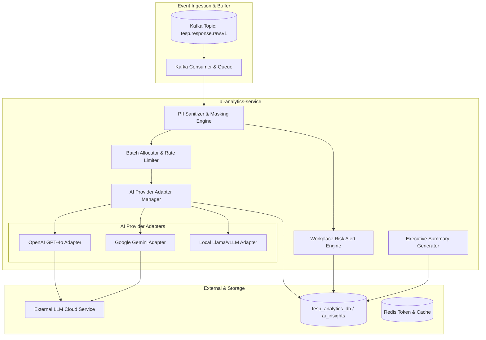

# DOC-007: AI Analytics & NLP Architecture Specification

| Metadata Field | Value |
|---|---|
| **Document ID** | DOC-007 |
| **Title** | AI Analytics & NLP Architecture Specification |
| **Version** | 1.0.0 |
| **Status** | Approved |
| **Owner** | Principal Software Architect |
| **Last Updated** | 2026-08-05 |
| **Dependencies** | `project-overview.md`, `ARCHITECTURE_PRINCIPLES.md`, `PROJECT_GLOSSARY.md`, `DOC-001-PROJECT-BLUEPRINT.md`, `DOC-002-SERVICE-ARCHITECTURE.md`, `DOC-003-DATABASE-PHILOSOPHY-AND-METAMODEL.md`, `DOC-004-ORGANIZATION-AND-HIERARCHY-DOMAIN.md`, `DOC-005-SURVEY-ENGINE-ARCHITECTURE.md`, `DOC-006-ANALYTICS-ENGINE-ARCHITECTURE.md` |
| **Related Documents** | `DOCUMENT_INDEX.md`, `DOCUMENT_DEPENDENCY_GRAPH.md` |
| **Implementation Phase** | Phase 1 (Advanced AI Services) |

---

## Purpose

This document provides the implementation specification for the AI Analytics & Natural Language Processing (NLP) Subsystem within TESP. It defines the asynchronous qualitative feedback processing pipeline, multi-lingual sentiment classification algorithms, automated topic/theme extraction, workplace risk identification, PII masking pre-processors, and LLM provider integration adapters implemented in `ai-analytics-service`.

---

## Scope

This specification governs all AI and NLP operations in TESP:
- Automated processing of qualitative open-ended survey answers (`SHORT_TEXT`, `LONG_TEXT`).
- Multi-lingual Sentiment Polarity Scoring (-1.0 Negative to +1.0 Positive).
- Theme & Topic Clustering (K-Means / Embedding distance / LLM Prompt-based topic aggregation).
- High-Risk Keyword & Workplace Safety Alert Engine.
- Automated Executive Summary Generation per Organization Node.
- Pluggable AI Service Provider Adapter Layer (OpenAI, Google Gemini, Local LLM).
- PII Masking and Data Privacy Sanitization pre-processing.

Out of scope:
- Quantitative statistical scoring (covered in `DOC-006: Analytics Engine Specification`).
- Survey question construction advice (covered in `DOC-005: Survey Engine Architecture Specification`).

---

## Dependencies

This specification strictly depends on and extends:
- `project-overview.md`: AI Analytics Module requirements and Daash Global partner alignment.
- `ARCHITECTURE_PRINCIPLES.md`: API First, Cloud Native, Security First.
- `PROJECT_GLOSSARY.md`: Canonical domain terms (`AI Analytics`, `Insight`, `Metadata`, `Snapshot`).
- `DOC-001-PROJECT-BLUEPRINT.md`: Bounded context mapping.
- `DOC-002-SERVICE-ARCHITECTURE.md`: `ai-analytics-service` microservice definition.
- `DOC-003-DATABASE-PHILOSOPHY-AND-METAMODEL.md`: MongoDB collections and database boundaries.
- `DOC-004-ORGANIZATION-AND-HIERARCHY-DOMAIN.md`: Organization Node scope for AI summaries.
- `DOC-005-SURVEY-ENGINE-ARCHITECTURE.md`: Question types (`SHORT_TEXT`, `LONG_TEXT`).
- `DOC-006-ANALYTICS-ENGINE-ARCHITECTURE.md`: Quantitative engagement scores triggering qualitative deep dives.

---

## Definitions

| Term | Technical Implementation Definition |
|---|---|
| **Sentiment Polarity** | A float score between -1.0 (extremely negative) and +1.0 (extremely positive) assigned to a text comment. |
| **Theme Cluster** | A conceptual topic (e.g., "Work-Life Balance", "Management Communication") grouping multiple text comments. |
| **Risk Flag** | An immediate high-priority system alert triggered by text containing compliance, safety, or severe distress keywords. |
| **PII Sanitizer** | A regex and Named Entity Recognition (NER) filter removing names, emails, phone numbers, and IDs before cloud LLM transmission. |
| **AI Provider Adapter** | A software abstraction layer standardizing calls across external LLM APIs (OpenAI GPT-4o, Google Gemini 1.5 Pro). |

---

## Architecture

### AI Analytics Processing Pipeline Topology



---

## Technical Specifications & Data Models

### 1. PII Masking & Sanitization Specification

Before sending text to an external LLM, the `PIIFilter` replaces sensitive entities with generic tokens:

| Entity Type | Detection Pattern / Regex | Replacement Token |
|---|---|---|
| **Email Address** | `[a-zA-Z0-9._%+-]+@[a-zA-Z0-9.-]+\.[a-zA-Z]{2,}` | `[MASKED_EMAIL]` |
| **Phone Number** | `\b\+?[0-9]{1,4}?[-.\s]?\(?[0-9]{1,3}?\)?[-.\s]?[0-9]{3,4}[-.\s]?[0-9]{3,4}\b` | `[MASKED_PHONE]` |
| **Employee ID** | `\bEMP-?[0-9]{4,8}\b` | `[MASKED_EMP_ID]` |
| **Person Name** | Named Entity Recognition (NER) Spacy Model | `[MASKED_NAME]` |

### 2. `ai_insights` Collection Schema

```json
{
  "$jsonSchema": {
    "bsonType": "object",
    "required": ["projectId", "campaignId", "responseId", "questionId", "sentimentScore", "sentimentLabel", "themes"],
    "properties": {
      "projectId": { "bsonType": "string" },
      "campaignId": { "bsonType": "string" },
      "responseId": { "bsonType": "string" },
      "questionId": { "bsonType": "string" },
      "nodeId": { "bsonType": "string" },
      "sanitizedText": { "bsonType": "string" },
      "sentimentScore": { "bsonType": "double", "description": "Range: -1.0 to +1.0" },
      "sentimentLabel": { "enum": ["POSITIVE", "NEUTRAL", "NEGATIVE"] },
      "confidence": { "bsonType": "double" },
      "themes": {
        "bsonType": "array",
        "items": { "bsonType": "string" }
      },
      "riskFlags": {
        "bsonType": "array",
        "items": {
          "bsonType": "object",
          "properties": {
            "category": { "enum": ["SAFETY", "HARASSMENT", "BURNOUT", "COMPLIANCE"] },
            "severity": { "enum": ["LOW", "MEDIUM", "HIGH", "CRITICAL"] },
            "keyword": { "bsonType": "string" }
          }
        }
      },
      "processedAt": { "bsonType": "date" }
    }
  }
}
```

---

## Executive Summary Prompt & LLM Specification

When generating an AI Executive Summary for an Organization Node, the system uses a structured JSON prompt:

```json
{
  "systemPrompt": "You are an expert organizational psychologist working for Daash Global. Analyze the provided anonymized employee comments for Department X and generate a concise executive summary with top 3 strengths, top 3 concerns, and 2 actionable recommendations.",
  "parameters": {
    "temperature": 0.2,
    "maxTokens": 800,
    "responseFormat": "json_object"
  }
}
```

---

## Functional Requirements

| ID | Requirement Title | Technical Specification & Description | Priority |
|---|---|---|---|
| **FR-AI-010** | Sentiment Scoring Pipeline | Asynchronously calculate sentiment polarity (-1.0 to +1.0) and confidence score for all text responses within 60 seconds of submission. | Critical |
| **FR-AI-011** | PII Text Pre-Sanitization | System MUST mask all names, emails, phone numbers, and employee IDs from text comments prior to invoking external AI APIs. | Critical |
| **FR-AI-012** | Automatic Theme Extraction | System must extract top recurring themes per Question Group across responses and aggregate frequency counts. | Critical |
| **FR-AI-013** | Workplace Risk Flagging | System must scan text for critical risk keywords (e.g., harassment, safety breach) and raise immediate alerts in `tesp_audit_db`. | Critical |
| **FR-AI-014** | Pluggable Provider Failover | System must automatically failover to secondary LLM provider if primary API returns 5xx errors or rate-limit throttles. | High |

---

## Business Rules

| Rule ID | Domain | Business Rule Statement | Technical Enforcement |
|---|---|---|---|
| **BR-AI-010** | Zero External PII Leakage | No raw, unmasked employee text containing PII may be sent across external network boundaries to third-party LLM providers. | Unit test & pre-flight interceptor in `PIIFilter`. |
| **BR-AI-011** | Daily AI Token Budget Guard | If project API usage reaches 100% of daily token budget, AI processing must gracefully defer non-critical summary generation to off-peak hours. | Token counter monitor in Redis. |
| **BR-AI-012** | Consultant Override Authority | HR Admins and Daash Global consultants must be permitted to override AI-assigned sentiment tags or themes manually. | API endpoint `PUT /api/v1/insights/{insightId}/override`. |

---

## Technical Considerations

### Provider Adapter Pattern Pseudocode

```java
public interface AiProviderAdapter {
    SentimentResult analyzeSentiment(String sanitizedText);
    ThemeResult extractThemes(List<String> textBatch);
    String generateExecutiveSummary(SummaryPromptRequest prompt);
}

@Service
public class OpenAiAdapter implements AiProviderAdapter {
    // Implementation using OpenAI REST API with Resilience4j CircuitBreaker
}
```

---

## Security Considerations

1. **Zero Data Retention Agreements**: External AI contracts with cloud vendors (OpenAI Enterprise, AWS Bedrock, GCP Vertex AI) MUST mandate zero data retention (no storing or training on customer survey comments).
2. **Encrypted Storage of AI Outputs**: Analyzed sentiment scores and generated executive summaries are encrypted at rest in MongoDB using AES-256.

---

## Scalability & Performance

| Operation | Target SLA | Scaling Strategy |
|---|---|---|
| **Text Comment PII Masking** | < 5 ms per comment | In-memory Java Regex + Spacy ONNX runtime worker. |
| **Batch Sentiment Scoring (50 comments)** | < 1.2 seconds | Parallel HTTP/2 calls via `WebClient` to LLM provider endpoints. |
| **Node Executive Summary Generation** | < 4.0 seconds | Async background job execution triggered post-campaign. |

---

## Future Extensions

1. **Local Fine-Tuned LLM Deployment**: Replacing external cloud LLM APIs with self-hosted vLLM containers running fine-tuned Llama 3 models on AWS GPU instances for complete data sovereignty.
2. **Voice-to-Text Feedback Sentiment**: Native speech recognition and acoustic emotion detection for audio survey responses.

---

## References

- `DOC-001-PROJECT-BLUEPRINT.md`: Master architectural blueprint.
- `DOC-002-SERVICE-ARCHITECTURE.md`: `ai-analytics-service` definition.
- `DOC-003-DATABASE-PHILOSOPHY-AND-METAMODEL.md`: MongoDB database topology.
- `DOC-005-SURVEY-ENGINE-ARCHITECTURE.md`: Question types (`SHORT_TEXT`, `LONG_TEXT`).
- `DOC-006-ANALYTICS-ENGINE-ARCHITECTURE.md`: Quantitative metric integration.

---

## Related Documents & Future Impact

| Relationship Type | Document ID | Title |
|---|---|---|
| **Upstream Dependencies** | `DOC-001` through `DOC-006` | Blueprint, Service, DB, Org, Survey, and Analytics Architecture Specs |
| **Downstream Impacted** | `DOC-008` | Reporting Engine Architecture Specification |

---

## Open Questions

| Question ID | Topic | Description | Impact |
|---|---|---|---|
| **OQ-AI-001** | Local vs Cloud LLM Default | Should default deployments use Cloud OpenAI APIs or self-hosted local vLLM models? (Current decision: Pluggable adapter defaults to Cloud OpenAI with toggle for local vLLM). | Infrastructure deployment cost and GPU requirements. |

---

## Document Status

| Field | Value |
|---|---|
| **Document Status** | Approved / Implementation-Ready |
| **Dependencies Satisfied** | `project-overview.md`, `ARCHITECTURE_PRINCIPLES.md`, `PROJECT_GLOSSARY.md`, `DOC-001` to `DOC-006` |
| **Documents Affected** | `DOCUMENT_INDEX.md`, `DOCUMENT_DEPENDENCY_GRAPH.md` |
| **Next Recommended Document** | `DOC-008: Reporting Engine Architecture Specification` |
