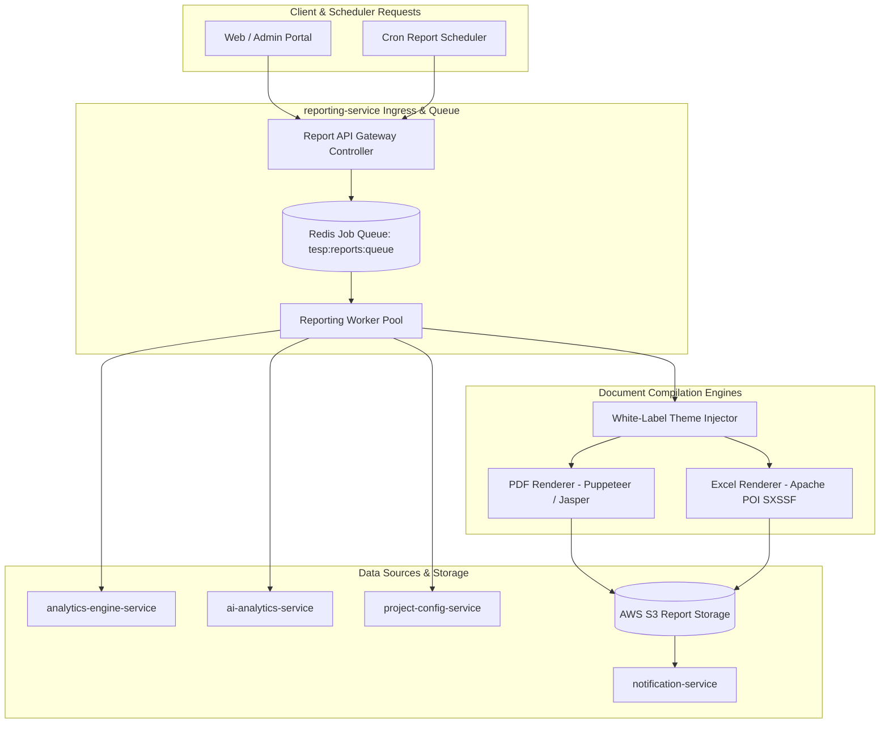
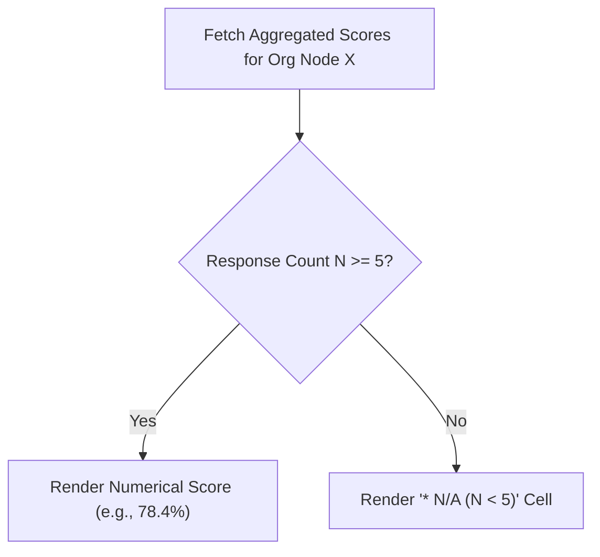

# DOC-008: Reporting Engine Architecture Specification

| Metadata Field | Value |
|---|---|
| **Document ID** | DOC-008 |
| **Title** | Reporting Engine Architecture Specification |
| **Version** | 1.0.0 |
| **Status** | Approved |
| **Owner** | Principal Software Architect |
| **Last Updated** | 2026-08-05 |
| **Dependencies** | `project-overview.md`, `ARCHITECTURE_PRINCIPLES.md`, `PROJECT_GLOSSARY.md`, `DOC-001-PROJECT-BLUEPRINT.md`, `DOC-002-SERVICE-ARCHITECTURE.md`, `DOC-003-DATABASE-PHILOSOPHY-AND-METAMODEL.md`, `DOC-004-ORGANIZATION-AND-HIERARCHY-DOMAIN.md`, `DOC-005-SURVEY-ENGINE-ARCHITECTURE.md`, `DOC-006-ANALYTICS-ENGINE-ARCHITECTURE.md`, `DOC-007-AI-ANALYTICS-AND-NLP-SPECIFICATION.md` |
| **Related Documents** | `DOCUMENT_INDEX.md`, `DOCUMENT_DEPENDENCY_GRAPH.md` |
| **Implementation Phase** | Phase 1 (Core Reporting Services) |

---

## Purpose

This document provides the implementation specification for the Reporting Engine within TESP. It defines the asynchronous document generation pipeline, white-label branding compilation, PDF/Excel rendering engines, scheduled batch dispatchers, and pre-signed S3 distribution mechanics implemented in `reporting-service`.

---

## Scope

This specification governs all document export and report rendering capabilities in TESP:
- Asynchronous Report Job Queuing and Execution.
- Executive PDF Report Compilation (incorporating eNPS cards, heatmaps, and AI executive summaries).
- Aggregated & Anonymized Excel (XLSX) Export Engine.
- White-label Theme & Branding Injection (Logos, custom CSS palettes, typography).
- Scheduled Cron-based Report Generation and Email/Teams Dispatch.
- Differential Anonymity Protection within generated artifacts.

Out of scope:
- Interactive web dashboard widget rendering (covered in Frontend specs).
- Action plan task management (covered in `DOC-009: Action Planning Architecture Specification`).

---

## Dependencies

This specification strictly depends on and extends:
- `project-overview.md`: Reporting Engine requirements and output formats.
- `ARCHITECTURE_PRINCIPLES.md`: Configuration over Code, Metadata Driven.
- `PROJECT_GLOSSARY.md`: Canonical domain terms (`Reporting Engine`, `Template`, `Snapshot`, `Dashboard`).
- `DOC-001-PROJECT-BLUEPRINT.md`: Bounded context boundaries.
- `DOC-002-SERVICE-ARCHITECTURE.md`: `reporting-service` microservice definition.
- `DOC-003-DATABASE-PHILOSOPHY-AND-METAMODEL.md`: Analytical database sources.
- `DOC-004-ORGANIZATION-AND-HIERARCHY-DOMAIN.md`: Node scoping for reports.
- `DOC-006-ANALYTICS-ENGINE-ARCHITECTURE.md`: Quantitative score data inputs.
- `DOC-007-AI-ANALYTICS-AND-NLP-SPECIFICATION.md`: Qualitative sentiment and AI summary inputs.

---

## Definitions

| Term | Technical Implementation Definition |
|---|---|
| **Report Template** | A dynamic layout schema (JRXML / HTML Handlebars template) defining section ordering, chart placements, and styling rules. |
| **Job Queue** | A Redis-backed asynchronous queue holding requested report generation jobs prior to worker consumption. |
| **Streaming XLSX Writer** | A low-memory Java stream renderer (`SXSSFWorkbook`) writing large tabular response datasets directly to disk/S3. |
| **Pre-Signed URL** | A time-limited, cryptographically signed AWS S3 URL granting temporary read access to generated report files. |
| **White-Label Branding** | The dynamic substitution of Project logos, brand primary/secondary colors, and custom header/footer metadata into reports. |

---

## Architecture

### Reporting Engine Subsystem Component Topology



---

## Report Types & Output Specifications

| Report Type Code | Format | Engine Used | Content Included |
|---|---|---|---|
| `EXEC_SUMMARY_PDF` | PDF | Headless Chromium / Jasper | Executive summary, eNPS, engagement score cards, top/bottom heatmaps, AI recommendations. |
| `DEPT_BREAKDOWN_PDF` | PDF | Headless Chromium | Detailed side-by-side comparative analysis of descendant Organization Nodes. |
| `RAW_RESPONSES_XLSX` | XLSX | Apache POI Streaming | Tabular raw response data (anonymized), demographic tags, question columns. |
| `AGGREGATED_SCORES_XLSX`| XLSX | Apache POI | Pre-calculated category, question group, and demographic cross-tab matrices. |
| `PULSE_SUMMARY_PPTX` | PPTX | Apache POI-HSLF (Future) | Executive slide deck presentation summary. |

---

## White-Label Branding Engine Specification

During report compilation, `BrandInjector` fetches branding parameters from `project-config-service` and injects CSS variables into the layout:

```json
{
  "projectId": "PRJ-99201",
  "branding": {
    "companyName": "Aitken Spence",
    "logoUrl": "https://s3.amazonaws.com/tesp-assets/prj-99201/logo.png",
    "primaryColor": "#1E3A8A",
    "secondaryColor": "#3B82F6",
    "fontFamily": "Inter, Roboto, sans-serif",
    "footerText": "Confidential Employee Engagement Report - Aitken Spence"
  }
}
```

---

## Anonymity Guard Enforcement in Reports

Before rendering data cells into PDF heatmaps or Excel sheets, the `reporting-service` verifies sample size rules:



---

## Functional Requirements

| ID | Requirement Title | Technical Specification & Description | Priority |
|---|---|---|---|
| **FR-RPT-010** | Asynchronous Report Job API | API `POST /api/v1/reports/generate` must enqueue report generation jobs and return HTTP 202 Accepted with `jobId`. | Critical |
| **FR-RPT-011** | Executive PDF Generation | System must compile polished multi-page executive PDF reports incorporating white-label branding, eNPS metrics, and charts. | Critical |
| **FR-RPT-012** | Streaming Excel Export | System must generate multi-tab XLSX files for large datasets (50,000+ rows) without causing out-of-memory errors. | Critical |
| **FR-RPT-013** | Report Anonymity Suppression | System MUST enforce sample size suppression ($N < 5$) inside all generated PDF tables and Excel worksheets. | Critical |
| **FR-RPT-014** | Scheduled Report Dispatcher | System must support scheduling recurring report generation jobs (e.g., every Monday 08:00 UTC) with email PDF attachment delivery. | High |

---

## Business Rules

| Rule ID | Domain | Business Rule Statement | Technical Enforcement |
|---|---|---|---|
| **BR-RPT-010** | Anonymity Protection in Reports | Generated PDF/Excel reports must suppress numeric values for any data slice with fewer than `minResponseThreshold` responses. | Data pre-pass check in `reporting-service`. |
| **BR-RPT-011** | Pre-Signed URL Expiration | Download links for generated reports sent via email or API MUST expire after 24 hours. | AWS S3 pre-signed URL parameter `expiration = 86400`. |
| **BR-RPT-012** | RBAC Node Scope Boundary | Report requests must be rejected if the user requests an organizational node path outside their assigned `nodeScope`. | Ingress security interceptor check. |

---

## Technical Considerations

### Apache POI Memory Optimization Code Pattern

```java
// Low-memory streaming Excel export pattern
public void generateRawResponseXlsx(List<SurveyResponse> responses, OutputStream out) {
    // Keep 100 rows in memory, flush excess to disk
    SXSSFWorkbook wb = new SXSSFWorkbook(100); 
    Sheet sheet = wb.createSheet("Anonymized Responses");
    
    int rowNum = 0;
    for (SurveyResponse resp : responses) {
        Row row = sheet.createRow(rowNum++);
        row.createCell(0).setCellValue(resp.getCampaignId());
        row.createCell(1).setCellValue(resp.getSubmittedAt().toString());
        // Append question answers...
    }
    wb.write(out);
    wb.dispose(); // Dispose temporary disk files
}
```

---

## Security Considerations

1. **Pre-Signed URL Security**: Report files stored on S3 are private (`ACL: private`); access is permitted exclusively via short-lived pre-signed URLs.
2. **Encrypted PDF Export**: System supports optional password protection (AES-128 PDF Encryption) using recipient employee ID or birth date.

---

## Scalability & Performance

| Operation | Target SLA | Scaling Strategy |
|---|---|---|
| **10-Page Executive PDF Render** | < 2.5 seconds | Pre-compiled HTML templates + Headless Chrome worker pool. |
| **50,000 Row XLSX Export** | < 6.0 seconds | Apache POI `SXSSFWorkbook` streaming disk flush. |
| **Report Worker Scaling** | Auto-scale pods | HPA scales worker pods when Redis queue size > 50 jobs. |

---

## Future Extensions

1. **Automated Executive PPTX Slide Decks**: Direct generation of editable PowerPoint presentations for enterprise board meetings.
2. **Interactive Offline HTML Bundles**: Single-file self-contained HTML reports with embedded offline SVG charts.

---

## References

- `DOC-001-PROJECT-BLUEPRINT.md`: Master architectural blueprint.
- `DOC-002-SERVICE-ARCHITECTURE.md`: `reporting-service` definition.
- `DOC-003-DATABASE-PHILOSOPHY-AND-METAMODEL.md`: Database data specs.
- `DOC-006-ANALYTICS-ENGINE-ARCHITECTURE.md`: Quantitative data inputs.
- `DOC-007-AI-ANALYTICS-AND-NLP-SPECIFICATION.md`: Qualitative AI summary inputs.

---

## Related Documents & Future Impact

| Relationship Type | Document ID | Title |
|---|---|---|
| **Upstream Dependencies** | `DOC-001` through `DOC-007` | All previous foundation, DB, domain, and engine specs |
| **Downstream Impacted** | `DOC-009` | Action Planning Architecture Specification |

---

## Open Questions

| Question ID | Topic | Description | Impact |
|---|---|---|---|
| **OQ-RPT-001** | PDF Rendering Engine | Should PDF generation rely on JasperReports JRXML or Puppeteer HTML-to-PDF? (Current decision: Puppeteer HTML-to-PDF for rich CSS3/Flexbox visual quality). | Worker container memory footprint. |

---

## Document Status

| Field | Value |
|---|---|
| **Document Status** | Approved / Implementation-Ready |
| **Dependencies Satisfied** | `project-overview.md`, `ARCHITECTURE_PRINCIPLES.md`, `PROJECT_GLOSSARY.md`, `DOC-001` to `DOC-007` |
| **Documents Affected** | `DOCUMENT_INDEX.md`, `DOCUMENT_DEPENDENCY_GRAPH.md` |
| **Next Recommended Document** | `DOC-009: Action Planning Architecture Specification` |
