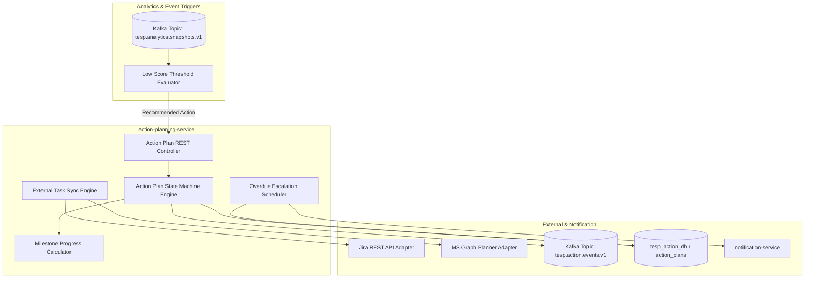
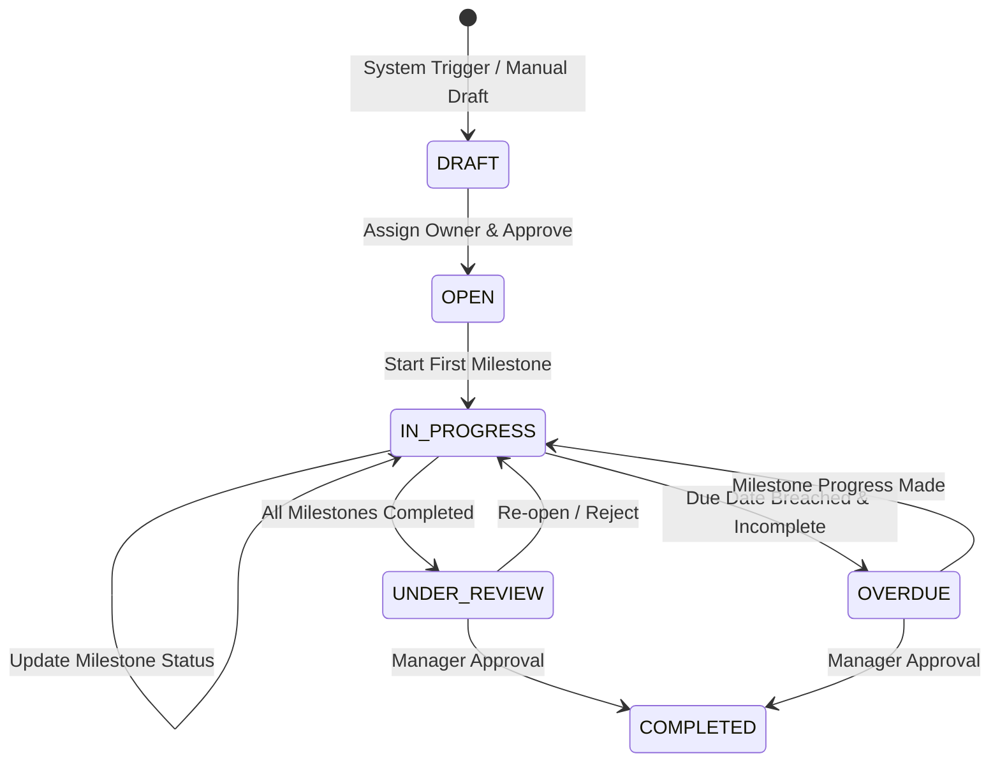

# DOC-009: Action Planning Architecture Specification

| Metadata Field | Value |
|---|---|
| **Document ID** | DOC-009 |
| **Title** | Action Planning Architecture Specification |
| **Version** | 1.0.0 |
| **Status** | Approved |
| **Owner** | Principal Software Architect |
| **Last Updated** | 2026-08-05 |
| **Dependencies** | `project-overview.md`, `ARCHITECTURE_PRINCIPLES.md`, `PROJECT_GLOSSARY.md`, `DOC-001-PROJECT-BLUEPRINT.md`, `DOC-002-SERVICE-ARCHITECTURE.md`, `DOC-003-DATABASE-PHILOSOPHY-AND-METAMODEL.md`, `DOC-004-ORGANIZATION-AND-HIERARCHY-DOMAIN.md`, `DOC-005-SURVEY-ENGINE-ARCHITECTURE.md`, `DOC-006-ANALYTICS-ENGINE-ARCHITECTURE.md`, `DOC-007-AI-ANALYTICS-AND-NLP-SPECIFICATION.md`, `DOC-008-REPORTING-ENGINE-ARCHITECTURE.md` |
| **Related Documents** | `DOCUMENT_INDEX.md`, `DOCUMENT_DEPENDENCY_GRAPH.md` |
| **Implementation Phase** | Phase 1 (Action & Workflow Services) |

---

## Purpose

This document provides the implementation specification for the Action Planning Subsystem within TESP. It defines the state machine, milestone task tracking engine, automated low-score threshold trigger mechanics, external integration bridges (Jira / Microsoft Planner), and notification escalation rules implemented in `action-planning-service`.

---

## Scope

This specification governs all action planning capabilities in TESP:
- Action Plan creation, milestone breakdown, and ownership assignment.
- Linkage to low-performing survey Question Groups and Organization Nodes.
- State Machine Transitions (`DRAFT`, `OPEN`, `IN_PROGRESS`, `UNDER_REVIEW`, `COMPLETED`, `OVERDUE`).
- Automated Trigger Generation based on analytics score threshold breaches.
- External System Sync (Bi-directional task synchronization with Jira and MS Planner).
- Overdue Task Escalation and Reminder Workflows.

Out of scope:
- Web UI component layout rendering (covered in Frontend specs).
- Single-use survey token distribution (covered in `DOC-005: Survey Engine Architecture Specification`).

---

## Dependencies

This specification strictly depends on and extends:
- `project-overview.md`: Action Planning Module requirements.
- `ARCHITECTURE_PRINCIPLES.md`: DDD, Event Driven, Everything Auditable.
- `PROJECT_GLOSSARY.md`: Canonical domain terms (`Action Plan`, `Organization Node`, `Question Group`, `Insight`).
- `DOC-001-PROJECT-BLUEPRINT.md`: Bounded context mapping.
- `DOC-002-SERVICE-ARCHITECTURE.md`: `action-planning-service` microservice definition.
- `DOC-003-DATABASE-PHILOSOPHY-AND-METAMODEL.md`: `action_plans` MongoDB collection schema.
- `DOC-004-ORGANIZATION-AND-HIERARCHY-DOMAIN.md`: Node scoping for action plans.
- `DOC-006-ANALYTICS-ENGINE-ARCHITECTURE.md`: Analytical threshold score inputs triggering action plans.

---

## Definitions

| Term | Technical Implementation Definition |
|---|---|
| **Action Plan** | A structured improvement initiative linked to a specific Organization Node and survey theme with assigned owners, milestones, and target due dates. |
| **Milestone Sub-Task** | An atomic, measurable work unit within an Action Plan with its own assignee, due date, and completion status. |
| **Threshold Trigger** | An automated alert generated when an analytical score for an Organization Node drops below a configured threshold (e.g., $S < 60\%$). |
| **Sync Bridge** | An asynchronous integration connector relaying Action Plan status updates to external enterprise systems (Jira / MS Planner). |

---

## Architecture

### Action Planning Subsystem Topology



### Action Plan State Machine



---

## Technical Specifications & Data Models

### `action_plans` Schema Specification

```json
{
  "$jsonSchema": {
    "bsonType": "object",
    "required": ["projectId", "actionPlanId", "title", "nodeId", "groupId", "ownerId", "status", "targetDueDate", "milestones"],
    "properties": {
      "projectId": { "bsonType": "string" },
      "actionPlanId": { "bsonType": "string" },
      "campaignId": { "bsonType": "string" },
      "title": { "bsonType": "string" },
      "description": { "bsonType": "string" },
      "nodeId": { "bsonType": "string" },
      "groupId": { "bsonType": "string", "description": "Associated Question Group e.g. GRP-LEADERSHIP" },
      "ownerId": { "bsonType": "string", "description": "Primary responsible employeeId" },
      "status": { "enum": ["DRAFT", "OPEN", "IN_PROGRESS", "UNDER_REVIEW", "COMPLETED", "OVERDUE"] },
      "progressPercentage": { "bsonType": "double" },
      "targetDueDate": { "bsonType": "date" },
      "milestones": {
        "bsonType": "array",
        "items": {
          "bsonType": "object",
          "required": ["milestoneId", "title", "assigneeId", "status", "dueDate"],
          "properties": {
            "milestoneId": { "bsonType": "string" },
            "title": { "bsonType": "string" },
            "assigneeId": { "bsonType": "string" },
            "status": { "enum": ["OPEN", "IN_PROGRESS", "COMPLETED"] },
            "dueDate": { "bsonType": "date" },
            "completedAt": { "bsonType": ["date", "null"] }
          }
        }
      },
      "externalSync": {
        "bsonType": "object",
        "properties": {
          "provider": { "enum": ["JIRA", "MS_PLANNER", "NONE"] },
          "externalKey": { "bsonType": "string" },
          "lastSyncedAt": { "bsonType": "date" }
        }
      }
    }
  }
}
```

---

## Milestone Progress Calculation Algorithm

$$\text{Progress Percentage (\%)} = \left( \frac{\sum_{i=1}^{M} S_i}{M} \right) \times 100$$

- $M$ = Total count of milestones in the Action Plan.
- $S_i$ = Milestone state score: `COMPLETED` = 1.0, `IN_PROGRESS` = 0.5, `OPEN` = 0.0.

---

## Functional Requirements

| ID | Requirement Title | Technical Specification & Description | Priority |
|---|---|---|---|
| **FR-ACT-010** | Action Plan Lifecycle Management | API must support creating, updating, assigning, and executing state transitions for Action Plans. | Critical |
| **FR-ACT-011** | Automated Low-Score Trigger | System must evaluate analytical snapshots and auto-generate draft Action Plans when an Organization Node breaches configured threshold $S < 60\%$. | Critical |
| **FR-ACT-012** | Milestone Progress Tracking | System must recalculate `progressPercentage` automatically upon any milestone status change. | Critical |
| **FR-ACT-013** | Bi-Directional Jira / MS Planner Sync | System must synchronize Action Plan status and milestone completions with external Jira issues or MS Planner tasks via webhook/REST. | High |
| **FR-ACT-014** | Overdue Task Escalation Worker | Daily cron worker must identify overdue tasks, transition status to `OVERDUE`, and trigger email/Teams notification alerts. | High |

---

## Business Rules

| Rule ID | Domain | Business Rule Statement | Technical Enforcement |
|---|---|---|---|
| **BR-ACT-010** | Primary Owner Mandate | Every active Action Plan MUST have exactly one designated primary owner (`ownerId`) assigned before moving to `OPEN` status. | State machine transition validation rule. |
| **BR-ACT-011** | Node Scope Boundary | Users can only view or edit Action Plans associated with Organization Nodes within their authorized `nodeScope`. | RBAC filter check in `action-planning-service`. |
| **BR-ACT-012** | Completion Guard Rule | An Action Plan CANNOT be transitioned to `COMPLETED` status if any child milestone remains in `OPEN` or `IN_PROGRESS` state. | State machine pre-condition check. |

---

## Security Considerations

1. **RBAC Scoping on Action Tasks**: Line managers can only create and modify Action Plans within their own department sub-tree scope.
2. **Audit Event Logging**: Every Action Plan owner re-assignment, due date extension, or status completion emits an audit record to `tesp_audit_db`.

---

## Scalability & Performance

| Operation | Target SLA | Scaling Implementation |
|---|---|---|
| **Milestone Status Update SLA** | < 20 ms | In-memory Spring State Machine + MongoDB `$set` atomic update. |
| **Daily Escalation Cron Sweep (100,000 plans)** | < 15 seconds | MongoDB index scan on `{ projectId: 1, targetDueDate: 1, status: 1 }`. |
| **External Jira Task Sync** | < 1.0 second per task | Async event-driven worker using Kafka and Spring WebClient. |

---

## Future Extensions

1. **AI Action Item Recommender**: Machine learning recommendation engine suggesting specific remedial interventions based on past enterprise success rates.
2. **Impact Assessment Analytics**: Correlating completed Action Plans with subsequent pulse survey score improvements to measure ROI.

---

## References

- `DOC-001-PROJECT-BLUEPRINT.md`: Master architectural blueprint.
- `DOC-002-SERVICE-ARCHITECTURE.md`: `action-planning-service` definition.
- `DOC-003-DATABASE-PHILOSOPHY-AND-METAMODEL.md`: `action_plans` collection spec.
- `DOC-004-ORGANIZATION-AND-HIERARCHY-DOMAIN.md`: Materialized path scoping.
- `DOC-006-ANALYTICS-ENGINE-ARCHITECTURE.md`: Quantitative analytical threshold inputs.

---

## Related Documents & Future Impact

| Relationship Type | Document ID | Title |
|---|---|---|
| **Upstream Dependencies** | `DOC-001` through `DOC-008` | All previous foundation, DB, domain, analytics, and reporting specs |
| **Downstream Impacted** | `DOC-010` | User Roles, RBAC & Security Specification |

---

## Open Questions

| Question ID | Topic | Description | Impact |
|---|---|---|---|
| **OQ-ACT-001** | External Webhook Retries | How should external Jira API failures be retried? (Current decision: Exponential backoff retries up to 5 attempts, then flag in DLQ). | External sync reliability. |

---

## Document Status

| Field | Value |
|---|---|
| **Document Status** | Approved / Implementation-Ready |
| **Dependencies Satisfied** | `project-overview.md`, `ARCHITECTURE_PRINCIPLES.md`, `PROJECT_GLOSSARY.md`, `DOC-001` to `DOC-008` |
| **Documents Affected** | `DOCUMENT_INDEX.md`, `DOCUMENT_DEPENDENCY_GRAPH.md` |
| **Next Recommended Document** | `DOC-010: User Roles, RBAC & Security Specification` |
