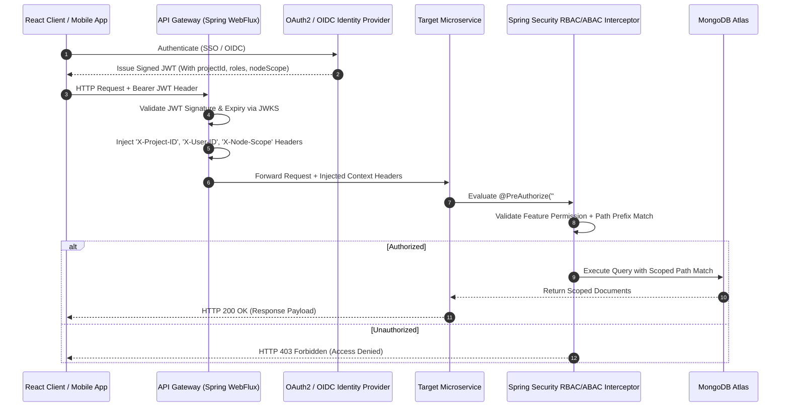

# DOC-010: User Roles, RBAC & Security Specification

| Metadata Field | Value |
|---|---|
| **Document ID** | DOC-010 |
| **Title** | User Roles, RBAC & Security Specification |
| **Version** | 1.0.0 |
| **Status** | Approved |
| **Owner** | Principal Software Architect |
| **Last Updated** | 2026-08-05 |
| **Dependencies** | `project-overview.md`, `ARCHITECTURE_PRINCIPLES.md`, `PROJECT_GLOSSARY.md`, `DOC-001-PROJECT-BLUEPRINT.md`, `DOC-002-SERVICE-ARCHITECTURE.md`, `DOC-003-DATABASE-PHILOSOPHY-AND-METAMODEL.md`, `DOC-004-ORGANIZATION-AND-HIERARCHY-DOMAIN.md`, `DOC-005-SURVEY-ENGINE-ARCHITECTURE.md`, `DOC-006-ANALYTICS-ENGINE-ARCHITECTURE.md`, `DOC-007-AI-ANALYTICS-AND-NLP-SPECIFICATION.md`, `DOC-008-REPORTING-ENGINE-ARCHITECTURE.md`, `DOC-009-ACTION-PLANNING-ARCHITECTURE.md` |
| **Related Documents** | `DOCUMENT_INDEX.md`, `DOCUMENT_DEPENDENCY_GRAPH.md` |
| **Implementation Phase** | Phase 1 (Security Infrastructure) |

---

## Purpose

This document provides the definitive technical specification for authentication, authorization, fine-grained Role-Based Access Control (RBAC), Attribute-Based Access Control (ABAC), organizational node data scoping, and security governance across the Talnova Enterprise Survey Platform (TESP). It defines how microservices enforce security policies, validate JWT tokens, isolate project context, and record audit events.

---

## Scope

This specification governs all platform security mechanisms:
- Single Sign-On (SSO) identity federation (OAuth2, OpenID Connect, SAML 2.0).
- Standardized JWT Token claim structure and context propagation.
- System Role Inventory and Feature Permission Matrix.
- Hybrid RBAC + ABAC Data Visibility Engine (Organizational Node Sub-tree Scoping).
- Cryptographic Respondent Anonymity Decoupling.
- Audit Event Logging and OWASP Security Controls.

Out of scope:
- Frontend React login form CSS layout (covered in Frontend specs).
- Physical cloud infrastructure firewall rules (covered in Deployment specs).

---

## Dependencies

This specification strictly depends on and extends:
- `project-overview.md`: User Roles & Permissions and Security Architecture sections.
- `ARCHITECTURE_PRINCIPLES.md`: Security First, Everything Auditable.
- `PROJECT_GLOSSARY.md`: Canonical domain terms (`Project`, `Organization Node`, `Metadata`).
- `DOC-001-PROJECT-BLUEPRINT.md`: Security Gateway & API boundaries.
- `DOC-002-SERVICE-ARCHITECTURE.md`: Ingress Security & `audit-service` definition.
- `DOC-003-DATABASE-PHILOSOPHY-AND-METAMODEL.md`: `audit_logs` collection schema.
- `DOC-004-ORGANIZATION-AND-HIERARCHY-DOMAIN.md`: Materialized path node scoping.

---

## Definitions

| Term | Technical Implementation Definition |
|---|---|
| **RBAC (Role-Based Access Control)** | Authorization model restricting feature access based on assigned user roles (e.g., `HR_MANAGER`). |
| **ABAC (Attribute-Based Access Control)** | Authorization model restricting data access based on runtime attributes (e.g., matching user's `nodeScope` against document `path`). |
| **JWT (JSON Web Token)** | Cryptographically signed bearer token carrying identity, `projectId`, roles, and `nodeScope` claims. |
| **Node Scope** | The specific Organization Node ID establishing the root of a user's authorized data sub-tree. |
| **Anonymity Vault** | An isolated cryptographic data store preventing linkability between respondent identity and survey submissions. |

---

## Architecture

### Security Pipeline & Authorization Flow



---

## Role Inventory & Feature Permission Matrix

### System Role Definitions

1. `SUPER_ADMIN`: Platform owner with global administration access across all Projects.
2. `PROJECT_ADMIN`: Enterprise client administrator owning configuration for a single Project.
3. `HR_MANAGER`: HR leader managing employee rosters, survey launches, and executive reports.
4. `EXECUTIVE`: C-suite executive with full analytical dashboard and reporting visibility across the enterprise.
5. `BUSINESS_UNIT_HEAD`: Regional or division leader scoped to a specific major Organization Node sub-tree.
6. `DEPARTMENT_MANAGER`: Line manager scoped strictly to their department sub-tree.
7. `CONSULTANT_DAASH`: Third-party advisory consultant from Daash Global providing survey configuration & insights.
8. `VIEWER`: Read-only user permitted to view specific shared analytical dashboards.
9. `SURVEY_RESPONDENT`: Participant authorized strictly to submit survey responses.

### Permission Matrix

| Role | `PROJECT_MANAGE` | `ORG_MANAGE` | `SURVEY_CREATE` | `CAMPAIGN_LAUNCH` | `ANALYTICS_VIEW` | `REPORT_EXPORT` | `ACTION_MANAGE` | `AUDIT_VIEW` |
|---|---|---|---|---|---|---|---|---|
| `SUPER_ADMIN` | YES (All) | YES (All) | YES (All) | YES (All) | YES (All) | YES (All) | YES (All) | YES (All) |
| `PROJECT_ADMIN` | YES (Own) | YES (Own) | YES (Own) | YES (Own) | YES (Own) | YES (Own) | YES (Own) | YES (Own) |
| `HR_MANAGER` | NO | YES (Own) | YES (Own) | YES (Own) | YES (Own) | YES (Own) | YES (Own) | NO |
| `EXECUTIVE` | NO | NO | NO | NO | YES (Global) | YES (Global) | YES (Global) | NO |
| `BUSINESS_UNIT_HEAD` | NO | NO | NO | NO | YES (Scoped) | YES (Scoped) | YES (Scoped) | NO |
| `DEPARTMENT_MANAGER` | NO | NO | NO | NO | YES (Scoped) | YES (Scoped) | YES (Scoped) | NO |
| `CONSULTANT_DAASH` | NO | YES (Config) | YES (Templates) | NO | YES (Own) | YES (Own) | YES (Consult) | NO |
| `VIEWER` | NO | NO | NO | NO | YES (Scoped) | NO | NO | NO |
| `SURVEY_RESPONDENT` | NO | NO | NO | NO | NO | NO | NO | NO |

---

## JWT Claim Structure Specification

```json
{
  "iss": "https://auth.tesp.talnova.com/auth/realms/tesp",
  "sub": "usr_9920184",
  "aud": "tesp-api-gateway",
  "exp": 1785952800,
  "iat": 1785949200,
  "projectId": "PRJ-99201",
  "email": "manager@aitkenspence.com",
  "roles": ["DEPARTMENT_MANAGER"],
  "nodeScope": "N-301",
  "nodePath": ",N-001,N-101,N-201,N-301,"
}
```

---

## Functional Requirements

| ID | Requirement Title | Technical Specification & Description | Priority |
|---|---|---|---|
| **FR-SEC-010** | Multi-Tenant Identity Federation | API Gateway must authenticate users via OpenID Connect (OIDC) / SAML 2.0 integrating with client identity providers (Azure AD, Okta, Ping). | Critical |
| **FR-SEC-011** | Strict Context Header Enforcement | Microservices MUST validate and reject requests missing `X-Project-ID` or carrying unverified JWT claims. | Critical |
| **FR-SEC-012** | Hybrid RBAC + ABAC Interceptor | Spring Security expression `@HasPermission('ANALYTICS_VIEW', #nodeId)` must evaluate both feature role AND materialized path sub-tree match. | Critical |
| **FR-SEC-013** | Immutable Audit Log Capture | `audit-service` must intercept all admin actions (user creation, role change, project edit, report export) and append records to `tesp_audit_db`. | Critical |
| **FR-SEC-014** | Cryptographic Anonymity Isolation | In anonymous campaigns, identity tokens MUST NOT be stored in the response collection or exposed via any reporting API. | Critical |

---

## Business Rules

| Rule ID | Domain | Business Rule Statement | Technical Enforcement |
|---|---|---|---|
| **BR-SEC-010** | Tenant Isolation Mandate | Under no circumstances may a user token issued for Project A query or modify data belonging to Project B. | API Gateway `X-Project-ID` header validation filter. |
| **BR-SEC-011** | Node Scope Boundary Rule | Users with scoped roles (`DEPARTMENT_MANAGER`) can ONLY access analytical data where `nodePath` starts with their assigned `nodePath`. | Mongo Query aggregate match constraint. |
| **BR-SEC-012** | Immutable Audit Trail | Audit log entries in `audit_logs` CANNOT be edited or deleted by any user, including `SUPER_ADMIN`. | MongoDB Collection Write-Once permissions. |

---

## Technical Considerations

### Custom Security Expression Evaluator Code Pattern

```java
@Component("tespSecurity")
public class TespSecurityEvaluator {

    public boolean hasNodeAccess(Authentication auth, String targetNodePath) {
        Jwt jwt = (Jwt) auth.getPrincipal();
        String userNodePath = jwt.getClaimAsString("nodePath");
        
        // Super Admin or Executive with global access
        if (jwt.getClaimAsStringList("roles").contains("EXECUTIVE")) {
            return true;
        }
        
        // ABAC Check: Target path must start with user's authorized sub-tree path
        return targetNodePath != null && targetNodePath.startsWith(userNodePath);
    }
}
```

---

## Security Considerations

1. **OWASP Top 10 Mitigation**:
   - **Broken Access Control**: Enforced via API Gateway + Spring Security ABAC interceptor.
   - **Cryptographic Failures**: TLS 1.3 in transit; AES-256 CSFLE at rest for PII.
   - **Injection Protection**: Parameterized MongoDB queries via Spring Data Repositories; zero raw string concatenation.
2. **Zero Trust Service-to-Service Security**: Internal microservices communicate via mutual TLS (mTLS) with Spring Security service account JWT tokens.

---

## Scalability & Performance

| Operation | Target SLA | Scaling Implementation |
|---|---|---|
| **JWT Verification & Ingress Filter** | < 0.8 ms | Local public key caching via JWKS in Gateway memory. |
| **RBAC / ABAC Security Check** | < 0.5 ms | In-memory String prefix evaluation of `nodePath`. |
| **Audit Event Logging** | < 2.0 ms async | Asynchronous Kafka event dispatch to `tesp.audit.events.v1`. |

---

## Future Extensions

1. **Passwordless WebAuthn / FIDO2 Support**: Native biometric login integration for mobile and web admin portals.
2. **Dynamic Risk-Based Step-Up Authentication**: Triggering multi-factor authentication (MFA) challenges when sensitive executive reports are exported from unusual IP locations.

---

## References

- `DOC-001-PROJECT-BLUEPRINT.md`: Master architectural blueprint.
- `DOC-002-SERVICE-ARCHITECTURE.md`: API Gateway and Security Topology.
- `DOC-003-DATABASE-PHILOSOPHY-AND-METAMODEL.md`: `audit_logs` collection schema.
- `DOC-004-ORGANIZATION-AND-HIERARCHY-DOMAIN.md`: Materialized path node scoping.

---

## Related Documents & Future Impact

| Relationship Type | Document ID | Title |
|---|---|---|
| **Upstream Dependencies** | `DOC-001` through `DOC-009` | All previous foundation, service, database, domain, and engine specs |
| **Downstream Impacted** | `DOC-011` | Deployment & Cloud Infrastructure Specification |

---

## Open Questions

| Question ID | Topic | Description | Impact |
|---|---|---|---|
| **OQ-SEC-001** | Session Invalidation Strategy | Should JWT revocation rely on Redis blacklisting or short token expiration (15 mins)? (Current decision: Short 15-minute JWT TTL with Redis revocation blacklist for admin lockouts). | API Gateway cache lookup overhead. |

---

## Document Status

| Field | Value |
|---|---|
| **Document Status** | Approved / Implementation-Ready |
| **Dependencies Satisfied** | `project-overview.md`, `ARCHITECTURE_PRINCIPLES.md`, `PROJECT_GLOSSARY.md`, `DOC-001` to `DOC-009` |
| **Documents Affected** | `DOCUMENT_INDEX.md`, `DOCUMENT_DEPENDENCY_GRAPH.md` |
| **Next Recommended Document** | `DOC-011: Deployment & Cloud Infrastructure Specification` |
