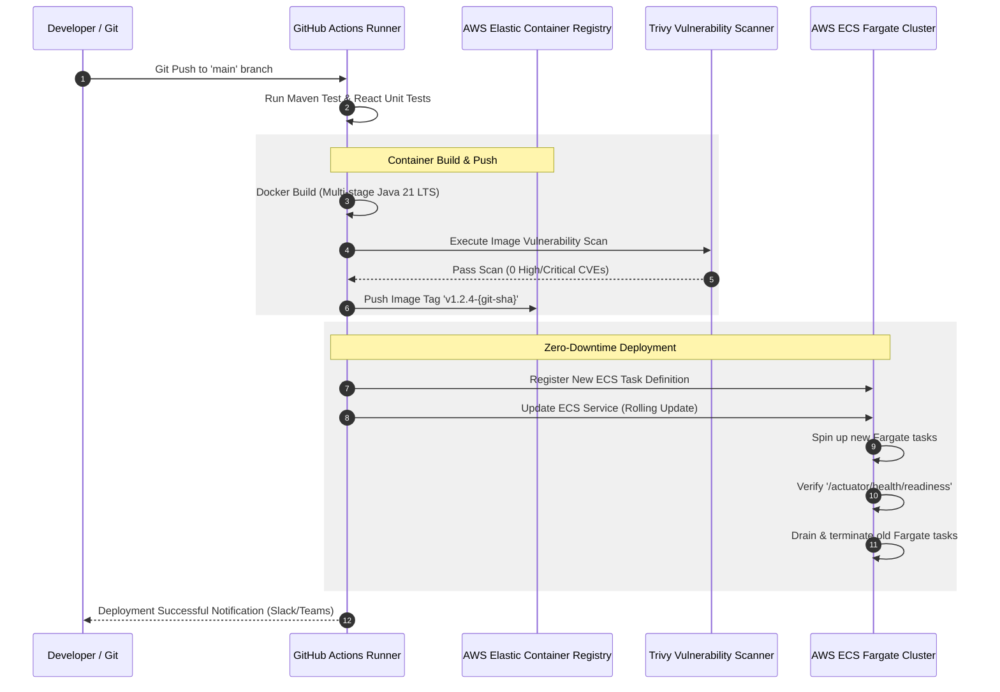

# DOC-011: Deployment & Cloud Infrastructure Specification

| Metadata Field | Value |
|---|---|
| **Document ID** | DOC-011 |
| **Title** | Deployment & Cloud Infrastructure Specification |
| **Version** | 1.0.0 |
| **Status** | Approved |
| **Owner** | Principal Software Architect |
| **Last Updated** | 2026-08-05 |
| **Dependencies** | `project-overview.md`, `ARCHITECTURE_PRINCIPLES.md`, `PROJECT_GLOSSARY.md`, `DOC-001-PROJECT-BLUEPRINT.md`, `DOC-002-SERVICE-ARCHITECTURE.md`, `DOC-003-DATABASE-PHILOSOPHY-AND-METAMODEL.md`, `DOC-004-ORGANIZATION-AND-HIERARCHY-DOMAIN.md`, `DOC-005-SURVEY-ENGINE-ARCHITECTURE.md`, `DOC-006-ANALYTICS-ENGINE-ARCHITECTURE.md`, `DOC-007-AI-ANALYTICS-AND-NLP-SPECIFICATION.md`, `DOC-008-REPORTING-ENGINE-ARCHITECTURE.md`, `DOC-009-ACTION-PLANNING-ARCHITECTURE.md`, `DOC-010-USER-ROLES-RBAC-AND-SECURITY.md` |
| **Related Documents** | `DOCUMENT_INDEX.md`, `DOCUMENT_DEPENDENCY_GRAPH.md` |
| **Implementation Phase** | Phase 1 (DevOps & Infrastructure) |

---

## Purpose

This document provides the definitive implementation specification for containerization, cloud infrastructure topology, orchestration, CI/CD automation pipelines, database clustering, caching infrastructure, and Infrastructure-as-Code (IaC) for the Talnova Enterprise Survey Platform (TESP). It defines how Spring Boot backend microservices, React / Vite SPAs, MongoDB Atlas clusters, Redis instances, and Kafka brokers are provisioned and operated across AWS environments.

---

## Scope

This specification governs all DevOps and infrastructure operations in TESP:
- Infrastructure-as-Code (Terraform module structures and state management).
- Cloud Topology on AWS (VPCs, Subnets, Internet Gateways, NAT Gateways, Security Groups).
- Container Orchestration via AWS ECS Fargate / EKS.
- Ingress Routing & Global Content Delivery (AWS CloudFront CDN, ALB, WAF).
- Database & Cache Provisioning (MongoDB Atlas VPC Peering, AWS ElastiCache Redis Cluster).
- Event Bus Messaging Infrastructure (AWS MSK / Apache Kafka Cluster).
- CI/CD Automation Workflows (GitHub Actions, Docker Buildx, AWS ECR).
- Monitoring, Logging, and Observability (OpenTelemetry, Prometheus, Grafana, CloudWatch).

Out of scope:
- React / Vite UI component styling (covered in Frontend specs).
- Individual microservice internal Spring Java code (covered in Service Architecture specs).

---

## Dependencies

This specification strictly depends on and extends:
- `project-overview.md`: Technical Architecture, Scalability Strategy, and Deployment Models.
- `ARCHITECTURE_PRINCIPLES.md`: Cloud Native, API First, Security First.
- `PROJECT_GLOSSARY.md`: Canonical domain terms (`Platform`, `Project`, `Metadata`).
- `DOC-001-PROJECT-BLUEPRINT.md`: Master system architecture topography.
- `DOC-002-SERVICE-ARCHITECTURE.md`: Microservices inventory, ports, and health probe paths.
- `DOC-003-DATABASE-PHILOSOPHY-AND-METAMODEL.md`: MongoDB sharding and read/write concerns.
- `DOC-010-USER-ROLES-RBAC-AND-SECURITY.md`: Encryption, TLS 1.3, and Secrets Manager integration.

---

## Definitions

| Term | Technical Implementation Definition |
|---|---|
| **Terraform Module** | A declarative HCL infrastructure definition creating cloud resources reproducibly. |
| **AWS ECS Fargate** | Serverless container compute engine running Docker containers without managing EC2 instances. |
| **VPC Peering** | A private network connection linking the TESP AWS VPC directly to MongoDB Atlas cloud database clusters. |
| **AWS WAF** | Web Application Firewall filtering malicious traffic, rate-limiting, and blocking OWASP Top 10 threats at the ALB level. |
| **Rolling Update** | Zero-downtime deployment strategy replacing old container tasks with new versions after health check verification. |

---

## Architecture

### AWS Cloud Network Topology

```mermaid
graph TB
    subgraph Global Edge Layer
        CF[AWS CloudFront CDN]
        WAF[AWS WAF Security Rules]
    end

    subgraph AWS Region (us-east-1)
        subgraph Virtual Private Cloud VPC 10.0.0.0/16
            subgraph Public Subnets - 3 AZs
                ALB[Application Load Balancer]
                NAT[NAT Gateways]
            end

            subgraph Private Application Subnets - 3 AZs
                subgraph AWS ECS Cluster Fargate
                    GW[api-gateway]
                    PCS[project-config-service]
                    OMS[organization-service]
                    EMS[employee-service]
                    SBS[survey-builder-service]
                    SDS[survey-distribution-service]
                    RIS[response-ingestion-service]
                    AES[analytics-engine-service]
                    RPS[reporting-service]
                    APS[action-planning-service]
                    AIS[ai-analytics-service]
                    NTS[notification-service]
                end
            end

            subgraph Private Data Subnets - 3 AZs
                ElastiCache[(AWS ElastiCache Redis Cluster)]
                MSK[(AWS MSK Kafka Cluster)]
            end
        end

        subgraph MongoDB Atlas Cloud
            AtlasDB[(MongoDB Atlas Multi-AZ Sharded Cluster)]
        end
    end

    Internet([Public Internet Users]) --> CF
    CF --> WAF
    WAF --> ALB
    ALB --> GW

    GW --> PCS
    GW --> OMS
    GW --> EMS
    GW --> SBS
    GW --> SDS
    GW --> RIS
    GW --> AES
    GW --> RPS
    GW --> APS
    GW --> AIS

    RIS --> MSK
    MSK --> AES
    MSK --> AIS

    ECS --> ElastiCache
    VPC -. Private VPC Peering .- AtlasDB
```

---

## Container Compute & Task Specifications

| Service Container Name | CPU (vCPU) | RAM (MB) | Min Tasks | Max Tasks | Auto-Scaling Trigger |
|---|---|---|---|---|---|
| `api-gateway` | 1.0 | 2048 | 3 | 12 | Active Connections > 2000 |
| `project-config-service` | 0.5 | 1024 | 2 | 6 | CPU > 75% |
| `organization-service` | 0.5 | 1024 | 2 | 6 | CPU > 75% |
| `employee-service` | 0.5 | 1024 | 2 | 6 | CPU > 75% |
| `survey-builder-service` | 0.5 | 1024 | 2 | 6 | CPU > 75% |
| `survey-distribution-service` | 1.0 | 2048 | 2 | 10 | CPU > 80% |
| `response-ingestion-service` | 2.0 | 4096 | 4 | 20 | Ingest Rate > 2000 req/s |
| `analytics-engine-service` | 2.0 | 4096 | 3 | 15 | Kafka Consumer Lag > 5000 |
| `reporting-service` | 1.0 | 2048 | 2 | 10 | Redis Queue > 20 jobs |
| `action-planning-service` | 0.5 | 1024 | 2 | 4 | CPU > 80% |
| `ai-analytics-service` | 1.0 | 2048 | 2 | 8 | Kafka Consumer Lag > 1000 |
| `notification-service` | 0.5 | 1024 | 2 | 6 | CPU > 80% |

---

## CI/CD Pipeline Automation Architecture



---

## Technical Specifications & Code Templates

### 1. Multi-Stage Dockerfile Template (`Spring Boot Microservices`)

```dockerfile
# Stage 1: Build Jar
FROM eclipse-temurin:21-jdk-alpine AS builder
WORKDIR /app
COPY . .
RUN ./mvnw clean package -DskipTests

# Stage 2: Runtime Image
FROM eclipse-temurin:21-jre-alpine
WORKDIR /app
RUN addgroup -S tesp && adduser -S tesp -G tesp
USER tesp:tesp
COPY --from=builder /app/target/*.jar app.jar
EXPOSE 8080
ENTRYPOINT ["java", "-XX:+UseG1GC", "-XX:MaxRAMPercentage=75.0", "-jar", "app.jar"]
```

### 2. Terraform AWS ECS Task Module (`main.tf`)

```hcl
resource "aws_ecs_task_definition" "service_task" {
  family                   = "tesp-${var.service_name}"
  network_mode             = "awsvpc"
  requires_compatibilities = ["FARGATE"]
  cpu                      = var.cpu_units
  memory                   = var.memory_mb
  execution_role_arn       = aws_iam_role.ecs_execution_role.arn
  task_role_arn            = aws_iam_role.ecs_task_role.arn

  container_definitions = jsonencode([{
    name      = var.service_name
    image     = "${var.ecr_repository_url}:${var.image_tag}"
    essential = true
    portMappings = [{
      containerPort = var.service_port
      hostPort      = var.service_port
    }]
    environment = [
      { name = "SPRING_PROFILES_ACTIVE", value = var.environment },
      { name = "PROJECT_ID", value = var.project_id }
    ]
    secrets = [
      { name = "MONGODB_URI", valueFrom = aws_secretsmanager_secret.db_secret.arn }
    ]
    logConfiguration = {
      logDriver = "awslogs"
      options = {
        "awslogs-group"         = "/ecs/tesp-${var.service_name}"
        "awslogs-region"        = "us-east-1"
        "awslogs-stream-prefix" = "ecs"
      }
    }
  }])
}
```

---

## Functional Requirements

| ID | Requirement Title | Technical Specification & Description | Priority |
|---|---|---|---|
| **FR-DEP-010** | Infrastructure-as-Code (IaC) | All AWS infrastructure MUST be declaratively managed using modularized Terraform code stored in git. | Critical |
| **FR-DEP-011** | Zero-Downtime Deployment | Rolling ECS container updates must drain active ALB connections over 30 seconds after readiness probes pass. | Critical |
| **FR-DEP-012** | Multi-AZ High Availability | All microservice tasks, Redis nodes, and database replicas must be distributed evenly across at least 3 AWS Availability Zones. | Critical |
| **FR-DEP-013** | Secrets Manager Integration | Microservice containers MUST fetch database credentials and API tokens dynamically from AWS Secrets Manager at startup. | Critical |
| **FR-DEP-014** | Automated Vulnerability Scanning | CI/CD pipeline MUST block image deployment if Trivy detects any UNPATCHED Critical or High severity CVEs. | Critical |

---

## Business Rules

| Rule ID | Domain | Business Rule Statement | Technical Enforcement |
|---|---|---|---|
| **BR-DEP-010** | Private Subnet Execution | Backend microservices and databases must NEVER run in public subnets or carry public IP addresses. | AWS Subnet routing table configuration & Terraform guards. |
| **BR-DEP-011** | Immutable Container Tags | Deploying container images with `latest` tag is strictly forbidden; deployments must specify exact release version or git commit SHA. | CI/CD pipeline deployment script assertion rule. |
| **BR-DEP-012** | Continuous Database Backup | MongoDB Atlas databases must enforce continuous automated backups with 35-day Point-in-Time Recovery (PITR). | MongoDB Atlas API automated configuration check. |

---

## Security Considerations

1. **AWS WAF Rules Engine**: Attached to CloudFront and ALB, enforcing rate limiting (max 2,000 requests per 5-minute IP window) and OWASP Core Rule Set blocking SQLi/XSS attempts.
2. **KMS Encryption**: All AWS S3 buckets, EBS container volumes, Redis caches, and ECR repositories are encrypted at rest using dedicated AWS KMS customer-managed keys.

---

## Scalability & Performance

| Layer | Scaling Mechanism | Capacity Target |
|---|---|---|
| **Ingress CDN** | AWS CloudFront Edge Network | Unlimited static asset caching (99.999% availability). |
| **API Gateway Layer** | AWS Fargate HPA (3 to 12 tasks) | 25,000 requests / second throughput capacity. |
| **Ingestion Worker Layer** | AWS Fargate HPA (4 to 20 tasks) | 5,000 response submissions / second ingestion SLA. |

---

## Future Extensions

1. **Multi-Region Active-Active Replication**: Expanding container clusters to AWS `eu-central-1` and `ap-southeast-1` with Route 53 latency-based DNS routing for global enterprise clients.
2. **Karpenter Autoscaling Migration**: Migrating from ECS Fargate to EKS Kubernetes clusters with Karpenter for sub-second container pod provisioning.

---

## References

- `DOC-001-PROJECT-BLUEPRINT.md`: Master architectural blueprint.
- `DOC-002-SERVICE-ARCHITECTURE.md`: Microservices inventory, ports, and health checks.
- `DOC-003-DATABASE-PHILOSOPHY-AND-METAMODEL.md`: Database cluster specifications.
- `DOC-010-USER-ROLES-RBAC-AND-SECURITY.md`: Encryption and Secrets Manager integration.

---

## Related Documents & Future Impact

| Relationship Type | Document ID | Title |
|---|---|---|
| **Upstream Dependencies** | `DOC-001` through `DOC-010` | All previous blueprint, service, DB, domain, and security specs |
| **Downstream Impacted** | `DOC-012` | Quality Assurance, Testing & Validation Specification |

---

## Open Questions

| Question ID | Topic | Description | Impact |
|---|---|---|---|
| **OQ-DEP-001** | AWS Fargate vs EKS Kubernetes | Should default deployments use AWS ECS Fargate or AWS EKS Kubernetes? (Current decision: AWS ECS Fargate for lower operational overhead in Phase 1). | Kubernetes manifest complexity vs ECS simplicity. |

---

## Document Status

| Field | Value |
|---|---|
| **Document Status** | Approved / Implementation-Ready |
| **Dependencies Satisfied** | `project-overview.md`, `ARCHITECTURE_PRINCIPLES.md`, `PROJECT_GLOSSARY.md`, `DOC-001` to `DOC-010` |
| **Documents Affected** | `DOCUMENT_INDEX.md`, `DOCUMENT_DEPENDENCY_GRAPH.md` |
| **Next Recommended Document** | `DOC-012: Quality Assurance, Testing & Validation Specification` |
