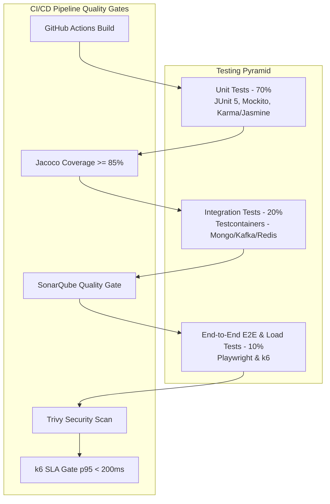

# DOC-012: Quality Assurance, Testing & Validation Specification

| Metadata Field | Value |
|---|---|
| **Document ID** | DOC-012 |
| **Title** | Quality Assurance, Testing & Validation Specification |
| **Version** | 1.0.0 |
| **Status** | Approved |
| **Owner** | Principal Software Architect |
| **Last Updated** | 2026-08-05 |
| **Dependencies** | `project-overview.md`, `ARCHITECTURE_PRINCIPLES.md`, `PROJECT_GLOSSARY.md`, `DOC-001-PROJECT-BLUEPRINT.md`, `DOC-002-SERVICE-ARCHITECTURE.md`, `DOC-003-DATABASE-PHILOSOPHY-AND-METAMODEL.md`, `DOC-004-ORGANIZATION-AND-HIERARCHY-DOMAIN.md`, `DOC-005-SURVEY-ENGINE-ARCHITECTURE.md`, `DOC-006-ANALYTICS-ENGINE-ARCHITECTURE.md`, `DOC-007-AI-ANALYTICS-AND-NLP-SPECIFICATION.md`, `DOC-008-REPORTING-ENGINE-ARCHITECTURE.md`, `DOC-009-ACTION-PLANNING-ARCHITECTURE.md`, `DOC-010-USER-ROLES-RBAC-AND-SECURITY.md`, `DOC-011-DEPLOYMENT-AND-CLOUD-INFRASTRUCTURE.md` |
| **Related Documents** | `DOCUMENT_INDEX.md`, `DOCUMENT_DEPENDENCY_GRAPH.md` |
| **Implementation Phase** | Phase 1 (QA & Testing Infrastructure) |

---

## Purpose

This document provides the definitive implementation specification for quality assurance, automated unit testing, integration testing, end-to-end (E2E) browser testing, performance load testing, and security penetration testing across the Talnova Enterprise Survey Platform (TESP). It defines the test automation frameworks, coverage thresholds, performance SLAs, and CI/CD quality gates ensuring implementation readiness.

---

## Scope

This specification governs all testing and validation activities in TESP:
- Unit Testing Frameworks & Code Coverage Standards (JUnit 5, Mockito, Jacoco - 85% line coverage).
- Integration Testing Frameworks (Spring Boot Test, Testcontainers for MongoDB Atlas, Redis, Kafka).
- Frontend Testing Standards (Vitest / React Testing Library unit tests, Playwright E2E browser flows).
- Performance & Load Testing (k6 load scripts validating 5,000 response submissions/sec SLA).
- Security & Anonymity Verification Test Suites (Automated de-anonymization attack assertion tests).
- Automated CI/CD Quality Gates (SonarQube static analysis, OWASP ZAP DAST scanning).

Out of scope:
- Manual exploratory testing protocols (covered in QA operational manuals).
- User acceptance testing (UAT) sign-off documents.

---

## Dependencies

This specification strictly depends on and extends:
- `project-overview.md`: System performance, scalability, and security requirements.
- `ARCHITECTURE_PRINCIPLES.md`: Everything Versioned, Everything Auditable, Security First.
- `PROJECT_GLOSSARY.md`: Canonical domain terms (`Platform`, `Project`, `Organization Node`, `Survey`).
- `DOC-001` through `DOC-011`: All previous architectural, database, service, domain, and deployment specifications.

---

## Definitions

| Term | Technical Implementation Definition |
|---|---|
| **Testing Pyramid** | The test allocation strategy dictating 70% Unit Tests, 20% Integration Tests, and 10% E2E/Load Tests. |
| **Testcontainers** | A Java library instantiating ephemeral Docker containers (MongoDB, Kafka, Redis) for integration testing. |
| **Playwright** | Node.js browser automation framework executing cross-browser E2E user interaction workflows. |
| **k6** | Developer-centric load testing tool executing JavaScript load scripts against HTTP/gRPC APIs. |
| **Quality Gate** | Mandatory automated build criteria in GitHub Actions that fail the pipeline if metrics fall below threshold. |

---

## Architecture

### Testing Strategy & Pyramid Topology



---

## Testing Framework & Tooling Inventory

| Testing Level | Technology / Framework | Scope / Target | Success Criteria |
|---|---|---|---|
| **Backend Unit Tests** | JUnit 5 + Mockito + Jacoco | Spring Boot Service & Controller logic | >= 85% Line Coverage, 0 failures |
| **Backend Integration** | Spring Boot Test + Testcontainers | MongoDB queries, Materialized Path, Kafka | 100% Data contract compliance |
| **Frontend Unit Tests** | Vitest + React Testing Library | React Components, Hooks, State Stores | >= 80% Line Coverage |
| **E2E Browser Tests** | Playwright (TypeScript) | Survey completion, Admin Dashboards | 100% Core flow pass rate |
| **Performance Load** | k6 Load Generator | Response Ingestion API (`POST /responses`) | 5,000 req/sec, p95 < 200ms |
| **Security DAST** | OWASP ZAP + Trivy | API Gateway, Docker Images | 0 High/Critical Vulnerabilities |

---

## Code Templates & Test Implementation Specs

### 1. Integration Test with Testcontainers & MongoDB (`OrganizationServiceTest.java`)

```java
@SpringBootTest
@Testcontainers
class OrganizationServiceTest {

    @Container
    static MongoDBContainer mongoDBContainer = new MongoDBContainer("mongo:7.0");

    @DynamicPropertySource
    static void setProperties(DynamicPropertyRegistry registry) {
        registry.add("spring.data.mongodb.uri", mongoDBContainer::getReplicaSetUrl);
    }

    @Autowired
    private OrganizationService organizationService;

    @Test
    void testMaterializedPathReParentingAtomicUpdate() {
        // Arrange: Create Root -> Child1 -> Child2
        OrgNode child2 = organizationService.createNode("PRJ-99201", "N-202", "Dept Eng", "N-101");
        
        // Act: Move N-202 to new parent N-102
        organizationService.moveNode("PRJ-99201", "N-202", "N-102");
        
        // Assert: Verify new materialized path
        OrgNode updated = organizationService.getNode("PRJ-99201", "N-202");
        assertEquals(",N-001,N-102,N-202,", updated.getPath());
    }
}
```

### 2. k6 High-Throughput Ingestion Load Test Script (`response_load_test.js`)

```javascript
import http from 'k6/http';
import { check, sleep } from 'k6';

export const options = {
  stages: [
    { duration: '30s', target: 1000 },  // Ramp-up to 1,000 users
    { duration: '1m', target: 5000 },   // Peak at 5,000 req/sec
    { duration: '30s', target: 0 },     // Ramp-down
  ],
  thresholds: {
    http_req_duration: ['p(95)<200'],   // 95% of requests must complete in < 200ms
    http_req_failed: ['rate<0.001'],    // Error rate < 0.1%
  },
};

export default function () {
  const url = 'http://api-gateway.tesp.internal/api/v1/responses';
  const payload = JSON.stringify({
    projectId: 'PRJ-99201',
    campaignId: 'CMP-1001',
    surveyId: 'SRV-5001',
    surveyVersion: 1,
    respondentType: 'FULLY_ANONYMOUS',
    answers: [{ questionId: 'Q-1', questionType: 'NPS', numericValue: 10 }]
  });

  const params = {
    headers: {
      'Content-Type': 'application/json',
      'X-Project-ID': 'PRJ-99201',
    },
  };

  const res = http.post(url, payload, params);
  check(res, {
    'status is 202': (r) => r.status === 202,
  });
}
```

---

## Differential Anonymity Verification Test Suite

To ensure privacy guarantees, an automated security test runs against `analytics-engine-service`:

```java
@Test
void testAnonymityThresholdSuppressionEnforcement() {
    // Insert only 3 responses for a small department (Threshold N = 5)
    insertResponses("N-404", 3);
    
    // Query analytics API for N-404
    ResponseEntity<AnalyticsResult> response = restTemplate.getForEntity(
        "/api/v1/analytics/eNPS?nodeId=N-404", AnalyticsResult.class
    );
    
    // Assert data is suppressed
    assertEquals("SUPPRESSED", response.getBody().getStatus());
    assertNull(response.getBody().getEnpsScore());
}
```

---

## Functional Requirements

| ID | Requirement Title | Technical Specification & Description | Priority |
|---|---|---|---|
| **FR-TST-010** | Minimum 85% Code Coverage | Jacoco code coverage plugin MUST fail maven build if backend line coverage is less than 85%. | Critical |
| **FR-TST-011** | Testcontainers Integration Testing | All repository and service integration tests MUST execute against real ephemeral MongoDB, Redis, and Kafka containers. | Critical |
| **FR-TST-012** | Load Test SLA Validation | k6 load test MUST validate 5,000 response submissions/sec under 200ms p95 latency threshold in Staging environment. | Critical |
| **FR-TST-013** | Automated Anonymity Attack Assertion | Test suite MUST assert that sample sizes $N < 5$ return `SUPPRESSED` status across all reporting APIs. | Critical |
| **FR-TST-014** | Static & Dynamic Security Scanning | SonarQube static code analysis and OWASP ZAP DAST scanning MUST execute automatically on every Pull Request. | Critical |

---

## Business Rules

| Rule ID | Domain | Business Rule Statement | Technical Enforcement |
|---|---|---|---|
| **BR-TST-010** | Quality Gate Blocking Rule | No Pull Request may be merged to `main` if any unit test fails or line coverage drops below 85%. | GitHub Actions branch protection rule. |
| **BR-TST-011** | Zero Synthetic PII Rule | Test suites MUST use synthetic data generators (Java Faker) and NEVER use real production employee data. | Pre-commit git hook data scanner. |
| **BR-TST-012** | Performance Regression Gate | If k6 load testing in Staging demonstrates a latency degradation > 15% compared to previous release, deployment is blocked. | CI/CD performance baseline comparison script. |

---

## Security Considerations

1. **Synthetic Test Data Generation**: All test suites utilize Java Faker / Chance.js to generate synthetic employee names, emails, and comments. Real production database dumps are strictly prohibited in non-production environments.
2. **DAST Vulnerability Scanning**: OWASP ZAP scans active API endpoints in Staging for SQLi, XSS, CSRF, and misconfigured HTTP security headers.

---

## Scalability & Performance

| Test Suite | Execution Target SLA | Parallelization Mechanism |
|---|---|---|
| **Backend Unit Tests (2,500 tests)** | < 45 seconds | JUnit 5 parallel execution (`junit.jupiter.execution.parallel.enabled = true`). |
| **Integration Tests (400 tests)** | < 2.5 minutes | Shared Testcontainers container instance reuse. |
| **E2E Playwright Suite (50 flows)** | < 3.0 minutes | Playwright test sharding across 4 parallel GitHub Actions runners. |

---

## Future Extensions

1. **AI Visual Regression Testing**: Automating pixel-by-pixel visual diff validation across React dashboard widgets using Percy / Applitools.
2. **Chaos Engineering Automation**: Chaos Mesh / AWS Fault Injection Simulator injecting network latency and pod failures to test system resilience.

---

## References

- `DOC-001-PROJECT-BLUEPRINT.md`: Master architectural blueprint.
- `DOC-002-SERVICE-ARCHITECTURE.md`: Microservices inventory and health probes.
- `DOC-003-DATABASE-PHILOSOPHY-AND-METAMODEL.md`: Data schemas.
- `DOC-006-ANALYTICS-ENGINE-ARCHITECTURE.md`: Anonymity threshold specs.
- `DOC-011-DEPLOYMENT-AND-CLOUD-INFRASTRUCTURE.md`: CI/CD pipeline automation.

---

## Related Documents & Future Impact

| Relationship Type | Document ID | Title |
|---|---|---|
| **Upstream Dependencies** | `DOC-001` through `DOC-011` | All previous foundation, service, DB, domain, security, and cloud specs |
| **Downstream Impacted** | Complete Specification Set | Master Engineering Documentation Library Complete |

---

## Open Questions

| Question ID | Topic | Description | Impact |
|---|---|---|---|
| **OQ-TST-001** | E2E Testing Browser Matrix | Should Playwright tests execute against Chromium, Firefox, and WebKit simultaneously on every PR? (Current decision: Chromium on PRs; full cross-browser matrix nightly). | CI pipeline execution duration and cost. |

---

## Document Status

| Field | Value |
|---|---|
| **Document Status** | Approved / Implementation-Ready |
| **Dependencies Satisfied** | `project-overview.md`, `ARCHITECTURE_PRINCIPLES.md`, `PROJECT_GLOSSARY.md`, `DOC-001` to `DOC-011` |
| **Documents Affected** | `DOCUMENT_INDEX.md`, `DOCUMENT_DEPENDENCY_GRAPH.md` |
| **Next Recommended Document** | None (Master Documentation Library Complete) |
