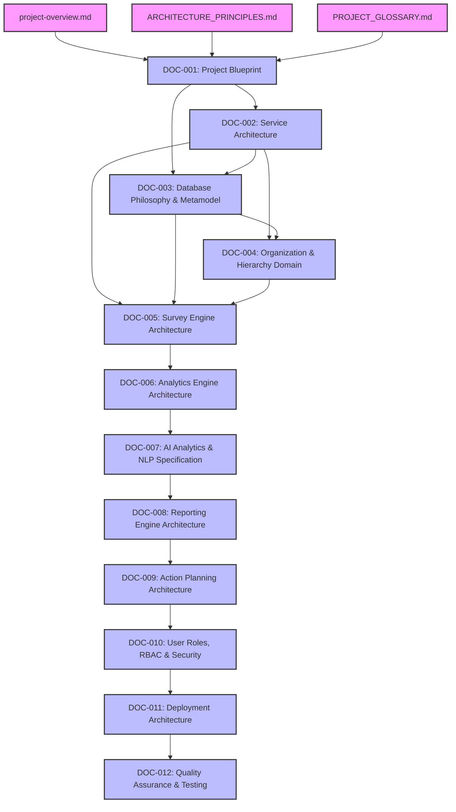

# TESP Engineering Document Dependency Graph

## Visual Dependency Graph

---

## Dependency Matrix

| Document ID | Upstream Direct Dependencies | Downstream Dependents |
|---|---|---|
| **DOC-001** | `project-overview.md`, `ARCHITECTURE_PRINCIPLES.md`, `PROJECT_GLOSSARY.md` | DOC-002, DOC-003, DOC-004, DOC-005 |
| **DOC-002** | `DOC-001-PROJECT-BLUEPRINT.md` | DOC-003, DOC-004, DOC-005 |
| **DOC-003** | `DOC-001-PROJECT-BLUEPRINT.md`, `DOC-002-SERVICE-ARCHITECTURE.md` | DOC-004, DOC-005 |
| **DOC-004** | `DOC-001`, `DOC-002`, `DOC-003` | DOC-005 |
| **DOC-005** | `DOC-001`, `DOC-002`, `DOC-003`, `DOC-004` | DOC-006 |
| **DOC-006** | `DOC-001` through `DOC-005` | DOC-007 |
| **DOC-007** | `DOC-001` through `DOC-006` | DOC-008 |
| **DOC-008** | `DOC-001` through `DOC-007` | DOC-009 |
| **DOC-009** | `DOC-001` through `DOC-008` | DOC-010 |
| **DOC-010** | `DOC-001` through `DOC-009` | DOC-011 |
| **DOC-011** | `DOC-001` through `DOC-010` | DOC-012 |
| **DOC-012** | `DOC-001` through `DOC-011` | Complete Documentation Library |
