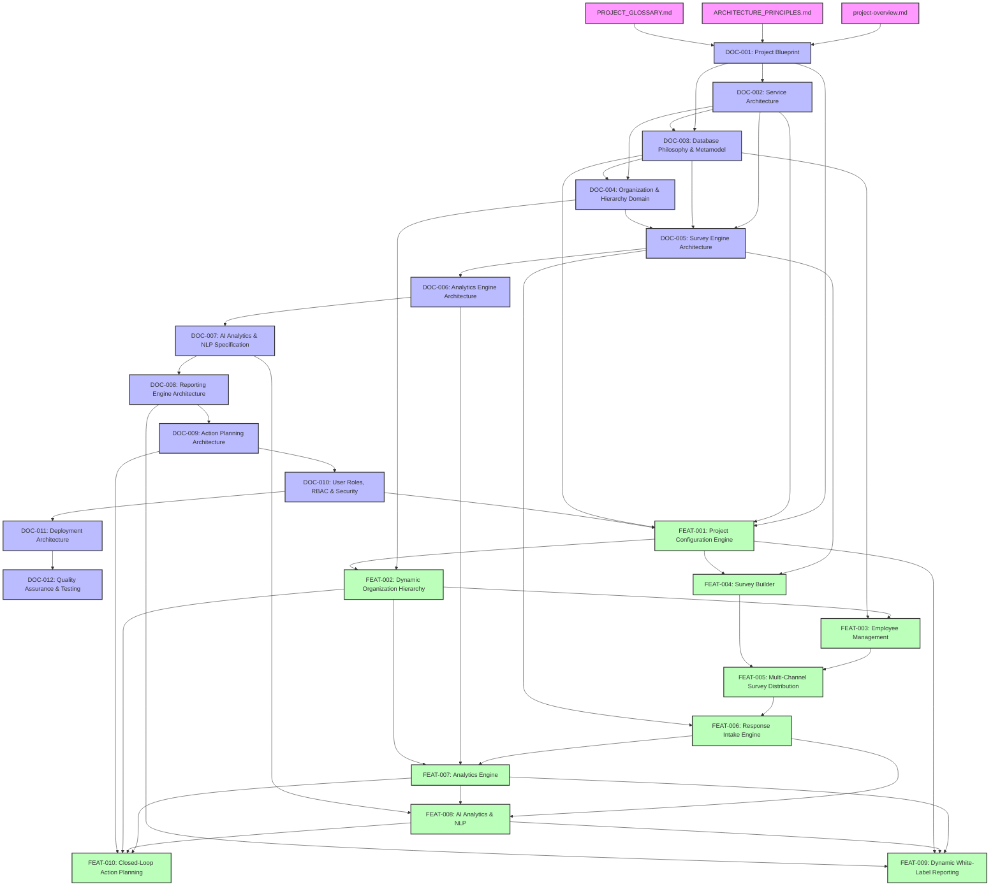

# TESP Engineering Document Dependency Graph

## Visual Dependency Graph

---

## Dependency Matrix

| Document ID | Upstream Direct Dependencies | Downstream Dependents |
|---|---|---|
| **DOC-001** | `project-overview.md`, `ARCHITECTURE_PRINCIPLES.md`, `PROJECT_GLOSSARY.md` | DOC-002, DOC-003, DOC-004, DOC-005, FEAT-001 |
| **DOC-002** | `DOC-001-PROJECT-BLUEPRINT.md` | DOC-003, DOC-004, DOC-005, FEAT-001 |
| **DOC-003** | `DOC-001-PROJECT-BLUEPRINT.md`, `DOC-002-SERVICE-ARCHITECTURE.md` | DOC-004, DOC-005, FEAT-001, FEAT-003 |
| **DOC-004** | `DOC-001`, `DOC-002`, `DOC-003` | DOC-005, FEAT-002 |
| **DOC-005** | `DOC-001`, `DOC-002`, `DOC-003`, `DOC-004` | DOC-006, FEAT-004, FEAT-006 |
| **DOC-006** | `DOC-001` through `DOC-005` | DOC-007, FEAT-007 |
| **DOC-007** | `DOC-001` through `DOC-006` | DOC-008, FEAT-008 |
| **DOC-008** | `DOC-001` through `DOC-007` | DOC-009, FEAT-009 |
| **DOC-009** | `DOC-001` through `DOC-008` | DOC-010, FEAT-010 |
| **DOC-010** | `DOC-001` through `DOC-009` | DOC-011, FEAT-001 |
| **DOC-011** | `DOC-001` through `DOC-010` | DOC-012 |
| **DOC-012** | `DOC-001` through `DOC-011` | Complete Master Architecture |
| **FEAT-001** | `DOC-001`, `DOC-002`, `DOC-003`, `DOC-010` | FEAT-002, FEAT-004, FEAT-009 |
| **FEAT-002** | `DOC-001` through `DOC-004`, `FEAT-001` | FEAT-003, FEAT-007, FEAT-010 |
| **FEAT-003** | `DOC-001` through `DOC-004`, `FEAT-001`, `FEAT-002` | FEAT-004, FEAT-005 |
| **FEAT-004** | `DOC-001`, `DOC-002`, `DOC-003`, `DOC-005`, `FEAT-001` | FEAT-005, FEAT-006 |
| **FEAT-005** | `DOC-001` through `DOC-005`, `FEAT-001` to `FEAT-004` | FEAT-006 |
| **FEAT-006** | `DOC-001` through `DOC-005`, `FEAT-004`, `FEAT-005` | FEAT-007, FEAT-008 |
| **FEAT-007** | `DOC-001` to `DOC-006`, `FEAT-002`, `FEAT-006` | FEAT-008, FEAT-009, FEAT-010 |
| **FEAT-008** | `DOC-001` to `DOC-007`, `FEAT-006`, `FEAT-007` | FEAT-009, FEAT-010 |
| **FEAT-009** | `DOC-001` to `DOC-008`, `FEAT-001`, `FEAT-007`, `FEAT-008` | FEAT-010 |
| **FEAT-010** | `DOC-001` to `DOC-009`, `FEAT-001` to `FEAT-009` | Complete Feature Documentation Library |
