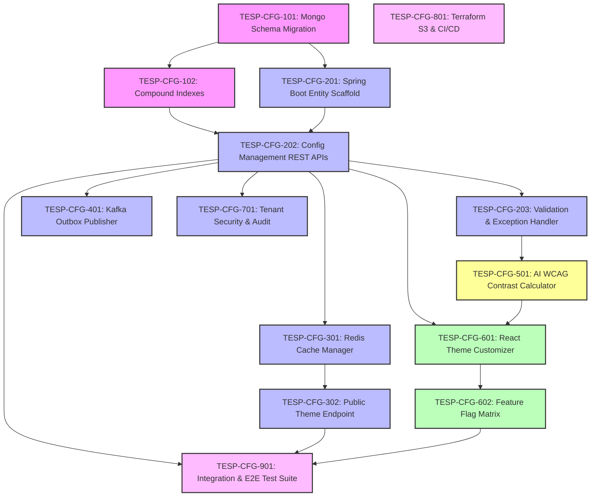

# FEAT-001: Project & Workspace Configuration Engine — Engineering Backlog

| Metadata Field | Value |
|---|---|
| **Feature ID** | FEAT-001 |
| **Feature Title** | Project & Workspace Configuration Engine |
| **Backlog Owner** | Lead Engineering Program Manager |
| **Target Architecture** | `DOC-001`, `DOC-002`, `DOC-003`, `DOC-010`, `FEAT-001` |
| **Technology Stack** | Spring Boot 3.3+ (Java 21), React 19+ (Vite, TypeScript, Tailwind CSS), MongoDB Atlas, Redis 7.x, Apache Kafka, AWS S3, Terraform |
| **Total Story Points** | 58 Points |
| **Total Epics** | 9 Epics |
| **Target Sprints** | Sprints 1.1 – 1.3 (3 Two-Week Sprints) |

---

## 1. Capability Breakdown Matrix

| Capability ID | Capability Name | Target Requirements | Target Microservice / Layer | Component Primary Tech |
|---|---|---|---|---|
| **CAP-CFG-01** | Multi-Tenant Data Persistence & Metamodel | `FR-CFG-001`, `FR-CFG-002`, `BR-CFG-001` | `project-config-service` / DB | MongoDB Atlas `projects` collection |
| **CAP-CFG-02** | Config CRUD & Validation API Layer | `FR-CFG-001`, `VR-CFG-001` to `004` | `project-config-service` / REST API | Spring Web / Jakarta Validation |
| **CAP-CFG-03** | Low-Latency Redis Caching Layer | `FR-CFG-003`, `SLA-CFG-01` | `project-config-service` / Cache | Redis 7.x (`tesp:config:<projectId>`) |
| **CAP-CFG-04** | Unauthenticated Public Theme API | `FR-CFG-004`, `PR-CFG-004` | `project-config-service` / Ingress | Spring Web / Redis Cache Filter |
| **CAP-CFG-05** | Custom Attribute & Feature Flag Engine | `FR-CFG-005`, `FR-CFG-006`, `BR-CFG-004` | `project-config-service` / Logic | Java 21 Record Metamodel Engine |
| **CAP-CFG-06** | Event-Driven Kafka Domain Publisher | `FR-CFG-007`, `DOC-002` | `project-config-service` / Messaging | Apache Kafka + Outbox Pattern |
| **CAP-CFG-07** | Admin Configuration Portal UI | `US-CFG-001` to `004` | `tesp-admin-portal` / Web UI | React 19+, Vite, Tailwind, TanStack |
| **CAP-CFG-08** | AI Color Contrast & WCAG Validator | `FEAT-001 Sec 20` | `tesp-admin-portal` / AI Module | WCAG 2.1 AA Contrast Engine |
| **CAP-CFG-09** | Infrastructure, CI/CD & Security Audit | `DOC-010`, `DOC-011` | DevOps & Infra | Terraform, GitHub Actions, AWS S3 |

---

## 2. Epic Hierarchy Structure

```
EPIC-CFG-01: MongoDB Metamodel & Schema Persistence (9 pts)
  ├── TESP-CFG-101: MongoDB Collection & Validation Schema Setup (3 pts)
  └── TESP-CFG-102: Indexes & Multi-Tenant Query Scoping (6 pts)

EPIC-CFG-02: Backend Microservice Core & Configuration CRUD APIs (13 pts)
  ├── TESP-CFG-201: Spring Boot Service Scaffold & Entity Mapping (3 pts)
  ├── TESP-CFG-202: Project Provisioning & Mutation REST APIs (5 pts)
  └── TESP-CFG-203: Jakarta Bean Validation & Custom Exception Handler (5 pts)

EPIC-CFG-03: Low-Latency Redis Caching & Public Theme Engine (8 pts)
  ├── TESP-CFG-301: Redis Cache Manager & Cache Warm-Up Configuration (3 pts)
  └── TESP-CFG-302: Fast Unauthenticated Public Theme Endpoint (5 pts)

EPIC-CFG-04: Domain Event Streaming & Transactional Outbox (5 pts)
  └── TESP-CFG-401: Kafka Producer & Transactional Outbox Event Relay (5 pts)

EPIC-CFG-05: AI Color Contrast & Accessibility Advisor (3 pts)
  └── TESP-CFG-501: AI WCAG 2.1 AA Color Contrast Validation Module (3 pts)

EPIC-CFG-06: React 19+ Admin Configuration Portal UI (11 pts)
  ├── TESP-CFG-601: Project Setup Wizard & Theme Customizer Component (5 pts)
  └── TESP-CFG-602: Feature Flag Matrix & Locale Management Panel (6 pts)

EPIC-CFG-07: Security, RBAC & Multi-Tenant Audit Logging (4 pts)
  └── TESP-CFG-701: Security Filter & Multi-Tenant Audit Logger (4 pts)

EPIC-CFG-08: DevOps Infrastructure & CI/CD Pipeline (3 pts)
  └── TESP-CFG-801: Terraform S3 Assets & GitHub Actions CI/CD Pipeline (3 pts)

EPIC-CFG-09: Quality Assurance & End-to-End Test Suite (2 pts)
  └── TESP-CFG-901: Integration, E2E & Load Testing Suite (2 pts)
```

---

## 3. Detailed Jira Engineering Tasks

### EPIC-CFG-01: MongoDB Metamodel & Schema Persistence

#### Task: TESP-CFG-101
- **Summary**: Implement MongoDB Schema Validation & Migration Script for `projects` Collection
- **Issue Type**: Database Task / Migration
- **Component**: Database / MongoDB
- **Story Points**: 3 Points
- **Target Requirements**: `FR-CFG-002`, `BR-CFG-001`, `DOC-003`
- **Dependencies**: None (Root Task)
- **Implementation Notes**:
  - Create MongoDB migration script in `src/main/resources/db/migration/v1_001_create_projects_collection.js`.
  - Implement JSON Schema validation enforcing required fields: `projectId`, `name`, `status`, `branding`, `supportedLocales`, `defaultLocale`, `features`, `version`, `isDeleted`.
  - Enforce `bsonType` assertions for `branding.primaryColor` and `branding.secondaryColor`.
- **Acceptance Criteria**:
  - [ ] Attempting to insert a document missing `defaultLocale` raises a MongoDB Schema Validation Exception.
  - [ ] Field `projectId` enforces string type and regex pattern `^PRJ-[A-Z0-9]{4,10}$`.
  - [ ] Migration script runs statelessly via Liquibase / Mongock runner upon service startup.

#### Task: TESP-CFG-102
- **Summary**: Define MongoDB Compound Indexes & Tenant Isolation Repository Filters
- **Issue Type**: Task
- **Component**: Database / Spring Data MongoDB
- **Story Points**: 6 Points
- **Target Requirements**: `FR-CFG-002`, `BR-CFG-003`, `PR-CFG-002`
- **Dependencies**: `TESP-CFG-101`
- **Implementation Notes**:
  - Create unique index `{ projectId: 1 }` with `unique: true`.
  - Create compound index `{ projectId: 1, isDeleted: 1, status: 1 }` for high-throughput reads.
  - Implement `ProjectRepositoryCustom` overriding default `findAll()` and `findByProjectId()` to automatically inject `isDeleted: false` clause.
- **Acceptance Criteria**:
  - [ ] Duplicate `projectId` insertion raises `DuplicateKeyException` (HTTP 400 mapping).
  - [ ] Index execution plan (`explain()`) verifies `IXSCAN` on `{ projectId: 1, isDeleted: 1 }` queries.

---

### EPIC-CFG-02: Backend Microservice Core & Configuration CRUD APIs

#### Task: TESP-CFG-201
- **Summary**: Scaffold `project-config-service` Microservice & Spring Data Entities
- **Issue Type**: Task
- **Component**: Backend / Java 21 Spring Boot
- **Story Points**: 3 Points
- **Target Requirements**: `DOC-002`, `FR-CFG-001`
- **Dependencies**: `TESP-CFG-101`
- **Implementation Notes**:
  - Scaffold Maven module `com.talnova.config` with Spring Boot 3.3+, Java 21 records, and Virtual Threads (`spring.threads.virtual.enabled=true`).
  - Implement `@Document("projects")` entity `ProjectDocument`, `BrandingConfigRecord`, `FeatureFlagsRecord`, `CustomAttributeDefRecord`.
- **Acceptance Criteria**:
  - [ ] Microservice builds cleanly with Maven multi-module structure.
  - [ ] Java 21 Records correctly deserialize nested JSON BSON documents without boilerplate getters/setters.

#### Task: TESP-CFG-202
- **Summary**: Implement Project Configuration Management REST APIs
- **Issue Type**: API Implementation Task
- **Component**: Backend / REST API
- **Story Points**: 5 Points
- **Target Requirements**: `FR-CFG-001`, `FR-CFG-006`, `FR-CFG-007`, `PR-CFG-001`, `PR-CFG-002`
- **Dependencies**: `TESP-CFG-201`, `TESP-CFG-102`
- **Implementation Notes**:
  - Create `@RestController` `ProjectConfigController` mapped to `/api/v1/projects`.
  - Implement `POST /api/v1/projects` (Provision Project - `SUPER_ADMIN`).
  - Implement `GET /api/v1/projects/{projectId}` (Fetch Project Settings).
  - Implement `PUT /api/v1/projects/{projectId}` (Update Settings - increments `version`).
  - Implement `PATCH /api/v1/projects/{projectId}/features` (Toggle Feature Flags).
- **Acceptance Criteria**:
  - [ ] `POST /api/v1/projects` returns `201 Created` with `Location` header.
  - [ ] Updating project configuration increments `version` counter by 1.
  - [ ] Soft-deleted projects (`isDeleted: true`) return `404 Not Found`.

#### Task: TESP-CFG-203
- **Summary**: Implement Jakarta Bean Validation Rules & Global Exception Handler
- **Issue Type**: Task
- **Component**: Backend / Security & Validation
- **Story Points**: 5 Points
- **Target Requirements**: `VR-CFG-001` to `VR-CFG-004`, `BR-CFG-002`
- **Dependencies**: `TESP-CFG-202`
- **Implementation Notes**:
  - Create `@ControllerAdvice` `GlobalExceptionHandler` converting validation errors to RFC 7807 Problem Details JSON format.
  - Add `@Pattern(regexp = "^#([A-Fa-f0-9]{6})$")` to `primaryColor` and `secondaryColor`.
  - Add custom validator `@ValidSupportedLocales` verifying `defaultLocale` is present in `supportedLocales` array.
- **Acceptance Criteria**:
  - [ ] `primaryColor: "blue"` produces HTTP 400 with detail `"Invalid HEX color format"`.
  - [ ] Mismatch between `defaultLocale` and `supportedLocales` produces HTTP 400 with detail `"Default locale must be present in supported locales"`.

---

### EPIC-CFG-03: Low-Latency Redis Caching & Public Theme Engine

#### Task: TESP-CFG-301
- **Summary**: Configure Redis Cache Manager & Cache Eviction Logic
- **Issue Type**: Task
- **Component**: Backend / Redis Caching
- **Story Points**: 3 Points
- **Target Requirements**: `FR-CFG-003`, `SLA-CFG-01`
- **Dependencies**: `TESP-CFG-202`
- **Implementation Notes**:
  - Configure `RedisCacheManager` with Jackson JSON serializer and default TTL of 60 seconds.
  - Annotate `ProjectConfigService.getProjectConfig()` with `@Cacheable(value = "tesp:config", key = "#projectId")`.
  - Annotate update/patch methods with `@CacheEvict(value = "tesp:config", key = "#projectId")`.
- **Acceptance Criteria**:
  - [ ] Subsequent calls to `getProjectConfig()` fetch payload from Redis in `< 2ms` without querying MongoDB.
  - [ ] Updating a project configuration immediately evicts key `tesp:config:<projectId>` from Redis.

#### Task: TESP-CFG-302
- **Summary**: Implement Lightweight Unauthenticated Public Theme API
- **Issue Type**: API Implementation Task
- **Component**: Backend / Public API
- **Story Points**: 5 Points
- **Target Requirements**: `FR-CFG-004`, `PR-CFG-004`, `SLA-CFG-01`
- **Dependencies**: `TESP-CFG-301`
- **Implementation Notes**:
  - Implement `GET /api/v1/projects/{projectId}/public-theme` returning `PublicThemeDTO` (`companyName`, `logoUrl`, `primaryColor`, `secondaryColor`, `defaultLocale`).
  - Configure Spring Security to permit unauthenticated access to `/public-theme`.
  - Enable HTTP `Cache-Control: public, max-age=60`.
- **Acceptance Criteria**:
  - [ ] Endpoint is accessible without `Authorization` bearer token.
  - [ ] Response time p95 is $< 5\text{ ms}$ under 500 requests/sec concurrency.

---

### EPIC-CFG-04: Domain Event Streaming & Transactional Outbox

#### Task: TESP-CFG-401
- **Summary**: Implement Transactional Outbox & Kafka Event Publisher for Project Events
- **Issue Type**: Event Implementation Task
- **Component**: Backend / Kafka Messaging
- **Story Points**: 5 Points
- **Target Requirements**: `FR-CFG-007`, `DOC-002`
- **Dependencies**: `TESP-CFG-202`
- **Implementation Notes**:
  - Implement `outbox_events` collection in MongoDB.
  - Upon project creation or modification, write `ProjectCreatedEvent` or `ProjectUpdatedEvent` into outbox in the same Mongo session transaction.
  - Implement scheduled outbox poller publishing events to Kafka topic `tesp.project.events.v1` with partition key `projectId`.
- **Acceptance Criteria**:
  - [ ] Creating a project writes an outbox record and dispatches `ProjectCreatedEvent` to Kafka.
  - [ ] Kafka message contains `eventId`, `eventType`, `projectId`, `status`, and ISO-8601 `timestamp`.

---

### EPIC-CFG-05: AI Color Contrast & Accessibility Advisor

#### Task: TESP-CFG-501
- **Summary**: Implement AI WCAG 2.1 AA Color Contrast Accessibility Validator
- **Issue Type**: AI Task / Validation
- **Component**: AI & Web Standards
- **Story Points**: 3 Points
- **Target Requirements**: `FEAT-001 Sec 20`
- **Dependencies**: `TESP-CFG-203`
- **Implementation Notes**:
  - Implement `WcagAccessibilityCalculator` computing relative luminance ($L = 0.2126R + 0.7152G + 0.0722B$) and contrast ratio ($CR = \frac{L_1 + 0.05}{L_2 + 0.05}$).
  - Expose API endpoint `POST /api/v1/projects/validate-contrast` accepting `primaryColor` and `backgroundColor`.
  - Return WCAG compliance status (`PASS_AA`, `PASS_AAA`, `FAIL`) and recommended accessible hex alternatives if contrast $< 4.5:1$.
- **Acceptance Criteria**:
  - [ ] White text on yellow background (`#FFFF00`) returns `FAIL` ($CR = 1.07:1$) with darker accessible alternative.
  - [ ] White text on navy blue (`#1E3A8A`) returns `PASS_AAA` ($CR = 12.6:1$).

---

### EPIC-CFG-06: React 19+ Admin Configuration Portal UI

#### Task: TESP-CFG-601
- **Summary**: Build Project Setup Wizard & White-Label Theme Customizer Component
- **Issue Type**: Frontend Task
- **Component**: Frontend / React 19+ Vite
- **Story Points**: 5 Points
- **Target Requirements**: `US-CFG-001`, `US-CFG-002`, `UI-CFG-01`
- **Dependencies**: `TESP-CFG-202`, `TESP-CFG-501`
- **Implementation Notes**:
  - Create React component `src/components/config/ThemeCustomizer.tsx` using Tailwind CSS.
  - Implement interactive color pickers for `primaryColor` and `secondaryColor` with real-time card preview simulator.
  - Integrate drag-and-drop uploader uploading company logo directly to AWS S3 bucket.
  - Display real-time WCAG accessibility contrast badge calling `validate-contrast` API.
- **Acceptance Criteria**:
  - [ ] Color picker updates live preview card instantly without page reload.
  - [ ] Uploading invalid image format (.txt) displays error alert "Only PNG, SVG, and JPEG logos supported".

#### Task: TESP-CFG-602
- **Summary**: Build Feature Flag Matrix & Locale Management Panel Component
- **Issue Type**: Frontend Task
- **Component**: Frontend / React 19+ Vite
- **Story Points**: 6 Points
- **Target Requirements**: `US-CFG-003`, `US-CFG-004`
- **Dependencies**: `TESP-CFG-601`
- **Implementation Notes**:
  - Create React component `src/components/config/FeatureFlagMatrix.tsx`.
  - Render toggle switches for `aiAnalyticsEnabled`, `actionPlanningEnabled`, `kioskModeEnabled`, `smsDistributionEnabled`.
  - Render multi-select tag picker for `supportedLocales` with default locale radio selector.
  - Integrate TanStack Query `useMutation` for saving configuration state with toast notification.
- **Acceptance Criteria**:
  - [ ] Toggling feature switches updates state and triggers API save payload.
  - [ ] Toast notification "Project Configuration Saved Successfully" appears post-save.

---

### EPIC-CFG-07: Security, RBAC & Multi-Tenant Audit Logging

#### Task: TESP-CFG-701
- **Summary**: Implement Multi-Tenant Security Interceptor & Audit Event Logger
- **Issue Type**: Security Task
- **Component**: Security & Audit
- **Story Points**: 4 Points
- **Target Requirements**: `PR-CFG-001` to `PR-CFG-003`, `BR-CFG-003`, `DOC-010`
- **Dependencies**: `TESP-CFG-202`
- **Implementation Notes**:
  - Implement `TenantSecurityInterceptor` extracting `X-Project-ID` and JWT claims.
  - Verify user's assigned `projectId` in JWT matches requested URI parameter; raise HTTP 403 Forbidden if mismatched (except for `SUPER_ADMIN`).
  - Write immutable audit log record to `tesp_audit_db.audit_logs` for any configuration update.
- **Acceptance Criteria**:
  - [ ] User with JWT `projectId: PRJ-001` attempting to edit `PRJ-002` receives HTTP 403 Forbidden.
  - [ ] Audit log entry records `userId`, `projectId`, `action: "UPDATE_CONFIG"`, `timestamp`, and `clientIp`.

---

### EPIC-CFG-08: DevOps Infrastructure & CI/CD Pipeline

#### Task: TESP-CFG-801
- **Summary**: Provision Terraform S3 Asset Bucket & GitHub Actions CI/CD Pipeline
- **Issue Type**: DevOps Task
- **Component**: DevOps & Cloud Infrastructure
- **Story Points**: 3 Points
- **Target Requirements**: `DOC-011`
- **Dependencies**: None
- **Implementation Notes**:
  - Create Terraform script `terraform/modules/s3_assets/main.tf` provisioning private S3 bucket `tesp-project-assets` with CORS policy allowing admin domain.
  - Create GitHub Actions workflow `.github/workflows/deploy-project-config-service.yml` running unit tests, building Docker image, and deploying to AWS ECS Fargate.
- **Acceptance Criteria**:
  - [ ] S3 bucket is provisioned with server-side encryption (`AES256`) and block public access settings.
  - [ ] GitHub Actions pipeline completes build and deployment in $< 6\text{ minutes}$.

---

### EPIC-CFG-09: Quality Assurance & End-to-End Test Suite

#### Task: TESP-CFG-901
- **Summary**: Build Integration, E2E Playwright & k6 Performance Test Suite
- **Issue Type**: QA Task
- **Component**: QA & Automated Testing
- **Story Points**: 2 Points
- **Target Requirements**: `DOC-012`, `TC-CFG-001`, `TC-CFG-002`, `SLA-CFG-01`
- **Dependencies**: `TESP-CFG-202`, `TESP-CFG-302`, `TESP-CFG-602`
- **Implementation Notes**:
  - Implement Spring Boot Integration tests using Testcontainers MongoDB & Redis (`ProjectConfigControllerTest.java`).
  - Implement Playwright E2E test `tests/e2e/project-config.spec.ts` testing admin setup wizard flow.
  - Implement k6 performance script `tests/performance/public-theme-load.js` simulating 500 RPS on `/public-theme`.
- **Acceptance Criteria**:
  - [ ] Integration tests pass 100% in CI environment using Testcontainers.
  - [ ] k6 load test verifies p95 latency is $< 5\text{ ms}$ for `/public-theme` endpoint.

---

## 4. Visual Dependency Graph



---

## 5. Release Sequencing & Sprint Allocation

### Sprint 1.1: Core Domain Foundation & Database Layer (Total: 20 Points)
- **Focus**: Metamodel, MongoDB schemas, Spring Boot CRUD APIs, Redis Caching.
- **Tasks**:
  - `TESP-CFG-101`: Mongo Schema Migration (3 pts)
  - `TESP-CFG-102`: Compound Indexes & Filters (6 pts)
  - `TESP-CFG-201`: Spring Boot Entity Scaffold (3 pts)
  - `TESP-CFG-202`: Config Management REST APIs (5 pts)
  - `TESP-CFG-301`: Redis Cache Manager (3 pts)
- **Sprint Milestone**: Working REST API creating and fetching Project configurations from MongoDB with Redis caching.

---

### Sprint 1.2: Validation, Events, Security & AI Accessibility (Total: 20 Points)
- **Focus**: Bean validation, Kafka event outbox, Public theme API, Security RBAC, AI contrast validator.
- **Tasks**:
  - `TESP-CFG-203`: Validation & Exception Handler (5 pts)
  - `TESP-CFG-302`: Public Theme Endpoint (5 pts)
  - `TESP-CFG-401`: Kafka Outbox Publisher (5 pts)
  - `TESP-CFG-501`: AI WCAG Contrast Calculator (3 pts)
  - `TESP-CFG-701`: Tenant Security & Audit (4 pts)
- **Sprint Milestone**: Unauthenticated theme endpoint operational (< 5ms latency); Kafka events emitting on project updates; WCAG contrast validation active.

---

### Sprint 1.3: React Admin Portal UI, Infrastructure & QA Validation (Total: 18 Points)
- **Focus**: React 19+ Admin UI components, Terraform S3 assets, CI/CD pipeline, and E2E Playwright testing.
- **Tasks**:
  - `TESP-CFG-601`: React Theme Customizer (5 pts)
  - `TESP-CFG-602`: Feature Flag Matrix (6 pts)
  - `TESP-CFG-801`: Terraform S3 & CI/CD (3 pts)
  - `TESP-CFG-901`: Integration & E2E Test Suite (2 pts)
- **Sprint Milestone**: Complete FEAT-001 Feature Delivery ready for Production deployment.

---

## 6. QA Test Plan Summary

### Automated Test Coverage Strategy
1. **Unit Testing**: JUnit 5 + Mockito testing core service validation logic and WCAG accessibility contrast calculations (Target: > 90% Code Coverage).
2. **Integration Testing**: Spring Boot `@SpringBootTest` with Testcontainers MongoDB and Redis validating database queries, index execution, and Redis cache eviction.
3. **API Performance Testing**: k6 load testing verifying `/public-theme` response times under 500 RPS concurrency (Target: p95 < 5ms).
4. **E2E UI Testing**: Playwright cross-browser tests verifying Theme Customizer color pickers, image uploads, and feature flag toggle persistence.

---

## Document Status

| Field | Value |
|---|---|
| **Document Status** | Approved / Ready for Jira Import |
| **Target Feature** | `FEAT-001: Project & Workspace Configuration Engine` |
| **Total Story Points** | 58 Story Points |
| **Dependencies Satisfied** | `DOC-001`, `DOC-002`, `DOC-003`, `DOC-010`, `FEAT-001` |
| **Next Recommended Backlog** | `FEAT-002-ORGANIZATION-HIERARCHY-BACKLOG.md` |
