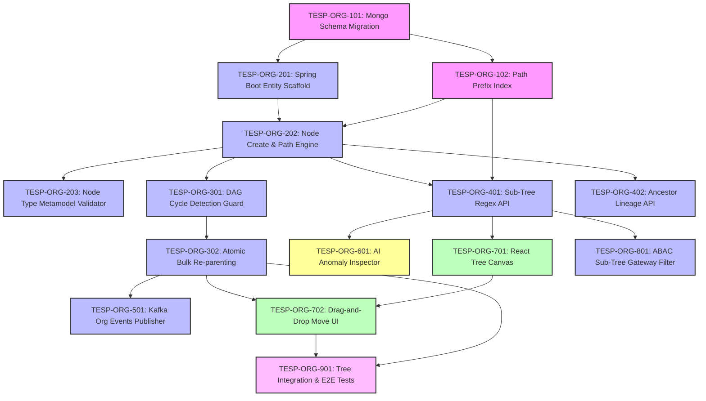

# FEAT-002: Dynamic Organizational Hierarchy Management — Engineering Backlog

| Metadata Field | Value |
|---|---|
| **Feature ID** | FEAT-002 |
| **Feature Title** | Dynamic Organizational Hierarchy Management |
| **Backlog Owner** | Lead Engineering Program Manager |
| **Target Architecture** | `DOC-001`, `DOC-002`, `DOC-003`, `DOC-004`, `FEAT-001`, `FEAT-002` |
| **Technology Stack** | Spring Boot 3.3+ (Java 21), React 19+ (Vite, TypeScript, Tailwind, React Flow / D3), MongoDB Atlas, Redis 7.x, Apache Kafka, Terraform |
| **Total Story Points** | 68 Points |
| **Total Epics** | 9 Epics |
| **Target Sprints** | Sprints 1.3 – 2.2 (3 Two-Week Sprints) |

---

## 1. Capability Breakdown Matrix

| Capability ID | Capability Name | Target Requirements | Target Microservice / Layer | Component Primary Tech |
|---|---|---|---|---|
| **CAP-ORG-01** | Materialized Path Tree Metamodel | `FR-ORG-001`, `BR-ORG-001`, `DOC-004` | `organization-service` / DB | MongoDB `organization_nodes` collection |
| **CAP-ORG-02** | Node Insertion & Path Calculation | `FR-ORG-001`, `VR-ORG-001` to `003` | `organization-service` / Core | Java 21 Tree Path Calculator Service |
| **CAP-ORG-03** | Cycle Prevention & Graph Guard | `FR-ORG-002`, `VR-ORG-004` | `organization-service` / Core | Directed Acyclic Graph (DAG) Validator |
| **CAP-ORG-04** | Atomic Re-parenting & Sub-Tree Path Updating | `FR-ORG-003`, `BR-ORG-003`, `SLA-ORG-02` | `organization-service` / Transactions | Mongo Session Transaction + Bulk Update |
| **CAP-ORG-05** | Fast Sub-Tree Prefix Indexing & APIs | `FR-ORG-004`, `FR-ORG-005`, `SLA-ORG-01` | `organization-service` / REST API | MongoDB Regex Index + Spring REST |
| **CAP-ORG-06** | Node Deletion Integrity Guard | `FR-ORG-006` | `organization-service` / Guard | Employee & Child Reference Interceptor |
| **CAP-ORG-07** | Asynchronous Kafka Event Publisher | `FR-ORG-007`, `DOC-002` | `organization-service` / Messaging | Apache Kafka + Transactional Outbox |
| **CAP-ORG-08** | React 19+ Interactive Tree Visualizer | `US-ORG-004`, `FEAT-002 Sec 19` | `tesp-admin-portal` / Web UI | React 19+, Vite, React Flow / D3, Virtualized |
| **CAP-ORG-09** | AI Hierarchy Anomaly Detector | `FEAT-002 Sec 20` | `organization-service` / AI Service | Structural Graph Anomaly Inspector |

---

## 2. Epic Hierarchy Structure

```
EPIC-ORG-01: Materialized Path Metamodel & MongoDB Indexing (9 pts)
  ├── TESP-ORG-101: MongoDB Collection Schema & Materialized Path Setup (4 pts)
  └── TESP-ORG-102: Path Prefix Compound Index & Unique Constraints (5 pts)

EPIC-ORG-02: Organization Node CRUD & Path Materialization Engine (13 pts)
  ├── TESP-ORG-201: Spring Boot Service Scaffold & Entity Mapping (4 pts)
  ├── TESP-ORG-202: Node Creation & Automatic Path Computation Engine (5 pts)
  └── TESP-ORG-203: Dynamic Node Type Metamodel Validator (4 pts)

EPIC-ORG-03: Atomic Re-parenting & Cycle Prevention Engine (11 pts)
  ├── TESP-ORG-301: DAG Cycle Detection Guard Algorithm (5 pts)
  └── TESP-ORG-302: Atomic Session Bulk Sub-Tree Re-parenting Transaction (6 pts)

EPIC-ORG-04: Sub-Tree Regex Query & Lineage Ancestor APIs (8 pts)
  ├── TESP-ORG-401: Fast Sub-Tree Regex Prefix Query Endpoint (4 pts)
  └── TESP-ORG-402: Ancestor Lineage Path Resolver API (4 pts)

EPIC-ORG-05: Domain Event Streaming & Transactional Outbox (5 pts)
  └── TESP-ORG-501: Kafka OrgNodeMoved & OrgNodeCreated Publisher (5 pts)

EPIC-ORG-06: AI Automated Hierarchy Anomaly Detector (3 pts)
  └── TESP-ORG-601: AI Tree Structural Depth & Orphan Anomaly Inspector (3 pts)

EPIC-ORG-07: React 19+ Interactive Tree Visualizer UI (12 pts)
  ├── TESP-ORG-701: React Flow / D3 Hierarchy Tree Canvas Component (7 pts)
  └── TESP-ORG-702: Drag-and-Drop Node Re-parenting & Search Filter Panel (5 pts)

EPIC-ORG-08: Security ABAC Sub-Tree Gateway Filter & Audit Logger (4 pts)
  └── TESP-ORG-801: Materialized Path ABAC Scope Interceptor & Audit Trail (4 pts)

EPIC-ORG-09: QA Testing Suite & Performance Validation (3 pts)
  └── TESP-ORG-901: Tree Operations Unit, E2E & Re-parenting Load Tests (3 pts)
```

---

## 3. Detailed Jira Engineering Tasks

### EPIC-ORG-01: Materialized Path Metamodel & MongoDB Indexing

#### Task: TESP-ORG-101
- **Summary**: Implement MongoDB Schema Validation for `organization_nodes` Collection
- **Issue Type**: Database Task / Migration
- **Component**: Database / MongoDB
- **Story Points**: 4 Points
- **Target Requirements**: `FR-ORG-001`, `BR-ORG-001`, `DOC-003`
- **Dependencies**: None (Root Task)
- **Implementation Notes**:
  - Create MongoDB migration script `src/main/resources/db/migration/v1_002_create_org_nodes.js`.
  - Implement JSON Schema validation enforcing: `projectId`, `nodeId`, `name`, `type`, `path`, `depth`, `status`, `version`, `isDeleted`.
  - Enforce string regex pattern for `path`: `^,([A-Za-z0-9_-]+,)+$`.
- **Acceptance Criteria**:
  - [ ] Inserting a node with invalid path format (e.g., `N-001/N-101`) fails MongoDB validation.
  - [ ] Field `depth` is verified as integer matching the comma count in `path` minus 1.
  - [ ] Script executes statelessly via Mongock migration runner.

#### Task: TESP-ORG-102
- **Summary**: Create Path Prefix Compound Index & Unique Node ID Constraints
- **Issue Type**: Task
- **Component**: Database / Spring Data MongoDB
- **Story Points**: 5 Points
- **Target Requirements**: `FR-ORG-004`, `BR-ORG-002`, `SLA-ORG-01`
- **Dependencies**: `TESP-ORG-101`
- **Implementation Notes**:
  - Create compound unique index `{ projectId: 1, nodeId: 1 }` with `unique: true`.
  - Create compound path prefix index `{ projectId: 1, path: 1 }` for regex sub-tree queries (`^,ROOT,N-101,`).
  - Create secondary index `{ projectId: 1, parentId: 1 }`.
- **Acceptance Criteria**:
  - [ ] Index execution plan (`explain()`) verifies `IXSCAN` on `{ projectId: 1, path: 1 }` regex prefix queries.
  - [ ] Duplicate `nodeId` within the same `projectId` throws `DuplicateKeyException`.

---

### EPIC-ORG-02: Organization Node CRUD & Path Materialization Engine

#### Task: TESP-ORG-201
- **Summary**: Scaffold `organization-service` Microservice & Document Entities
- **Issue Type**: Task
- **Component**: Backend / Java 21 Spring Boot
- **Story Points**: 4 Points
- **Target Requirements**: `DOC-002`, `FR-ORG-001`
- **Dependencies**: `TESP-ORG-101`
- **Implementation Notes**:
  - Scaffold Maven module `com.talnova.org` with Spring Boot 3.3+, Java 21 records, and Virtual Threads enabled.
  - Implement `@Document("organization_nodes")` entity `OrgNodeDocument` and records `OrgNodeDTO`, `CreateNodeRequest`, `MoveNodeRequest`.
- **Acceptance Criteria**:
  - [ ] Entity maps nested attributes object `Map<String, Object>` dynamically without hardcoded keys.
  - [ ] Microservice compiles and connects to MongoDB Atlas cluster.

#### Task: TESP-ORG-202
- **Summary**: Implement Node Creation & Automatic Path Computation Engine
- **Issue Type**: API Implementation Task
- **Component**: Backend / Core Logic
- **Story Points**: 5 Points
- **Target Requirements**: `FR-ORG-001`, `VR-ORG-001` to `003`, `TC-ORG-001`
- **Dependencies**: `TESP-ORG-201`, `TESP-ORG-102`
- **Implementation Notes**:
  - Implement `POST /api/v1/nodes` in `OrgNodeController`.
  - Implement `PathCalculatorService`: If `parentId` is null, set `path = "," + nodeId + ","` and `depth = 1`. If `parentId` exists, fetch parent, set `path = parent.path + nodeId + ","` and `depth = parent.depth + 1`.
- **Acceptance Criteria**:
  - [ ] Creating node `N-201` under parent `N-101` (path `,N-001,N-101,`) assigns `path: ",N-001,N-101,N-201,"` and `depth: 3`.
  - [ ] Non-existent `parentId` returns HTTP 400 Bad Request ("Parent Node does not exist").

#### Task: TESP-ORG-203
- **Summary**: Implement Dynamic Node Type Metamodel Validator
- **Issue Type**: Task
- **Component**: Backend / Validation
- **Story Points**: 4 Points
- **Target Requirements**: `VR-ORG-003`, `FEAT-001`
- **Dependencies**: `TESP-ORG-202`
- **Implementation Notes**:
  - Integrate REST client fetching active Project Node Types configured in `FEAT-001`.
  - Implement `@ValidNodeType` annotation checking request `type` against project configuration.
- **Acceptance Criteria**:
  - [ ] Submitting `type: "REGIONAL_HUB"` when project only allows `COMPANY, DIVISION, DEPARTMENT` returns HTTP 400 Bad Request ("Unrecognized Node Type").

---

### EPIC-ORG-03: Atomic Re-parenting & Cycle Prevention Engine

#### Task: TESP-ORG-301
- **Summary**: Implement Directed Acyclic Graph (DAG) Cycle Prevention Guard
- **Issue Type**: Task
- **Component**: Backend / Algorithmic Logic
- **Story Points**: 5 Points
- **Target Requirements**: `FR-ORG-002`, `VR-ORG-004`, `TC-ORG-002`
- **Dependencies**: `TESP-ORG-202`
- **Implementation Notes**:
  - Implement `CycleDetectionGuard`: Before moving node $N$ to `newParentId` $P$, verify $P \ne N$ AND $P$'s path does NOT contain `,N,`.
  - Throw `CircularHierarchyException` if violation detected.
- **Acceptance Criteria**:
  - [ ] Attempting to move parent node `N-101` under its own child `N-201` (path `,N-001,N-101,N-201,`) returns HTTP 409 Conflict ("Circular hierarchy move detected").

#### Task: TESP-ORG-302
- **Summary**: Implement Atomic Session Transaction for Bulk Sub-Tree Path Updating
- **Issue Type**: Task
- **Component**: Backend / Transactions
- **Story Points**: 6 Points
- **Target Requirements**: `FR-ORG-003`, `SLA-ORG-02`
- **Dependencies**: `TESP-ORG-301`
- **Implementation Notes**:
  - Implement `POST /api/v1/nodes/{nodeId}/move` using `@Transactional`.
  - Construct `oldPrefix = targetNode.path` and `newPrefix = newParent.path + targetNode.nodeId + ","`.
  - Update target node's `parentId`, `path`, and `depth`.
  - Execute MongoDB bulk update on descendants: `updateMany({ path: { $regex: "^" + oldPrefix } }, [ { $set: { path: { $concat: [ newPrefix, { $substrBytes: [ "$path", strLen(oldPrefix), -1 ] } ] } } } ])`.
- **Acceptance Criteria**:
  - [ ] Moving a branch node automatically updates paths for all 500 child descendant nodes in a single MongoDB transaction.
  - [ ] Operation executes in $< 300\text{ ms (p95)}$ for 1,000 descendant nodes.

---

### EPIC-ORG-04: Sub-Tree Regex Query & Lineage Ancestor APIs

#### Task: TESP-ORG-401
- **Summary**: Implement Fast Sub-Tree Regex Prefix Query Endpoint
- **Issue Type**: API Implementation Task
- **Component**: Backend / REST API
- **Story Points**: 4 Points
- **Target Requirements**: `FR-ORG-004`, `SLA-ORG-01`
- **Dependencies**: `TESP-ORG-102`, `TESP-ORG-202`
- **Implementation Notes**:
  - Implement `GET /api/v1/nodes/{nodeId}/subtree` returning list of descendant nodes.
  - Execute regex query `{ projectId: projectId, path: { $regex: "^" + targetNode.path } }`.
- **Acceptance Criteria**:
  - [ ] Returns all descendant nodes within the target node's hierarchy tree.
  - [ ] Query SLA is $< 10\text{ ms (p95)}$ for 50,000 nodes using indexed path prefix.

#### Task: TESP-ORG-402
- **Summary**: Implement Ancestor Lineage Path Resolver API
- **Issue Type**: API Implementation Task
- **Component**: Backend / REST API
- **Story Points**: 4 Points
- **Target Requirements**: `FR-ORG-005`
- **Dependencies**: `TESP-ORG-202`
- **Implementation Notes**:
  - Implement `GET /api/v1/nodes/{nodeId}/lineage` returning ordered array of ancestor node DTOs from Root down to requested `nodeId`.
  - Parse node's `path` string (e.g., `,N-001,N-101,N-201,`), extract node IDs `["N-001", "N-101", "N-201"]`, and execute `$in` query preserving order.
- **Acceptance Criteria**:
  - [ ] Returns ancestor nodes in strict top-down root-to-leaf hierarchy order.

---

### EPIC-ORG-05: Domain Event Streaming & Transactional Outbox

#### Task: TESP-ORG-501
- **Summary**: Implement Kafka OrgNodeMoved & OrgNodeCreated Event Publisher
- **Issue Type**: Event Implementation Task
- **Component**: Backend / Kafka Messaging
- **Story Points**: 5 Points
- **Target Requirements**: `FR-ORG-007`, `DOC-002`
- **Dependencies**: `TESP-ORG-302`
- **Implementation Notes**:
  - Write `OrgNodeMovedEvent` and `OrgNodeCreatedEvent` into MongoDB outbox collection within the move transaction.
  - Scheduled outbox poller publishes payload to Kafka topic `tesp.org.events.v1` with partition key `projectId`.
- **Acceptance Criteria**:
  - [ ] Re-parenting a node publishes `OrgNodeMovedEvent` containing `nodeId`, `oldPath`, `newPath`, and `timestamp`.

---

### EPIC-ORG-06: AI Automated Hierarchy Anomaly Detector

#### Task: TESP-ORG-601
- **Summary**: Implement AI Tree Structural Depth & Orphan Anomaly Inspector
- **Issue Type**: AI Task / Optimization
- **Component**: AI & Structural Analytics
- **Story Points**: 3 Points
- **Target Requirements**: `FEAT-002 Sec 20`
- **Dependencies**: `TESP-ORG-401`
- **Implementation Notes**:
  - Implement `HierarchyAnomalyInspector`: Background service scanning project tree for extreme depth anomalies ($depth > 20$), single-child node chains ($> 5$ levels), or orphan nodes.
  - Expose API `GET /api/v1/nodes/anomalies` returning structural optimization suggestions.
- **Acceptance Criteria**:
  - [ ] Tree with depth 22 flags `EXTREME_DEPTH_WARNING` with recommendation to flatten structure.

---

### EPIC-ORG-07: React 19+ Interactive Tree Visualizer UI

#### Task: TESP-ORG-701
- **Summary**: Build React Flow / D3 Hierarchy Tree Canvas Component
- **Issue Type**: Frontend Task
- **Component**: Frontend / React 19+ Vite
- **Story Points**: 7 Points
- **Target Requirements**: `US-ORG-004`, `UI-ORG-01`
- **Dependencies**: `TESP-ORG-401`
- **Implementation Notes**:
  - Create React component `src/components/hierarchy/OrgTreeCanvas.tsx` using `react-flow` / D3 Tree.
  - Implement expandable and collapsible node sub-trees for high performance on large trees (up to 50,000 nodes).
  - Display node cards showing Node Name, Node Type badge, and child count.
- **Acceptance Criteria**:
  - [ ] Renders organizational hierarchy canvas smoothly at 60 FPS.
  - [ ] Clicking a node expands/collapses its immediate child sub-tree.

#### Task: TESP-ORG-702
- **Summary**: Build Drag-and-Drop Node Re-parenting & Search Filter Panel
- **Issue Type**: Frontend Task
- **Component**: Frontend / React 19+ Vite
- **Story Points**: 5 Points
- **Target Requirements**: `US-ORG-003`, `UI-ORG-01`
- **Dependencies**: `TESP-ORG-701`, `TESP-ORG-302`
- **Implementation Notes**:
  - Implement drag-and-drop node re-parenting on the tree canvas.
  - Display visual confirmation modal showing `oldPath` vs `newPath` before triggering move API call.
  - Intercept circular drag attempts client-side, displaying alert "Cannot drag parent into child sub-tree".
- **Acceptance Criteria**:
  - [ ] Dragging node `N-201` onto parent `N-102` prompts confirmation modal and executes move API.
  - [ ] Client-side pre-validation blocks circular move attempts before network call.

---

### EPIC-ORG-08: Security ABAC Sub-Tree Gateway Filter & Audit Logger

#### Task: TESP-ORG-801
- **Summary**: Implement Materialized Path ABAC Scope Interceptor & Audit Trail
- **Issue Type**: Security Task
- **Component**: Security & Audit
- **Story Points**: 4 Points
- **Target Requirements**: `PR-ORG-001` to `PR-ORG-003`, `BR-ORG-004`, `DOC-010`
- **Dependencies**: `TESP-ORG-401`
- **Implementation Notes**:
  - Implement `SubTreeScopeFilter` in API Gateway.
  - Extract user's JWT claim `nodeScope` (e.g., `,N-001,N-101,`); automatically append path prefix check to incoming query endpoints.
  - Write audit record to `tesp_audit_db.audit_logs` for node moves or archives.
- **Acceptance Criteria**:
  - [ ] User with `nodeScope: ,N-001,N-101,` attempting to query `N-102` receives HTTP 403 Forbidden.

---

### EPIC-ORG-09: QA Testing Suite & Performance Validation

#### Task: TESP-ORG-901
- **Summary**: Build Tree Operations Unit, E2E & Re-parenting Load Tests
- **Issue Type**: QA Task
- **Component**: QA & Automated Testing
- **Story Points**: 3 Points
- **Target Requirements**: `DOC-012`, `TC-ORG-001`, `TC-ORG-002`, `SLA-ORG-01`, `SLA-ORG-02`
- **Dependencies**: `TESP-ORG-302`, `TESP-ORG-401`, `TESP-ORG-702`
- **Implementation Notes**:
  - Unit tests for `PathCalculatorService` and `CycleDetectionGuard` (JUnit 5 + Testcontainers).
  - Playwright E2E test `tests/e2e/org-tree.spec.ts` testing drag-and-drop node re-parenting.
  - k6 performance script testing sub-tree fetch latency under 1,000 RPS concurrency.
- **Acceptance Criteria**:
  - [ ] 100% pass rate on atomic re-parenting unit and integration tests.
  - [ ] Sub-tree fetch p95 latency is $< 10\text{ ms}$.

---

## 4. Visual Dependency Graph



---

## 5. Release Sequencing & Sprint Allocation

### Sprint 1.3: Core Tree Persistence & Path Computation (Total: 22 Points)
- **Focus**: MongoDB schemas, Materialized Path calculation, Node creation APIs, Path prefix indexes.
- **Tasks**:
  - `TESP-ORG-101`: Mongo Schema Migration (4 pts)
  - `TESP-ORG-102`: Path Prefix Compound Index (5 pts)
  - `TESP-ORG-201`: Spring Boot Entity Scaffold (4 pts)
  - `TESP-ORG-202`: Node Create & Path Engine (5 pts)
  - `TESP-ORG-203`: Node Type Validator (4 pts)

---

### Sprint 2.1: Atomic Re-parenting, Cycle Guards & Sub-Tree APIs (Total: 24 Points)
- **Focus**: Cycle detection guard, Mongo bulk transaction re-parenting, Sub-tree & lineage APIs, Kafka events.
- **Tasks**:
  - `TESP-ORG-301`: DAG Cycle Detection Guard (5 pts)
  - `TESP-ORG-302`: Atomic Bulk Re-parenting Transaction (6 pts)
  - `TESP-ORG-401`: Sub-Tree Regex API (4 pts)
  - `TESP-ORG-402`: Ancestor Lineage API (4 pts)
  - `TESP-ORG-501`: Kafka Org Events Publisher (5 pts)

---

### Sprint 2.2: React Tree Visualizer UI, AI Inspector & QA (Total: 22 Points)
- **Focus**: React Flow tree canvas, Drag-and-drop move UI, AI anomaly inspector, ABAC security, QA suite.
- **Tasks**:
  - `TESP-ORG-601`: AI Tree Anomaly Inspector (3 pts)
  - `TESP-ORG-701`: React Tree Canvas Component (7 pts)
  - `TESP-ORG-702`: Drag-and-Drop Move UI (5 pts)
  - `TESP-ORG-801`: ABAC Sub-Tree Filter (4 pts)
  - `TESP-ORG-901`: QA E2E & Load Tests (3 pts)

---

## Document Status

| Field | Value |
|---|---|
| **Document Status** | Approved / Ready for Jira Import |
| **Target Feature** | `FEAT-002: Dynamic Organizational Hierarchy Management` |
| **Total Story Points** | 68 Story Points |
| **Dependencies Satisfied** | `DOC-001` to `DOC-004`, `FEAT-001`, `FEAT-002` |
| **Next Recommended Backlog** | `FEAT-003-EMPLOYEE-MANAGEMENT-BACKLOG.md` |
