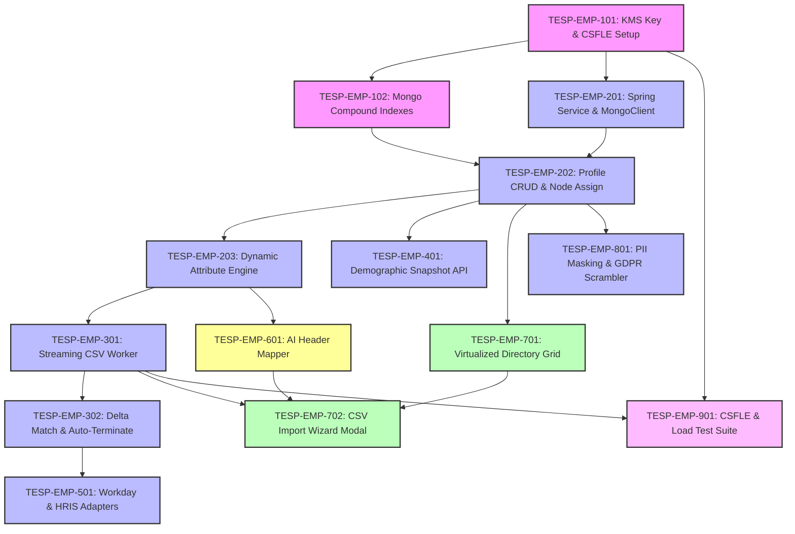

# FEAT-003: Employee Roster & Demographic Attribute Management — Engineering Backlog

| Metadata Field | Value |
|---|---|
| **Feature ID** | FEAT-003 |
| **Feature Title** | Employee Roster & Demographic Attribute Management |
| **Backlog Owner** | Lead Engineering Program Manager |
| **Target Architecture** | `DOC-001`, `DOC-002`, `DOC-003`, `DOC-004`, `FEAT-001`, `FEAT-002`, `FEAT-003` |
| **Technology Stack** | Spring Boot 3.3+ (Java 21), React 19+ (Vite, TypeScript, TanStack Virtual/Table), MongoDB Atlas CSFLE, AWS KMS, Redis, Kafka |
| **Total Story Points** | 75 Points |
| **Total Epics** | 9 Epics |
| **Target Sprints** | Sprints 2.1 – 3.1 (3 Two-Week Sprints) |

---

## 1. Capability Breakdown Matrix

| Capability ID | Capability Name | Target Requirements | Target Microservice / Layer | Component Primary Tech |
|---|---|---|---|---|
| **CAP-EMP-01** | CSFLE PII Field Level Encryption | `FR-EMP-002`, `BR-EMP-003`, `DOC-003` | `employee-service` / Security | AWS KMS + MongoDB CSFLE Driver |
| **CAP-EMP-02** | Flexible Demographic Metamodel | `FR-EMP-001`, `VR-EMP-004` | `employee-service` / DB | Dynamic Key-Value Map Validator |
| **CAP-EMP-03** | Streaming Bulk CSV Ingestion | `FR-EMP-003`, `SLA-EMP-01` | `employee-service` / Stream | Java 21 Streaming CSV Parser |
| **CAP-EMP-04** | Delta Matching & Auto-Termination | `FR-EMP-004`, `BR-EMP-004` | `employee-service` / Batch | Bulk Upsert & Set Difference Worker |
| **CAP-EMP-05** | Primary & Matrix Node Linking | `FR-EMP-005`, `VR-EMP-003` | `employee-service` / Core | Org Node Foreign Key Validator |
| **CAP-EMP-06** | Immutable Demographic Snapshot | `FR-EMP-006` | `employee-service` / Internal API | JSON Snapshot Compiler |
| **CAP-EMP-07** | HRIS REST Synchronization | `FR-EMP-007` | `employee-service` / Connector | Workday & SuccessFactors Adapters |
| **CAP-EMP-08** | Smart AI Header Mapping | `FEAT-003 Sec 20` | `employee-service` / AI Assistant | Fuzzy NLP Header Matcher |
| **CAP-EMP-09** | Virtualized Directory UI | `US-EMP-001`, `UI-EMP-01` | `tesp-admin-portal` / Web UI | React 19+, TanStack Virtual, Table |

---

## 2. Epic Hierarchy Structure

```
EPIC-EMP-01: CSFLE Data Model & MongoDB Encryption Setup (10 pts)
  ├── TESP-EMP-101: AWS KMS Key Provisioning & CSFLE Schema Definition (5 pts)
  └── TESP-EMP-102: MongoDB Compound Indexes & Dynamic Metamodel Setup (5 pts)

EPIC-EMP-02: Employee Service Core & REST Profile APIs (12 pts)
  ├── TESP-EMP-201: Spring Boot Service Scaffold & CSFLE Mongo Template (4 pts)
  ├── TESP-EMP-202: Employee CRUD & Primary/Matrix Node Assignment APIs (5 pts)
  └── TESP-EMP-203: Dynamic Attribute Schema Validation Engine (3 pts)

EPIC-EMP-03: Streaming Bulk CSV Ingestion & Delta Match Engine (14 pts)
  ├── TESP-EMP-301: Streaming CSV Parser & 5,000 Record Batch Worker (6 pts)
  └── TESP-EMP-302: Bulk Delta Matching & Automatic Termination Engine (8 pts)

EPIC-EMP-04: Immutable Demographic Snapshot Generator API (6 pts)
  └── TESP-EMP-401: Internal Immutable Demographic Snapshot Compiler API (6 pts)

EPIC-EMP-05: Automated HRIS REST Connector Framework (8 pts)
  └── TESP-EMP-501: Workday & SAP SuccessFactors REST Sync Adapters (8 pts)

EPIC-EMP-06: Smart AI CSV Header Mapping Assistant (4 pts)
  └── TESP-EMP-601: AI Fuzzy CSV Header-to-Attribute Mapping Engine (4 pts)

EPIC-EMP-07: React 19+ Virtualized Directory & Import Wizard UI (12 pts)
  ├── TESP-EMP-701: High-Performance Virtualized Roster Data Grid (6 pts)
  └── TESP-EMP-702: Drag-and-Drop CSV Import Wizard & Column Mapper Modal (6 pts)

EPIC-EMP-08: GDPR Anonymization & Security Interceptor (5 pts)
  └── TESP-EMP-801: PII Masking Interceptor & Right-to-be-Forgotten Scrambler (5 pts)

EPIC-EMP-09: QA Integration & Performance Load Test Suite (4 pts)
  └── TESP-EMP-901: CSFLE Verification & 100k Bulk Upload Load Tests (4 pts)
```

---

## 3. Detailed Jira Engineering Tasks

### EPIC-EMP-01: CSFLE Data Model & MongoDB Encryption Setup

#### Task: TESP-EMP-101
- **Summary**: Provision AWS KMS Key & Configure MongoDB CSFLE Encryption Schema
- **Issue Type**: Database / Security Task
- **Component**: Security & MongoDB
- **Story Points**: 5 Points
- **Target Requirements**: `FR-EMP-002`, `BR-EMP-003`, `DOC-003`, `TC-EMP-002`
- **Dependencies**: None (Root Task)
- **Implementation Notes**:
  - Configure AWS KMS Data Encryption Key (DEK) in Terraform.
  - Implement CSFLE Schema map for `employees` collection encrypting `email`, `fullName`, and `phoneNumber` using `AEAD_AES_256_CBC_HMAC_SHA_512-Deterministic` (for email/phone queries) and `Random` (for fullName).
- **Acceptance Criteria**:
  - [ ] Querying raw MongoDB document via `mongosh` verifies `email` and `fullName` store binary ciphertext (`BinData(6, ...)`).
  - [ ] Spring Boot application transparently decrypts PII fields for authorized application queries.

#### Task: TESP-EMP-102
- **Summary**: Define MongoDB Compound Indexes for Employee Search & Demographics
- **Issue Type**: Task
- **Component**: Database / Spring Data MongoDB
- **Story Points**: 5 Points
- **Target Requirements**: `BR-EMP-001`, `SLA-EMP-02`
- **Dependencies**: `TESP-EMP-101`
- **Implementation Notes**:
  - Create unique index `{ projectId: 1, employeeId: 1 }` with `unique: true`.
  - Create compound index `{ projectId: 1, nodeId: 1, status: 1 }`.
  - Create multikey index `{ projectId: 1, matrixNodeIds: 1 }`.
- **Acceptance Criteria**:
  - [ ] Directory queries filtering by `nodeId` and `status` execute in $< 15\text{ ms (p95)}$.
  - [ ] Duplicate `employeeId` within same project throws `DuplicateKeyException`.

---

### EPIC-EMP-02: Employee Service Core & REST Profile APIs

#### Task: TESP-EMP-201
- **Summary**: Scaffold `employee-service` Microservice & CSFLE MongoClient Configuration
- **Issue Type**: Task
- **Component**: Backend / Java 21 Spring Boot
- **Story Points**: 4 Points
- **Target Requirements**: `DOC-002`, `FR-EMP-002`
- **Dependencies**: `TESP-EMP-101`
- **Implementation Notes**:
  - Scaffold Maven module `com.talnova.employee` with Java 21 Virtual Threads enabled.
  - Configure `AutoEncryptionSettings` bean linking to AWS KMS key provider.
- **Acceptance Criteria**:
  - [ ] Microservice initializes CSFLE driver and establishes encrypted connection to MongoDB Atlas.

#### Task: TESP-EMP-202
- **Summary**: Implement Employee Profile CRUD & Primary/Matrix Node Assignment APIs
- **Issue Type**: API Implementation Task
- **Component**: Backend / REST API
- **Story Points**: 5 Points
- **Target Requirements**: `FR-EMP-001`, `FR-EMP-005`, `VR-EMP-001` to `003`
- **Dependencies**: `TESP-EMP-201`, `TESP-EMP-102`
- **Implementation Notes**:
  - Implement `POST /api/v1/employees` (Create Profile).
  - Implement `GET /api/v1/employees/{employeeId}` (Fetch Profile).
  - Implement `PUT /api/v1/employees/{employeeId}` (Update Profile & Matrix Assignments).
  - Validate `nodeId` and `matrixNodeIds` against `organization_nodes` collection in `FEAT-002`.
- **Acceptance Criteria**:
  - [ ] Assigning non-existent `nodeId` returns HTTP 400 Bad Request ("Assigned Node ID does not exist").
  - [ ] Profile contains primary `nodeId` and array of secondary `matrixNodeIds`.

#### Task: TESP-EMP-203
- **Summary**: Implement Dynamic Attribute Schema Validation Engine
- **Issue Type**: Task
- **Component**: Backend / Validation
- **Story Points**: 3 Points
- **Target Requirements**: `FR-EMP-001`, `VR-EMP-004`
- **Dependencies**: `TESP-EMP-202`
- **Implementation Notes**:
  - Fetch custom attribute definitions from Project configuration (`FEAT-001`).
  - Validate incoming employee `attributes` map: verify key names exist and data types (`STRING`, `NUMERIC`, `ENUM`, `DATE`) match defined constraints.
- **Acceptance Criteria**:
  - [ ] Passing string `"Five Years"` for a `NUMERIC` attribute `TenureYears` returns HTTP 400 Bad Request ("Custom attribute type mismatch").

---

### EPIC-EMP-03: Streaming Bulk CSV Ingestion & Delta Match Engine

#### Task: TESP-EMP-301
- **Summary**: Implement Streaming CSV Parser & 5,000 Record Batch Ingestion Worker
- **Issue Type**: Task
- **Component**: Backend / High-Throughput Stream
- **Story Points**: 6 Points
- **Target Requirements**: `FR-EMP-003`, `SLA-EMP-01`
- **Dependencies**: `TESP-EMP-203`
- **Implementation Notes**:
  - Implement `POST /api/v1/employees/bulk-import` handling `multipart/form-data`.
  - Use Apache Commons CSV streaming parser to process input stream in 5,000 record batches using Java Virtual Threads.
  - Execute MongoDB bulk unordered upsert (`bulkOps.execute()`) encrypting PII batch-by-batch.
- **Acceptance Criteria**:
  - [ ] 10,000 record CSV file is parsed, encrypted, and written to MongoDB in $< 12\text{ seconds}$.
  - [ ] Memory footprint remains flat ($< 256\text{MB}$) during 100,000 row CSV upload.

#### Task: TESP-EMP-302
- **Summary**: Implement Bulk Delta Matching & Automatic Termination Engine
- **Issue Type**: Task
- **Component**: Backend / Batch Processing
- **Story Points**: 8 Points
- **Target Requirements**: `FR-EMP-004`, `BR-EMP-004`, `TC-EMP-001`
- **Dependencies**: `TESP-EMP-301`
- **Implementation Notes**:
  - During CSV bulk import, track set of processed `employeeId`s in a temporary Redis Set (`tesp:import:<jobId>:ids`).
  - If `autoTerminateMissing: true` flag is selected, execute set difference against active project employees: `updateMany({ projectId, employeeId: { $nin: importedSet }, status: "ACTIVE" }, { $set: { status: "TERMINATED" } })`.
- **Acceptance Criteria**:
  - [ ] Existing employees present in CSV have their attributes updated.
  - [ ] Active employees missing from CSV are updated to `status: "TERMINATED"` without hard document deletion.

---

### EPIC-EMP-04: Immutable Demographic Snapshot Generator API

#### Task: TESP-EMP-401
- **Summary**: Implement Internal Immutable Demographic Snapshot Compiler API
- **Issue Type**: API Implementation Task
- **Component**: Backend / Internal Service API
- **Story Points**: 6 Points
- **Target Requirements**: `FR-EMP-006`
- **Dependencies**: `TESP-EMP-202`
- **Implementation Notes**:
  - Implement `GET /api/v1/internal/employees/{employeeId}/demographic-snapshot`.
  - Fetch employee record, resolve primary node's ancestor materialized path from `FEAT-002`, and compile key-value map of demographic attributes (e.g., `{ Tenure: "3-5 Years", Gender: "Female", Band: "L3", ancestorPaths: ",N-001,N-101,N-201," }`).
  - Omit all PII fields (`fullName`, `email`, `phoneNumber`) from snapshot payload.
- **Acceptance Criteria**:
  - [ ] Returned JSON snapshot contains zero PII identity fields.
  - [ ] Includes ancestor materialized path string required for downstream analytics sub-tree slicing.

---

### EPIC-EMP-05: Automated HRIS REST Connector Framework

#### Task: TESP-EMP-501
- **Summary**: Implement Workday & SAP SuccessFactors REST Sync Adapters
- **Issue Type**: Task / Integration
- **Component**: Backend / Enterprise Connectors
- **Story Points**: 8 Points
- **Target Requirements**: `FR-EMP-007`, `OQ-EMP-001`
- **Dependencies**: `TESP-EMP-302`
- **Implementation Notes**:
  - Implement `HrisSyncService` with pluggable `WorkdayAdapter` and `SuccessFactorsAdapter`.
  - Authenticate using OAuth2 client credentials stored in AWS Secrets Manager.
  - Execute nightly scheduled sync job with exponential backoff retries and Redis token bucket rate limiting (max 10 RPS to HRIS endpoint).
- **Acceptance Criteria**:
  - [ ] Successfully fetches employee delta updates from Workday REST API and applies upserts to `employees` collection.
  - [ ] HRIS rate-limiting (HTTP 429) triggers exponential backoff delay.

---

### EPIC-EMP-06: Smart AI CSV Header Mapping Assistant

#### Task: TESP-EMP-601
- **Summary**: Implement AI Fuzzy CSV Header-to-Attribute Mapping Engine
- **Issue Type**: AI Task / NLP
- **Component**: AI & Data Utility
- **Story Points**: 4 Points
- **Target Requirements**: `FEAT-003 Sec 20`
- **Dependencies**: `TESP-EMP-203`
- **Implementation Notes**:
  - Implement `POST /api/v1/employees/suggest-column-mapping`.
  - Pass array of CSV column header strings (e.g., `["Emp_ID", "Full_Name", "Work_Email", "Yrs_Service"]`).
  - Use Levenshtein distance + TF-IDF fuzzy matcher mapping headers to system attribute keys with confidence scores ($0.0 - 1.0$).
- **Acceptance Criteria**:
  - [ ] Header `"Work Email Address"` maps automatically to system attribute `email` with confidence $> 0.95$.
  - [ ] Header `"Years_Service"` maps automatically to custom attribute `TenureYears`.

---

### EPIC-EMP-07: React 19+ Virtualized Directory & Import Wizard UI

#### Task: TESP-EMP-701
- **Summary**: Build High-Performance Virtualized Roster Data Grid Component
- **Issue Type**: Frontend Task
- **Component**: Frontend / React 19+ Vite
- **Story Points**: 6 Points
- **Target Requirements**: `US-EMP-002`, `UI-EMP-01`
- **Dependencies**: `TESP-EMP-202`
- **Implementation Notes**:
  - Create React component `src/components/employee/EmployeeDirectoryGrid.tsx` using `@tanstack/react-table` and `@tanstack/react-virtual`.
  - Implement virtualized row rendering supporting smooth 60 FPS scrolling for 100,000 employee records.
  - Add multi-attribute column filter bar (Filter by Node, Status, Tenure, Custom Attributes).
- **Acceptance Criteria**:
  - [ ] Displays 100,000 employee rows without browser DOM lagging or memory spikes.
  - [ ] Filter bar updates table results in real time.

#### Task: TESP-EMP-702
- **Summary**: Build Drag-and-Drop CSV Import Wizard & Column Mapper Modal Component
- **Issue Type**: Frontend Task
- **Component**: Frontend / React 19+ Vite
- **Story Points**: 6 Points
- **Target Requirements**: `US-EMP-001`, `UI-EMP-01`
- **Dependencies**: `TESP-EMP-701`, `TESP-EMP-601`, `TESP-EMP-301`
- **Implementation Notes**:
  - Create modal component `src/components/employee/CsvImportWizardModal.tsx`.
  - Step 1: Drag-and-drop CSV file dropzone.
  - Step 2: Interactive column mapping table with AI suggestions pre-selected.
  - Step 3: Import progress bar & execution summary report (Total, Inserted, Updated, Terminated).
- **Acceptance Criteria**:
  - [ ] Dragging CSV populates column mapping wizard with AI suggested field mappings.
  - [ ] Completing upload displays summary modal with exact count of inserted/updated records.

---

### EPIC-EMP-08: GDPR Anonymization & Security Interceptor

#### Task: TESP-EMP-801
- **Summary**: Implement PII Masking Interceptor & Right-to-be-Forgotten Scrambler
- **Issue Type**: Security Task
- **Component**: Security & Compliance
- **Story Points**: 5 Points
- **Target Requirements**: `PR-EMP-003`, `BR-EMP-003`, `FEAT-003 Sec 21`
- **Dependencies**: `TESP-EMP-202`
- **Implementation Notes**:
  - Implement `PiiMaskingAspect`: If current user has `DEPARTMENT_MANAGER` role (without explicit HR privilege), automatically mask `email`, `fullName`, and `phoneNumber` in REST response DTOs (`"J*** D**"`).
  - Implement `DELETE /api/v1/employees/{employeeId}/anonymize` for GDPR compliance: Scramble PII fields while retaining demographic attributes for survey validity.
- **Acceptance Criteria**:
  - [ ] Department Manager viewing direct reports sees masked PII fields (`"f***@company.com"`).
  - [ ] Triggering GDPR anonymization overwrites PII fields with random hashes while preserving `attributes` map.

---

### EPIC-EMP-09: QA Integration & Performance Load Test Suite

#### Task: TESP-EMP-901
- **Summary**: Build CSFLE Verification & 100k Bulk Upload Load Test Suite
- **Issue Type**: QA Task
- **Component**: QA & Load Testing
- **Story Points**: 4 Points
- **Target Requirements**: `DOC-012`, `TC-EMP-001`, `TC-EMP-002`, `SLA-EMP-01`, `SLA-EMP-02`
- **Dependencies**: `TESP-EMP-101`, `TESP-EMP-301`, `TESP-EMP-701`
- **Implementation Notes**:
  - Integration test verifying raw MongoDB documents contain binary ciphertext (`TC-EMP-002`).
  - Playwright E2E test `tests/e2e/employee-import.spec.ts` testing CSV import wizard workflow.
  - k6 load test script uploading a 100,000 row CSV file measuring parsing and upsert duration.
- **Acceptance Criteria**:
  - [ ] 100,000 row CSV load test completes in $< 120\text{ seconds}$ without memory leaks.
  - [ ] CSFLE integration tests verify zero unencrypted PII disk writes.

---

## 4. Visual Dependency Graph



---

## 5. Release Sequencing & Sprint Allocation

### Sprint 2.1: CSFLE Data Layer & Profile CRUD APIs (Total: 24 Points)
- **Focus**: AWS KMS provisioning, CSFLE Schema, MongoDB indexes, Profile CRUD APIs.
- **Tasks**:
  - `TESP-EMP-101`: KMS Key & CSFLE Setup (5 pts)
  - `TESP-EMP-102`: Mongo Compound Indexes (5 pts)
  - `TESP-EMP-201`: Spring Service & MongoClient (4 pts)
  - `TESP-EMP-202`: Profile CRUD & Node Assign (5 pts)
  - `TESP-EMP-203`: Dynamic Attribute Engine (3 pts)

---

### Sprint 2.2: Bulk CSV Streaming, Delta Match & Snapshot API (Total: 26 Points)
- **Focus**: High-speed CSV streaming parser, 5,000 batch worker, Delta auto-termination, Snapshot API, AI Header Mapper.
- **Tasks**:
  - `TESP-EMP-301`: Streaming CSV Worker (6 pts)
  - `TESP-EMP-302`: Delta Match & Auto-Terminate (8 pts)
  - `TESP-EMP-401`: Demographic Snapshot API (6 pts)
  - `TESP-EMP-601`: AI Header Mapper (4 pts)

---

### Sprint 3.1: React Virtualized Roster UI, HRIS Sync & QA (Total: 25 Points)
- **Focus**: Virtualized data grid UI, Drag-and-drop CSV wizard, Workday connector, GDPR anonymizer, Load tests.
- **Tasks**:
  - `TESP-EMP-501`: Workday & HRIS Adapters (8 pts)
  - `TESP-EMP-701`: Virtualized Directory Grid (6 pts)
  - `TESP-EMP-702`: CSV Import Wizard Modal (6 pts)
  - `TESP-EMP-801`: PII Masking & GDPR Scrambler (5 pts)
  - `TESP-EMP-901`: CSFLE & Load Test Suite (4 pts)

---

## Document Status

| Field | Value |
|---|---|
| **Document Status** | Approved / Ready for Jira Import |
| **Target Feature** | `FEAT-003: Employee Roster & Demographic Attribute Management` |
| **Total Story Points** | 75 Story Points |
| **Dependencies Satisfied** | `DOC-001` to `DOC-004`, `FEAT-001` to `FEAT-003` |
| **Next Recommended Backlog** | `FEAT-004-SURVEY-BUILDER-BACKLOG.md` |
