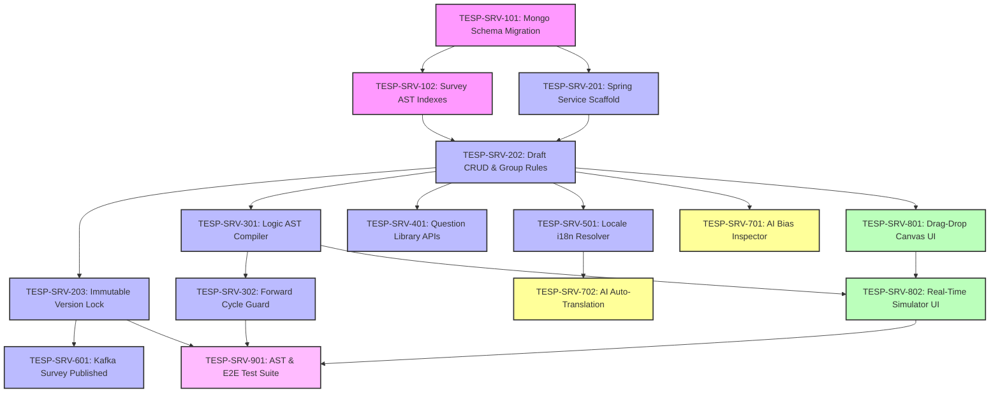

# FEAT-004: Metadata-Driven Survey Construction & Logic Builder — Engineering Backlog

| Metadata Field | Value |
|---|---|
| **Feature ID** | FEAT-004 |
| **Feature Title** | Metadata-Driven Survey Construction & Logic Builder |
| **Backlog Owner** | Lead Engineering Program Manager |
| **Target Architecture** | `DOC-001`, `DOC-002`, `DOC-003`, `DOC-005`, `FEAT-001`, `FEAT-004` |
| **Technology Stack** | Spring Boot 3.3+ (Java 21), React 19+ (Vite, TypeScript, `@hello-pangea/dnd`), MongoDB Atlas, Redis 7.x, Apache Kafka |
| **Total Story Points** | 70 Points |
| **Total Epics** | 9 Epics |
| **Target Sprints** | Sprints 2.3 – 3.2 (3 Two-Week Sprints) |

---

## 1. Capability Breakdown Matrix

| Capability ID | Capability Name | Target Requirements | Target Microservice / Layer | Component Primary Tech |
|---|---|---|---|---|
| **CAP-SRV-01** | Survey AST Metamodel | `FR-SRV-001`, `DOC-003` | `survey-builder-service` / DB | MongoDB `surveys` collection |
| **CAP-SRV-02** | 10+ Question Types Support | `FR-SRV-002`, `FR-SRV-003` | `survey-builder-service` / Core | Java 21 Question Schema Validator |
| **CAP-SRV-03** | Declarative Branching Logic AST | `FR-SRV-004`, `BR-SRV-004` | `survey-builder-service` / Engine | Logic AST DAG Parser |
| **CAP-SRV-04** | Immutable Version Publishing | `FR-SRV-005`, `BR-SRV-001` | `survey-builder-service` / Lock | State Machine & Copy-on-Write |
| **CAP-SRV-05** | Multi-Language Localization | `FR-SRV-006`, `VR-SRV-004` | `survey-builder-service` / i18n | Locale Map Prompt Dictionary |
| **CAP-SRV-06** | Question Library Reuse Catalog | `FR-SRV-007` | `survey-builder-service` / Library | Mongo `question_library` collection |
| **CAP-SRV-07** | Asynchronous Kafka Event Emission | `FR-SRV-008`, `DOC-002` | `survey-builder-service` / Messaging | Apache Kafka + Outbox Pattern |
| **CAP-SRV-08** | Drag-and-Drop React Canvas UI | `US-SRV-001`, `UI-SRV-01` | `tesp-admin-portal` / Web UI | React 19+, `@hello-pangea/dnd`, TanStack Query |
| **CAP-SRV-09** | AI Phrasing & Auto-Translation | `FEAT-004 Sec 20` | `survey-builder-service` / AI Module | OpenAI / Gemini Translation Adapter |

---

## 2. Epic Hierarchy Structure

```
EPIC-SRV-01: Survey AST Metamodel & MongoDB Storage (8 pts)
  ├── TESP-SRV-101: MongoDB Nested AST Schema Migration Script (4 pts)
  └── TESP-SRV-102: Survey Compound Indexes & Query Scoping (4 pts)

EPIC-SRV-02: Survey Builder Core CRUD & Version Locking (12 pts)
  ├── TESP-SRV-201: Spring Boot Service Scaffold & AST Entity Model (4 pts)
  ├── TESP-SRV-202: Survey Draft CRUD & Question Group Association (4 pts)
  └── TESP-SRV-203: Immutable Version Publishing & Lock Engine (4 pts)

EPIC-SRV-03: Declarative Branching Logic AST & Cycle Guard (10 pts)
  ├── TESP-SRV-301: Declarative Branching Logic AST Compiler (5 pts)
  └── TESP-SRV-302: Forward-Only Skip Logic Cycle Prevention Guard (5 pts)

EPIC-SRV-04: Question Library Catalog & Template Reuse (6 pts)
  └── TESP-SRV-401: Question Library & Survey Template Management APIs (6 pts)

EPIC-SRV-05: Multi-Language Localization Dictionary Engine (5 pts)
  └── TESP-SRV-501: Multi-Locale Dictionary Resolver & Fallback Engine (5 pts)

EPIC-SRV-06: Domain Event Streaming & Kafka Outbox (5 pts)
  └── TESP-SRV-601: Kafka SurveyPublished Event Publisher (5 pts)

EPIC-SRV-07: AI Question Phrasing & One-Click Auto-Translation (6 pts)
  ├── TESP-SRV-701: AI Leading Question & Bias Inspector (3 pts)
  └── TESP-SRV-702: One-Click Multi-Language Translation Service (3 pts)

EPIC-SRV-08: React 19+ Drag-and-Drop Canvas & Simulator UI (14 pts)
  ├── TESP-SRV-801: Drag-and-Drop Survey Page & Section Builder Canvas (7 pts)
  └── TESP-SRV-802: Real-Time Mobile & Desktop Logic Simulator Component (7 pts)

EPIC-SRV-09: QA Integration & Logic Evaluation Test Suite (4 pts)
  └── TESP-SRV-901: AST Parser Unit, E2E & Branching Logic Test Suite (4 pts)
```

---

## 3. Detailed Jira Engineering Tasks

### EPIC-SRV-01: Survey AST Metamodel & MongoDB Storage

#### Task: TESP-SRV-101
- **Summary**: Implement MongoDB Schema Validation Script for `surveys` AST Collection
- **Issue Type**: Database Task / Migration
- **Component**: Database / MongoDB
- **Story Points**: 4 Points
- **Target Requirements**: `FR-SRV-001`, `DOC-003`
- **Dependencies**: None (Root Task)
- **Implementation Notes**:
  - Create MongoDB migration script `src/main/resources/db/migration/v1_003_create_surveys_collection.js`.
  - Implement JSON Schema validation for nested survey tree structure (`projectId`, `surveyId`, `version`, `title`, `status`, `pages`, `sections`, `questions`).
- **Acceptance Criteria**:
  - [ ] Inserting a question without mandatory `groupId` throws MongoDB validation error.
  - [ ] Validates question `type` against 10 allowed enums (`LIKERT`, `NPS`, `MATRIX`, etc.).

#### Task: TESP-SRV-102
- **Summary**: Create Survey Indexes & Active Version Lookup Compound Index
- **Issue Type**: Task
- **Component**: Database / Spring Data MongoDB
- **Story Points**: 4 Points
- **Target Requirements**: `FR-SRV-001`, `BR-SRV-003`
- **Dependencies**: `TESP-SRV-101`
- **Implementation Notes**:
  - Create compound unique index `{ projectId: 1, surveyId: 1, version: 1 }` with `unique: true`.
  - Create query index `{ projectId: 1, status: 1 }`.
- **Acceptance Criteria**:
  - [ ] Duplicate `(surveyId, version)` insertion throws `DuplicateKeyException`.
  - [ ] Fetching active survey payload uses index `IXSCAN`.

---

### EPIC-SRV-02: Survey Builder Core CRUD & Version Locking

#### Task: TESP-SRV-201
- **Summary**: Scaffold `survey-builder-service` Microservice & AST Entity Model
- **Issue Type**: Task
- **Component**: Backend / Java 21 Spring Boot
- **Story Points**: 4 Points
- **Target Requirements**: `DOC-002`, `FR-SRV-001`
- **Dependencies**: `TESP-SRV-101`
- **Implementation Notes**:
  - Scaffold Maven module `com.talnova.surveybuilder` with Java 21 Virtual Threads.
  - Implement `@Document("surveys")` `SurveyDocument` with nested records `PageRecord`, `SectionRecord`, `QuestionRecord`.
- **Acceptance Criteria**:
  - [ ] Microservice compiles and connects to MongoDB database.

#### Task: TESP-SRV-202
- **Summary**: Implement Survey Draft CRUD & Mandatory Question Group Rules
- **Issue Type**: API Implementation Task
- **Component**: Backend / REST API
- **Story Points**: 4 Points
- **Target Requirements**: `FR-SRV-001`, `FR-SRV-003`, `BR-SRV-002`, `VR-SRV-001`
- **Dependencies**: `TESP-SRV-201`, `TESP-SRV-102`
- **Implementation Notes**:
  - Implement `PUT /api/v1/surveys/{surveyId}` for creating/saving draft survey ASTs.
  - Validate that every `LIKERT` or `NPS` question contains a valid `groupId`.
- **Acceptance Criteria**:
  - [ ] Saving draft survey creates nested Pages/Sections/Questions JSON AST.
  - [ ] Creating Likert question without `groupId` returns HTTP 400 Bad Request ("Mandatory Question Group missing").

#### Task: TESP-SRV-203
- **Summary**: Implement Immutable Version Publishing & Structural Lock Engine
- **Issue Type**: Task
- **Component**: Backend / Versioning Logic
- **Story Points**: 4 Points
- **Target Requirements**: `FR-SRV-005`, `BR-SRV-001`, `TC-SRV-001`
- **Dependencies**: `TESP-SRV-202`
- **Implementation Notes**:
  - Implement `POST /api/v1/surveys/{surveyId}/publish`.
  - Validate survey is not empty (must contain at least 1 page, section, question).
  - Update `status = "PUBLISHED"`, set `publishedAt = NOW()`.
  - Inhibit structural mutations on `PUBLISHED` version; cloning creates new draft `version = N + 1`.
- **Acceptance Criteria**:
  - [ ] Attempting to delete a question from a `PUBLISHED` survey returns HTTP 400 Bad Request ("Cannot modify structural design of a published survey version").

---

### EPIC-SRV-03: Declarative Branching Logic AST & Cycle Guard

#### Task: TESP-SRV-301
- **Summary**: Implement Declarative Branching Logic AST Compiler
- **Issue Type**: Task
- **Component**: Backend / Logic Engine
- **Story Points**: 5 Points
- **Target Requirements**: `FR-SRV-004`, `VR-SRV-003`
- **Dependencies**: `TESP-SRV-202`
- **Implementation Notes**:
  - Implement JSON logic rule schema (`IF questionId operator value THEN SKIP_TO targetPageId`).
  - Validate that `targetPageId` exists in the survey page array.
- **Acceptance Criteria**:
  - [ ] Logic AST payload validates rule operators (`EQUALS`, `NOT_EQUALS`, `LESS_THAN`, `GREATER_THAN`).

#### Task: TESP-SRV-302
- **Summary**: Implement Forward-Only Skip Logic Cycle Prevention Guard
- **Issue Type**: Task
- **Component**: Backend / DAG Validation
- **Story Points**: 5 Points
- **Target Requirements**: `BR-SRV-004`, `VR-SRV-003`
- **Dependencies**: `TESP-SRV-301`
- **Implementation Notes**:
  - Implement `LogicCycleGuard`: Verify that `targetPageId` appears at a higher `pageOrder` sequence index than the source page.
  - Throw `InvalidLogicRuleException` if backward skip or loop detected.
- **Acceptance Criteria**:
  - [ ] Configuring Page 3 to skip to Page 1 returns HTTP 400 Bad Request ("Invalid forward skip target page").

---

### EPIC-SRV-04: Question Library Catalog & Template Reuse

#### Task: TESP-SRV-401
- **Summary**: Implement Question Library & Survey Template Management APIs
- **Issue Type**: API Implementation Task
- **Component**: Backend / REST API
- **Story Points**: 6 Points
- **Target Requirements**: `FR-SRV-007`, `PR-SRV-003`
- **Dependencies**: `TESP-SRV-202`
- **Implementation Notes**:
  - Create MongoDB collection `question_library`.
  - Implement `POST /api/v1/question-library` (Save question/section to template catalog).
  - Implement `GET /api/v1/question-library` (Search reusable questions by category/theme).
- **Acceptance Criteria**:
  - [ ] Consultants can save validated engagement questions to the Question Library for cross-survey reuse.

---

### EPIC-SRV-05: Multi-Language Localization Dictionary Engine

#### Task: TESP-SRV-501
- **Summary**: Implement Multi-Locale Dictionary Resolver & Fallback Engine
- **Issue Type**: Task
- **Component**: Backend / i18n
- **Story Points**: 5 Points
- **Target Requirements**: `FR-SRV-006`, `VR-SRV-004`
- **Dependencies**: `TESP-SRV-202`
- **Implementation Notes**:
  - Implement `LocaleDictionaryResolver`: Ensure prompt strings are stored as key-value maps (`{ "en-US": "...", "si-LK": "..." }`).
  - Validate that `prompt` object contains at least the project's `defaultLocale` key.
- **Acceptance Criteria**:
  - [ ] Missing default locale prompt entry returns HTTP 400 Bad Request ("Missing default locale prompt").

---

### EPIC-SRV-06: Domain Event Streaming & Kafka Outbox

#### Task: TESP-SRV-601
- **Summary**: Implement Kafka SurveyPublished Event Publisher
- **Issue Type**: Event Implementation Task
- **Component**: Backend / Kafka Messaging
- **Story Points**: 5 Points
- **Target Requirements**: `FR-SRV-008`, `DOC-002`
- **Dependencies**: `TESP-SRV-203`
- **Implementation Notes**:
  - Write `SurveyPublishedEvent` into MongoDB outbox collection upon publishing.
  - Scheduled worker relays payload to Kafka topic `tesp.survey.events.v1`.
- **Acceptance Criteria**:
  - [ ] Publishing a survey version dispatches `SurveyPublishedEvent` to Kafka with `surveyId`, `version`, and `questionCount`.

---

### EPIC-SRV-07: AI Question Phrasing & One-Click Auto-Translation

#### Task: TESP-SRV-701
- **Summary**: Implement AI Leading Question & Bias Inspector
- **Issue Type**: AI Task / Quality
- **Component**: AI Service
- **Story Points**: 3 Points
- **Target Requirements**: `FEAT-004 Sec 20`
- **Dependencies**: `TESP-SRV-202`
- **Implementation Notes**:
  - Expose API `POST /api/v1/surveys/inspect-question-bias` calling OpenAI/Gemini adapter.
  - Analyze question prompt for leading language, double-barreled items, or bias, returning feedback score and suggested revision.
- **Acceptance Criteria**:
  - [ ] Prompt `"Don't you agree that management is doing a great job?"` returns bias alert with suggestion `"How would you rate management performance?"`.

#### Task: TESP-SRV-702
- **Summary**: Implement One-Click Multi-Language Translation Service
- **Issue Type**: AI Task / Translation
- **Component**: AI Service
- **Story Points**: 3 Points
- **Target Requirements**: `FEAT-004 Sec 20`
- **Dependencies**: `TESP-SRV-501`
- **Implementation Notes**:
  - Expose API `POST /api/v1/surveys/auto-translate` taking source prompt and target locale list (`si-LK`, `ta-LK`, `es-ES`).
  - Generate localized prompt strings automatically for human review.
- **Acceptance Criteria**:
  - [ ] Automatically populates Sinhala and Tamil prompt map entries in survey JSON AST.

---

### EPIC-SRV-08: React 19+ Drag-and-Drop Canvas & Simulator UI

#### Task: TESP-SRV-801
- **Summary**: Build Drag-and-Drop Survey Page & Section Builder Canvas
- **Issue Type**: Frontend Task
- **Component**: Frontend / React 19+ Vite
- **Story Points**: 7 Points
- **Target Requirements**: `US-SRV-001`, `UI-SRV-01`
- **Dependencies**: `TESP-SRV-202`
- **Implementation Notes**:
  - Create React component `src/components/survey/SurveyBuilderCanvas.tsx` using `@hello-pangea/dnd`.
  - Palette sidebar with 10+ Question Type tiles; drag-and-drop onto page canvas.
  - Right inspector panel for prompt editing, locale dictionary, mandatory toggle, and group selector.
- **Acceptance Criteria**:
  - [ ] Dragging Likert question tile onto canvas adds question to current section.
  - [ ] Inspector panel updates survey AST state in real time.

#### Task: TESP-SRV-802
- **Summary**: Build Real-Time Mobile & Desktop Logic Simulator Component
- **Issue Type**: Frontend Task
- **Component**: Frontend / React 19+ Vite
- **Story Points**: 7 Points
- **Target Requirements**: `US-SRV-002`, `UI-SRV-01`, `TC-SRV-002`
- **Dependencies**: `TESP-SRV-801`, `TESP-SRV-301`
- **Implementation Notes**:
  - Create split-screen preview simulator component `src/components/survey/SurveySimulator.tsx`.
  - Evaluate client-side branching logic AST rules dynamically as mock answers are selected.
- **Acceptance Criteria**:
  - [ ] Selecting answer `2` on NPS question dynamically triggers skip logic rule to jump to Page 3 in the simulator preview.

---

### EPIC-SRV-09: QA Integration & Logic Evaluation Test Suite

#### Task: TESP-SRV-901
- **Summary**: Build AST Parser Unit, E2E & Branching Logic Test Suite
- **Issue Type**: QA Task
- **Component**: QA & Automated Testing
- **Story Points**: 4 Points
- **Target Requirements**: `DOC-012`, `TC-SRV-001`, `TC-SRV-002`
- **Dependencies**: `TESP-SRV-203`, `TESP-SRV-302`, `TESP-SRV-802`
- **Implementation Notes**:
  - Unit tests for JSON logic AST parser and cycle detection guard.
  - Playwright E2E test `tests/e2e/survey-builder.spec.ts` building a 3-page survey with skip logic and publishing version 1.0.
- **Acceptance Criteria**:
  - [ ] 100% pass rate on branching logic evaluation unit tests.

---

## 4. Visual Dependency Graph



---

## 5. Release Sequencing & Sprint Allocation

### Sprint 2.3: Survey AST Schema & Core Draft CRUD (Total: 22 Points)
- **Focus**: MongoDB AST schema, Spring Boot CRUD APIs, Question Group validation, Question Library.
- **Tasks**:
  - `TESP-SRV-101`: Mongo Schema Migration (4 pts)
  - `TESP-SRV-102`: Survey AST Indexes (4 pts)
  - `TESP-SRV-201`: Spring Service Scaffold (4 pts)
  - `TESP-SRV-202`: Draft CRUD & Group Rules (4 pts)
  - `TESP-SRV-401`: Question Library APIs (6 pts)

---

### Sprint 3.1: Branching Logic Engine, Version Locking & AI (Total: 23 Points)
- **Focus**: Declarative logic AST compiler, Forward skip cycle guard, Version locking, i18n, AI translator.
- **Tasks**:
  - `TESP-SRV-203`: Immutable Version Lock (4 pts)
  - `TESP-SRV-301`: Logic AST Compiler (5 pts)
  - `TESP-SRV-302`: Forward Cycle Guard (5 pts)
  - `TESP-SRV-501`: Locale i18n Resolver (5 pts)
  - `TESP-SRV-701`: AI Bias Inspector (3 pts)
  - `TESP-SRV-702`: AI Auto-Translation (3 pts)

---

### Sprint 3.2: Drag-and-Drop Canvas UI, Simulator & QA (Total: 25 Points)
- **Focus**: React drag-and-drop builder canvas, Real-time preview simulator, Kafka publisher, E2E test suite.
- **Tasks**:
  - `TESP-SRV-601`: Kafka Survey Published (5 pts)
  - `TESP-SRV-801`: Drag-Drop Canvas UI (7 pts)
  - `TESP-SRV-802`: Real-Time Simulator UI (7 pts)
  - `TESP-SRV-901`: AST & E2E Test Suite (4 pts)

---

## Document Status

| Field | Value |
|---|---|
| **Document Status** | Approved / Ready for Jira Import |
| **Target Feature** | `FEAT-004: Metadata-Driven Survey Construction & Logic Builder` |
| **Total Story Points** | 70 Story Points |
| **Dependencies Satisfied** | `DOC-001`, `DOC-002`, `DOC-003`, `DOC-005`, `FEAT-001`, `FEAT-004` |
| **Next Recommended Backlog** | `FEAT-005-SURVEY-DISTRIBUTION-BACKLOG.md` |
