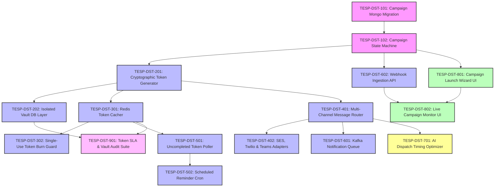

# FEAT-005: Multi-Channel Survey Distribution Engine — Engineering Backlog

| Metadata Field | Value |
|---|---|
| **Feature ID** | FEAT-005 |
| **Feature Title** | Multi-Channel Survey Distribution Engine |
| **Backlog Owner** | Lead Engineering Program Manager |
| **Target Architecture** | `DOC-001`, `DOC-002`, `DOC-003`, `DOC-005`, `FEAT-001` to `FEAT-005` |
| **Technology Stack** | Spring Boot 3.3+ (Java 21 Virtual Threads), React 19+ (Vite, TypeScript, Recharts), MongoDB Atlas, Isolated Vault DB, Redis 7.x, Apache Kafka, AWS SES, Twilio |
| **Total Story Points** | 80 Points |
| **Total Epics** | 9 Epics |
| **Target Sprints** | Sprints 3.1 – 4.1 (3 Two-Week Sprints) |

---

## 1. Capability Breakdown Matrix

| Capability ID | Capability Name | Target Requirements | Target Microservice / Layer | Component Primary Tech |
|---|---|---|---|---|
| **CAP-DST-01** | Campaign Persistence Metamodel | `FR-DST-007`, `DOC-003` | `survey-distribution-service` / DB | MongoDB `survey_campaigns` collection |
| **CAP-DST-02** | Cryptographic Token Vaulting | `FR-DST-002`, `FR-DST-004`, `BR-DST-002` | `survey-distribution-service` / Vault | HMAC-SHA256 + Isolated `tesp_vault_db` |
| **CAP-DST-03** | In-Memory Redis Token Caching | `FR-DST-003`, `SLA-DST-02` | `survey-distribution-service` / Cache | Redis 7.x (`tesp:tokens:<token>`) |
| **CAP-DST-04** | Multi-Channel Dispatch Router | `FR-DST-001` | `notification-service` / Dispatcher | AWS SES, Twilio, MS Teams Bot, Slack |
| **CAP-DST-05** | Non-Respondent Reminder Engine | `FR-DST-005`, `BR-DST-004` | `survey-distribution-service` / Cron | Scheduled Token State Poller |
| **CAP-DST-06** | Kafka Notification Queue & Webhooks | `FR-DST-006`, `FR-DST-008` | `notification-service` / Gateway | Apache Kafka + Webhook Ingestion |
| **CAP-DST-07** | AI Dispatch Timing Optimizer | `FEAT-005 Sec 20` | `survey-distribution-service` / AI | ML Engagement Hour Predictor |
| **CAP-DST-08** | Campaign Wizard & Monitor UI | `US-DST-001`, `UI-DST-01` | `tesp-admin-portal` / Web UI | React 19+, Recharts, TanStack Query |
| **CAP-DST-09** | Vault Isolation & Security Audit | `BR-DST-002`, `DOC-010` | Security & Compliance | Network ACL & IAM User Isolation |

---

## 2. Epic Hierarchy Structure

```
EPIC-DST-01: Campaign Persistence & MongoDB Metamodel (8 pts)
  ├── TESP-DST-101: MongoDB Campaign Collection Schema & Indexes (4 pts)
  └── TESP-DST-102: Campaign State Machine & Status Persistence (4 pts)

EPIC-DST-02: Cryptographic Token Generation & Vaulting Engine (14 pts)
  ├── TESP-DST-201: HMAC-SHA256 Token Generator & Kiosk PIN Allocator (6 pts)
  └── TESP-DST-202: Isolated Vault Database & Identity Decoupling Layer (8 pts)

EPIC-DST-03: In-Memory Redis Token Cache & TTL Management (8 pts)
  ├── TESP-DST-301: High-Speed Redis Token Cacher & Warm-Up Pipeline (4 pts)
  └── TESP-DST-302: Single-Use Token Expiry & Atomic Deletion Guard (4 pts)

EPIC-DST-04: Multi-Channel Dispatch Router (AWS SES / Twilio / MS Teams) (12 pts)
  ├── TESP-DST-401: Multi-Channel Message Router & Template Hydrator (6 pts)
  └── TESP-DST-402: AWS SES Email, Twilio SMS & MS Teams Adapters (6 pts)

EPIC-DST-05: Non-Respondent Automated Reminder Nudge Engine (10 pts)
  ├── TESP-DST-501: Uncompleted Token State Poller & Target Filter (5 pts)
  └── TESP-DST-502: Automated Scheduled Reminder Sequence Cron (5 pts)

EPIC-DST-06: Kafka Notification Dispatch Queue & Delivery Webhooks (8 pts)
  ├── TESP-DST-601: Kafka Notification Dispatch Queue Producer (4 pts)
  └── TESP-DST-602: AWS SES & Twilio Delivery Status Webhook Ingestion API (4 pts)

EPIC-DST-07: AI Dispatch Timing Optimizer (4 pts)
  └── TESP-DST-701: AI Optimal Recipient Dispatch Hour Predictor (4 pts)

EPIC-DST-08: React 19+ Campaign Launch Wizard & Live Monitor UI (12 pts)
  ├── TESP-DST-801: Multi-Step Campaign Launch Wizard Component (6 pts)
  └── TESP-DST-802: Real-Time Live Campaign Delivery & Participation Monitor (6 pts)

EPIC-DST-09: QA Security, Vault Isolation & Load Test Suite (4 pts)
  └── TESP-DST-901: 100k Token Generation SLA & Vault Security Audit Suite (4 pts)
```

---

## 3. Detailed Jira Engineering Tasks

### EPIC-DST-01: Campaign Persistence & MongoDB Metamodel

#### Task: TESP-DST-101
- **Summary**: Implement MongoDB Schema Validation & Indexes for `survey_campaigns` Collection
- **Issue Type**: Database Task / Migration
- **Component**: Database / MongoDB
- **Story Points**: 4 Points
- **Target Requirements**: `FR-DST-007`, `DOC-003`
- **Dependencies**: None (Root Task)
- **Implementation Notes**:
  - Create MongoDB migration script `src/main/resources/db/migration/v1_004_create_campaigns_collection.js`.
  - Implement JSON Schema validation enforcing required fields: `projectId`, `campaignId`, `surveyId`, `surveyVersion`, `anonymityLevel`, `channels`, `status`, `startDate`, `expirationDate`.
  - Create compound index `{ projectId: 1, campaignId: 1 }` and `{ projectId: 1, status: 1 }`.
- **Acceptance Criteria**:
  - [ ] Validates `anonymityLevel` against allowed enums (`AUTHENTICATED`, `SEMI_ANONYMOUS`, `FULLY_ANONYMOUS`, `KIOSK`).
  - [ ] Migration script executes statelessly via Mongock runner.

#### Task: TESP-DST-102
- **Summary**: Implement Campaign Lifecycle State Machine & Target Audience Selector
- **Issue Type**: Task
- **Component**: Backend / Core Logic
- **Story Points**: 4 Points
- **Target Requirements**: `FR-DST-007`, `VR-DST-001` to `004`
- **Dependencies**: `TESP-DST-101`
- **Implementation Notes**:
  - Implement Campaign State Machine (`DRAFT` $\rightarrow$ `SCHEDULED` $\rightarrow$ `ACTIVE` $\rightarrow$ `COMPLETED` / `EXPIRED`).
  - Implement target audience resolver fetching employee IDs based on Organization Node sub-tree materialized paths and demographic attribute filters.
- **Acceptance Criteria**:
  - [ ] Launching a campaign for node `N-301` resolves all descendant employees assigned to that node scope.

---

### EPIC-DST-02: Cryptographic Token Generation & Vaulting Engine

#### Task: TESP-DST-201
- **Summary**: Implement HMAC-SHA256 Token Generator & Kiosk 6-Digit PIN Allocator
- **Issue Type**: Task
- **Component**: Backend / Security Engine
- **Story Points**: 6 Points
- **Target Requirements**: `FR-DST-002`, `SLA-DST-01`
- **Dependencies**: `TESP-DST-102`
- **Implementation Notes**:
  - Implement `CryptographicTokenGenerator` using Java 21 Virtual Threads (Loom).
  - For Semi-Anonymous campaigns: Generate `token = HMAC-SHA256(employeeId + campaignSalt)`.
  - For Kiosk campaigns: Generate unique non-colliding 6-digit PIN numbers.
- **Acceptance Criteria**:
  - [ ] Generates 100,000 cryptographically hashed tokens in $< 3.5\text{ seconds}$.
  - [ ] Tokens generated for semi-anonymous campaigns cannot be reverse-engineered without the secret salt.

#### Task: TESP-DST-202
- **Summary**: Implement Isolated Vault Database & Identity Decoupling Layer
- **Issue Type**: Security Task / Database
- **Component**: Security & Vault Persistence
- **Story Points**: 8 Points
- **Target Requirements**: `FR-DST-004`, `BR-DST-002`
- **Dependencies**: `TESP-DST-201`
- **Implementation Notes**:
  - Create separate, access-restricted MongoDB database `tesp_vault_db` containing `identity_token_vault` collection.
  - Implement `VaultRepository`: Save `{ employeeId, token, campaignId }` mapping isolated from analytics database users.
  - Enforce IAM database credential isolation preventing analytics queries from referencing `tesp_vault_db`.
- **Acceptance Criteria**:
  - [ ] Identity-to-token mappings are stored strictly in `tesp_vault_db`.
  - [ ] Analytics Engine database credentials are explicitly denied read access to `tesp_vault_db`.

---

### EPIC-DST-03: In-Memory Redis Token Cache & TTL Management

#### Task: TESP-DST-301
- **Summary**: Implement High-Speed Redis Token Cacher & Warm-Up Pipeline
- **Issue Type**: Task
- **Component**: Backend / Cache
- **Story Points**: 4 Points
- **Target Requirements**: `FR-DST-003`, `SLA-DST-02`
- **Dependencies**: `TESP-DST-201`
- **Implementation Notes**:
  - During campaign launch, stream generated tokens into Redis: `SET tesp:tokens:<token>` with value `{ campaignId, nodeId, anonymityLevel }`.
  - Set key TTL matching campaign `expirationDate`.
- **Acceptance Criteria**:
  - [ ] Redis token lookup returns metadata payload in $< 1.5\text{ ms (p95)}$.
  - [ ] Tokens automatically expire in Redis upon reaching campaign `expirationDate`.

#### Task: TESP-DST-302
- **Summary**: Implement Single-Use Token Expiry & Atomic Deletion Guard
- **Issue Type**: Task
- **Component**: Backend / Redis Security
- **Story Points**: 4 Points
- **Target Requirements**: `BR-DST-001`, `BR-DST-003`, `TC-DST-001`
- **Dependencies**: `TESP-DST-301`
- **Implementation Notes**:
  - Implement Lua script in Redis for atomic token validation and deletion (`DEL tesp:tokens:<token>`).
  - Provide internal endpoint for `response-ingestion-service` to invoke single-use token burn.
- **Acceptance Criteria**:
  - [ ] Invoking Lua script deletes key in single atomic operation, preventing race conditions or double-submissions.

---

### EPIC-DST-04: Multi-Channel Dispatch Router (AWS SES / Twilio / MS Teams)

#### Task: TESP-DST-401
- **Summary**: Implement Multi-Channel Message Router & Template Hydrator
- **Issue Type**: Task
- **Component**: Backend / Dispatcher
- **Story Points**: 6 Points
- **Target Requirements**: `FR-DST-001`
- **Dependencies**: `TESP-DST-201`
- **Implementation Notes**:
  - Implement `DistributionChannelRouter` dispatching payloads based on selected channels (`EMAIL`, `SMS`, `KIOSK_PIN`, `TEAMS`, `SLACK`).
  - Hydrate message templates with recipient prompt dictionary and personalized single-use survey URL (`https://surveys.aitkenspence.com/p?t=<token>`).
- **Acceptance Criteria**:
  - [ ] Hydrates localized email/SMS template with recipient language and survey URL.

#### Task: TESP-DST-402
- **Summary**: Implement AWS SES Email, Twilio SMS & MS Teams Connector Adapters
- **Issue Type**: Task / Integration
- **Component**: Backend / Integrations
- **Story Points**: 6 Points
- **Target Requirements**: `FR-DST-001`
- **Dependencies**: `TESP-DST-401`
- **Implementation Notes**:
  - Implement `AwsSesEmailAdapter` using AWS Java SDK v2.
  - Implement `TwilioSmsAdapter` sending mobile SMS invitations.
  - Implement `MsTeamsBotAdapter` sending adaptive card notifications to employee Teams chats.
- **Acceptance Criteria**:
  - [ ] Email adapter dispatches survey invitations via AWS SES.
  - [ ] SMS adapter formats and transmits SMS via Twilio API.

---

### EPIC-DST-05: Non-Respondent Automated Reminder Nudge Engine

#### Task: TESP-DST-501
- **Summary**: Implement Uncompleted Token State Poller & Target Filter
- **Issue Type**: Task
- **Component**: Backend / Reminder Logic
- **Story Points**: 5 Points
- **Target Requirements**: `FR-DST-005`, `TC-DST-002`
- **Dependencies**: `TESP-DST-301`
- **Implementation Notes**:
  - Implement `ReminderTargetResolver`: Query Redis/Vault for tokens that remain unburned/uncompleted.
  - Filter out employees who have already submitted responses.
- **Acceptance Criteria**:
  - [ ] Target list for reminders contains strictly uncompleted tokens; 0 completed respondents receive reminder nudges.

#### Task: TESP-DST-502
- **Summary**: Implement Automated Scheduled Reminder Sequence Cron
- **Issue Type**: Task
- **Component**: Backend / Scheduler
- **Story Points**: 5 Points
- **Target Requirements**: `FR-DST-005`, `BR-DST-004`
- **Dependencies**: `TESP-DST-501`
- **Implementation Notes**:
  - Implement scheduled Quartz/Spring `@Scheduled` worker evaluating active campaign reminder schedules.
  - Enforce 24-hour spam guard frequency limit per recipient.
- **Acceptance Criteria**:
  - [ ] Dispatches scheduled reminder batch strictly on target reminder dates.
  - [ ] Blocks multiple dispatches to the same recipient within a 24-hour window.

---

### EPIC-DST-06: Kafka Notification Dispatch Queue & Delivery Webhooks

#### Task: TESP-DST-601
- **Summary**: Implement Kafka Notification Dispatch Queue Producer
- **Issue Type**: Event Implementation Task
- **Component**: Backend / Messaging
- **Story Points**: 4 Points
- **Target Requirements**: `FR-DST-006`, `DOC-002`
- **Dependencies**: `TESP-DST-401`
- **Implementation Notes**:
  - Publish notification dispatch payloads to Kafka topic `tesp.notifications.queue.v1`.
  - Rate-limited notification consumers process messages without exceeding provider API rate limits.
- **Acceptance Criteria**:
  - [ ] Campaign launch enqueues notification payloads to Kafka with partition key `projectId`.

#### Task: TESP-DST-602
- **Summary**: Implement AWS SES & Twilio Delivery Status Webhook Ingestion API
- **Issue Type**: API Implementation Task
- **Component**: Backend / Webhooks
- **Story Points**: 4 Points
- **Target Requirements**: `FR-DST-008`
- **Dependencies**: `TESP-DST-102`
- **Implementation Notes**:
  - Implement `POST /api/v1/webhooks/aws-ses` and `POST /api/v1/webhooks/twilio`.
  - Process delivery, open, and bounce webhooks; atomically increment campaign metric counters (`delivered`, `opened`, `bounced`).
- **Acceptance Criteria**:
  - [ ] Receiving AWS SES bounce webhook increments `bounced` metric counter on target campaign.

---

### EPIC-DST-07: AI Dispatch Timing Optimizer

#### Task: TESP-DST-701
- **Summary**: Implement AI Optimal Recipient Dispatch Hour Predictor
- **Issue Type**: AI Task / Optimization
- **Component**: AI Service
- **Story Points**: 4 Points
- **Target Requirements**: `FEAT-005 Sec 20`
- **Dependencies**: `TESP-DST-401`
- **Implementation Notes**:
  - Implement `DispatchTimingOptimizer`: Analyze historical email/Teams open timestamps per department node, calculating peak engagement hour (e.g., Tuesday 09:15 AM).
  - Expose API `GET /api/v1/campaigns/optimal-dispatch-time`.
- **Acceptance Criteria**:
  - [ ] Returns recommended campaign launch timestamp per department node.

---

### EPIC-DST-08: React 19+ Campaign Launch Wizard & Live Monitor UI

#### Task: TESP-DST-801
- **Summary**: Build Multi-Step Campaign Launch Wizard Component
- **Issue Type**: Frontend Task
- **Component**: Frontend / React 19+ Vite
- **Story Points**: 6 Points
- **Target Requirements**: `US-DST-001`, `US-DST-003`, `UI-DST-01`
- **Dependencies**: `TESP-DST-102`
- **Implementation Notes**:
  - Create React component `src/components/campaign/CampaignWizardModal.tsx`.
  - Step 1: Survey Version & Anonymity Tier selection.
  - Step 2: Target Audience Node & Demographic Filter picker.
  - Step 3: Multi-channel configuration (Email preview, SMS composer, Teams bot setup).
  - Step 4: Schedule & Reminder configurator.
- **Acceptance Criteria**:
  - [ ] Multi-step wizard validates channel inputs and triggers campaign launch API.

#### Task: TESP-DST-802
- **Summary**: Build Real-Time Live Campaign Delivery & Participation Monitor Component
- **Issue Type**: Frontend Task
- **Component**: Frontend / React 19+ Vite
- **Story Points**: 6 Points
- **Target Requirements**: `US-DST-004`, `UI-DST-01`
- **Dependencies**: `TESP-DST-801`, `TESP-DST-602`
- **Implementation Notes**:
  - Create dashboard component `src/components/campaign/LiveCampaignMonitor.tsx`.
  - Render real-time gauge meters for Participation %, Delivery %, Open %, Bounce %.
  - Render live progress bar matrix showing completion rates by department.
- **Acceptance Criteria**:
  - [ ] Gauge charts update live as webhook counter API updates occur.

---

### EPIC-DST-09: QA Security, Vault Isolation & Load Test Suite

#### Task: TESP-DST-901
- **Summary**: Build 100k Token Generation SLA & Vault Security Audit Suite
- **Issue Type**: QA Task
- **Component**: QA & Automated Testing
- **Story Points**: 4 Points
- **Target Requirements**: `DOC-012`, `TC-DST-001`, `TC-DST-002`, `SLA-DST-01`, `SLA-DST-02`
- **Dependencies**: `TESP-DST-202`, `TESP-DST-301`, `TESP-DST-802`
- **Implementation Notes**:
  - Unit test verifying token vault isolation and un-linkability (`TC-DST-001`).
  - k6 load test script generating 100,000 tokens measuring generation and Redis caching duration.
- **Acceptance Criteria**:
  - [ ] 100,000 token generation load test completes in $< 3.5\text{ seconds}$.
  - [ ] Vault isolation audit verifies 0 direct join routes between analytics DB and vault DB.

---

## 4. Visual Dependency Graph



---

## 5. Release Sequencing & Sprint Allocation

### Sprint 3.1: Campaign Persistence & Token Vaulting Engine (Total: 26 Points)
- **Focus**: MongoDB schemas, HMAC token generator, Vault DB isolation, Redis token caching.
- **Tasks**:
  - `TESP-DST-101`: Campaign Mongo Migration (4 pts)
  - `TESP-DST-102`: Campaign State Machine (4 pts)
  - `TESP-DST-201`: Cryptographic Token Generator (6 pts)
  - `TESP-DST-202`: Isolated Vault DB Layer (8 pts)
  - `TESP-DST-301`: Redis Token Cacher (4 pts)

---

### Sprint 3.2: Multi-Channel Router, Reminder Engine & Webhooks (Total: 27 Points)
- **Focus**: Channel router, AWS SES/Twilio adapters, Reminder sequence cron, Delivery webhooks, AI timing optimizer.
- **Tasks**:
  - `TESP-DST-302`: Single-Use Token Burn Guard (4 pts)
  - `TESP-DST-401`: Multi-Channel Message Router (6 pts)
  - `TESP-DST-402`: SES, Twilio & Teams Adapters (6 pts)
  - `TESP-DST-501`: Uncompleted Token Poller (5 pts)
  - `TESP-DST-601`: Kafka Notification Queue (4 pts)
  - `TESP-DST-701`: AI Dispatch Timing Optimizer (4 pts)

---

### Sprint 4.1: Campaign UI, Reminder Automation & QA (Total: 27 Points)
- **Focus**: Launch wizard UI, Live delivery monitor dashboard, Scheduled reminder cron, Delivery webhooks, Vault load tests.
- **Tasks**:
  - `TESP-DST-502`: Scheduled Reminder Cron (5 pts)
  - `TESP-DST-602`: Webhook Ingestion API (4 pts)
  - `TESP-DST-801`: Campaign Launch Wizard UI (6 pts)
  - `TESP-DST-802`: Live Campaign Monitor UI (6 pts)
  - `TESP-DST-901`: Token SLA & Vault Audit Suite (4 pts)

---

## Document Status

| Field | Value |
|---|---|
| **Document Status** | Approved / Ready for Jira Import |
| **Target Feature** | `FEAT-005: Multi-Channel Survey Distribution Engine` |
| **Total Story Points** | 80 Story Points |
| **Dependencies Satisfied** | `DOC-001` to `DOC-005`, `FEAT-001` to `FEAT-005` |
| **Next Recommended Backlog** | `FEAT-006-RESPONSE-INTAKE-BACKLOG.md` |
