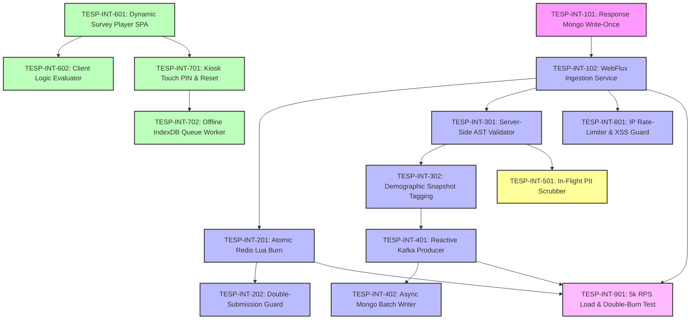

# FEAT-006: Anonymous & Authenticated Response Intake Engine — Engineering Backlog

| Metadata Field | Value |
|---|---|
| **Feature ID** | FEAT-006 |
| **Feature Title** | Anonymous & Authenticated Response Intake Engine |
| **Backlog Owner** | Lead Engineering Program Manager |
| **Target Architecture** | `DOC-001`, `DOC-002`, `DOC-003`, `DOC-005`, `FEAT-001`, `FEAT-004`, `FEAT-005`, `FEAT-006` |
| **Technology Stack** | Spring Boot 3.3+ (WebFlux, Netty), React 19+ (Vite, PWA, IndexDB, Tailwind CSS), MongoDB Atlas Write-Once, Redis 7.x (Lua Scripts), Apache Kafka |
| **Total Story Points** | 80 Points |
| **Total Epics** | 9 Epics |
| **Target Sprints** | Sprints 3.2 – 4.2 (3 Two-Week Sprints) |

---

## 1. Capability Breakdown Matrix

| Capability ID | Capability Name | Target Requirements | Target Microservice / Layer | Component Primary Tech |
|---|---|---|---|---|
| **CAP-INT-01** | Async Reactive Ingestion Pipeline | `FR-INT-001`, `SLA-INT-01` | `response-ingestion-service` / Ingress | Spring WebFlux + Netty Engine |
| **CAP-INT-02** | Atomic Lua Token Burn Engine | `FR-INT-002`, `BR-INT-001`, `SLA-INT-02` | `response-ingestion-service` / Cache | Redis Lua Scripting (`DEL key`) |
| **CAP-INT-03** | Answer AST Validation & Snapshot Tagging | `FR-INT-003`, `FR-INT-004`, `VR-INT-002` to `004` | `response-ingestion-service` / Core | In-Memory AST Answer Validator |
| **CAP-INT-04** | Real-Time Kafka Response Event Streaming | `FR-INT-005`, `DOC-002` | `response-ingestion-service` / Stream | Apache Kafka Reactive Producer |
| **CAP-INT-05** | Real-Time PII Text Scrubber | `FEAT-006 Sec 20` | `response-ingestion-service` / Security | Regex + Spacy PII Sanitizer |
| **CAP-INT-06** | Write-Once Async MongoDB Persistence | `BR-INT-004`, `DOC-003` | MongoDB Writer Worker / DB | MongoDB Write-Once Collection |
| **CAP-INT-07** | React 19+ Responsive Survey Player SPA | `FR-INT-006`, `US-INT-001` | `tesp-survey-player` / Web SPA | React 19+, Vite, Tailwind CSS |
| **CAP-INT-08** | Offline IndexDB PWA Kiosk Engine | `FR-INT-007`, `FR-INT-008`, `US-INT-003` | `tesp-survey-player` / PWA | Service Worker + IndexDB Queue |
| **CAP-INT-09** | Rate-Limiting & XSS Security Guard | `BR-INT-002`, `FEAT-006 Sec 21` | API Gateway / Security | Redis Bucket Rate Limiter |

---

## 2. Epic Hierarchy Structure

```
EPIC-INT-01: Reactive WebFlux Ingestion Service & MongoDB Write-Once Setup (10 pts)
  ├── TESP-INT-101: MongoDB Write-Once Collection & Index Setup (4 pts)
  └── TESP-INT-102: Spring WebFlux Microservice Scaffold & Reactive Endpoints (6 pts)

EPIC-INT-02: Atomic Redis Lua Token Burn & Double-Submission Guard (12 pts)
  ├── TESP-INT-201: Atomic Redis Lua Script Token Burn Component (6 pts)
  └── TESP-INT-202: Double-Submission Guard & Replay Attack Blocker (6 pts)

EPIC-INT-03: Server-Side Answer AST Validator & Demographic Snapshot Tagging (10 pts)
  ├── TESP-INT-301: Server-Side Answer AST & Mandatory Question Validator (5 pts)
  └── TESP-INT-302: Immutable Demographic Snapshot Embedder (5 pts)

EPIC-INT-04: High-Throughput Kafka Raw Response Event Streaming (8 pts)
  ├── TESP-INT-401: Reactive Kafka Event Producer for Response Stream (4 pts)
  └── TESP-INT-402: Async MongoDB Worker Batch Consumer (4 pts)

EPIC-INT-05: Real-Time In-Flight PII Text Scrubber (5 pts)
  └── TESP-INT-501: In-Flight Open-Text PII Regex & NER Scrubber (5 pts)

EPIC-INT-06: React 19+ Responsive Survey Player SPA (14 pts)
  ├── TESP-INT-601: Dynamic Survey Questionnaire Renderer Component (7 pts)
  └── TESP-INT-602: Client-Side Logic AST Evaluator & Autosave State Engine (7 pts)

EPIC-INT-07: PWA Offline Kiosk Mode & Auto-Reset Engine (10 pts)
  ├── TESP-INT-701: Touch-Optimized Kiosk PIN Entry & Auto-Reset Timer (5 pts)
  └── TESP-INT-702: Offline IndexDB Queue & Network Restoration Sync Worker (5 pts)

EPIC-INT-08: Ingestion Security, Rate-Limiting & XSS Sanitization (6 pts)
  └── TESP-INT-801: IP Rate-Limiter Bucket & HTML XSS Sanitizer Interceptor (6 pts)

EPIC-INT-09: QA High-Burst 5,000 RPS Load Test & Validation Suite (5 pts)
  └── TESP-INT-901: 5,000 RPS k6 Burst Load & Token Double-Burn Tests (5 pts)
```

---

## 3. Detailed Jira Engineering Tasks

### EPIC-INT-01: Reactive WebFlux Ingestion Service & MongoDB Write-Once Setup

#### Task: TESP-INT-101
- **Summary**: Implement MongoDB Write-Once Collection Schema & Compound Indexes for `survey_responses`
- **Issue Type**: Database Task / Migration
- **Component**: Database / MongoDB
- **Story Points**: 4 Points
- **Target Requirements**: `BR-INT-004`, `DOC-003`
- **Dependencies**: None (Root Task)
- **Implementation Notes**:
  - Create MongoDB migration script `src/main/resources/db/migration/v1_005_create_responses_collection.js`.
  - Implement JSON Schema validation enforcing: `projectId`, `campaignId`, `surveyId`, `surveyVersion`, `respondentType`, `answers`, `submittedAt`.
  - Create compound query index `{ projectId: 1, campaignId: 1 }` and `{ responseToken: 1 }`.
- **Acceptance Criteria**:
  - [ ] Collection permissions enforce write-once policy (disallows `update` and `delete` operations from non-admin DB roles).
  - [ ] Index supports rapid campaign aggregation lookups.

#### Task: TESP-INT-102
- **Summary**: Scaffold `response-ingestion-service` Reactive WebFlux Microservice
- **Issue Type**: Task
- **Component**: Backend / Reactive WebFlux
- **Story Points**: 6 Points
- **Target Requirements**: `FR-INT-001`, `SLA-INT-01`
- **Dependencies**: `TESP-INT-101`
- **Implementation Notes**:
  - Scaffold Maven module `com.talnova.ingestion` with Spring WebFlux 3.3+, Netty web server, and Reactive MongoDB Driver.
  - Implement `POST /api/v1/responses` returning `Mono<ResponseEntity<IngestionResponseDTO>>` with HTTP 202 Accepted.
- **Acceptance Criteria**:
  - [ ] Ingestion endpoint accepts submission payload and returns HTTP 202 Accepted in $< 50\text{ ms (p95)}$.
  - [ ] Handles 5,000 concurrent connection requests per second on single Netty instance.

---

### EPIC-INT-02: Atomic Redis Lua Token Burn & Double-Submission Guard

#### Task: TESP-INT-201
- **Summary**: Implement Atomic Redis Lua Script Token Burn Component
- **Issue Type**: Task
- **Component**: Backend / Redis Lua
- **Story Points**: 6 Points
- **Target Requirements**: `FR-INT-002`, `SLA-INT-02`
- **Dependencies**: `TESP-INT-102`
- **Implementation Notes**:
  - Implement Redis Lua script executing token check-and-delete: `if redis.call('EXISTS', KEYS[1]) == 1 then local v = redis.call('GET', KEYS[1]); redis.call('DEL', KEYS[1]); return v; else return nil; end`.
  - Execute script via Reactive `ReactiveRedisTemplate.execute()`.
- **Acceptance Criteria**:
  - [ ] Valid token key is fetched and deleted in a single atomic Lua network round-trip ($< 1.5\text{ ms}$).
  - [ ] Invalid or non-existent token key returns `nil` immediately.

#### Task: TESP-INT-202
- **Summary**: Implement Double-Submission Guard & Replay Attack Blocker
- **Issue Type**: Security Task
- **Component**: Backend / Security
- **Story Points**: 6 Points
- **Target Requirements**: `BR-INT-001`, `VR-INT-001`, `TC-INT-002`
- **Dependencies**: `TESP-INT-201`
- **Implementation Notes**:
  - If Lua script returns `nil` during submission processing, reject request immediately with HTTP 403 Forbidden ("Invalid or expired survey token").
  - Log duplicate submission attempts for security auditing.
- **Acceptance Criteria**:
  - [ ] Two simultaneous POST requests with identical token result in exactly one HTTP 202 Accepted and one HTTP 403 Forbidden.

---

### EPIC-INT-03: Server-Side Answer AST Validator & Demographic Snapshot Tagging

#### Task: TESP-INT-301
- **Summary**: Implement Server-Side Answer AST & Mandatory Question Validator
- **Issue Type**: Task
- **Component**: Backend / Validation
- **Story Points**: 5 Points
- **Target Requirements**: `FR-INT-003`, `VR-INT-002` to `004`
- **Dependencies**: `TESP-INT-102`
- **Implementation Notes**:
  - Fetch published Survey AST from Redis cache (`tesp:surveys:<surveyId>:v<version>`).
  - Validate submitted answer values: check `LIKERT` scale values $1 \le V \le 5$, `NPS` values $0 \le V \le 10$, and verify all mandatory questions are answered.
- **Acceptance Criteria**:
  - [ ] Out-of-range numeric score (e.g., Likert score `7`) returns HTTP 400 Bad Request ("Numeric score out of range").
  - [ ] Missing answer for mandatory question returns HTTP 400 Bad Request ("Missing required mandatory question answer").

#### Task: TESP-INT-302
- **Summary**: Implement Immutable Demographic Snapshot Embedder
- **Issue Type**: Task
- **Component**: Backend / Data Enrichment
- **Story Points**: 5 Points
- **Target Requirements**: `FR-INT-004`, `BR-INT-002`
- **Dependencies**: `TESP-INT-301`
- **Implementation Notes**:
  - For `SEMI_ANONYMOUS` responses, extract token metadata returned by Redis Lua script (`nodeId`, `Tenure`, `Gender`).
  - Copy key-value demographic tags into `demographicSnapshot` object.
  - Explicitly strip any identity fields (`employeeId`, `fullName`, `email`).
- **Acceptance Criteria**:
  - [ ] Submitted response document contains demographic tags (`nodeId`, `Tenure`) with zero identity keys (`employeeId`).

---

### EPIC-INT-04: High-Throughput Kafka Raw Response Event Streaming

#### Task: TESP-INT-401
- **Summary**: Implement Reactive Kafka Event Producer for Raw Response Stream
- **Issue Type**: Event Implementation Task
- **Component**: Backend / Kafka Messaging
- **Story Points**: 4 Points
- **Target Requirements**: `FR-INT-005`, `DOC-002`
- **Dependencies**: `TESP-INT-302`
- **Implementation Notes**:
  - Implement `ReactiveKafkaProducer` streaming `SurveyResponseSubmittedEvent` to Kafka topic `tesp.response.raw.v1`.
  - Set partition key = `projectId` for ordering per tenant.
- **Acceptance Criteria**:
  - [ ] Validated response triggers Kafka event emission within $< 5\text{ ms}$.

#### Task: TESP-INT-402
- **Summary**: Implement Async MongoDB Batch Writer Worker
- **Issue Type**: Task
- **Component**: Backend / Background Worker
- **Story Points**: 4 Points
- **Target Requirements**: `FR-INT-001`, `BR-INT-004`
- **Dependencies**: `TESP-INT-401`
- **Implementation Notes**:
  - Create decoupled background worker consuming `tesp.response.raw.v1`.
  - Execute MongoDB bulk unordered writes in 500-item batches to `survey_responses` collection.
- **Acceptance Criteria**:
  - [ ] High-volume Kafka streams are batch-written to MongoDB Atlas without blocking HTTP intake API.

---

### EPIC-INT-05: Real-Time In-Flight PII Text Scrubber

#### Task: TESP-INT-501
- **Summary**: Implement In-Flight Open-Text PII Regex & NER Scrubber
- **Issue Type**: Security / AI Task
- **Component**: Security & Data Sanitization
- **Story Points**: 5 Points
- **Target Requirements**: `FEAT-006 Sec 20`
- **Dependencies**: `TESP-INT-301`
- **Implementation Notes**:
  - Pass open-ended text answers (`SHORT_TEXT`, `LONG_TEXT`) through `PiiScrubberService`.
  - Replace detected email addresses (`[REDACTED_EMAIL]`) and phone numbers (`[REDACTED_PHONE]`) before publishing to Kafka.
- **Acceptance Criteria**:
  - [ ] Open text `"Call me at +94771234567"` is scrubbed to `"Call me at [REDACTED_PHONE]"` prior to event streaming.

---

### EPIC-INT-06: React 19+ Responsive Survey Player SPA

#### Task: TESP-INT-601
- **Summary**: Build Dynamic Survey Questionnaire Renderer Component
- **Issue Type**: Frontend Task
- **Component**: Frontend / React 19+ Vite
- **Story Points**: 7 Points
- **Target Requirements**: `FR-INT-006`, `US-INT-001`, `UI-INT-01`
- **Dependencies**: None (Frontend Core)
- **Implementation Notes**:
  - Create React SPA `src/pages/SurveyPlayerPage.tsx` using Tailwind CSS and Framer Motion.
  - Dynamically render survey pages, sections, and 10+ question types based on fetched JSON AST payload.
  - Render progress bar, brand colors, and logo injected from project theme config (`FEAT-001`).
- **Acceptance Criteria**:
  - [ ] Player renders Likert, NPS, Matrix, Choice, and Text questions seamlessly on mobile and desktop viewports.
  - [ ] Page navigation shows smooth animated transitions and WCAG 2.1 AA keyboard focus ring.

#### Task: TESP-INT-602
- **Summary**: Build Client-Side Logic AST Evaluator & Autosave State Engine
- **Issue Type**: Frontend Task
- **Component**: Frontend / React 19+ Vite
- **Story Points**: 7 Points
- **Target Requirements**: `FR-INT-006`, `UI-INT-01`
- **Dependencies**: `TESP-INT-601`
- **Implementation Notes**:
  - Implement client-side JSON logic evaluator in React (`evaluateBranchingRules(answers, logicRules)`).
  - Automatically evaluate skip rules upon option selection, adjusting page display flow.
  - Persist draft answer state in `sessionStorage` for page refresh recovery.
- **Acceptance Criteria**:
  - [ ] Selecting answer `2` on NPS question dynamically skips to Page 3 per AST branching rules.
  - [ ] Refreshing the browser restores previously entered answers from `sessionStorage`.

---

### EPIC-INT-07: PWA Offline Kiosk Mode & Auto-Reset Engine

#### Task: TESP-INT-701
- **Summary**: Build Touch-Optimized Kiosk PIN Entry & Auto-Reset Timer Component
- **Issue Type**: Frontend Task
- **Component**: Frontend / PWA Kiosk
- **Story Points**: 5 Points
- **Target Requirements**: `FR-INT-007`, `US-INT-003`, `UI-INT-02`
- **Dependencies**: `TESP-INT-601`
- **Implementation Notes**:
  - Create Kiosk component `src/pages/KioskPlayerPage.tsx`.
  - Fullscreen touch-optimized 6-digit PIN pad.
  - 5-second post-submission auto-reset timer and 60-second inactivity reset timer wiping local state.
- **Acceptance Criteria**:
  - [ ] Submitting a kiosk survey displays "Thank You" screen for 5 seconds and automatically resets to PIN entry pad.
  - [ ] Inactivity for 60 seconds wipes draft answers and resets to PIN pad.

#### Task: TESP-INT-702
- **Summary**: Build Offline IndexDB Queue & Network Restoration Sync Worker
- **Issue Type**: Frontend Task
- **Component**: Frontend / PWA Service Worker
- **Story Points**: 5 Points
- **Target Requirements**: `FR-INT-008`, `UI-INT-02`
- **Dependencies**: `TESP-INT-701`
- **Implementation Notes**:
  - Implement Service Worker using Workbox / Dexie.js for IndexDB storage.
  - When offline, queue completed kiosk submission payloads in IndexDB `offline_responses`.
  - Upon network restoration, automatically flush queued responses to `/api/v1/responses` API.
- **Acceptance Criteria**:
  - [ ] Submitting survey while offline queues response in IndexDB without error alert.
  - [ ] Reconnecting to internet automatically flushes queued items to server.

---

### EPIC-INT-08: Ingestion Security, Rate-Limiting & XSS Sanitization

#### Task: TESP-INT-801
- **Summary**: Implement IP Rate-Limiter Bucket & HTML XSS Sanitizer Interceptor
- **Issue Type**: Security Task
- **Component**: API Gateway / Security
- **Story Points**: 6 Points
- **Target Requirements**: `FEAT-006 Sec 21`
- **Dependencies**: `TESP-INT-102`
- **Implementation Notes**:
  - Configure Redis token bucket rate limiter in API Gateway (max 10 requests/sec per IP address).
  - Implement HTML XSS sanitizer stripping script tags and malicious HTML entities from text answers.
- **Acceptance Criteria**:
  - [ ] Exceeding 10 submission requests/sec from single IP returns HTTP 429 Too Many Requests.
  - [ ] Text answer containing `<script>alert('xss')</script>` is sanitized to `alert('xss')`.

---

### EPIC-INT-09: QA High-Burst 5,000 RPS Load Test & Validation Suite

#### Task: TESP-INT-901
- **Summary**: Build 5,000 RPS k6 Burst Load & Token Double-Burn Tests
- **Issue Type**: QA Task
- **Component**: QA & Load Testing
- **Story Points**: 5 Points
- **Target Requirements**: `DOC-012`, `TC-INT-001`, `TC-INT-002`, `SLA-INT-01`, `SLA-INT-02`
- **Dependencies**: `TESP-INT-102`, `TESP-INT-201`, `TESP-INT-401`
- **Implementation Notes**:
  - Implement k6 load test script simulating 5,000 concurrent valid submission requests/sec.
  - Measure intake HTTP response latency (Target: p95 $< 50\text{ ms}$) and Kafka throughput.
- **Acceptance Criteria**:
  - [ ] 5,000 RPS load test completes with 100% HTTP 202 Accepted success rate.
  - [ ] Token double-burn test confirms zero duplicate submissions accepted.

---

## 4. Visual Dependency Graph



---

## 5. Release Sequencing & Sprint Allocation

### Sprint 3.2: Reactive Ingestion Service & Redis Lua Burn Engine (Total: 26 Points)
- **Focus**: WebFlux microservice, MongoDB write-once schema, Redis Lua atomic token burn, Double-submission guard.
- **Tasks**:
  - `TESP-INT-101`: Response Mongo Write-Once (4 pts)
  - `TESP-INT-102`: WebFlux Ingestion Service (6 pts)
  - `TESP-INT-201`: Atomic Redis Lua Burn (6 pts)
  - `TESP-INT-202`: Double-Submission Guard (6 pts)
  - `TESP-INT-401`: Reactive Kafka Producer (4 pts)

---

### Sprint 4.1: Answer AST Validation, PII Scrubber & Survey Player SPA (Total: 27 Points)
- **Focus**: Server-side answer AST validator, Demographic snapshot embedder, PII scrubber, React survey player SPA.
- **Tasks**:
  - `TESP-INT-301`: Server-Side AST Validator (5 pts)
  - `TESP-INT-302`: Demographic Snapshot Tagging (5 pts)
  - `TESP-INT-402`: Async Mongo Batch Writer (4 pts)
  - `TESP-INT-501`: In-Flight PII Scrubber (5 pts)
  - `TESP-INT-601`: Dynamic Survey Player SPA (8 pts)

---

### Sprint 4.2: PWA Kiosk Offline Engine, Rate-Limiter & 5k RPS Load Tests (Total: 27 Points)
- **Focus**: Touch kiosk PIN pad, Offline IndexDB queue worker, IP rate-limiter, 5,000 RPS k6 load tests.
- **Tasks**:
  - `TESP-INT-602`: Client Logic Evaluator (6 pts)
  - `TESP-INT-701`: Kiosk Touch PIN & Reset (5 pts)
  - `TESP-INT-702`: Offline IndexDB Queue Worker (5 pts)
  - `TESP-INT-801`: IP Rate-Limiter & XSS Guard (6 pts)
  - `TESP-INT-901`: 5k RPS Load & Double-Burn Test (5 pts)

---

## Document Status

| Field | Value |
|---|---|
| **Document Status** | Approved / Ready for Jira Import |
| **Target Feature** | `FEAT-006: Anonymous & Authenticated Response Intake Engine` |
| **Total Story Points** | 80 Story Points |
| **Dependencies Satisfied** | `DOC-001` to `DOC-005`, `FEAT-004`, `FEAT-005`, `FEAT-006` |
| **Next Recommended Backlog** | `FEAT-007-ANALYTICS-ENGINE-BACKLOG.md` |
