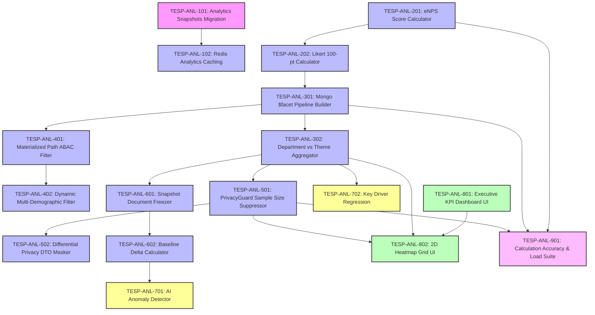

# FEAT-007: Real-Time Engagement Analytics & Heatmap Engine — Engineering Backlog

| Metadata Field | Value |
|---|---|
| **Feature ID** | FEAT-007 |
| **Feature Title** | Real-Time Engagement Analytics & Heatmap Engine |
| **Backlog Owner** | Lead Engineering Program Manager |
| **Target Architecture** | `DOC-001`, `DOC-002`, `DOC-003`, `DOC-004`, `DOC-006`, `FEAT-001`, `FEAT-002`, `FEAT-006`, `FEAT-007` |
| **Technology Stack** | Spring Boot 3.3+ (Java 21 Virtual Threads), React 19+ (Vite, Recharts, Tailwind CSS), MongoDB Atlas Faceted Aggregations, Redis 7.x, Apache Kafka |
| **Total Story Points** | 82 Points |
| **Total Epics** | 9 Epics |
| **Target Sprints** | Sprints 4.1 – 5.1 (3 Two-Week Sprints) |

---

## 1. Capability Breakdown Matrix

| Capability ID | Capability Name | Target Requirements | Target Microservice / Layer | Component Primary Tech |
|---|---|---|---|---|
| **CAP-ANL-01** | Analytical Snapshot Metamodel | `FR-ANL-007`, `DOC-003` | `analytics-engine-service` / DB | MongoDB `analytical_snapshots` collection |
| **CAP-ANL-02** | eNPS & 100-Point Scoring Engine | `FR-ANL-001`, `FR-ANL-002`, `DOC-006` | `analytics-engine-service` / Core | Java 21 Quantitative Scoring Calculator |
| **CAP-ANL-03** | 2D Organizational Heatmap Pipeline | `FR-ANL-003`, `DOC-006` | `analytics-engine-service` / Aggregation | MongoDB `$facet` Aggregation Pipeline |
| **CAP-ANL-04** | Multi-Dimensional Slicing & ABAC Scope | `FR-ANL-005`, `VR-ANL-002`, `004` | `analytics-engine-service` / Router | Materialized Path `$regex` ABAC Filter |
| **CAP-ANL-05** | Sample Size Anonymity Guard | `FR-ANL-004`, `BR-ANL-001`, `TC-ANL-002` | `analytics-engine-service` / Privacy | PrivacyGuard Suppressor ($N < 5$) |
| **CAP-ANL-06** | Snapshot Freezer & Baseline Trends | `FR-ANL-007`, `FR-ANL-008`, `BR-ANL-003` | `analytics-engine-service` / History | Snapshot Document Freezer & Delta Comp |
| **CAP-ANL-07** | AI Anomaly & Key Driver Analyzer | `FEAT-007 Sec 20` | `analytics-engine-service` / AI | Linear Regression & Anomaly Detector |
| **CAP-ANL-08** | Executive Dashboard & Heatmap UI | `US-ANL-001`, `US-ANL-002`, `UI-ANL-01` | `tesp-admin-portal` / Web UI | React 19+, Recharts, TanStack Table |
| **CAP-ANL-09** | Redis Analytics Caching | `FR-ANL-006`, `SLA-ANL-01` | `analytics-engine-service` / Cache | Redis 7.x (`tesp:analytics:<filterHash>`) |

---

## 2. Epic Hierarchy Structure

```
EPIC-ANL-01: Analytical Persistence Metamodel & MongoDB Indexing (8 pts)
  ├── TESP-ANL-101: MongoDB Analytical Snapshots Collection & Index Setup (4 pts)
  └── TESP-ANL-102: Redis Analytics Caching & Throttled Invalidation Setup (4 pts)

EPIC-ANL-02: Quantitative Score Aggregation Engine (eNPS & Likert 100-pt) (12 pts)
  ├── TESP-ANL-201: eNPS Score Calculator Component (-100 to +100) (6 pts)
  └── TESP-ANL-202: Normalized Likert 100-Point Engagement Index Calculator (6 pts)

EPIC-ANL-03: 2D Organizational Heatmap Cross-Tabulation Pipeline (12 pts)
  ├── TESP-ANL-301: MongoDB $facet Cross-Tabulation Pipeline Builder (6 pts)
  └── TESP-ANL-302: Department vs Question Group Theme Aggregator (6 pts)

EPIC-ANL-04: Dynamic Multi-Dimensional Slicing & Materialized Path ABAC (10 pts)
  ├── TESP-ANL-401: Materialized Path Sub-Tree Prefix Matching ABAC Filter (5 pts)
  └── TESP-ANL-402: Multi-Demographic Attribute Dynamic Filter Compiler (5 pts)

EPIC-ANL-05: Sample Size Anonymity Guard (N < 5) & Suppression Filter (8 pts)
  ├── TESP-ANL-501: PrivacyGuard Sample Size Suppressor Interceptor (4 pts)
  └── TESP-ANL-502: Differential Privacy Data Masker for REST Payloads (4 pts)

EPIC-ANL-06: Point-in-Time Analytical Snapshot Freezer & Baseline Trend Engine (8 pts)
  ├── TESP-ANL-601: Campaign Closure Snapshot Document Freezer (4 pts)
  └── TESP-ANL-602: Longitudinal Baseline Score Delta Calculator (4 pts)

EPIC-ANL-07: AI Trend Anomaly Detector & Key Driver Regression Analyzer (6 pts)
  ├── TESP-ANL-701: AI Score Drop Anomaly Detector Service (3 pts)
  └── TESP-ANL-702: Multiple Linear Regression Key Driver Analyzer (3 pts)

EPIC-ANL-08: React 19+ Executive Dashboard & 2D Interactive Heatmap UI (14 pts)
  ├── TESP-ANL-801: Executive KPI Scorecard & Trend Chart Components (7 pts)
  └── TESP-ANL-802: Interactive 2D Organizational Heatmap Grid Component (7 pts)

EPIC-ANL-09: QA Calculation Accuracy & Performance Load Test Suite (4 pts)
  └── TESP-ANL-901: eNPS Accuracy & 100k Response Aggregation Load Tests (4 pts)
```

---

## 3. Detailed Jira Engineering Tasks

### EPIC-ANL-01: Analytical Persistence Metamodel & MongoDB Indexing

#### Task: TESP-ANL-101
- **Summary**: Implement MongoDB Schema Validation & Indexes for `analytical_snapshots` Collection
- **Issue Type**: Database Task / Migration
- **Component**: Database / MongoDB
- **Story Points**: 4 Points
- **Target Requirements**: `FR-ANL-007`, `DOC-003`
- **Dependencies**: None (Root Task)
- **Implementation Notes**:
  - Create MongoDB migration script `src/main/resources/db/migration/v1_006_create_analytics_snapshots.js`.
  - Implement JSON Schema validation enforcing required fields: `projectId`, `campaignId`, `surveyId`, `snapshotDate`, `totalResponses`, `overallEnps`, `overallEngagementIndex`, `nodeAggregates`.
  - Create compound index `{ projectId: 1, campaignId: 1 }` and `{ projectId: 1, snapshotDate: -1 }`.
- **Acceptance Criteria**:
  - [ ] Schema validates node aggregate status enums (`VALID`, `SUPPRESSED`).
  - [ ] Index supports baseline trend comparison queries.

#### Task: TESP-ANL-102
- **Summary**: Implement Redis Analytics Caching & Throttled Invalidation Setup
- **Issue Type**: Task
- **Component**: Backend / Cache
- **Story Points**: 4 Points
- **Target Requirements**: `FR-ANL-006`, `SLA-ANL-01`, `OQ-ANL-002`
- **Dependencies**: `TESP-ANL-101`
- **Implementation Notes**:
  - Implement Redis caching for analytics queries: Key `tesp:analytics:<projectId>:<campaignId>:<filterHash>` (1-hour TTL).
  - Implement 30-second throttled cache invalidation poller during active campaign intake spikes.
- **Acceptance Criteria**:
  - [ ] Dashboard metrics query returns cached response in $< 150\text{ ms (p95)}$.
  - [ ] Cache invalidation throttles updates to max once per 30 seconds during high write intake.

---

### EPIC-ANL-02: Quantitative Score Aggregation Engine (eNPS & Likert 100-pt)

#### Task: TESP-ANL-201
- **Summary**: Implement eNPS Score Calculator Component (-100 to +100)
- **Issue Type**: Task
- **Component**: Backend / Mathematical Scoring
- **Story Points**: 6 Points
- **Target Requirements**: `FR-ANL-001`, `DOC-006`, `TC-ANL-001`
- **Dependencies**: None (Core Logic)
- **Implementation Notes**:
  - Implement `EnpsCalculator`: Classify NPS responses ($9-10 = \text{Promoter}$, $7-8 = \text{Passive}$, $0-6 = \text{Detractor}$).
  - Compute $\text{eNPS} = \left( \frac{\text{Promoters}}{\text{Total}} - \frac{\text{Detractors}}{\text{Total}} \right) \times 100$.
- **Acceptance Criteria**:
  - [ ] Dataset of 50 Promoters, 30 Passives, 20 Detractors computes eNPS score of exactly `+30.0`.
  - [ ] Handles 0 response edge cases safely without division by zero errors.

#### Task: TESP-ANL-202
- **Summary**: Implement Normalized Likert 100-Point Engagement Index Calculator
- **Issue Type**: Task
- **Component**: Backend / Mathematical Scoring
- **Story Points**: 6 Points
- **Target Requirements**: `FR-ANL-002`, `DOC-006`
- **Dependencies**: `TESP-ANL-201`
- **Implementation Notes**:
  - Implement `EngagementIndexCalculator`: Normalize Likert 1-5 scores to 100-point scale: $\text{Index} = \frac{V - 1}{5 - 1} \times 100$.
  - Aggregate mean score per question and Question Group theme (`groupId`).
- **Acceptance Criteria**:
  - [ ] Average Likert score of `4.0` calculates to normalized index score of `75.0%`.
  - [ ] Group scores aggregate across all member questions accurately.

---

### EPIC-ANL-03: 2D Organizational Heatmap Cross-Tabulation Pipeline

#### Task: TESP-ANL-301
- **Summary**: Implement MongoDB `$facet` Cross-Tabulation Pipeline Builder
- **Issue Type**: Task
- **Component**: Backend / Aggregation Engine
- **Story Points**: 6 Points
- **Target Requirements**: `FR-ANL-003`, `DOC-006`
- **Dependencies**: `TESP-ANL-202`
- **Implementation Notes**:
  - Construct dynamic MongoDB aggregation pipeline using `$match`, `$unwind`, `$group`, and `$facet`.
  - Group responses vertically by Organization Node (`nodeId`) and horizontally by Question Group (`groupId`).
- **Acceptance Criteria**:
  - [ ] Aggregates 100,000 raw responses into 2D node vs theme matrix in $< 450\text{ ms}$.

#### Task: TESP-ANL-302
- **Summary**: Implement Department vs Question Group Theme Aggregator Component
- **Issue Type**: Task
- **Component**: Backend / Service Layer
- **Story Points**: 6 Points
- **Target Requirements**: `FR-ANL-003`
- **Dependencies**: `TESP-ANL-301`
- **Implementation Notes**:
  - Process raw MongoDB `$facet` aggregation result into `HeatmapMatrixDTO` containing row nodes, column themes, and cell score values.
- **Acceptance Criteria**:
  - [ ] Formats matrix payload with cell color intensity codes based on score ranges ($< 50\%$ Red, $50-70\%$ Yellow, $> 70\%$ Green).

---

### EPIC-ANL-04: Dynamic Multi-Dimensional Slicing & Materialized Path ABAC

#### Task: TESP-ANL-401
- **Summary**: Implement Materialized Path Sub-Tree Prefix Matching ABAC Filter
- **Issue Type**: Task / Security
- **Component**: Backend / Scope Control
- **Story Points**: 5 Points
- **Target Requirements**: `FR-ANL-005`, `BR-ANL-004`, `VR-ANL-002`
- **Dependencies**: `TESP-ANL-301`
- **Implementation Notes**:
  - Intercept incoming request and inject user's authorized `nodeScope`.
  - Append match clause to aggregation pipeline: `{ "demographicSnapshot.ancestorPaths": { $regex: "^,userNodePath," } }`.
- **Acceptance Criteria**:
  - [ ] User with scope `N-201` receives analytics aggregated strictly for node `N-201` and its descendant sub-tree nodes.
  - [ ] Blocked from accessing sibling node scopes.

#### Task: TESP-ANL-402
- **Summary**: Implement Multi-Demographic Attribute Dynamic Filter Compiler
- **Issue Type**: Task
- **Component**: Backend / Filter Engine
- **Story Points**: 5 Points
- **Target Requirements**: `US-ANL-003`, `VR-ANL-004`
- **Dependencies**: `TESP-ANL-401`
- **Implementation Notes**:
  - Parse demographic filter map from query params (e.g., `Tenure: "1-3 Years"`, `Gender: "Female"`).
  - Append dynamic key-value matches to MongoDB `$match` stage. Max 5 concurrent filters allowed.
- **Acceptance Criteria**:
  - [ ] Filters raw responses by tenure and location before computing eNPS and engagement scores.

---

### EPIC-ANL-05: Sample Size Anonymity Guard (N < 5) & Suppression Filter

#### Task: TESP-ANL-501
- **Summary**: Implement PrivacyGuard Sample Size Suppressor Interceptor Component
- **Issue Type**: Security Task
- **Component**: Backend / Privacy Guard
- **Story Points**: 4 Points
- **Target Requirements**: `FR-ANL-004`, `BR-ANL-001`, `TC-ANL-002`
- **Dependencies**: `TESP-ANL-302`
- **Implementation Notes**:
  - Implement `PrivacyGuardAspect`: Inspect response count $N$ for every department cell or sliced cohort.
  - If $N < 5$, replace numeric scores with `null` and set `status: "SUPPRESSED"`.
- **Acceptance Criteria**:
  - [ ] Cohort with 4 responses returns `status: "SUPPRESSED"` with zero numeric score leakage.
  - [ ] Cohort with 5 responses returns valid numeric scores.

#### Task: TESP-ANL-502
- **Summary**: Implement Differential Privacy Data Masker for REST Payloads
- **Issue Type**: Security Task
- **Component**: Backend / DTO Serializer
- **Story Points**: 4 Points
- **Target Requirements**: `BR-ANL-001`, `FEAT-007 Sec 21`
- **Dependencies**: `TESP-ANL-501`
- **Implementation Notes**:
  - Jackson DTO serializer enforcing privacy suppression mask on all JSON REST response fields.
- **Acceptance Criteria**:
  - [ ] REST API response DTO contains `"status": "SUPPRESSED"` and omits raw score keys when $N < 5$.

---

### EPIC-ANL-06: Point-in-Time Analytical Snapshot Freezer & Baseline Trend Engine

#### Task: TESP-ANL-601
- **Summary**: Implement Campaign Closure Snapshot Document Freezer Component
- **Issue Type**: Task
- **Component**: Backend / Snapshot Engine
- **Story Points**: 4 Points
- **Target Requirements**: `FR-ANL-007`, `BR-ANL-002`
- **Dependencies**: `TESP-ANL-302`
- **Implementation Notes**:
  - Listen for `CampaignCompletedEvent` or `CampaignExpiredEvent` from Kafka.
  - Compute final aggregates for all organization nodes and write immutable document to `analytical_snapshots`.
- **Acceptance Criteria**:
  - [ ] Campaign closure triggers generation of immutable analytical snapshot document in MongoDB.

#### Task: TESP-ANL-602
- **Summary**: Implement Longitudinal Baseline Score Delta Calculator Component
- **Issue Type**: Task
- **Component**: Backend / Trends Logic
- **Story Points**: 4 Points
- **Target Requirements**: `FR-ANL-008`, `BR-ANL-003`
- **Dependencies**: `TESP-ANL-601`
- **Implementation Notes**:
  - Compare current campaign scores against previous campaign snapshot for the same project/node scope.
  - Calculate variance $\Delta \text{Score} = \text{Score}_{\text{Current}} - \text{Score}_{\text{Baseline}}$.
- **Acceptance Criteria**:
  - [ ] Returns baseline delta values (e.g., `+5.2%` vs Q2 Campaign) for trend visualization.

---

### EPIC-ANL-07: AI Trend Anomaly Detector & Key Driver Regression Analyzer

#### Task: TESP-ANL-701
- **Summary**: Implement AI Score Drop Anomaly Detector Service
- **Issue Type**: AI Task / Analytics
- **Component**: AI Engine
- **Story Points**: 3 Points
- **Target Requirements**: `FEAT-007 Sec 20`
- **Dependencies**: `TESP-ANL-602`
- **Implementation Notes**:
  - Implement `AnomalyDetectorService`: Scan snapshot score deltas across all organization nodes.
  - Flag any node experiencing a negative score drop $> 10\%$ compared to baseline, generating an alert event.
- **Acceptance Criteria**:
  - [ ] Department experiencing a 12% drop in leadership score generates an automated anomaly alert payload.

#### Task: TESP-ANL-702
- **Summary**: Implement Multiple Linear Regression Key Driver Analyzer Component
- **Issue Type**: AI Task / Statistics
- **Component**: AI Engine
- **Story Points**: 3 Points
- **Target Requirements**: `FEAT-007 Sec 20`
- **Dependencies**: `TESP-ANL-302`
- **Implementation Notes**:
  - Execute multiple linear regression fitting Question Group theme scores against overall eNPS.
  - Identify top 3 key driver themes with highest beta coefficient weights.
- **Acceptance Criteria**:
  - [ ] Output identifies `"Leadership Communication"` as top driver explaining 45% of eNPS variance.

---

### EPIC-ANL-08: React 19+ Executive Dashboard & 2D Interactive Heatmap UI

#### Task: TESP-ANL-801
- **Summary**: Build Executive KPI Scorecard & Trend Chart Components
- **Issue Type**: Frontend Task
- **Component**: Frontend / React 19+ Vite
- **Story Points**: 7 Points
- **Target Requirements**: `US-ANL-001`, `UI-ANL-01`
- **Dependencies**: None (Frontend Core)
- **Implementation Notes**:
  - Create React dashboard `src/pages/ExecutiveDashboardPage.tsx` using Tailwind CSS and Recharts.
  - Render 4 top KPI cards (eNPS Gauge, Engagement Index %, Participation %, Total Responses).
  - Render longitudinal score trend line chart.
- **Acceptance Criteria**:
  - [ ] Dashboard displays KPI cards and score trend line charts matching design system.
  - [ ] Responsive layout adapts smoothly across desktop and tablet screen widths.

#### Task: TESP-ANL-802
- **Summary**: Build Interactive 2D Organizational Heatmap Grid Component
- **Issue Type**: Frontend Task
- **Component**: Frontend / React 19+ Vite
- **Story Points**: 7 Points
- **Target Requirements**: `US-ANL-002`, `US-ANL-004`, `UI-ANL-01`
- **Dependencies**: `TESP-ANL-801`
- **Implementation Notes**:
  - Create component `src/components/analytics/OrganizationalHeatmapGrid.tsx`.
  - Render 2D grid matrix of Department Nodes vs Engagement Themes.
  - Color-code cells dynamically; display gray `"SUPPRESSED (N < 5)"` badge for small sample sizes.
- **Acceptance Criteria**:
  - [ ] Interactive heatmap renders department vs theme matrix with hover tooltip details.
  - [ ] Cell with $N < 5$ displays suppressed badge without showing numeric scores.

---

### EPIC-ANL-09: QA Calculation Accuracy & Performance Load Test Suite

#### Task: TESP-ANL-901
- **Summary**: Build eNPS Accuracy & 100k Response Aggregation Load Tests
- **Issue Type**: QA Task
- **Component**: QA & Automated Testing
- **Story Points**: 4 Points
- **Target Requirements**: `DOC-012`, `TC-ANL-001`, `TC-ANL-002`, `SLA-ANL-01`, `SLA-ANL-02`
- **Dependencies**: `TESP-ANL-201`, `TESP-ANL-301`, `TESP-ANL-501`
- **Implementation Notes**:
  - Unit tests verifying eNPS and Likert 100-point calculation accuracy (`TC-ANL-001`).
  - Integration test asserting $N < 5$ anonymity suppression guard (`TC-ANL-002`).
  - k6 load test aggregating 100,000 raw responses across 50 nodes measuring aggregation latency.
- **Acceptance Criteria**:
  - [ ] Aggregation query on 100,000 responses completes in $< 450\text{ ms}$.
  - [ ] 100% pass rate on calculation accuracy and privacy suppression unit tests.

---

## 4. Visual Dependency Graph



---

## 5. Release Sequencing & Sprint Allocation

### Sprint 4.1: Quantitative Scoring & Mongo $facet Pipeline (Total: 26 Points)
- **Focus**: MongoDB analytics schema, eNPS calculator, Likert 100-pt index calculator, `$facet` cross-tabulation pipeline.
- **Tasks**:
  - `TESP-ANL-101`: Analytics Snapshots Migration (4 pts)
  - `TESP-ANL-102`: Redis Analytics Caching (4 pts)
  - `TESP-ANL-201`: eNPS Score Calculator (6 pts)
  - `TESP-ANL-202`: Likert 100-pt Calculator (6 pts)
  - `TESP-ANL-301`: Mongo $facet Pipeline Builder (6 pts)

---

### Sprint 4.2: Multi-Dimensional ABAC Slicing & Privacy Guard (Total: 27 Points)
- **Focus**: Materialized path ABAC filter, Demographic slicer, PrivacyGuard sample size suppressor ($N < 5$), Snapshot freezer.
- **Tasks**:
  - `TESP-ANL-302`: Department vs Theme Aggregator (6 pts)
  - `TESP-ANL-401`: Materialized Path ABAC Filter (5 pts)
  - `TESP-ANL-402`: Dynamic Multi-Demographic Filter (5 pts)
  - `TESP-ANL-501`: PrivacyGuard Sample Size Suppressor (4 pts)
  - `TESP-ANL-502`: Differential Privacy DTO Masker (4 pts)
  - `TESP-ANL-601`: Snapshot Document Freezer (4 pts)

---

### Sprint 5.1: Executive Dashboard, 2D Heatmap UI & AI Analytics (Total: 29 Points)
- **Focus**: Executive KPI dashboard UI, 2D interactive heatmap grid UI, Baseline trend calculator, AI anomaly detector, Key driver regression.
- **Tasks**:
  - `TESP-ANL-602`: Baseline Delta Calculator (4 pts)
  - `TESP-ANL-701`: AI Anomaly Detector (3 pts)
  - `TESP-ANL-702`: Key Driver Regression (3 pts)
  - `TESP-ANL-801`: Executive KPI Dashboard UI (7 pts)
  - `TESP-ANL-802`: 2D Heatmap Grid UI (7 pts)
  - `TESP-ANL-901`: Calculation Accuracy & Load Suite (4 pts)

---

## Document Status

| Field | Value |
|---|---|
| **Document Status** | Approved / Ready for Jira Import |
| **Target Feature** | `FEAT-007: Real-Time Engagement Analytics & Heatmap Engine` |
| **Total Story Points** | 82 Story Points |
| **Dependencies Satisfied** | `DOC-001` to `DOC-006`, `FEAT-001`, `FEAT-002`, `FEAT-006`, `FEAT-007` |
| **Next Recommended Backlog** | `FEAT-008-AI-ANALYTICS-BACKLOG.md` |
