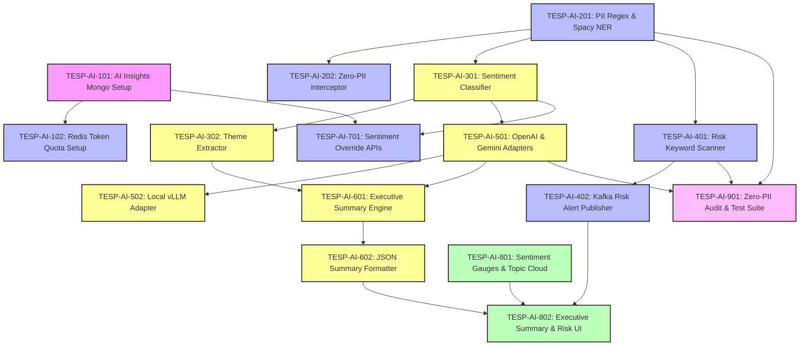

# FEAT-008: AI-Powered NLP Sentiment & Executive Insights — Engineering Backlog

| Metadata Field | Value |
|---|---|
| **Feature ID** | FEAT-008 |
| **Feature Title** | AI-Powered NLP Sentiment & Executive Insights |
| **Backlog Owner** | Lead Engineering Program Manager |
| **Target Architecture** | `DOC-001`, `DOC-002`, `DOC-003`, `DOC-007`, `FEAT-001`, `FEAT-006`, `FEAT-007`, `FEAT-008` |
| **Technology Stack** | Spring Boot 3.3+ (Java 21), React 19+ (Vite, Tailwind CSS, Recharts), OpenAI GPT-4o / Gemini 1.5 Pro Adapter, Spacy PII NER, MongoDB Atlas, Apache Kafka |
| **Total Story Points** | 85 Points |
| **Total Epics** | 9 Epics |
| **Target Sprints** | Sprints 4.2 – 5.2 (3 Two-Week Sprints) |

---

## 1. Capability Breakdown Matrix

| Capability ID | Capability Name | Target Requirements | Target Microservice / Layer | Component Primary Tech |
|---|---|---|---|---|
| **CAP-AI-01** | AI Insights Metamodel | `FR-AI-003`, `DOC-003` | `ai-analytics-service` / DB | MongoDB `ai_insights` collection |
| **CAP-AI-02** | Pre-Processing PII Text Masking | `FR-AI-001`, `BR-AI-001`, `TC-AI-001` | `ai-analytics-service` / Security | Spacy NER + Regex PII Filter |
| **CAP-AI-03** | Multi-Lingual Sentiment Classification | `FR-AI-002`, `FR-AI-003` | `ai-analytics-service` / NLP | Transformer Sentiment Classifier |
| **CAP-AI-04** | High-Risk Keyword Alert Engine | `FR-AI-004`, `BR-AI-004`, `TC-AI-002` | `ai-analytics-service` / Risk | Keyword Pattern Matcher & Kafka Alert |
| **CAP-AI-05** | Pluggable AI Adapter Architecture | `FR-AI-005`, `OQ-AI-002` | `ai-analytics-service` / Adapters | OpenAI, Gemini & vLLM Adapters |
| **CAP-AI-06** | Node Executive Summary Generator | `FR-AI-006`, `US-AI-004` | `ai-analytics-service` / Summarizer | Multi-Doc LLM Summarizer |
| **CAP-AI-07** | Manual Sentiment Override API | `FR-AI-007`, `BR-AI-003` | `ai-analytics-service` / Override | Human Override REST API |
| **CAP-AI-08** | AI Sentiment & Theme Cloud UI | `US-AI-003`, `UI-AI-01` | `tesp-admin-portal` / Web UI | React 19+, Recharts, Topic Cloud |
| **CAP-AI-09** | Asynchronous Kafka Batch Consumer | `FR-AI-008`, `SLA-AI-01` | `ai-analytics-service` / Queue | Apache Kafka Batch Worker |

---

## 2. Epic Hierarchy Structure

```
EPIC-AI-01: AI Analytics Persistence Metamodel & Storage (8 pts)
  ├── TESP-AI-101: MongoDB AI Insights Collection Schema & Indexes (4 pts)
  └── TESP-AI-102: Redis Token Quota & Daily Budget Counter Setup (4 pts)

EPIC-AI-02: Pre-Processing PII Text Masking & Sanitizer Engine (12 pts)
  ├── TESP-AI-201: PII Regex & Spacy NER Masking Component (6 pts)
  └── TESP-AI-202: Zero-PII Data Sanitization Interceptor & Audit Logger (6 pts)

EPIC-AI-03: Multi-Lingual Sentiment & Theme Classification Service (12 pts)
  ├── TESP-AI-301: Multi-Lingual Sentiment Polarity & Label Scorer (-1.0 to +1.0) (6 pts)
  └── TESP-AI-302: Question Group Theme Extractor & Keyword Clusterer (6 pts)

EPIC-AI-04: High-Risk Keyword Alert & Compliance Notification Engine (10 pts)
  ├── TESP-AI-401: Workplace Safety & Harassment Risk Keyword Scanner (5 pts)
  └── TESP-AI-402: Kafka WorkplaceRiskAlert Event Publisher (5 pts)

EPIC-AI-05: Pluggable AI Provider Adapter Architecture (OpenAI / Gemini / vLLM) (10 pts)
  ├── TESP-AI-501: OpenAI GPT-4o & GCP Gemini 1.5 Pro Adapter Implementations (5 pts)
  └── TESP-AI-502: Self-Hosted Local vLLM Llama 3 Adapter Implementation (5 pts)

EPIC-AI-06: Node-Scoped AI Executive Summary Generator (8 pts)
  ├── TESP-AI-601: Departmental Executive Summary Compilation Engine (4 pts)
  └── TESP-AI-602: Strengths, Concerns & Recommendations JSON Formatter (4 pts)

EPIC-AI-07: Human Sentiment Override & Audit Logger APIs (6 pts)
  └── TESP-AI-701: Sentiment Re-classification & Audit Override REST APIs (6 pts)

EPIC-AI-08: React 19+ AI Sentiment, Theme Cloud & Executive Summary UI (14 pts)
  ├── TESP-AI-801: Sentiment Donut Gauges & Interactive Topic Cloud UI (7 pts)
  └── TESP-AI-802: Executive Summary Drawer & Risk Alert Banner UI (7 pts)

EPIC-AI-09: QA PII Leakage Audits, Risk Trigger & Throughput Test Suite (5 pts)
  └── TESP-AI-901: Zero-PII Transmission Audit & Risk Alert Verification Suite (5 pts)
```

---

## 3. Detailed Jira Engineering Tasks

### EPIC-AI-01: AI Analytics Persistence Metamodel & Storage

#### Task: TESP-AI-101
- **Summary**: Implement MongoDB Schema Validation & Indexes for `ai_insights` Collection
- **Issue Type**: Database Task / Migration
- **Component**: Database / MongoDB
- **Story Points**: 4 Points
- **Target Requirements**: `FR-AI-003`, `DOC-003`
- **Dependencies**: None (Root Task)
- **Implementation Notes**:
  - Create MongoDB migration script `src/main/resources/db/migration/v1_007_create_ai_insights_collection.js`.
  - Implement JSON Schema validation enforcing required fields: `projectId`, `campaignId`, `responseId`, `questionId`, `sentimentScore`, `sentimentLabel`, `themes`.
  - Create compound indexes `{ projectId: 1, campaignId: 1 }` and `{ responseId: 1 }`.
- **Acceptance Criteria**:
  - [ ] Validates `sentimentLabel` against allowed enums (`POSITIVE`, `NEUTRAL`, `NEGATIVE`).
  - [ ] Supports fast theme cluster lookups.

#### Task: TESP-AI-102
- **Summary**: Implement Redis Token Quota & Daily Budget Counter Setup
- **Issue Type**: Task
- **Component**: Backend / Rate Limiting
- **Story Points**: 4 Points
- **Target Requirements**: `BR-AI-002`
- **Dependencies**: `TESP-AI-101`
- **Implementation Notes**:
  - Implement `TokenQuotaManager`: Track project LLM token consumption in Redis (`tesp:ai:quota:<projectId>:<date>`).
  - Defer non-critical batch summaries when token usage hits 100% of daily budget.
- **Acceptance Criteria**:
  - [ ] Defers non-urgent AI summary generation when daily token budget is reached.

---

### EPIC-AI-02: Pre-Processing PII Text Masking & Sanitizer Engine

#### Task: TESP-AI-201
- **Summary**: Implement PII Regex & Spacy NER Masking Component
- **Issue Type**: Security Task
- **Component**: Security & PII Sanitizer
- **Story Points**: 6 Points
- **Target Requirements**: `FR-AI-001`, `BR-AI-001`, `TC-AI-001`
- **Dependencies**: None (Security Core)
- **Implementation Notes**:
  - Implement `PiiSanitizerEngine` combining Regex pattern matching and Spacy Named Entity Recognition (NER).
  - Mask emails (`[MASKED_EMAIL]`), phone numbers (`[MASKED_PHONE]`), and names (`[MASKED_NAME]`).
- **Acceptance Criteria**:
  - [ ] Text containing `"John Doe at john.doe@email.com"` is scrubbed to `"[MASKED_NAME] at [MASKED_EMAIL]"`.
  - [ ] 0 unmasked PII strings escape the sanitizer pipeline.

#### Task: TESP-AI-202
- **Summary**: Implement Zero-PII Data Sanitization Interceptor & Audit Logger
- **Issue Type**: Security Task
- **Component**: Security Interceptor
- **Story Points**: 6 Points
- **Target Requirements**: `BR-AI-001`, `FEAT-008 Sec 21`
- **Dependencies**: `TESP-AI-201`
- **Implementation Notes**:
  - Implement pre-flight REST/Feign client interceptor asserting zero unmasked PII before invoking external AI APIs.
  - Log masked metrics (`emailMaskedCount`, `nameMaskedCount`) without writing unmasked text to disk.
- **Acceptance Criteria**:
  - [ ] Pre-flight interceptor throws `PiiSecurityException` and blocks request if unmasked email regex matches outgoing payload.

---

### EPIC-AI-03: Multi-Lingual Sentiment & Theme Classification Service

#### Task: TESP-AI-301
- **Summary**: Implement Multi-Lingual Sentiment Polarity & Label Scorer (-1.0 to +1.0)
- **Issue Type**: Task / NLP
- **Component**: Backend / AI Classification
- **Story Points**: 6 Points
- **Target Requirements**: `FR-AI-002`, `VR-AI-002`, `VR-AI-003`
- **Dependencies**: `TESP-AI-201`
- **Implementation Notes**:
  - Implement `SentimentClassificationService` invoking selected AI provider.
  - Classify text sentiment polarity ($S \in [-1.0, +1.0]$), assigning labels (`POSITIVE`, `NEUTRAL`, `NEGATIVE`) and confidence score ($0.0 - 1.0$).
  - Support multi-lingual inputs (English, Sinhala, Tamil, Spanish, French).
- **Acceptance Criteria**:
  - [ ] Returns structured sentiment DTO with polarity score, label, and confidence score.

#### Task: TESP-AI-302
- **Summary**: Implement Question Group Theme Extractor & Keyword Clusterer
- **Issue Type**: Task / NLP
- **Component**: Backend / Theme Clustering
- **Story Points**: 6 Points
- **Target Requirements**: `FR-AI-003`, `US-AI-003`
- **Dependencies**: `TESP-AI-301`
- **Implementation Notes**:
  - Implement `ThemeClusteringService`: Group text comments by Question Group and extract top 10 recurring organizational themes with frequency counts.
- **Acceptance Criteria**:
  - [ ] Grouping IT department feedback extracts top themes (e.g., `"Workload Audit"`, `"Development Workshops"`).

---

### EPIC-AI-04: High-Risk Keyword Alert & Compliance Notification Engine

#### Task: TESP-AI-401
- **Summary**: Implement Workplace Safety & Harassment Risk Keyword Scanner
- **Issue Type**: Security / Risk Task
- **Component**: Backend / Risk Engine
- **Story Points**: 5 Points
- **Target Requirements**: `FR-AI-004`, `VR-AI-004`, `TC-AI-002`
- **Dependencies**: `TESP-AI-201`
- **Implementation Notes**:
  - Implement `RiskAlertEngine`: Scan sanitized text comments against configurable risk keyword dictionaries (`SAFETY`, `HARASSMENT`, `BURNOUT`, `COMPLIANCE`).
  - Assign risk severity (`LOW`, `MEDIUM`, `HIGH`, `CRITICAL`).
- **Acceptance Criteria**:
  - [ ] Text containing `"safety guard broken on machine"` flags `category: "SAFETY"` and `severity: "CRITICAL"`.

#### Task: TESP-AI-402
- **Summary**: Implement Kafka WorkplaceRiskAlert Event Publisher
- **Issue Type**: Event Implementation Task
- **Component**: Backend / Kafka Messaging
- **Story Points**: 5 Points
- **Target Requirements**: `FR-AI-004`, `BR-AI-004`, `TC-AI-002`
- **Dependencies**: `TESP-AI-401`
- **Implementation Notes**:
  - When `severity == "CRITICAL"`, publish `WorkplaceRiskAlertEvent` to Kafka topic `tesp.notifications.queue.v1`.
  - Trigger immediate email notification to designated HR compliance officers.
- **Acceptance Criteria**:
  - [ ] Critical risk detection dispatches high-priority notification event to Kafka.

---

### EPIC-AI-05: Pluggable AI Provider Adapter Architecture (OpenAI / Gemini / vLLM)

#### Task: TESP-AI-501
- **Summary**: Implement OpenAI GPT-4o & GCP Gemini 1.5 Pro Adapter Implementations
- **Issue Type**: Task / Integration
- **Component**: Backend / AI Adapters
- **Story Points**: 5 Points
- **Target Requirements**: `FR-AI-005`, `FEAT-008 Sec 21`
- **Dependencies**: `TESP-AI-301`
- **Implementation Notes**:
  - Implement `AiProviderAdapter` interface with `OpenAiAdapter` and `GeminiAdapter`.
  - Configure HTTP REST clients with Zero-Data-Retention request headers.
- **Acceptance Criteria**:
  - [ ] Seamlessly routes requests to OpenAI GPT-4o or Gemini 1.5 Pro based on project configuration.

#### Task: TESP-AI-502
- **Summary**: Implement Self-Hosted Local vLLM Llama 3 Adapter Implementation
- **Issue Type**: Task / Integration
- **Component**: Backend / AI Adapters
- **Story Points**: 5 Points
- **Target Requirements**: `FR-AI-005`, `OQ-AI-002`
- **Dependencies**: `TESP-AI-501`
- **Implementation Notes**:
  - Implement `LocalVllmAdapter` connecting to self-hosted OpenAI-compatible vLLM Llama 3 container endpoint.
- **Acceptance Criteria**:
  - [ ] Enables offline/on-premise sentiment scoring via local vLLM endpoint without external cloud API calls.

---

### EPIC-AI-06: Node-Scoped AI Executive Summary Generator

#### Task: TESP-AI-601
- **Summary**: Implement Departmental Executive Summary Compilation Engine
- **Issue Type**: Task / Summarization
- **Component**: Backend / Summary Engine
- **Story Points**: 4 Points
- **Target Requirements**: `FR-AI-006`, `US-AI-004`
- **Dependencies**: `TESP-AI-302`, `TESP-AI-501`
- **Implementation Notes**:
  - Implement `ExecutiveSummaryService`: Fetch sanitized text comments for an Organization Node.
  - Compile LLM prompt requesting structured executive summary (3 strengths, 3 concerns, 2 recommendations).
- **Acceptance Criteria**:
  - [ ] Generates concise departmental executive summary JSON payload.

#### Task: TESP-AI-602
- **Summary**: Implement Strengths, Concerns & Recommendations JSON Formatter
- **Issue Type**: Task
- **Component**: Backend / Formatter
- **Story Points**: 4 Points
- **Target Requirements**: `FR-AI-006`
- **Dependencies**: `TESP-AI-601`
- **Implementation Notes**:
  - Parse raw LLM markdown output into structured DTO (`topStrengths[]`, `topConcerns[]`, `recommendations[]`).
- **Acceptance Criteria**:
  - [ ] Formats output cleanly for consumption by React UI components and PDF reporting engine (`FEAT-009`).

---

### EPIC-AI-07: Human Sentiment Override & Audit Logger APIs

#### Task: TESP-AI-701
- **Summary**: Implement Sentiment Re-classification & Audit Override REST APIs
- **Issue Type**: API Implementation Task
- **Component**: Backend / REST API
- **Story Points**: 6 Points
- **Target Requirements**: `FR-AI-007`, `BR-AI-003`, `PR-AI-002`
- **Dependencies**: `TESP-AI-101`, `TESP-AI-301`
- **Implementation Notes**:
  - Implement `PUT /api/v1/ai/insights/{insightId}/override`.
  - Update `humanOverride` sub-document (`overriddenBy`, `originalLabel`, `newLabel`, `reason`, `overriddenAt`).
  - Recalculate aggregate sentiment counters for target campaign/node.
- **Acceptance Criteria**:
  - [ ] HR Manager override updates sentiment label and recalculates aggregate sentiment distribution.

---

### EPIC-AI-08: React 19+ AI Sentiment, Theme Cloud & Executive Summary UI

#### Task: TESP-AI-801
- **Summary**: Build Sentiment Donut Gauges & Interactive Topic Cloud UI Component
- **Issue Type**: Frontend Task
- **Component**: Frontend / React 19+ Vite
- **Story Points**: 7 Points
- **Target Requirements**: `US-AI-003`, `UI-AI-01`
- **Dependencies**: None (Frontend Core)
- **Implementation Notes**:
  - Create React component `src/components/ai/SentimentAnalyticsPanel.tsx` using Tailwind CSS and Recharts.
  - Render 3 Sentiment Donut Gauges (% Positive, % Neutral, % Negative) + Polarity Meter (-1.0 to +1.0).
  - Render interactive Theme Topic Cloud with clickable theme chips filtering comments.
- **Acceptance Criteria**:
  - [ ] Donut gauges render sentiment percentages accurately.
  - [ ] Clicking a theme chip filters displayed comment list.

#### Task: TESP-AI-802
- **Summary**: Build Executive Summary Drawer & Risk Alert Banner UI Component
- **Issue Type**: Frontend Task
- **Component**: Frontend / React 19+ Vite
- **Story Points**: 7 Points
- **Target Requirements**: `US-AI-002`, `US-AI-004`, `UI-AI-01`
- **Dependencies**: `TESP-AI-801`
- **Implementation Notes**:
  - Create drawer component `src/components/ai/ExecutiveSummaryDrawer.tsx`.
  - Render 3 Strengths, 3 Concerns, and 2 Recommendations with "Export to Slide" button.
  - Render red Risk Alert Banner for critical workplace safety/harassment flags with action link.
- **Acceptance Criteria**:
  - [ ] Displays executive summary drawer and risk alert banner matching design system.

---

### EPIC-AI-09: QA PII Leakage Audits, Risk Trigger & Throughput Test Suite

#### Task: TESP-AI-901
- **Summary**: Build Zero-PII Transmission Audit & Risk Alert Verification Suite
- **Issue Type**: QA Task
- **Component**: QA & Automated Testing
- **Story Points**: 5 Points
- **Target Requirements**: `DOC-012`, `TC-AI-001`, `TC-AI-002`, `SLA-AI-01`
- **Dependencies**: `TESP-AI-201`, `TESP-AI-401`, `TESP-AI-501`
- **Implementation Notes**:
  - Security audit test verifying 0 unmasked PII strings escape to mock external LLM server (`TC-AI-001`).
  - Unit test verifying critical risk alert triggering (`TC-AI-002`).
  - Benchmark test verifying 1,000 comments/minute processing throughput.
- **Acceptance Criteria**:
  - [ ] 100% pass rate on PII security audit assertions.
  - [ ] Critical risk keyword triggers alert event within $< 500\text{ ms}$.

---

## 4. Visual Dependency Graph



---

## 5. Release Sequencing & Sprint Allocation

### Sprint 4.2: PII Text Sanitizer & Sentiment Classification (Total: 28 Points)
- **Focus**: MongoDB AI schemas, PII Spacy NER sanitizer, Zero-PII interceptor, Multi-lingual sentiment classifier, Risk keyword scanner.
- **Tasks**:
  - `TESP-AI-101`: AI Insights Mongo Setup (4 pts)
  - `TESP-AI-102`: Redis Token Quota Setup (4 pts)
  - `TESP-AI-201`: PII Regex & Spacy NER (6 pts)
  - `TESP-AI-202`: Zero-PII Interceptor (6 pts)
  - `TESP-AI-301`: Sentiment Classifier (6 pts)
  - `TESP-AI-401`: Risk Keyword Scanner (5 pts)

---

### Sprint 5.1: Pluggable AI Adapters, Risk Alerts & Summary Engine (Total: 27 Points)
- **Focus**: Kafka risk alert publisher, OpenAI/Gemini adapters, Local vLLM adapter, Theme extractor, Executive summary compiler.
- **Tasks**:
  - `TESP-AI-302`: Theme Extractor (6 pts)
  - `TESP-AI-402`: Kafka Risk Alert Publisher (5 pts)
  - `TESP-AI-501`: OpenAI & Gemini Adapters (5 pts)
  - `TESP-AI-502`: Local vLLM Adapter (5 pts)
  - `TESP-AI-601`: Executive Summary Engine (4 pts)
  - `TESP-AI-602`: JSON Summary Formatter (4 pts)

---

### Sprint 5.2: Sentiment Override APIs, React AI Dashboard & QA (Total: 30 Points)
- **Focus**: Sentiment override REST API, React sentiment gauges, Topic cloud UI, Executive summary drawer, Zero-PII security audit.
- **Tasks**:
  - `TESP-AI-701`: Sentiment Override APIs (6 pts)
  - `TESP-AI-801`: Sentiment Gauges & Topic Cloud (7 pts)
  - `TESP-AI-802`: Executive Summary & Risk UI (7 pts)
  - `TESP-AI-901`: Zero-PII Audit & Test Suite (5 pts)

---

## Document Status

| Field | Value |
|---|---|
| **Document Status** | Approved / Ready for Jira Import |
| **Target Feature** | `FEAT-008: AI-Powered NLP Sentiment & Executive Insights` |
| **Total Story Points** | 85 Story Points |
| **Dependencies Satisfied** | `DOC-001` to `DOC-007`, `FEAT-001`, `FEAT-006`, `FEAT-007` |
| **Next Recommended Backlog** | `FEAT-009-REPORTING-ENGINE-BACKLOG.md` |
