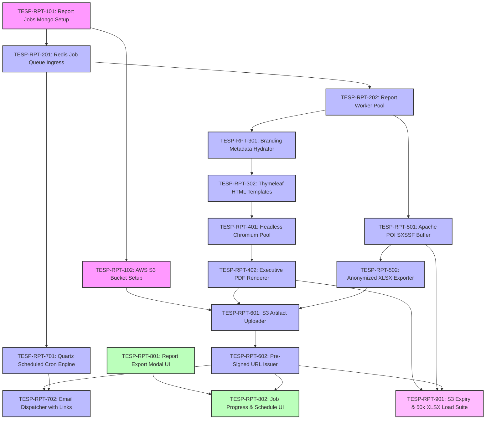

# FEAT-009: Dynamic White-Label Reporting & PDF/Excel Export — Engineering Backlog

| Metadata Field | Value |
|---|---|
| **Feature ID** | FEAT-009 |
| **Feature Title** | Dynamic White-Label Reporting & PDF/Excel Export |
| **Backlog Owner** | Lead Engineering Program Manager |
| **Target Architecture** | `DOC-001`, `DOC-002`, `DOC-003`, `DOC-008`, `FEAT-001`, `FEAT-007`, `FEAT-008`, `FEAT-009` |
| **Technology Stack** | Spring Boot 3.3+ (Java 21 Virtual Threads), React 19+ (Vite, Tailwind CSS), Headless Chromium (Puppeteer), Apache POI (`SXSSFWorkbook`), AWS S3, Redis 7.x, Apache Kafka |
| **Total Story Points** | 85 Points |
| **Total Epics** | 9 Epics |
| **Target Sprints** | Sprints 5.1 – 6.1 (3 Two-Week Sprints) |

---

## 1. Capability Breakdown Matrix

| Capability ID | Capability Name | Target Requirements | Target Microservice / Layer | Component Primary Tech |
|---|---|---|---|---|
| **CAP-RPT-01** | Report Jobs Metamodel | `FR-RPT-001`, `DOC-003` | `reporting-service` / DB | MongoDB `report_jobs` collection |
| **CAP-RPT-02** | Async Redis Job Queue Framework | `FR-RPT-001`, `SLA-RPT-01` | `reporting-service` / Queue | Redis 7.x List Queue + Worker Pool |
| **CAP-RPT-03** | White-Label Brand Injector | `FR-RPT-004`, `FEAT-001` | `reporting-service` / Layout | Thymeleaf HTML Template Compiler |
| **CAP-RPT-04** | Headless Chromium PDF Engine | `FR-RPT-002`, `SLA-RPT-01` | `reporting-service` / Renderer | Puppeteer Headless Chromium Pool |
| **CAP-RPT-05** | Streaming Apache POI XLSX Writer | `FR-RPT-003`, `BR-RPT-004`, `SLA-RPT-02` | `reporting-service` / Excel | Apache POI `SXSSFWorkbook` (100 row buffer) |
| **CAP-RPT-06** | Pre-Signed S3 URL Generator | `FR-RPT-006`, `BR-RPT-003`, `TC-RPT-001` | `reporting-service` / Storage | AWS S3 SDK v2 (24-hour TTL) |
| **CAP-RPT-07** | Scheduled Cron Dispatcher | `FR-RPT-007` | `reporting-service` / Cron | Quartz Scheduler + Spring Mail |
| **CAP-RPT-08** | Report Export & Schedule UI | `US-RPT-001`, `US-RPT-003`, `UI-RPT-01` | `tesp-admin-portal` / Web UI | React 19+, Tailwind CSS, TanStack Query |
| **CAP-RPT-09** | Report Privacy Suppressor | `FR-RPT-005`, `BR-RPT-001`, `TC-RPT-002` | `reporting-service` / Privacy | Differential Privacy Report Filter ($N < 5$) |

---

## 2. Epic Hierarchy Structure

```
EPIC-RPT-01: Reporting Job Persistence & MongoDB Metamodel (8 pts)
  ├── TESP-RPT-101: MongoDB Report Jobs Collection Schema & Indexes (4 pts)
  └── TESP-RPT-102: AWS S3 Bucket Lifecycle & IAM Security Policy Setup (4 pts)

EPIC-RPT-02: Asynchronous Redis Job Queue & Worker Pool Framework (10 pts)
  ├── TESP-RPT-101: Redis List Queue Producer & Async HTTP 202 Ingress API (5 pts)
  └── TESP-RPT-102: Distributed Report Worker Pool & Dead Letter Queue (5 pts)

EPIC-RPT-03: White-Label Branding Injection Engine & HTML Template Compiler (10 pts)
  ├── TESP-RPT-301: Project Branding Metadata Hydrator & Logo Injector (5 pts)
  └── TESP-RPT-302: Thymeleaf White-Label Report HTML Template Engine (5 pts)

EPIC-RPT-04: Headless Chromium PDF Compilation Engine (12 pts)
  ├── TESP-RPT-401: Headless Chromium Container Pool & Puppeteer Driver (6 pts)
  └── TESP-RPT-402: Executive Summary 10-Page PDF Renderer Component (6 pts)

EPIC-RPT-05: Streaming Apache POI Excel (XLSX) Multi-Tab Export Engine (12 pts)
  ├── TESP-RPT-501: Apache POI SXSSFWorkbook 100-Row Memory Buffer Writer (6 pts)
  └── TESP-RPT-502: Anonymized Raw Responses & Cross-Tab Multi-Worksheet Exporter (6 pts)

EPIC-RPT-06: AWS S3 Private Storage & 24-Hour Pre-Signed URL Generator (8 pts)
  ├── TESP-RPT-601: AWS S3 Artifact Uploader Component (4 pts)
  └── TESP-RPT-602: 24-Hour Pre-Signed Download URL Issuer & Expiry Guard (4 pts)

EPIC-RPT-07: Scheduled Cron Report Dispatcher & Email Dispatch (8 pts)
  ├── TESP-RPT-701: Quartz Scheduled Report Generation Cron Engine (4 pts)
  └── TESP-RPT-702: Email Notification Dispatcher with Pre-Signed Links (4 pts)

EPIC-RPT-08: React 19+ Report Export Dialog & Scheduled Dispatch UI (12 pts)
  ├── TESP-RPT-801: Multi-Format Report Export Modal & Section Picker (6 pts)
  └── TESP-RPT-802: Real-Time Job Progress Bar & Scheduled Dispatch Tab (6 pts)

EPIC-RPT-09: QA PDF/Excel Anonymity Audit & Memory Load Test Suite (5 pts)
  └── TESP-RPT-901: S3 Link Expiry, $N < 5$ Privacy Audit & 50k XLSX Load Tests (5 pts)
```

---

## 3. Detailed Jira Engineering Tasks

### EPIC-RPT-01: Reporting Job Persistence & MongoDB Metamodel

#### Task: TESP-RPT-101
- **Summary**: Implement MongoDB Schema Validation & Indexes for `report_jobs` Collection
- **Issue Type**: Database Task / Migration
- **Component**: Database / MongoDB
- **Story Points**: 4 Points
- **Target Requirements**: `FR-RPT-001`, `DOC-003`
- **Dependencies**: None (Root Task)
- **Implementation Notes**:
  - Create MongoDB migration script `src/main/resources/db/migration/v1_008_create_report_jobs_collection.js`.
  - Implement JSON Schema validation enforcing required fields: `projectId`, `jobId`, `reportType`, `campaignId`, `requestedBy`, `status`.
  - Create compound index `{ projectId: 1, jobId: 1 }` and `{ status: 1 }`.
- **Acceptance Criteria**:
  - [ ] Validates `reportType` against allowed enums (`EXEC_SUMMARY_PDF`, `DEPT_BREAKDOWN_PDF`, `RAW_RESPONSES_XLSX`, `AGGREGATED_SCORES_XLSX`).
  - [ ] Supports fast job status polling.

#### Task: TESP-RPT-102
- **Summary**: Configure AWS S3 Bucket Lifecycle & IAM Security Policy Setup
- **Issue Type**: DevOps / Infrastructure Task
- **Component**: AWS S3 Storage
- **Story Points**: 4 Points
- **Target Requirements**: `FR-RPT-006`, `BR-RPT-003`, `OQ-RPT-002`
- **Dependencies**: `TESP-RPT-101`
- **Implementation Notes**:
  - Create private AWS S3 bucket `tesp-report-exports` via Terraform.
  - Implement 30-day object deletion lifecycle policy.
  - Deny all public read access; enforce IAM pre-signed URL signatures.
- **Acceptance Criteria**:
  - [ ] S3 bucket blocks direct HTTP public URL access.
  - [ ] Lifecycle rule purges report objects older than 30 days automatically.

---

### EPIC-RPT-02: Asynchronous Redis Job Queue & Worker Pool Framework

#### Task: TESP-RPT-201
- **Summary**: Implement Redis List Queue Producer & Async HTTP 202 Ingress API
- **Issue Type**: Task
- **Component**: Backend / REST API & Queue
- **Story Points**: 5 Points
- **Target Requirements**: `FR-RPT-001`, `VR-RPT-001` to `004`
- **Dependencies**: `TESP-RPT-101`
- **Implementation Notes**:
  - Implement `POST /api/v1/reports/generate`.
  - Enqueue report generation job to Redis (`RPUSH tesp:reports:queue`).
  - Return HTTP 202 Accepted with `jobId` and `status: "QUEUED"`.
- **Acceptance Criteria**:
  - [ ] Ingress endpoint accepts report request and returns HTTP 202 Accepted in $< 50\text{ ms}$.

#### Task: TESP-RPT-202
- **Summary**: Implement Distributed Report Worker Pool & Dead Letter Queue
- **Issue Type**: Task
- **Component**: Backend / Queue Worker
- **Story Points**: 5 Points
- **Target Requirements**: `FR-RPT-001`
- **Dependencies**: `TESP-RPT-201`
- **Implementation Notes**:
  - Implement `ReportWorkerPool`: Consume jobs via `BLPOP tesp:reports:queue` using Java 21 Virtual Threads.
  - Max 3 automatic retries on failure; move failing jobs to Dead Letter Queue (`tesp:reports:dlq`).
- **Acceptance Criteria**:
  - [ ] Worker pool dequeues jobs and updates MongoDB job status (`QUEUED` $\rightarrow$ `PROCESSING` $\rightarrow$ `COMPLETED`).
  - [ ] Failing job retries 3 times before routing to DLQ.

---

### EPIC-RPT-03: White-Label Branding Injection Engine & HTML Template Compiler

#### Task: TESP-RPT-301
- **Summary**: Implement Project Branding Metadata Hydrator & Logo Injector
- **Issue Type**: Task
- **Component**: Backend / Branding
- **Story Points**: 5 Points
- **Target Requirements**: `FR-RPT-004`, `FEAT-001`
- **Dependencies**: `TESP-RPT-202`
- **Implementation Notes**:
  - Implement `BrandingHydratorService`: Fetch project branding metadata (`logoUrl`, `primaryColorHex`, `secondaryColorHex`, `fontFamily`, `footerText`) from `FEAT-001` project config.
- **Acceptance Criteria**:
  - [ ] Hydrates white-label CSS variables and corporate logo URLs dynamically for target project.

#### Task: TESP-RPT-302
- **Summary**: Implement Thymeleaf White-Label Report HTML Template Engine
- **Issue Type**: Task
- **Component**: Backend / Template Engine
- **Story Points**: 5 Points
- **Target Requirements**: `FR-RPT-004`
- **Dependencies**: `TESP-RPT-301`
- **Implementation Notes**:
  - Implement Thymeleaf HTML report templates (`executive_summary_report.html`, `department_breakdown.html`).
  - Inject hydrated branding CSS, executive KPI cards, 2D heatmap SVG grids, and AI recommendations.
- **Acceptance Criteria**:
  - [ ] Compiles responsive, pixel-perfect HTML document matching corporate white-label branding specifications.

---

### EPIC-RPT-04: Headless Chromium PDF Compilation Engine

#### Task: TESP-RPT-401
- **Summary**: Implement Headless Chromium Container Pool & Puppeteer Driver
- **Issue Type**: Task / Infrastructure
- **Component**: Backend / PDF Renderer
- **Story Points**: 6 Points
- **Target Requirements**: `FR-RPT-002`, `SLA-RPT-01`
- **Dependencies**: `TESP-RPT-302`
- **Implementation Notes**:
  - Deploy Headless Chromium Docker container pool.
  - Implement `ChromiumPdfRenderer` driving Puppeteer/Playwright headless browser instance over DevTools protocol.
- **Acceptance Criteria**:
  - [ ] Renders HTML string to PDF binary stream in $< 2.5\text{ seconds}$.

#### Task: TESP-RPT-402
- **Summary**: Implement Executive Summary 10-Page PDF Renderer Component
- **Issue Type**: Task
- **Component**: Backend / PDF Generator
- **Story Points**: 6 Points
- **Target Requirements**: `FR-RPT-002`, `FR-RPT-005`, `BR-RPT-001`, `TC-RPT-002`
- **Dependencies**: `TESP-RPT-401`
- **Implementation Notes**:
  - Render 10-page Executive PDF Briefing incorporating white-label cover page, eNPS cards, 2D heatmaps, AI recommendations, and Action Plan table.
  - Enforce sample size suppression ($N < 5$), rendering `* N/A (N < 5)` for small groups.
- **Acceptance Criteria**:
  - [ ] Generates publication-ready 10-page PDF document.
  - [ ] Suppresses numeric scores for cells with $N < 5$ (`* N/A (N < 5)`).

---

### EPIC-RPT-05: Streaming Apache POI Excel (XLSX) Multi-Tab Export Engine

#### Task: TESP-RPT-501
- **Summary**: Implement Apache POI SXSSFWorkbook 100-Row Memory Buffer Writer Component
- **Issue Type**: Task
- **Component**: Backend / Excel Engine
- **Story Points**: 6 Points
- **Target Requirements**: `FR-RPT-003`, `BR-RPT-004`, `SLA-RPT-02`
- **Dependencies**: `TESP-RPT-202`
- **Implementation Notes**:
  - Implement `StreamingExcelWriter` using Apache POI `SXSSFWorkbook(100)`.
  - Maintain max 100 row window in heap memory, flushing excess rows to temporary disk files.
- **Acceptance Criteria**:
  - [ ] Exports 50,000 response rows without throwing `OutOfMemoryError` or exceeding 512MB RAM.

#### Task: TESP-RPT-502
- **Summary**: Implement Anonymized Raw Responses & Cross-Tab Multi-Worksheet Exporter
- **Issue Type**: Task
- **Component**: Backend / Excel Exporter
- **Story Points**: 6 Points
- **Target Requirements**: `FR-RPT-003`, `FR-RPT-005`, `BR-RPT-001`
- **Dependencies**: `TESP-RPT-501`
- **Implementation Notes**:
  - Worksheet 1: Anonymized Raw Responses (answers + demographicSnapshot tags; 0 PII identity columns).
  - Worksheet 2: Department Cross-Tabulation Matrix (enforces $N < 5$ suppression).
- **Acceptance Criteria**:
  - [ ] Multi-tab XLSX file contains 0 PII columns (`fullName`, `email`).
  - [ ] Cross-tab sheet obscures score cells where $N < 5$.

---

### EPIC-RPT-06: AWS S3 Private Storage & 24-Hour Pre-Signed URL Generator

#### Task: TESP-RPT-601
- **Summary**: Implement AWS S3 Artifact Uploader Component
- **Issue Type**: Task
- **Component**: Backend / Storage
- **Story Points**: 4 Points
- **Target Requirements**: `FR-RPT-006`
- **Dependencies**: `TESP-RPT-102`, `TESP-RPT-402`, `TESP-RPT-502`
- **Implementation Notes**:
  - Stream generated PDF/XLSX binary artifacts to AWS S3 bucket `tesp-report-exports` under key path `/{projectId}/{campaignId}/{jobId}.pdf`.
- **Acceptance Criteria**:
  - [ ] Uploads generated report file to private S3 bucket.

#### Task: TESP-RPT-602
- **Summary**: Implement 24-Hour Pre-Signed Download URL Issuer & Expiry Guard
- **Issue Type**: Security Task
- **Component**: Backend / Security
- **Story Points**: 4 Points
- **Target Requirements**: `FR-RPT-006`, `BR-RPT-003`, `TC-RPT-001`
- **Dependencies**: `TESP-RPT-601`
- **Implementation Notes**:
  - Generate pre-signed S3 download URL using `S3Presigner` with expiration `86400s` (24 hours).
  - Save `downloadUrl` and `expiresAt` to MongoDB `report_jobs` record.
- **Acceptance Criteria**:
  - [ ] Pre-signed URL grants temporary read access to generated artifact.
  - [ ] URL expires and returns HTTP 403 Forbidden after 24 hours.

---

### EPIC-RPT-07: Scheduled Cron Report Dispatcher & Email Dispatch

#### Task: TESP-RPT-701
- **Summary**: Implement Quartz Scheduled Report Generation Cron Engine
- **Issue Type**: Task
- **Component**: Backend / Scheduler
- **Story Points**: 4 Points
- **Target Requirements**: `FR-RPT-007`, `US-RPT-003`
- **Dependencies**: `TESP-RPT-201`
- **Implementation Notes**:
  - Implement `ScheduledReportCronWorker`: Quartz job executing cron expressions configured for recurring departmental report dispatches (e.g., Every Monday at 07:00 AM).
- **Acceptance Criteria**:
  - [ ] Triggers automated report generation jobs on scheduled cron intervals.

#### Task: TESP-RPT-702
- **Summary**: Implement Email Notification Dispatcher with Pre-Signed Links
- **Issue Type**: Event Implementation Task
- **Component**: Backend / Messaging
- **Story Points**: 4 Points
- **Target Requirements**: `FR-RPT-007`, `FR-RPT-008`
- **Dependencies**: `TESP-RPT-602`, `TESP-RPT-701`
- **Implementation Notes**:
  - Publish `ReportGeneratedEvent` to Kafka topic `tesp.reports.events.v1`.
  - Dispatch email notification containing pre-signed download link to recipient HR directors.
- **Acceptance Criteria**:
  - [ ] Recipient receives email containing valid pre-signed download link upon report completion.

---

### EPIC-RPT-08: React 19+ Report Export Dialog & Scheduled Dispatch UI

#### Task: TESP-RPT-801
- **Summary**: Build Multi-Format Report Export Modal & Section Picker Component
- **Issue Type**: Frontend Task
- **Component**: Frontend / React 19+ Vite
- **Story Points**: 6 Points
- **Target Requirements**: `US-RPT-001`, `UI-RPT-01`
- **Dependencies**: None (Frontend Core)
- **Implementation Notes**:
  - Create React modal component `src/components/report/ReportExportModal.tsx`.
  - Format toggle: **Executive PDF Report** vs **Raw Data Excel Sheet**.
  - Section checkboxes (Include eNPS Cards, Include Heatmaps, Include AI Recommendations, Include Action Plans).
- **Acceptance Criteria**:
  - [ ] Modal allows selecting report type, scope, and optional sections before triggering generation API.

#### Task: TESP-RPT-802
- **Summary**: Build Real-Time Job Progress Bar & Scheduled Dispatch Tab Component
- **Issue Type**: Frontend Task
- **Component**: Frontend / React 19+ Vite
- **Story Points**: 6 Points
- **Target Requirements**: `US-RPT-003`, `US-RPT-004`, `UI-RPT-01`
- **Dependencies**: `TESP-RPT-801`
- **Implementation Notes**:
  - Implement polling hook tracking job status (`QUEUED` $\rightarrow$ `PROCESSING` $\rightarrow$ `COMPLETED`).
  - Render progress bar and "Download Report" button.
  - Implement "Schedule Recurring Dispatch" tab UI for configuring weekly automated email delivery.
- **Acceptance Criteria**:
  - [ ] Displays live progress bar during export generation and renders secure download button upon completion.

---

### EPIC-RPT-09: QA PDF/Excel Anonymity Audit & Memory Load Test Suite

#### Task: TESP-RPT-901
- **Summary**: Build S3 Link Expiry, $N < 5$ Privacy Audit & 50k XLSX Load Tests
- **Issue Type**: QA Task
- **Component**: QA & Automated Testing
- **Story Points**: 5 Points
- **Target Requirements**: `DOC-012`, `TC-RPT-001`, `TC-RPT-002`, `SLA-RPT-01`, `SLA-RPT-02`
- **Dependencies**: `TESP-RPT-402`, `TESP-RPT-501`, `TESP-RPT-602`
- **Implementation Notes**:
  - Integration test asserting pre-signed S3 URL expiration after 24 hours (`TC-RPT-001`).
  - Automated PDF/XLSX content audit verifying sample size suppression ($N < 5$) (`TC-RPT-002`).
  - Benchmark load test exporting 50,000 response rows to XLSX measuring duration and RAM consumption.
- **Acceptance Criteria**:
  - [ ] 50,000 row XLSX export completes in $< 6.0\text{ seconds}$ within 512MB RAM limit.
  - [ ] 100% pass rate on PDF/Excel privacy suppression audits.

---

## 4. Visual Dependency Graph



---

## 5. Release Sequencing & Sprint Allocation

### Sprint 5.1: Redis Queue Ingress, S3 Setup & White-Label HTML Engine (Total: 27 Points)
- **Focus**: Report jobs MongoDB schema, AWS S3 bucket lifecycle, Redis job queue ingress API, Worker pool, White-label HTML templates.
- **Tasks**:
  - `TESP-RPT-101`: Report Jobs Mongo Setup (4 pts)
  - `TESP-RPT-102`: AWS S3 Bucket Setup (4 pts)
  - `TESP-RPT-201`: Redis Job Queue Ingress (5 pts)
  - `TESP-RPT-202`: Report Worker Pool (5 pts)
  - `TESP-RPT-301`: Branding Metadata Hydrator (4 pts)
  - `TESP-RPT-302`: Thymeleaf HTML Templates (5 pts)

---

### Sprint 5.2: Chromium PDF Engine, POI XLSX Writer & S3 Delivery (Total: 28 Points)
- **Focus**: Headless Chromium PDF compilation pool, Executive PDF renderer, Apache POI SXSSFWorkbook streaming writer, Pre-signed S3 URL issuer.
- **Tasks**:
  - `TESP-RPT-401`: Headless Chromium Pool (6 pts)
  - `TESP-RPT-402`: Executive PDF Renderer (6 pts)
  - `TESP-RPT-501`: Apache POI SXSSF Buffer (6 pts)
  - `TESP-RPT-502`: Anonymized XLSX Exporter (6 pts)
  - `TESP-RPT-601`: S3 Artifact Uploader (4 pts)

---

### Sprint 6.1: Scheduled Cron Dispatch, React Export UI & Load Suite (Total: 30 Points)
- **Focus**: 24-hour pre-signed URL issuer, Quartz scheduled report cron engine, Email notification dispatcher, React export modal UI, Load test suite.
- **Tasks**:
  - `TESP-RPT-602`: Pre-Signed URL Issuer (4 pts)
  - `TESP-RPT-701`: Quartz Scheduled Cron Engine (4 pts)
  - `TESP-RPT-702`: Email Dispatcher with Links (4 pts)
  - `TESP-RPT-801`: Report Export Modal UI (6 pts)
  - `TESP-RPT-802`: Job Progress & Schedule UI (6 pts)
  - `TESP-RPT-901`: S3 Expiry & 50k XLSX Load Suite (5 pts)

---

## Document Status

| Field | Value |
|---|---|
| **Document Status** | Approved / Ready for Jira Import |
| **Target Feature** | `FEAT-009: Dynamic White-Label Reporting & PDF/Excel Export` |
| **Total Story Points** | 85 Story Points |
| **Dependencies Satisfied** | `DOC-001` to `DOC-008`, `FEAT-001`, `FEAT-007`, `FEAT-008` |
| **Next Recommended Backlog** | `FEAT-010-ACTION-PLANNING-BACKLOG.md` |
