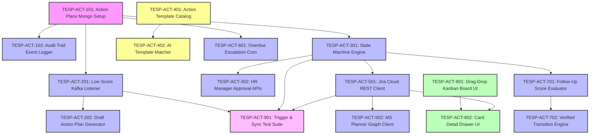

# FEAT-010: Closed-Loop Action Planning & Remediation Module — Engineering Backlog

| Metadata Field | Value |
|---|---|
| **Feature ID** | FEAT-010 |
| **Feature Title** | Closed-Loop Action Planning & Remediation Module |
| **Backlog Owner** | Lead Engineering Program Manager |
| **Target Architecture** | `DOC-001`, `DOC-002`, `DOC-003`, `DOC-009`, `FEAT-001`, `FEAT-002`, `FEAT-007`, `FEAT-008`, `FEAT-010` |
| **Technology Stack** | Spring Boot 3.3+ (Java 21 Virtual Threads), React 19+ (Vite, `@hello-pangea/dnd`, Tailwind CSS), Jira Cloud REST API, MS Graph API, MongoDB Atlas, Redis, Kafka |
| **Total Story Points** | 82 Points |
| **Total Epics** | 9 Epics |
| **Target Sprints** | Sprints 5.2 – 6.2 (3 Two-Week Sprints) |

---

## 1. Capability Breakdown Matrix

| Capability ID | Capability Name | Target Requirements | Target Microservice / Layer | Component Primary Tech |
|---|---|---|---|---|
| **CAP-ACT-01** | Action Planning Metamodel | `FR-ACT-001`, `DOC-003` | `action-planning-service` / DB | MongoDB `action_plans` collection |
| **CAP-ACT-02** | Automated Threshold Listener | `FR-ACT-001`, `TC-ACT-001` | `action-planning-service` / Event | Kafka Consumer (`AnalyticalSnapshotCreatedEvent`) |
| **CAP-ACT-03** | State Machine & Role Approvals | `FR-ACT-002`, `BR-ACT-001` | `action-planning-service` / State | Spring State Machine Engine |
| **CAP-ACT-04** | AI Remedial Template Recommender | `FR-ACT-003`, `US-ACT-002` | `action-planning-service` / AI | Template Matching Engine |
| **CAP-ACT-05** | Bi-Directional Task Sync Bridge | `FR-ACT-004`, `US-ACT-003`, `OQ-ACT-001` | `action-planning-service` / Sync | Jira REST & MS Graph API Adapters |
| **CAP-ACT-06** | Overdue Escalation Nudge Cron | `FR-ACT-005` | `action-planning-service` / Cron | Quartz Scheduler + Notification Service |
| **CAP-ACT-07** | Post-Action Verification Engine | `FR-ACT-006`, `BR-ACT-004`, `TC-ACT-002` | `action-planning-service` / Verification | Longitudinal $\Delta \text{Score}$ Evaluator |
| **CAP-ACT-08** | Drag-Drop Kanban Board UI | `FR-ACT-007`, `UI-ACT-01` | `tesp-admin-portal` / Web UI | React 19+, `@hello-pangea/dnd`, Tailwind CSS |
| **CAP-ACT-09** | Kafka Event Publisher | `FR-ACT-008` | `action-planning-service` / Messaging | Apache Kafka Producer (`tesp.action.events.v1`) |

---

## 2. Epic Hierarchy Structure

```
EPIC-ACT-01: Action Planning Persistence Metamodel & Storage (8 pts)
  ├── TESP-ACT-101: MongoDB Action Plans Collection Schema & Indexes (4 pts)
  └── TESP-ACT-102: Audit Trail Event Logger Integration (4 pts)

EPIC-ACT-02: Automated Threshold Trigger Listener & Event Pipeline (10 pts)
  ├── TESP-ACT-201: Low Score Threshold Kafka Event Listener (< 60% Trigger) (5 pts)
  └── TESP-ACT-202: Automated Draft Action Plan Generator (5 pts)

EPIC-ACT-03: Action Plan State Machine & Role-Gated Approvals (10 pts)
  ├── TESP-ACT-301: Action Lifecycle State Machine Engine Implementation (5 pts)
  └── TESP-ACT-302: HR Manager Approval & Rejection Workflow APIs (5 pts)

EPIC-ACT-04: AI-Guided Remedial Action Template Engine (8 pts)
  ├── TESP-ACT-401: Daash Global Remedial Action Template Catalog (4 pts)
  └── TESP-ACT-402: AI Template Recommendation Matching Service (4 pts)

EPIC-ACT-05: Bi-Directional Jira Cloud & Microsoft Planner Sync Bridge (14 pts)
  ├── TESP-ACT-501: Jira Cloud REST API Client & Issue Sync Adapter (7 pts)
  └── TESP-ACT-502: Microsoft Planner Graph API Client & Webhook Receiver (7 pts)

EPIC-ACT-06: Overdue Task Escalation Nudge & Reminder Cron (6 pts)
  └── TESP-ACT-601: Milestone Due Date Poller & Escalation Reminder Cron (6 pts)

EPIC-ACT-07: Post-Campaign Score Delta Verification Engine (8 pts)
  ├── TESP-ACT-701: Follow-Up Campaign Score Delta Evaluator Component (4 pts)
  └── TESP-ACT-702: Automatic Verified Transition & ROI Impact Reporter (4 pts)

EPIC-ACT-08: React 19+ Interactive Drag-and-Drop Kanban Board UI (14 pts)
  ├── TESP-ACT-801: Interactive Drag-and-Drop Kanban Action Board Component (7 pts)
  └── TESP-ACT-802: Action Card Detail Drawer & External Sync Status Badge (7 pts)

EPIC-ACT-09: QA Trigger Verification & Integration Test Suite (4 pts)
  └── TESP-ACT-901: Threshold Trigger, State Transition & Jira Sync Test Suite (4 pts)
```

---

## 3. Detailed Jira Engineering Tasks

### EPIC-ACT-01: Action Planning Persistence Metamodel & Storage

#### Task: TESP-ACT-101
- **Summary**: Implement MongoDB Schema Validation & Indexes for `action_plans` Collection
- **Issue Type**: Database Task / Migration
- **Component**: Database / MongoDB
- **Story Points**: 4 Points
- **Target Requirements**: `FR-ACT-001`, `DOC-003`
- **Dependencies**: None (Root Task)
- **Implementation Notes**:
  - Create MongoDB migration script `src/main/resources/db/migration/v1_009_create_action_plans_collection.js`.
  - Implement JSON Schema validation enforcing required fields: `projectId`, `actionPlanId`, `nodeId`, `groupId`, `title`, `status`, `assigneeId`, `targetCompletionDate`.
  - Create compound query index `{ projectId: 1, nodeId: 1, status: 1 }`.
- **Acceptance Criteria**:
  - [ ] Validates `status` against allowed enums (`DRAFT`, `PROPOSED`, `APPROVED`, `REJECTED`, `IN_PROGRESS`, `COMPLETED`, `VERIFIED`, `CANCELLED`).
  - [ ] Supports rapid Kanban board query execution.

#### Task: TESP-ACT-102
- **Summary**: Implement Audit Trail Event Logger Integration
- **Issue Type**: Security Task
- **Component**: Security & Audit
- **Story Points**: 4 Points
- **Target Requirements**: `FEAT-010 Sec 21`
- **Dependencies**: `TESP-ACT-101`
- **Implementation Notes**:
  - Implement `ActionAuditLogger`: Record every state transition, milestone update, or assignee change to `tesp_audit_db.audit_logs`.
- **Acceptance Criteria**:
  - [ ] State transition logs immutable audit record containing `actionPlanId`, `actorId`, `oldStatus`, `newStatus`, and `timestamp`.

---

### EPIC-ACT-02: Automated Threshold Trigger Listener & Event Pipeline

#### Task: TESP-ACT-201
- **Summary**: Implement Low Score Threshold Kafka Event Listener (< 60% Trigger)
- **Issue Type**: Task / Event Processing
- **Component**: Backend / Event Listener
- **Story Points**: 5 Points
- **Target Requirements**: `FR-ACT-001`, `TC-ACT-001`
- **Dependencies**: `TESP-ACT-101`
- **Implementation Notes**:
  - Implement `AnalyticalSnapshotListener`: Consume `AnalyticalSnapshotCreatedEvent` from Kafka topic `tesp.analytics.snapshots.v1`.
  - Evaluate category/theme scores for each organization node; trigger if score $< 60.0\%$.
- **Acceptance Criteria**:
  - [ ] Department with score `54.0%` triggers automatic draft action plan creation pipeline.
  - [ ] Department with score `65.0%` is ignored.

#### Task: TESP-ACT-202
- **Summary**: Implement Automated Draft Action Plan Generator
- **Issue Type**: Task
- **Component**: Backend / Generator
- **Story Points**: 5 Points
- **Target Requirements**: `FR-ACT-001`, `US-ACT-001`
- **Dependencies**: `TESP-ACT-201`
- **Implementation Notes**:
  - Create `DRAFT` Action Plan document in MongoDB linked to `nodeId` and `groupId`.
  - Populate baseline score from snapshot and set preliminary target score ($+15\%$).
- **Acceptance Criteria**:
  - [ ] Automatically inserts `DRAFT` action plan card onto target department's Kanban board.

---

### EPIC-ACT-03: Action Plan State Machine & Role-Gated Approvals

#### Task: TESP-ACT-301
- **Summary**: Implement Action Lifecycle State Machine Engine
- **Issue Type**: Task
- **Component**: Backend / State Machine
- **Story Points**: 5 Points
- **Target Requirements**: `FR-ACT-002`, `BR-ACT-001`
- **Dependencies**: `TESP-ACT-101`
- **Implementation Notes**:
  - Implement Spring State Machine managing transitions (`DRAFT` $\rightarrow$ `PROPOSED` $\rightarrow$ `APPROVED` $\rightarrow$ `IN_PROGRESS` $\rightarrow$ `COMPLETED` $\rightarrow$ `VERIFIED`).
  - Enforce role guards (`HR_MANAGER` required for `PROPOSED` $\rightarrow$ `APPROVED`).
- **Acceptance Criteria**:
  - [ ] Attempting to transition from `PROPOSED` to `IN_PROGRESS` without `HR_MANAGER` approval throws `InvalidStateTransitionException`.

#### Task: TESP-ACT-302
- **Summary**: Implement HR Manager Approval & Rejection Workflow APIs
- **Issue Type**: API Implementation Task
- **Component**: Backend / REST API
- **Story Points**: 5 Points
- **Target Requirements**: `FR-ACT-002`, `BR-ACT-001`, `PR-ACT-002`
- **Dependencies**: `TESP-ACT-301`
- **Implementation Notes**:
  - Implement `POST /api/v1/actions/{actionPlanId}/approve` and `POST /api/v1/actions/{actionPlanId}/reject`.
  - Send email notification to assignee upon approval or rejection.
- **Acceptance Criteria**:
  - [ ] Approving action plan transitions state to `APPROVED` and dispatches notification email to assignee.

---

### EPIC-ACT-04: AI-Guided Remedial Action Template Engine

#### Task: TESP-ACT-401
- **Summary**: Populate Daash Global Remedial Action Template Catalog
- **Issue Type**: Task
- **Component**: Database / Template Catalog
- **Story Points**: 4 Points
- **Target Requirements**: `FR-ACT-003`, `US-ACT-002`
- **Dependencies**: None (Catalog Setup)
- **Implementation Notes**:
  - Create MongoDB collection `action_templates` seeded with Daash Global consulting action templates categorized by Question Group (Leadership, Wellbeing, Recognition, Communication).
- **Acceptance Criteria**:
  - [ ] Catalog stores pre-validated templates with title, description, and suggested milestone steps.

#### Task: TESP-ACT-402
- **Summary**: Implement AI Template Recommendation Matching Service
- **Issue Type**: AI Task / Recommendation
- **Component**: Backend / AI Service
- **Story Points**: 4 Points
- **Target Requirements**: `FR-ACT-003`, `FEAT-010 Sec 20`
- **Dependencies**: `TESP-ACT-401`
- **Implementation Notes**:
  - Implement `ActionTemplateRecommender`: Match low-scoring Question Group and text comments against template catalog using TF-IDF similarity.
  - Expose API `GET /api/v1/actions/templates/recommendations?groupId=GRP-COMMUNICATION`.
- **Acceptance Criteria**:
  - [ ] Querying recommendations for communication deficit returns template `"Weekly Open Floor Huddle & Town Hall"`.

---

### EPIC-ACT-05: Bi-Directional Jira Cloud & Microsoft Planner Sync Bridge

#### Task: TESP-ACT-501
- **Summary**: Implement Jira Cloud REST API Client & Issue Sync Adapter
- **Issue Type**: Task / Integration
- **Component**: Backend / Jira Connector
- **Story Points**: 7 Points
- **Target Requirements**: `FR-ACT-004`, `US-ACT-003`, `OQ-ACT-001`
- **Dependencies**: `TESP-ACT-301`
- **Implementation Notes**:
  - Implement `JiraSyncAdapter` using OAuth2 client credentials stored in AWS Secrets Manager.
  - Create Jira Issue upon request (`POST /api/v1/actions/{actionPlanId}/sync-jira`).
  - Webhook receiver (`POST /api/v1/webhooks/jira`): Sync status changes in Jira back to TESP action plan milestones.
- **Acceptance Criteria**:
  - [ ] Syncing action plan creates Jira task issue with link to TESP.
  - [ ] Transitioning Jira issue to "Done" automatically completes corresponding TESP milestone.

#### Task: TESP-ACT-502
- **Summary**: Implement Microsoft Planner Graph API Client & Webhook Receiver
- **Issue Type**: Task / Integration
- **Component**: Backend / MS Planner Connector
- **Story Points**: 7 Points
- **Target Requirements**: `FR-ACT-004`
- **Dependencies**: `TESP-ACT-501`
- **Implementation Notes**:
  - Implement `MsPlannerSyncAdapter` using Microsoft Graph API.
  - Create Planner task items and receive Graph API change notification webhooks.
- **Acceptance Criteria**:
  - [ ] Syncs TESP action items to Microsoft Planner tasks with bi-directional status updates.

---

### EPIC-ACT-06: Overdue Task Escalation Nudge & Reminder Cron

#### Task: TESP-ACT-601
- **Summary**: Implement Milestone Due Date Poller & Escalation Reminder Cron
- **Issue Type**: Task / Scheduler
- **Component**: Backend / Cron
- **Story Points**: 6 Points
- **Target Requirements**: `FR-ACT-005`
- **Dependencies**: `TESP-ACT-101`
- **Implementation Notes**:
  - Implement scheduled Quartz worker running daily at 08:00 AM.
  - Send reminder notification 3 days prior to milestone due date.
  - Escalate overdue milestones ($> 1\text{ day past due}$) to HR Manager.
- **Acceptance Criteria**:
  - [ ] Sends reminder notification 3 days prior to due date.
  - [ ] Escalates overdue milestone to HR Manager via email notification.

---

### EPIC-ACT-07: Post-Campaign Score Delta Verification Engine

#### Task: TESP-ACT-701
- **Summary**: Implement Follow-Up Campaign Score Delta Evaluator Component
- **Issue Type**: Task
- **Component**: Backend / Verification
- **Story Points**: 4 Points
- **Target Requirements**: `FR-ACT-006`, `BR-ACT-004`, `TC-ACT-002`
- **Dependencies**: `TESP-ACT-301`
- **Implementation Notes**:
  - Upon follow-up survey campaign closure, evaluate aggregate score for target `nodeId` and `groupId`.
  - Calculate $\Delta \text{Score} = \text{Score}_{\text{post}} - \text{Score}_{\text{baseline}}$.
- **Acceptance Criteria**:
  - [ ] Calculates score improvement delta (e.g., $+16.0\%$ score increase).

#### Task: TESP-ACT-702
- **Summary**: Implement Automatic Verified Transition & ROI Impact Reporter
- **Issue Type**: Task
- **Component**: Backend / ROI Engine
- **Story Points**: 4 Points
- **Target Requirements**: `FR-ACT-006`, `US-ACT-004`
- **Dependencies**: `TESP-ACT-701`
- **Implementation Notes**:
  - If $\Delta \text{Score} > 0$, transition action plan state from `COMPLETED` to `VERIFIED`.
  - Store `postActionScore` and update ROI impact metrics.
- **Acceptance Criteria**:
  - [ ] Action plan automatically transitions to `VERIFIED` state upon positive score delta verification.

---

### EPIC-ACT-08: React 19+ Interactive Drag-and-Drop Kanban Board UI

#### Task: TESP-ACT-801
- **Summary**: Build Interactive Drag-and-Drop Kanban Action Board Component
- **Issue Type**: Frontend Task
- **Component**: Frontend / React 19+ Vite
- **Story Points**: 7 Points
- **Target Requirements**: `FR-ACT-007`, `UI-ACT-01`
- **Dependencies**: None (Frontend Core)
- **Implementation Notes**:
  - Create React page `src/pages/ActionKanbanBoardPage.tsx` using `@hello-pangea/dnd` and Tailwind CSS.
  - 6 Columns: **Draft**, **Proposed**, **Approved**, **In Progress**, **Completed**, **Verified**.
  - Drag-and-drop card movement triggering status transition API modal.
- **Acceptance Criteria**:
  - [ ] Dragging card between columns triggers status transition workflow with approval modal prompt.
  - [ ] Filter bar filters cards by Organization Node, Category Theme, and Assignee.

#### Task: TESP-ACT-802
- **Summary**: Build Action Card Detail Drawer & External Sync Status Badge Component
- **Issue Type**: Frontend Task
- **Component**: Frontend / React 19+ Vite
- **Story Points**: 7 Points
- **Target Requirements**: `US-ACT-003`, `UI-ACT-01`
- **Dependencies**: `TESP-ACT-801`
- **Implementation Notes**:
  - Create drawer component `src/components/action/ActionDetailDrawer.tsx`.
  - Display milestone checklist, baseline vs target score progress bar, and Jira/MS Planner sync button with status badge (`ENG-402 Synced`).
- **Acceptance Criteria**:
  - [ ] Card detail drawer displays milestone checklist and triggers external Jira sync.

---

### EPIC-ACT-09: QA Trigger Verification & Integration Test Suite

#### Task: TESP-ACT-901
- **Summary**: Build Threshold Trigger, State Transition & Jira Sync Test Suite
- **Issue Type**: QA Task
- **Component**: QA & Automated Testing
- **Story Points**: 4 Points
- **Target Requirements**: `DOC-012`, `TC-ACT-001`, `TC-ACT-002`, `SLA-ACT-01`
- **Dependencies**: `TESP-ACT-201`, `TESP-ACT-301`, `TESP-ACT-501`, `TESP-ACT-701`
- **Implementation Notes**:
  - Integration test verifying low score threshold trigger auto-creating draft action plan (`TC-ACT-001`).
  - Unit test asserting post-action verification math ($\Delta \text{Score}$) (`TC-ACT-002`).
  - E2E Playwright test `tests/e2e/action-kanban.spec.ts` moving card through approval workflow.
- **Acceptance Criteria**:
  - [ ] 100% pass rate on threshold trigger, state machine, and verification test suite.

---

## 4. Visual Dependency Graph



---

## 5. Release Sequencing & Sprint Allocation

### Sprint 5.2: Action Persistence, Listener & State Machine (Total: 27 Points)
- **Focus**: Action plans MongoDB schema, Audit logger, Low score Kafka threshold listener, State machine engine, HR approval APIs.
- **Tasks**:
  - `TESP-ACT-101`: Action Plans Mongo Setup (4 pts)
  - `TESP-ACT-102`: Audit Trail Event Logger (4 pts)
  - `TESP-ACT-201`: Low Score Kafka Listener (5 pts)
  - `TESP-ACT-202`: Draft Action Plan Generator (5 pts)
  - `TESP-ACT-301`: State Machine Engine (5 pts)
  - `TESP-ACT-302`: HR Manager Approval APIs (4 pts)

---

### Sprint 6.1: AI Action Templates, External Task Sync & Verification (Total: 27 Points)
- **Focus**: Template catalog, AI template recommender, Jira Cloud REST client, MS Planner Graph API adapter, Verification engine.
- **Tasks**:
  - `TESP-ACT-401`: Action Template Catalog (4 pts)
  - `TESP-ACT-402`: AI Template Matcher (4 pts)
  - `TESP-ACT-501`: Jira Cloud REST Client (7 pts)
  - `TESP-ACT-502`: MS Planner Graph Client (7 pts)
  - `TESP-ACT-701`: Follow-Up Score Evaluator (5 pts)

---

### Sprint 6.2: Kanban Board UI, Escalation Cron & Integration Test Suite (Total: 28 Points)
- **Focus**: Escalation cron, Verified transition engine, React drag-and-drop Kanban board UI, Card detail drawer, Integration test suite.
- **Tasks**:
  - `TESP-ACT-601`: Overdue Escalation Cron (6 pts)
  - `TESP-ACT-702`: Verified Transition Engine (4 pts)
  - `TESP-ACT-801`: Drag-Drop Kanban Board UI (7 pts)
  - `TESP-ACT-802`: Card Detail Drawer UI (7 pts)
  - `TESP-ACT-901`: Trigger & Sync Test Suite (4 pts)

---

## Document Status

| Field | Value |
|---|---|
| **Document Status** | Approved / Ready for Jira Import |
| **Target Feature** | `FEAT-010: Closed-Loop Action Planning & Remediation Module` |
| **Total Story Points** | 82 Story Points |
| **Dependencies Satisfied** | `DOC-001` to `DOC-009`, `FEAT-001` to `FEAT-010` |
| **Next Recommended Step** | Complete Engineering Program Backlog Library (`BACKLOG-FEAT-001` through `BACKLOG-FEAT-010` fully generated). Proceed to execution phase. |
