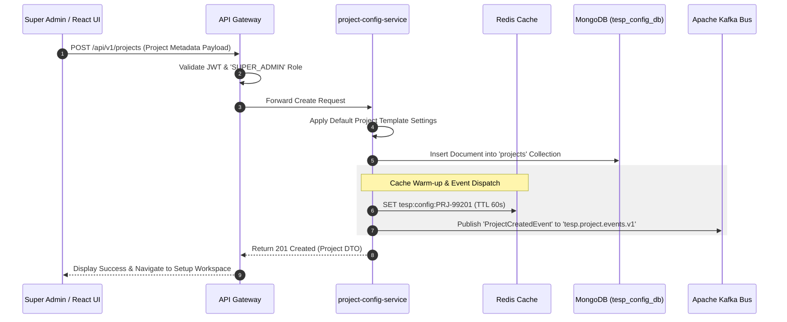
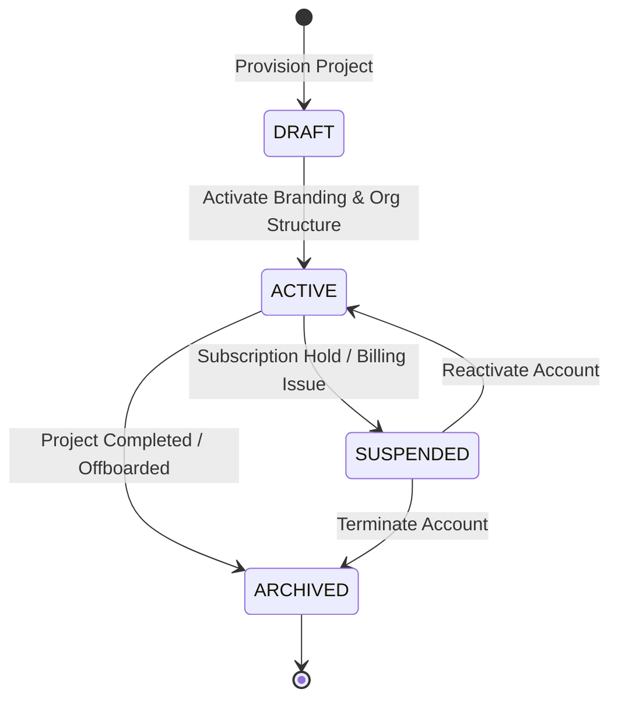

# FEAT-001: Project & Workspace Configuration Engine

| Metadata Field | Value |
|---|---|
| **Feature ID** | FEAT-001 |
| **Title** | Project & Workspace Configuration Engine |
| **Category** | Core Platform / Governance |
| **Version** | 1.0.0 |
| **Status** | Approved |
| **Owner** | Principal Enterprise Solution Architect |
| **Last Updated** | 2026-08-05 |
| **Dependencies** | `DOC-001-PROJECT-BLUEPRINT.md`, `DOC-002-SERVICE-ARCHITECTURE.md`, `DOC-003-DATABASE-PHILOSOPHY-AND-METAMODEL.md`, `DOC-010-USER-ROLES-RBAC-AND-SECURITY.md` |
| **Related Features** | `FEAT-002-ORGANIZATION-HIERARCHY`, `FEAT-003-EMPLOYEE-MANAGEMENT`, `FEAT-004-SURVEY-BUILDER`, `FEAT-009-REPORTING-ENGINE` |
| **Implementation Phase** | Phase 1 (Core Foundation) |

---

## 1. Feature Overview

The **Project & Workspace Configuration Engine** provides the foundational multi-tenant configuration layer for the Talnova Enterprise Survey Platform (TESP). In TESP, every client enterprise implementation is treated as an isolated, self-contained **Project**. 

Rather than modifying platform source code or deploying custom microservice builds for different clients, all enterprise-specific variations—including branding (logos, color palettes, typography), dynamic organizational node types, custom employee metadata schemas, survey distribution rules, localization strings, role permissions, module activation flags, and security policies—are defined purely via JSON configuration metadata.

---

## 2. Business Purpose

To enable rapid, zero-code onboarding of multi-national enterprise clients, subsidiaries, and consulting engagements by allowing platform administrators and Daash Global consultants to configure complete operational environments in minutes without backend code deployments.

---

## 3. Business Value

- **95% Reduction in Onboarding Time**: Provision new enterprise environments within 15 minutes via metadata template activation.
- **Zero Source Code Branching**: Single unified codebase serving all enterprise projects, eliminating maintenance fragmentation.
- **White-Label Monetization**: Enable enterprise clients and consulting partners to apply bespoke branding, custom domains, and white-labeled report outputs.
- **Operational Scalability**: Support thousands of enterprise projects simultaneously with strict data isolation.

---

## 4. Problem Statement

Traditional enterprise survey software either forces all clients into a rigid, one-size-fits-all organization structure or requires expensive, custom software development and dedicated code branches for every enterprise client. TESP solves this by decoupling feature behavior from application code, using a metadata-driven Project Configuration model.

---

## 5. Goals / Non-Goals

### Goals
- Support dynamic key-value configuration for branding, locales, feature flags, node types, and integration settings.
- Enforce strict logical and transactional tenant isolation via mandatory `projectId` scoping.
- Provide a responsive React 19+ / Vite configuration UI for managing project settings.
- Expose REST APIs with Redis caching for ultra-fast configuration hydration (< 5ms SLA).
- Publish asynchronous domain events (`ProjectCreated`, `ProjectUpdated`) via Apache Kafka.

### Non-Goals
- Infrastructure provisioning (VPC, ECS cluster provisioning is managed by Terraform in `DOC-011`).
- Direct employee profile management (handled by `FEAT-003: Employee Management`).

---

## 6. Dependencies

- `DOC-001-PROJECT-BLUEPRINT.md`: Master architectural blueprint & tenant context principles.
- `DOC-002-SERVICE-ARCHITECTURE.md`: `project-config-service` microservice definition.
- `DOC-003-DATABASE-PHILOSOPHY-AND-METAMODEL.md`: `projects` MongoDB collection schema.
- `DOC-010-USER-ROLES-RBAC-AND-SECURITY.md`: `SUPER_ADMIN` and `PROJECT_ADMIN` RBAC definitions.

---

## 7. Related Features

- `FEAT-002: Dynamic Organizational Hierarchy Management` (Consumes node type metadata).
- `FEAT-003: Employee Roster & Demographic Attribute Management` (Consumes custom employee metadata schemas).
- `FEAT-004: Metadata-Driven Survey Construction & Logic Builder` (Consumes survey default settings).
- `FEAT-009: Dynamic White-Label Reporting & Export` (Consumes project branding colors & logos).

---

## 8. User Roles & Personas

| Role Code | Role Name | Persona Description | Access Level |
|---|---|---|---|
| `SUPER_ADMIN` | Platform Super Administrator | Talnova platform operations engineer managing enterprise onboarding. | Full Create, Read, Update, Delete across all Projects. |
| `PROJECT_ADMIN` | Enterprise Project Administrator | Client HR Director or IT Administrator managing their specific Project settings. | Read, Update within assigned `projectId`. |
| `CONSULTANT_DAASH` | Daash Global Advisory Consultant | Survey methodology consultant customizing survey templates and branding for clients. | Read, Update configuration specs within client project. |

---

## 9. User Stories

### US-CFG-001: Initial Project Provisioning
**As a** `SUPER_ADMIN`,  
**I want to** create a new Project workspace by selecting a preset template and entering client metadata,  
**So that** the enterprise client environment is immediately operational without developer intervention.

### US-CFG-002: Custom Branding Configuration
**As a** `PROJECT_ADMIN`,  
**I want to** upload company logos and set primary, secondary, and accent brand colors,  
**So that** all survey portals, dashboards, and exported PDF reports reflect our corporate identity.

### US-CFG-003: Feature Flag Management
**As a** `SUPER_ADMIN`,  
**I want to** toggle specific modules (e.g., AI Analytics, Action Planning, Kiosk Mode) per Project,  
**So that** clients only see features included in their subscription package.

### US-CFG-004: Locale & Language Configuration
**As a** `PROJECT_ADMIN`,  
**I want to** configure supported survey languages and set the default fallback locale,  
**So that** multi-national employees receive surveys in their preferred native language.

---

## 10. Functional Requirements

| Requirement ID | Title | Technical Specification & Description | Priority |
|---|---|---|---|
| **FR-CFG-001** | Project Workspace Creation | The system must allow `SUPER_ADMIN` users to provision a new Project with a unique `projectId` (e.g., `PRJ-99201`). | Critical |
| **FR-CFG-002** | Metadata Configuration Storage | All project configurations (branding, feature flags, locales, node types, attributes) must be stored as JSON documents in MongoDB `tesp_config_db.projects`. | Critical |
| **FR-CFG-003** | In-Memory Redis Caching | `project-config-service` must cache active project settings in Redis (`tesp:config:<projectId>`) with 60-second TTL. | Critical |
| **FR-CFG-004** | Dynamic Theme & Styling API | System must serve white-label branding variables (colors, logo URLs, typography) via an unauthenticated lightweight endpoint `/api/v1/projects/{projectId}/public-theme`. | Critical |
| **FR-CFG-005** | Module Feature Flag Enforcement | System must evaluate project feature flags before exposing backend REST endpoints or UI navigation items. | Critical |
| **FR-CFG-006** | Custom Attribute Metamodel | System must allow defining project-specific custom attribute definitions (e.g., `Tenure`, `Grade`, `CostCenter`) with validation types (String, Enum, Numeric, Date). | High |
| **FR-CFG-007** | Configuration Versioning | Updating a Project configuration must increment the document `version` counter and append an audit entry in `tesp_audit_db`. | High |
| **FR-CFG-008** | Domain & SSO Identity Binding | System must support binding enterprise custom domains (e.g., `surveys.aitkenspence.com`) and SAML 2.0 / OIDC identity provider configurations. | High |

---

## 11. Business Rules

| Rule ID | Domain | Business Rule Statement | Enforcement Logic |
|---|---|---|---|
| **BR-CFG-001** | Immutable Project Identifier | The `projectId` string is immutable once created and cannot be renamed or altered. | MongoDB document validation & API path guard. |
| **BR-CFG-002** | Mandatory Default Locale | Every Project MUST specify exactly one valid `defaultLocale` (e.g., `en-US`) present in its `supportedLocales` array. | Pre-save validation in `project-config-service`. |
| **BR-CFG-003** | Tenant Scope Isolation | A `PROJECT_ADMIN` or user from Project A CANNOT view or modify the configuration of Project B. | API Gateway `X-Project-ID` interceptor check. |
| **BR-CFG-004** | Feature Lock Enforcement | Disabling a feature flag (e.g., `aiAnalyticsEnabled: false`) immediately blocks access to corresponding endpoints across all microservices. | Gateway route filter & Spring `@PreAuthorize` bean. |

---

## 12. Validation Rules

| Validation ID | Field / Parameter | Validation Rule & Condition | Failure Action |
|---|---|---|---|
| **VR-CFG-001** | `projectId` | Must match regex `^PRJ-[A-Z0-9]{4,10}$` and be globally unique. | HTTP 400 Bad Request ("Invalid or duplicate Project ID"). |
| **VR-CFG-002** | `branding.primaryColor` | Must be a valid 6-character hex color string matching `^#([A-Fa-f0-9]{6})$`. | HTTP 400 Bad Request ("Invalid HEX color format"). |
| **VR-CFG-003** | `branding.logoUrl` | Must be a valid HTTPS URL pointing to an approved S3 bucket domain. | HTTP 400 Bad Request ("Logo URL must use HTTPS"). |
| **VR-CFG-004** | `supportedLocales` | Array must contain at least 1 valid BCP-47 language tag (e.g., `en-US`, `es-ES`, `si-LK`). | HTTP 400 Bad Request ("At least one supported locale required"). |

---

## 13. Permission Rules

| Permission ID | Role | Action Allowed | Constraint / Conditions |
|---|---|---|---|
| **PR-CFG-001** | `SUPER_ADMIN` | CREATE, READ, UPDATE, DELETE Project | Unrestricted across all project instances. |
| **PR-CFG-002** | `PROJECT_ADMIN` | READ, UPDATE Project Configuration | Scoped strictly to assigned `projectId` in JWT. Cannot toggle subscription module flags. |
| **PR-CFG-003** | `CONSULTANT_DAASH` | READ, UPDATE Branding & Templates | Scoped to assigned client project; cannot modify security/SSO settings. |
| **PR-CFG-004** | `SURVEY_RESPONDENT` | READ Public Theme Metadata | Unauthenticated read of `/public-theme` endpoint only. |

---

## 14. Workflows & Sequence Diagrams

### Project Provisioning & Configuration Flow



---

## 15. State Machines

### Project Workspace Lifecycle State Machine



---

## 16. Data Model & MongoDB Collection Relationships

### MongoDB Collection: `tesp_config_db.projects`

```json
{
  "$jsonSchema": {
    "bsonType": "object",
    "required": ["projectId", "name", "status", "branding", "supportedLocales", "defaultLocale", "features"],
    "properties": {
      "_id": { "bsonType": "objectId" },
      "projectId": { "bsonType": "string" },
      "name": { "bsonType": "string" },
      "status": { "enum": ["DRAFT", "ACTIVE", "SUSPENDED", "ARCHIVED"] },
      "branding": {
        "bsonType": "object",
        "required": ["companyName", "primaryColor", "secondaryColor"],
        "properties": {
          "companyName": { "bsonType": "string" },
          "logoUrl": { "bsonType": "string" },
          "primaryColor": { "bsonType": "string" },
          "secondaryColor": { "bsonType": "string" },
          "customCssUrl": { "bsonType": "string" }
        }
      },
      "supportedLocales": {
        "bsonType": "array",
        "items": { "bsonType": "string" }
      },
      "defaultLocale": { "bsonType": "string" },
      "features": {
        "bsonType": "object",
        "properties": {
          "aiAnalyticsEnabled": { "bsonType": "bool" },
          "actionPlanningEnabled": { "bsonType": "bool" },
          "kioskModeEnabled": { "bsonType": "bool" },
          "smsDistributionEnabled": { "bsonType": "bool" }
        }
      },
      "customAttributeDefinitions": {
        "bsonType": "array",
        "items": {
          "bsonType": "object",
          "properties": {
            "key": { "bsonType": "string" },
            "displayName": { "bsonType": "string" },
            "dataType": { "enum": ["STRING", "NUMERIC", "ENUM", "DATE"] },
            "allowedValues": { "bsonType": "array" }
          }
        }
      },
      "version": { "bsonType": "int" },
      "isDeleted": { "bsonType": "bool" },
      "createdAt": { "bsonType": "date" },
      "updatedAt": { "bsonType": "date" }
    }
  }
}
```

---

## 17. API Requirements

### 1. Create Project Workspace
- **HTTP Method**: `POST`
- **Path**: `/api/v1/projects`
- **Headers**: `Authorization: Bearer <JWT>`, `Content-Type: application/json`
- **Request Body**:
  ```json
  {
    "projectId": "PRJ-99201",
    "name": "Aitken Spence Enterprise",
    "branding": {
      "companyName": "Aitken Spence PLC",
      "primaryColor": "#1E3A8A",
      "secondaryColor": "#3B82F6",
      "logoUrl": "https://s3.amazonaws.com/tesp-assets/prj-99201/logo.png"
    },
    "supportedLocales": ["en-US", "si-LK", "ta-LK"],
    "defaultLocale": "en-US",
    "features": {
      "aiAnalyticsEnabled": true,
      "actionPlanningEnabled": true,
      "kioskModeEnabled": false
    }
  }
  ```
- **Response**: `201 Created`

### 2. Fetch Public Project Theme (Unauthenticated)
- **HTTP Method**: `GET`
- **Path**: `/api/v1/projects/{projectId}/public-theme`
- **Response**: `200 OK`
  ```json
  {
    "projectId": "PRJ-99201",
    "companyName": "Aitken Spence PLC",
    "primaryColor": "#1E3A8A",
    "secondaryColor": "#3B82F6",
    "logoUrl": "https://s3.amazonaws.com/tesp-assets/prj-99201/logo.png",
    "defaultLocale": "en-US"
  }
  ```

---

## 18. Domain Events

### Kafka Event: `ProjectCreatedEvent`
- **Topic**: `tesp.project.events.v1`
- **Partition Key**: `projectId`
- **Payload**:
  ```json
  {
    "eventId": "EVT-8810293",
    "eventType": "PROJECT_CREATED",
    "projectId": "PRJ-99201",
    "name": "Aitken Spence Enterprise",
    "status": "ACTIVE",
    "timestamp": "2026-08-05T19:00:00Z"
  }
  ```

---

## 19. UI & Dashboard Requirements

- **Technology**: React 19+, Vite, Tailwind CSS, TanStack Query.
- **Admin Configuration Panel**:
  - Visual Theme Customizer with live color picker and real-time preview card.
  - Image drag-and-drop uploader for company logo (auto-compresses and uploads to S3).
  - Toggle switch matrix for activating/deactivating platform feature modules.
  - Multi-select language picker for configuring project locales.

---

## 20. AI Capabilities & Automation

- **Automated Color Contrast Verification**: AI accessibility validator checks primary and secondary color combinations against WCAG 2.1 AA standards (minimum 4.5:1 contrast ratio) during theme setup.

---

## 21. Security & Compliance

- **Multi-Tenant Data Isolation**: Database queries in all services MUST include `{ projectId }` in `$match` criteria.
- **Audit Event Emission**: Any change to project configuration triggers an immutable audit log entry in `tesp_audit_db.audit_logs`.

---

## 22. Performance & Scalability Requirements

- **Theme Fetch SLA**: Public theme endpoint (`/public-theme`) must respond in `< 5ms (p95)` using Redis cache.
- **Cache Hit Ratio**: Target `> 99%` Redis cache hit ratio for project configuration queries.

---

## 23. Test Cases & Acceptance Criteria

### Test Case: TC-CFG-001 - Project Provisioning Validation
- **Given**: A valid `SUPER_ADMIN` JWT token and a correctly formatted project JSON payload.
- **When**: Executing `POST /api/v1/projects`.
- **Then**: HTTP 201 Created is returned, MongoDB receives the document, Redis warm-up key is set, and `ProjectCreatedEvent` is published to Kafka.

### Test Case: TC-CFG-002 - Invalid Color Hex Format Guard
- **Given**: A project update payload with `primaryColor: "blue"`.
- **When**: Executing `PUT /api/v1/projects/PRJ-99201`.
- **Then**: HTTP 400 Bad Request is returned with validation error message `"Invalid HEX color format"`.

---

## 24. Future Enhancements

1. **Custom CSS Sandbox Injector**: Safe CSS pre-processor allowing enterprise clients to inject custom web fonts and responsive layouts.
2. **Multi-Region Configuration Sync**: Real-time multi-region Redis replication for global enterprise clients.

---

## 25. References & Related Documents

- `DOC-001-PROJECT-BLUEPRINT.md`: Platform Master Architecture.
- `DOC-002-SERVICE-ARCHITECTURE.md`: Microservices Topology.
- `DOC-003-DATABASE-PHILOSOPHY-AND-METAMODEL.md`: MongoDB Schema Standards.
- `DOC-010-USER-ROLES-RBAC-AND-SECURITY.md`: Security & RBAC Specifications.

---

## 26. Open Questions

| Question ID | Topic | Description | Impact |
|---|---|---|---|
| **OQ-FEAT-001** | Custom Domain SSL Termination | Should custom domains be managed via CloudFront SSL certificates or AWS Certificate Manager? (Current decision: AWS ACM with automated DNS validation). | Domain setup SLA. |

---

## Document Status

| Field | Value |
|---|---|
| **Document Status** | Approved / Implementation-Ready |
| **Dependencies Satisfied** | `DOC-001`, `DOC-002`, `DOC-003`, `DOC-010` |
| **Documents Affected** | `DOCUMENT_INDEX.md`, `DOCUMENT_DEPENDENCY_GRAPH.md` |
| **Next Recommended Document** | `FEAT-002: Dynamic Organizational Hierarchy Management` |
