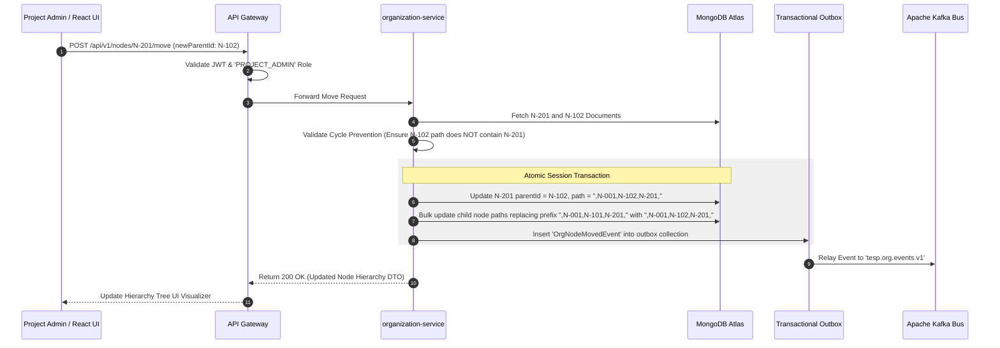
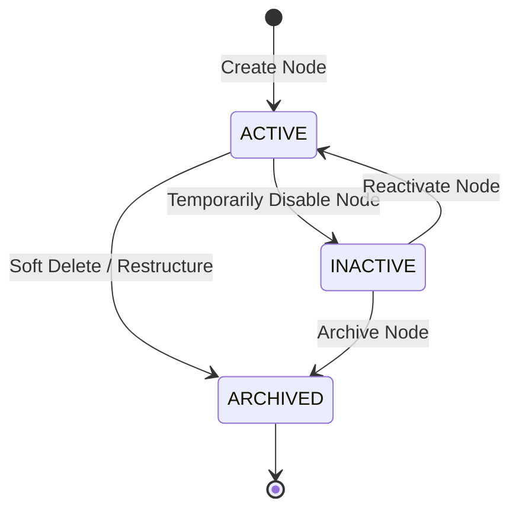

# FEAT-002: Dynamic Organizational Hierarchy Management

| Metadata Field | Value |
|---|---|
| **Feature ID** | FEAT-002 |
| **Title** | Dynamic Organizational Hierarchy Management |
| **Category** | Core Domain / Enterprise Structure |
| **Version** | 1.0.0 |
| **Status** | Approved |
| **Owner** | Principal Enterprise Solution Architect |
| **Last Updated** | 2026-08-05 |
| **Dependencies** | `DOC-001-PROJECT-BLUEPRINT.md`, `DOC-002-SERVICE-ARCHITECTURE.md`, `DOC-003-DATABASE-PHILOSOPHY-AND-METAMODEL.md`, `DOC-004-ORGANIZATION-AND-HIERARCHY-DOMAIN.md`, `FEAT-001-PROJECT-CONFIGURATION.md` |
| **Related Features** | `FEAT-003-EMPLOYEE-MANAGEMENT`, `FEAT-006-RESPONSE-INTAKE`, `FEAT-007-ANALYTICS-ENGINE`, `FEAT-010-ACTION-PLANNING` |
| **Implementation Phase** | Phase 1 (Core Foundation) |

---

## 1. Feature Overview

The **Dynamic Organizational Hierarchy Management** feature provides the core structural backbone for enterprise modeling within TESP. Enterprise organizations operate across diverse, highly complex organizational structures (e.g., Company $\rightarrow$ Sector $\rightarrow$ Division $\rightarrow$ Region $\rightarrow$ Branch $\rightarrow$ Department $\rightarrow$ Team, or Matrix structures spanning Business Units and Functions).

TESP enforces a **Zero Hardcoded Hierarchies** architectural principle. Rather than hardcoding fixed depth levels or node types in application code or relational database tables, the platform models organizational structures as an arbitrary, n-depth tree using the **Materialized Path** pattern in MongoDBAtlas. Every node contains dynamic metadata, configurable node types, parent-child linkages, and ancestor paths enabling instant sub-tree slice-and-dice analytics and fine-grained data access scoping.

---

## 2. Business Purpose

To enable enterprise clients to accurately map any organizational structure—regardless of complexity, geographic distribution, or subsidiary depth—into TESP with zero code customization, allowing corporate leaders, HR managers, and line supervisors to view engagement analytics at their exact span of control.

---

## 3. Business Value

- **Unlimited Hierarchy Depth**: Support global multi-nationals operating across 20+ organizational levels.
- **Instant Organizational Restructuring**: Re-parent organizational nodes (e.g., moving a branch under a new division) atomically in < 300ms without data corruption.
- **Automated Data Access Boundaries**: Sub-tree scoping automatically restricts managers to viewing survey data strictly within their authorized organizational path.
- **Dynamic Demographic Slicing**: Compare engagement metrics across custom node types (e.g., Factories vs Retail Stores vs Corporate Offices).

---

## 4. Problem Statement

Traditional survey tools force enterprises to conform to rigid 3-level hierarchies (Company $\rightarrow$ Department $\rightarrow$ Team). When an enterprise restructures, legacy tools corrupt historical survey benchmarks or require manual database migrations. TESP solves this with dynamic, metadata-driven materialized path trees and atomic re-parenting.

---

## 5. Goals / Non-Goals

### Goals
- Support arbitrary, n-depth organizational trees per Project workspace.
- Implement atomic node re-parenting with automated cycle prevention algorithms.
- Provide fast sub-tree query evaluation ($< 10\text{ ms SLA}$) using MongoDB path prefix indexes.
- Publish asynchronous domain events (`OrgNodeCreated`, `OrgNodeMoved`, `OrgNodeArchived`) to Kafka.
- Provide a responsive React 19+ / Vite drag-and-drop hierarchy tree visualizer.

### Non-Goals
- Individual employee assignment (handled by `FEAT-003: Employee Management`).
- Historical temporal snapshotting of organization trees (covered in future extensions).

---

## 6. Dependencies

- `DOC-001-PROJECT-BLUEPRINT.md`: Zero Hardcoded Hierarchies architectural principle.
- `DOC-002-SERVICE-ARCHITECTURE.md`: `organization-service` microservice specification.
- `DOC-003-DATABASE-PHILOSOPHY-AND-METAMODEL.md`: `organization_nodes` collection schema.
- `DOC-004-ORGANIZATION-AND-HIERARCHY-DOMAIN.md`: Materialized Path tree algorithms.
- `FEAT-001-PROJECT-CONFIGURATION.md`: Project configuration and node type metadata definitions.

---

## 7. Related Features

- `FEAT-003: Employee Roster & Demographic Attribute Management` (Assigns employees to nodes).
- `FEAT-007: Real-Time Engagement Analytics Engine` (Slices metrics by node paths).
- `FEAT-009: Dynamic White-Label Reporting Engine` (Filters reports by node scope).
- `FEAT-010: Closed-Loop Action Planning Module` (Links remedial actions to node IDs).

---

## 8. User Roles & Personas

| Role Code | Role Name | Persona Description | Access Level |
|---|---|---|---|
| `PROJECT_ADMIN` | Project Administrator | Client HR Operations Lead defining enterprise structure and node types. | Full CRUD & Re-parenting on Organization Nodes. |
| `HR_MANAGER` | HR Manager | Regional HR Director adding new branches, departments, and teams. | Create, Update, Archive within authorized node scope. |
| `DEPARTMENT_MANAGER` | Department Manager | Line supervisor viewing their assigned node and immediate child sub-tree. | Read-only visibility of assigned node sub-tree. |

---

## 9. User Stories

### US-ORG-001: Node Type Configuration
**As a** `PROJECT_ADMIN`,  
**I want to** configure dynamic Node Types (e.g., Company, Sector, Division, Branch, Department, Team) for my Project workspace,  
**So that** our enterprise terminology is accurately reflected across the platform.

### US-ORG-002: Organizational Node Creation
**As an** `HR_MANAGER`,  
**I want to** add a new Branch node under a specific Region parent node,  
**So that** employees in that new branch can be assigned and included in upcoming surveys.

### US-ORG-003: Atomic Node Re-Parenting
**As a** `PROJECT_ADMIN`,  
**I want to** move an entire Department node (and all its sub-teams) to a new Division parent,  
**So that** our platform hierarchy reflects our recent corporate restructuring.

### US-ORG-004: Interactive Hierarchy Exploration
**As a** `DEPARTMENT_MANAGER`,  
**I want to** view a visual tree diagram of my organizational unit,  
**So that** I can understand our department's structural breakdown and reporting lines.

---

## 10. Functional Requirements

| Requirement ID | Title | Technical Specification & Description | Priority |
|---|---|---|---|
| **FR-ORG-001** | Arbitrary Depth Materialized Path | `organization-service` must store nodes with a `path` string (e.g., `,N-001,N-101,N-201,`) updated automatically upon node insertion or move. | Critical |
| **FR-ORG-002** | Cycle Prevention Guard | System MUST validate that a target new parent node is NOT contained within the target node's own descendant sub-tree prior to executing a re-parent operation. | Critical |
| **FR-ORG-003** | Atomic Sub-Tree Path Updating | Moving node $N$ must update $N$'s path and bulk update all descendant child node paths within a single MongoDB session transaction. | Critical |
| **FR-ORG-004** | Fast Sub-Tree Query Indexing | MongoDB collection `organization_nodes` must maintain compound index `{ projectId: 1, path: 1 }` for regex prefix matching (`^,ROOT,NODE_A,`). | Critical |
| **FR-ORG-005** | Ancestor Lineage API | System must provide an API returning the ordered array of ancestor nodes from Root down to the requested `nodeId`. | High |
| **FR-ORG-006** | Node Deletion Integrity Guard | System MUST prevent deletion of an Organization Node if it contains active child nodes or assigned active employees. | High |
| **FR-ORG-007** | Asynchronous Kafka Event Emission | Node re-parenting operations must publish an `OrgNodeMovedEvent` to `tesp.org.events.v1` containing `nodeId`, `oldPath`, and `newPath`. | High |
| **FR-ORG-008** | Dynamic Attribute Metamodel | Nodes must support dynamic key-value custom attributes (e.g., `CostCenterCode`, `RegionCategory`, `FacilityType`) without schema changes. | Medium |

---

## 11. Business Rules

| Rule ID | Domain | Business Rule Statement | Enforcement Logic |
|---|---|---|---|
| **BR-ORG-001** | Zero Hardcoded Levels | Software logic MUST NEVER hardcode hierarchy depth limits or assume fixed level names (e.g., code must not assume level 3 is always 'Department'). | Code review assertion & dynamic path parser. |
| **BR-ORG-002** | Unique Node Identifier | Node IDs (`nodeId`) must be unique within a Project workspace. | MongoDB compound unique index `{ projectId: 1, nodeId: 1 }`. |
| **BR-ORG-003** | Single Parent Constraint | An Organization Node can have at most one primary parent node (`parentId`). | Data schema constraint. |
| **BR-ORG-004** | Sub-tree Data Scope Isolation | Users assigned to `nodeId` X can only query survey analytics for nodes where `path` starts with node X's materialized path. | Ingress RBAC/ABAC filter in API Gateway. |

---

## 12. Validation Rules

| Validation ID | Field / Parameter | Validation Rule & Condition | Failure Action |
|---|---|---|---|
| **VR-ORG-001** | `nodeId` | Must match regex `^N-[A-Za-z0-9_-]{3,20}$`. | HTTP 400 Bad Request ("Invalid Node ID format"). |
| **VR-ORG-002** | `parentId` | Must reference an existing, active Node ID within the same `projectId`. | HTTP 400 Bad Request ("Parent Node does not exist"). |
| **VR-ORG-003** | `type` | Must match a configured Node Type defined in `FEAT-001` project settings. | HTTP 400 Bad Request ("Unrecognized Node Type"). |
| **VR-ORG-004** | Re-parenting Move | Target `newParentId` must NOT be equal to `nodeId` OR present in `node.path`. | HTTP 409 Conflict ("Circular hierarchy move detected"). |

---

## 13. Permission Rules

| Permission ID | Role | Action Allowed | Constraint / Conditions |
|---|---|---|---|
| **PR-ORG-001** | `PROJECT_ADMIN` | CREATE, READ, UPDATE, DELETE, MOVE Node | Full access across entire project hierarchy tree. |
| **PR-ORG-002** | `HR_MANAGER` | CREATE, READ, UPDATE Node | Scoped to assigned `nodeScope` sub-tree. |
| **PR-ORG-003** | `DEPARTMENT_MANAGER` | READ Node & Sub-Tree | Read-only visibility of assigned node sub-tree. |
| **PR-ORG-004** | `SURVEY_RESPONDENT` | NO Direct API Access | Node information consumed indirectly via survey metadata. |

---

## 14. Workflows & Sequence Diagrams

### Atomic Node Re-Parenting Sequence Diagram



---

## 15. State Machines

### Organization Node Status Lifecycle



---

## 16. Data Model & MongoDB Collection Relationships

### MongoDB Collection: `tesp_org_db.organization_nodes`

```json
{
  "$jsonSchema": {
    "bsonType": "object",
    "required": ["projectId", "nodeId", "name", "type", "path", "depth", "status"],
    "properties": {
      "_id": { "bsonType": "objectId" },
      "projectId": { "bsonType": "string" },
      "nodeId": { "bsonType": "string" },
      "name": { "bsonType": "string" },
      "type": { "bsonType": "string", "description": "Node Type e.g. COMPANY, DIVISION, BRANCH, DEPARTMENT, TEAM" },
      "parentId": { "bsonType": ["string", "null"] },
      "path": { "bsonType": "string", "description": "Materialized path e.g. ,N-001,N-101,N-201," },
      "depth": { "bsonType": "int" },
      "displayOrder": { "bsonType": "int" },
      "status": { "enum": ["ACTIVE", "INACTIVE", "ARCHIVED"] },
      "attributes": {
        "bsonType": "object",
        "description": "Dynamic custom key-value attributes"
      },
      "version": { "bsonType": "int" },
      "isDeleted": { "bsonType": "bool" },
      "createdAt": { "bsonType": "date" },
      "updatedAt": { "bsonType": "date" }
    }
  }
}
```

---

## 17. API Requirements

### 1. Create Organization Node
- **HTTP Method**: `POST`
- **Path**: `/api/v1/nodes`
- **Request Body**:
  ```json
  {
    "projectId": "PRJ-99201",
    "nodeId": "N-301",
    "name": "Engineering Department",
    "type": "DEPARTMENT",
    "parentId": "N-201",
    "displayOrder": 1,
    "attributes": {
      "CostCenter": "CC-9920",
      "OfficeLocation": "Building B"
    }
  }
  ```
- **Response**: `201 Created`

### 2. Move / Re-parent Organization Node
- **HTTP Method**: `POST`
- **Path**: `/api/v1/nodes/{nodeId}/move`
- **Request Body**:
  ```json
  {
    "newParentId": "N-102"
  }
  ```
- **Response**: `200 OK`

### 3. Fetch Sub-Tree Nodes
- **HTTP Method**: `GET`
- **Path**: `/api/v1/nodes/{nodeId}/subtree`
- **Response**: `200 OK` (Returns array of child nodes matching path prefix)

---

## 18. Domain Events

### Kafka Event: `OrgNodeMovedEvent`
- **Topic**: `tesp.org.events.v1`
- **Partition Key**: `projectId`
- **Payload**:
  ```json
  {
    "eventId": "EVT-9920101",
    "eventType": "ORG_NODE_MOVED",
    "projectId": "PRJ-99201",
    "nodeId": "N-201",
    "oldPath": ",N-001,N-101,N-201,",
    "newPath": ",N-001,N-102,N-201,",
    "timestamp": "2026-08-05T19:15:00Z"
  }
  ```

---

## 19. UI & Dashboard Requirements

- **Technology**: React 19+, Vite, `@tanstack/react-virtual`, `react-flow` / D3 Tree.
- **Interactive Tree Visualizer Component**:
  - Drag-and-drop node re-parenting with real-time visual feedback and cycle warning alerts.
  - Searchable node filtering by Node Type, Name, or Custom Attribute.
  - Expandable / Collapsible sub-tree rendering for large enterprise trees (up to 50,000 nodes).

---

## 20. AI Capabilities & Automation

- **Automated Hierarchy Anomaly Detection**: AI background worker scans organization tree for orphan sub-trees, extreme depth anomalies (> 20 levels), or single-child node chains and suggests structural optimizations.

---

## 21. Security & Compliance

- **Sub-tree Scope Boundary**: API Gateway automatically appends materialized path filters based on user's JWT `nodeScope` claim.
- **Audit Event Capture**: Every node move or structural deletion logs an audit entry in `tesp_audit_db.audit_logs`.

---

## 22. Performance & Scalability Requirements

- **Sub-tree Fetch SLA**: `< 10ms (p95)` for 50,000 nodes using compound path prefix index `{ projectId: 1, path: 1 }`.
- **Re-parenting SLA**: `< 300ms (p95)` for moving sub-trees with up to 1,000 descendant nodes.

---

## 23. Test Cases & Acceptance Criteria

### Test Case: TC-ORG-001 - Sub-Tree Path Materialization
- **Given**: Parent node `N-101` with path `,N-001,N-101,`.
- **When**: Creating child node `N-201` under `N-101`.
- **Then**: `N-201` is saved with `path: ",N-001,N-101,N-201,"` and `depth: 3`.

### Test Case: TC-ORG-002 - Cycle Detection Guard Failure
- **Given**: Node `N-201` is a child of `N-101`.
- **When**: Attempting to move `N-101` to parent `N-201`.
- **Then**: HTTP 409 Conflict is returned with message `"Circular hierarchy move detected"`.

---

## 24. Future Extensions

1. **Temporal Tree Snapshots**: Point-in-time organization tree versioning for historical survey comparison.
2. **Matrix Reporting Visualization**: 2D overlay graph showing secondary matrix reporting relationships.

---

## 25. References & Related Documents

- `DOC-001-PROJECT-BLUEPRINT.md`: Master Architecture.
- `DOC-004-ORGANIZATION-AND-HIERARCHY-DOMAIN.md`: Domain Specification.
- `FEAT-001-PROJECT-CONFIGURATION.md`: Project Configuration Engine.

---

## 26. Open Questions

| Question ID | Topic | Description | Impact |
|---|---|---|---|
| **OQ-ORG-002** | Node Re-parenting Event Strategy | Should downstream analytics recalculate snapshot caches synchronously or asynchronously upon `OrgNodeMovedEvent`? (Current decision: Asynchronously via Kafka queue worker). | Re-parenting API latency vs cache freshness. |

---

## Document Status

| Field | Value |
|---|---|
| **Document Status** | Approved / Implementation-Ready |
| **Dependencies Satisfied** | `DOC-001`, `DOC-002`, `DOC-003`, `DOC-004`, `FEAT-001` |
| **Documents Affected** | `DOCUMENT_INDEX.md`, `DOCUMENT_DEPENDENCY_GRAPH.md` |
| **Next Recommended Document** | `FEAT-003: Employee Roster & Demographic Attribute Management` |
