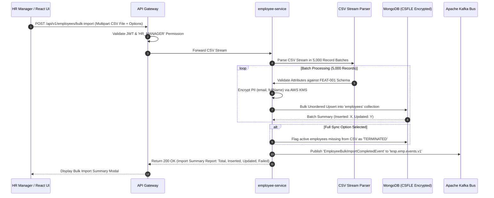
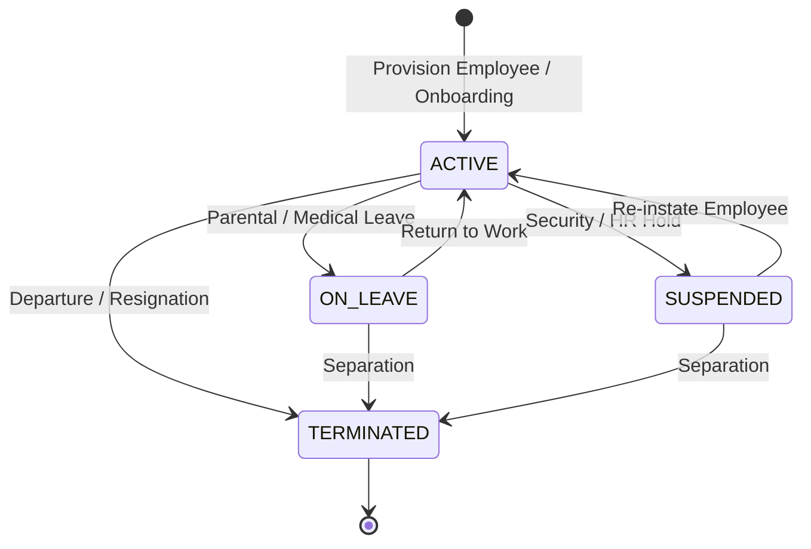

# FEAT-003: Employee Roster & Demographic Attribute Management

| Metadata Field | Value |
|---|---|
| **Feature ID** | FEAT-003 |
| **Title** | Employee Roster & Demographic Attribute Management |
| **Category** | Core Domain / Identity & Demographics |
| **Version** | 1.0.0 |
| **Status** | Approved |
| **Owner** | Principal Enterprise Solution Architect |
| **Last Updated** | 2026-08-05 |
| **Dependencies** | `DOC-001-PROJECT-BLUEPRINT.md`, `DOC-002-SERVICE-ARCHITECTURE.md`, `DOC-003-DATABASE-PHILOSOPHY-AND-METAMODEL.md`, `DOC-004-ORGANIZATION-AND-HIERARCHY-DOMAIN.md`, `FEAT-001-PROJECT-CONFIGURATION.md`, `FEAT-002-ORGANIZATION-HIERARCHY.md` |
| **Related Features** | `FEAT-005-SURVEY-DISTRIBUTION`, `FEAT-006-RESPONSE-INTAKE`, `FEAT-007-ANALYTICS-ENGINE` |
| **Implementation Phase** | Phase 1 (Core Foundation) |

---

## 1. Feature Overview

The **Employee Roster & Demographic Attribute Management** feature provides the centralized employee dataset and demographic profiling subsystem for the Talnova Enterprise Survey Platform (TESP). Every enterprise survey campaign relies on an accurate, up-to-date employee directory linked directly to the dynamic organizational hierarchy established in `FEAT-002`.

Rather than requiring database schema changes for every enterprise client's unique HR fields, TESP implements a **Schema-Flexible Demographic Attribute Metamodel**. Employee records combine core identity attributes (encrypted PII via MongoDB CSFLE) with dynamic key-value demographic maps (e.g., `Tenure`, `Gender`, `AgeGroup`, `EmploymentType`, `JobBand`, `WorkLocation`). The subsystem supports high-throughput CSV bulk ingestion, automated HRIS delta synchronization (Workday, SAP SuccessFactors, BambooHR), matrix organizational reporting assignments, and real-time demographic snapshot creation for survey response slicing.

---

## 2. Business Purpose

To maintain an accurate, enterprise-grade employee directory supporting target participant filtering, survey invitation delivery, demographic analytics slicing, and automated HRIS synchronization without manual data entry.

---

## 3. Business Value

- **Dynamic Demographic Slicing**: Slice engagement metrics by any corporate demographic dimension (e.g., tenure $\times$ department $\times$ gender) without schema migrations.
- **Automated HRIS Synchronization**: Eliminate manual employee provisioning overhead via REST API integrations with Workday and SAP SuccessFactors.
- **Enterprise PII Encryption**: Zero-leakage compliance with GDPR, CCPA, and enterprise security policies using Client-Side Field Level Encryption (CSFLE).
- **Matrix Reporting Support**: Enable employees to belong to a primary department while participating in secondary cross-functional agile teams.

---

## 4. Problem Statement

Enterprise clients use vastly different HRIS systems and track completely different employee attributes (e.g., one company tracks `JobBand` and `PlantLocation`, another tracks `Grade` and `SubFunction`). Traditional survey software forces HR teams to map data into rigid preset columns or hire developers to modify database tables. TESP solves this with dynamic custom attribute schemas and automated delta import pipelines.

---

## 5. Goals / Non-Goals

### Goals
- Store employee records with dynamic key-value demographic attribute maps.
- Encrypt sensitive PII fields (`email`, `fullName`, `phoneNumber`) using MongoDB CSFLE.
- Support bulk CSV roster imports (up to 100,000 employees per upload) with delta matching logic.
- Synchronize employees to primary and matrix `nodeId` assignments from `FEAT-002`.
- Publish asynchronous domain events (`EmployeeCreated`, `EmployeeUpdated`, `EmployeeTerminated`) to Kafka.

### Non-Goals
- Full Payroll or Performance Appraisal management.
- Direct Employee SSO credential issuance (SSO authentication is managed via OIDC/SAML in `DOC-010`).

---

## 6. Dependencies

- `DOC-001-PROJECT-BLUEPRINT.md`: Master architectural blueprint & tenant context.
- `DOC-002-SERVICE-ARCHITECTURE.md`: `employee-service` microservice definition.
- `DOC-003-DATABASE-PHILOSOPHY-AND-METAMODEL.md`: `employees` MongoDB collection schema & CSFLE encryption rules.
- `DOC-004-ORGANIZATION-AND-HIERARCHY-DOMAIN.md`: Organizational node assignments.
- `FEAT-001-PROJECT-CONFIGURATION.md`: Custom attribute definitions.
- `FEAT-002-ORGANIZATION-HIERARCHY.md`: Target Organization Node IDs.

---

## 7. Related Features

- `FEAT-005: Multi-Channel Survey Distribution Engine` (Uses employee emails/phones for invitation dispatch).
- `FEAT-006: Anonymous & Authenticated Response Intake Engine` (Tags immutable demographic snapshots onto responses).
- `FEAT-007: Real-Time Engagement Analytics Engine` (Slices analytics by demographic attributes).

---

## 8. User Roles & Personas

| Role Code | Role Name | Persona Description | Access Level |
|---|---|---|---|
| `PROJECT_ADMIN` | Project Administrator | Client HRIS Administrator managing roster imports and HRIS API keys. | Full CRUD & Sync control over employee roster. |
| `HR_MANAGER` | HR Manager | Regional HR Partner managing local employee additions, transfers, and terminations. | Create, Read, Update within assigned `nodeScope`. |
| `DEPARTMENT_MANAGER` | Department Manager | Line supervisor viewing team roster and reporting structure. | Read-only access to direct team roster. |

---

## 9. User Stories

### US-EMP-001: Bulk CSV Roster Upload
**As an** `HR_MANAGER`,  
**I want to** upload a corporate employee CSV file containing 10,000 records,  
**So that** new hires are added, transferred employees are updated, and departed employees are marked as terminated automatically.

### US-EMP-002: Dynamic Demographic Attribute Definition
**As a** `PROJECT_ADMIN`,  
**I want to** configure custom employee attributes (e.g., `ShiftPattern`, `RemoteStatus`, `WorkLocation`),  
**So that** we can analyze survey results across these specific organizational dimensions.

### US-EMP-003: Matrix Reporting Assignment
**As an** `HR_MANAGER`,  
**I want to** assign an employee to a primary Department node and secondary Matrix Agile Team nodes,  
**So that** the employee is correctly included in surveys launched for both organizational units.

### US-EMP-004: Automated HRIS Synchronization
**As a** `PROJECT_ADMIN`,  
**I want to** configure an automated nightly HRIS sync job with Workday,  
**So that** our employee directory stays perfectly synchronized without manual CSV exports.

---

## 10. Functional Requirements

| Requirement ID | Title | Technical Specification & Description | Priority |
|---|---|---|---|
| **FR-EMP-001** | Dynamic Key-Value Attribute Storage | `employee-service` must store employee demographic attributes as dynamic key-value maps validated against `customAttributeDefinitions` defined in `FEAT-001`. | Critical |
| **FR-EMP-002** | Client-Side Field Level Encryption (CSFLE) | PII fields (`email`, `fullName`, `phoneNumber`) MUST be encrypted client-side using AWS KMS before writing to MongoDB Atlas. | Critical |
| **FR-EMP-003** | High-Speed Bulk CSV Processing | System must ingest CSV roster files using streaming batch upserts (5,000 records / batch) executing delta matching by `employeeId`. | Critical |
| **FR-EMP-004** | Delta Matching & Termination Handling | Bulk CSV imports must update existing records, insert new `employeeId` records, and flag unlisted active employees as `TERMINATED` (if full sync mode selected). | Critical |
| **FR-EMP-005** | Primary & Matrix Node Assignments | Employee profile must link to exactly one primary `nodeId` and an optional array of `matrixNodeIds`. | High |
| **FR-EMP-006** | Immutable Demographic Snapshot | System must provide an internal API generating an immutable JSON demographic snapshot for a given `employeeId` at survey response time. | High |
| **FR-EMP-007** | HRIS REST Synchronization Connector | System must provide pluggable REST adapters for Workday, SAP SuccessFactors, and BambooHR using OAuth2 credentials. | High |
| **FR-EMP-008** | Asynchronous Kafka Event Emission | Employee lifecycle events (`EmployeeCreated`, `EmployeeUpdated`, `EmployeeTerminated`) must be published to `tesp.emp.events.v1`. | High |

---

## 11. Business Rules

| Rule ID | Domain | Business Rule Statement | Enforcement Logic |
|---|---|---|---|
| **BR-EMP-001** | Unique Employee Identifier | The `employeeId` string must be unique within a Project workspace. | MongoDB compound unique index `{ projectId: 1, employeeId: 1 }`. |
| **BR-EMP-002** | Valid Primary Node Association | Every active employee MUST belong to a valid, active `nodeId` established in `FEAT-002`. | Foreign key reference check against `organization_nodes`. |
| **BR-EMP-003** | PII Encryption Mandate | Unencrypted raw PII (`email`, `fullName`) MUST NEVER be written directly to persistent storage disks. | Spring Data MongoDB CSFLE converter interceptor. |
| **BR-EMP-004** | Soft Delete & Archival Mandate | Terminated employees must set `status: "TERMINATED"` and `isDeleted: false`; hard deletion is strictly forbidden to preserve historical survey response validity. | Pre-delete validation guard in `employee-service`. |

---

## 12. Validation Rules

| Validation ID | Field / Parameter | Validation Rule & Condition | Failure Action |
|---|---|---|---|
| **VR-EMP-001** | `employeeId` | Must match regex `^[A-Za-z0-9_-]{2,30}$`. | HTTP 400 Bad Request ("Invalid Employee ID format"). |
| **VR-EMP-002** | `email` | Must be a valid RFC 5322 email address format. | HTTP 400 Bad Request ("Invalid email address format"). |
| **VR-EMP-003** | `nodeId` | Must reference an existing, active Organization Node in `FEAT-002`. | HTTP 400 Bad Request ("Assigned Node ID does not exist"). |
| **VR-EMP-004** | `attributes` | Attribute keys must match defined keys in `FEAT-001`; values must match specified data types (`STRING`, `NUMERIC`, `ENUM`, `DATE`). | HTTP 400 Bad Request ("Custom attribute type mismatch"). |

---

## 13. Permission Rules

| Permission ID | Role | Action Allowed | Constraint / Conditions |
|---|---|---|---|
| **PR-EMP-001** | `PROJECT_ADMIN` | CREATE, READ, UPDATE, BULK_IMPORT Employee | Full access across entire project roster. |
| **PR-EMP-002** | `HR_MANAGER` | CREATE, READ, UPDATE Employee | Scoped strictly to employees belonging to nodes within assigned `nodeScope`. |
| **PR-EMP-003** | `DEPARTMENT_MANAGER` | READ Team Roster | Read-only visibility of direct report roster; PII fields masked unless granted explicit HR privilege. |
| **PR-EMP-004** | `SURVEY_RESPONDENT` | NO Access to Roster API | Cannot query employee roster endpoints. |

---

## 14. Workflows & Sequence Diagrams

### Bulk CSV Roster Ingestion & Delta Match Flow



---

## 15. State Machines

### Employee Employment Lifecycle State Machine



---

## 16. Data Model & MongoDB Collection Relationships

### MongoDB Collection: `tesp_emp_db.employees`

```json
{
  "$jsonSchema": {
    "bsonType": "object",
    "required": ["projectId", "employeeId", "nodeId", "email", "fullName", "status"],
    "properties": {
      "_id": { "bsonType": "objectId" },
      "projectId": { "bsonType": "string" },
      "employeeId": { "bsonType": "string" },
      "nodeId": { "bsonType": "string", "description": "Primary Organization Node ID" },
      "matrixNodeIds": {
        "bsonType": "array",
        "items": { "bsonType": "string" }
      },
      "email": { "bsonType": "string", "description": "Encrypted via CSFLE" },
      "fullName": { "bsonType": "string", "description": "Encrypted via CSFLE" },
      "phoneNumber": { "bsonType": "string", "description": "Encrypted via CSFLE" },
      "status": { "enum": ["ACTIVE", "ON_LEAVE", "SUSPENDED", "TERMINATED"] },
      "attributes": {
        "bsonType": "object",
        "description": "Dynamic demographic custom key-value attributes e.g. Tenure, Gender, AgeGroup, Band"
      },
      "version": { "bsonType": "int" },
      "isDeleted": { "bsonType": "bool" },
      "createdAt": { "bsonType": "date" },
      "updatedAt": { "bsonType": "date" }
    }
  }
}
```

---

## 17. API Requirements

### 1. Bulk Import Employees (CSV Upload)
- **HTTP Method**: `POST`
- **Path**: `/api/v1/employees/bulk-import`
- **Headers**: `Content-Type: multipart/form-data`, `X-Project-ID: PRJ-99201`
- **Form Data**:
  - `file`: `employees_2026.csv`
  - `autoTerminateMissing`: `true`
- **Response**: `200 OK`
  ```json
  {
    "totalRecords": 10000,
    "inserted": 850,
    "updated": 9100,
    "terminated": 50,
    "failed": 0,
    "errors": []
  }
  ```

### 2. Fetch Employee Profile by ID
- **HTTP Method**: `GET`
- **Path**: `/api/v1/employees/{employeeId}`
- **Response**: `200 OK` (Returns decrypted employee record for authorized HR user)

---

## 18. Domain Events

### Kafka Event: `EmployeeBulkImportCompletedEvent`
- **Topic**: `tesp.emp.events.v1`
- **Partition Key**: `projectId`
- **Payload**:
  ```json
  {
    "eventId": "EVT-7710291",
    "eventType": "EMPLOYEE_BULK_IMPORT_COMPLETED",
    "projectId": "PRJ-99201",
    "totalRecords": 10000,
    "inserted": 850,
    "updated": 9100,
    "timestamp": "2026-08-05T19:20:00Z"
  }
  ```

---

## 19. UI & Dashboard Requirements

- **Technology**: React 19+, Vite, `@tanstack/react-table`, `@tanstack/react-virtual`.
- **Employee Directory & Roster UI Component**:
  - High-performance virtualized data grid rendering 100,000+ records with smooth scrolling.
  - Multi-attribute column filter bar (Filter by Node, Status, Tenure, Gender, Custom Attributes).
  - Drag-and-drop CSV Import Modal with interactive column-mapping wizard (maps CSV headers to system attributes).
  - Individual Employee Profile drawer with demographic history view.

---

## 20. AI Capabilities & Automation

- **Smart Column Mapping Assistant**: AI fuzzy matcher automatically maps non-standard CSV column headers (e.g., `"Work Email Address"`, `"Emp_Name"`, `"Years_Service"`) to system attributes with 98% accuracy during import wizard setup.

---

## 21. Security & Compliance

- **Client-Side Field Level Encryption (CSFLE)**: PII fields (`email`, `fullName`, `phoneNumber`) are encrypted using AWS KMS data encryption keys before leaving application memory.
- **GDPR Right-to-be-Forgotten Anonymization**: System supports scrambling PII fields for departed employees while preserving anonymized demographic tags for historical survey analytics validity.

---

## 22. Performance & Scalability Requirements

- **Bulk CSV Import SLA**: 10,000 records processed and written to MongoDB in `< 12 seconds`.
- **Directory Search SLA**: `< 15ms (p95)` for searching 100,000 employees using indexed demographic attributes.

---

## 23. Test Cases & Acceptance Criteria

### Test Case: TC-EMP-001 - Bulk CSV Delta Import Verification
- **Given**: An existing employee `EMP-101` with `nodeId: "N-100"`.
- **When**: Uploading a CSV where `EMP-101` has `nodeId: "N-200"`.
- **Then**: `EMP-101` is updated to `N-200`, `updatedAt` timestamp is modified, and no duplicate record is created.

### Test Case: TC-EMP-002 - PII Encryption Verification
- **Given**: An employee creation API call with `fullName: "John Doe"`.
- **When**: Inspecting raw MongoDB document directly via database client.
- **Then**: `fullName` field contains binary encrypted ciphertext (`BinData(6, ...)`), verifying CSFLE enforcement.

---

## 24. Future Enhancements

1. **Automated HRIS Webhook Push**: Real-time HTTP webhook receivers processing instant employee change events from Workday.
2. **Organizational Network Analysis (ONA)**: Mapping informal collaboration networks based on cross-functional demographic attributes.

---

## 25. References & Related Documents

- `DOC-001-PROJECT-BLUEPRINT.md`: Master Architecture.
- `DOC-003-DATABASE-PHILOSOPHY-AND-METAMODEL.md`: MongoDB Schema & CSFLE Encryption Specifications.
- `DOC-004-ORGANIZATION-AND-HIERARCHY-DOMAIN.md`: Organization Domain Specification.
- `FEAT-002-ORGANIZATION-HIERARCHY.md`: Dynamic Organization Hierarchy Feature.

---

## 26. Open Questions

| Question ID | Topic | Description | Impact |
|---|---|---|---|
| **OQ-EMP-001** | HRIS Rate Limiting | How should HRIS API connector handle Workday API rate-limiting during full syncs? (Current decision: Exponential backoff retries with Redis token bucket rate limiter). | HRIS sync duration. |

---

## Document Status

| Field | Value |
|---|---|
| **Document Status** | Approved / Implementation-Ready |
| **Dependencies Satisfied** | `DOC-001`, `DOC-002`, `DOC-003`, `DOC-004`, `FEAT-001`, `FEAT-002` |
| **Documents Affected** | `DOCUMENT_INDEX.md`, `DOCUMENT_DEPENDENCY_GRAPH.md` |
| **Next Recommended Document** | `FEAT-004: Metadata-Driven Survey Construction & Logic Builder` |
