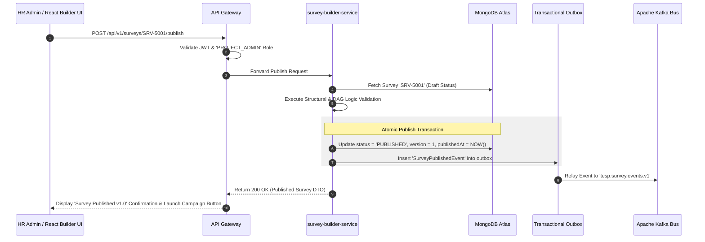
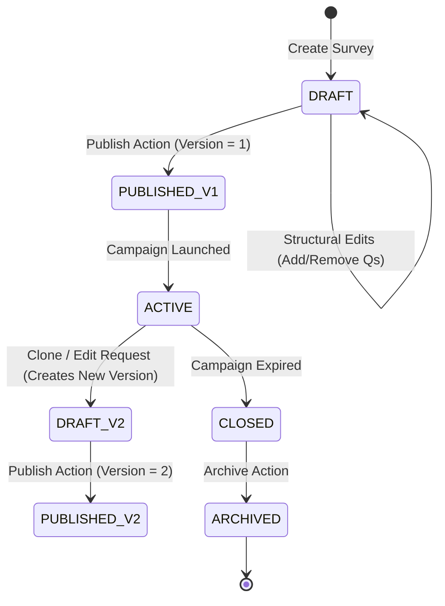

# FEAT-004: Metadata-Driven Survey Construction & Logic Builder

| Metadata Field | Value |
|---|---|
| **Feature ID** | FEAT-004 |
| **Title** | Metadata-Driven Survey Construction & Logic Builder |
| **Category** | Core Domain / Survey Engine |
| **Version** | 1.0.0 |
| **Status** | Approved |
| **Owner** | Principal Enterprise Solution Architect |
| **Last Updated** | 2026-08-05 |
| **Dependencies** | `DOC-001-PROJECT-BLUEPRINT.md`, `DOC-002-SERVICE-ARCHITECTURE.md`, `DOC-003-DATABASE-PHILOSOPHY-AND-METAMODEL.md`, `DOC-005-SURVEY-ENGINE-ARCHITECTURE.md`, `FEAT-001-PROJECT-CONFIGURATION.md` |
| **Related Features** | `FEAT-005-SURVEY-DISTRIBUTION`, `FEAT-006-RESPONSE-INTAKE`, `FEAT-007-ANALYTICS-ENGINE`, `FEAT-008-AI-ANALYTICS` |
| **Implementation Phase** | Phase 1 (Core Foundation) |

---

## 1. Feature Overview

The **Metadata-Driven Survey Construction & Logic Builder** feature provides the questionnaire design, logic compilation, and versioning subsystem for the Talnova Enterprise Survey Platform (TESP). In TESP, a survey is not a static web form; it is an immutable, versioned, metadata-driven JSON Abstract Syntax Tree (AST) constructed dynamically via `survey-builder-service`.

The feature enables HR leaders, survey methodology experts, and Daash Global consultants to design multi-page, multi-section enterprise surveys using an intuitive drag-and-drop React 19+ / Vite interface. The builder supports 10+ question types (Likert, NPS, Matrix, Choice, Ranking, Text), question theme grouping (mapped to analytical engagement indices), multi-language localization dictionaries, declarative branching/skip logic, and automated survey versioning.

---

## 2. Business Purpose

To enable enterprise client HR teams and Daash Global consulting partners to design scientifically validated, multi-lingual engagement questionnaires with complex conditional skip logic without writing code or relying on external web developers.

---

## 3. Business Value

- **Zero-Code Question & Logic Design**: Reduce survey creation timeline from weeks to hours via drag-and-drop questionnaire construction.
- **Methodological Consistency**: Re-use standardized Question Libraries and Question Groups validated by Daash Global consulting practices.
- **Historical Benchmark Integrity**: Immutable survey versioning guarantees that published active surveys preserve data fidelity across multi-year engagement benchmarks.
- **Seamless Localization**: Manage multi-language translations (English, Sinhala, Tamil, Spanish, etc.) within a unified question prompt dictionary.

---

## 4. Problem Statement

Legacy enterprise survey platforms either lack dynamic branching logic or allow users to edit live survey questions mid-campaign, corrupting historical analytics and breaking analytical aggregate models. TESP solves this through a metadata-driven JSON AST architecture combined with strict state-machine version locking.

---

## 5. Goals / Non-Goals

### Goals
- Provide drag-and-drop structural CRUD for Pages, Sections, Questions, and Question Groups.
- Support 10 core Question Types (Likert, NPS, Matrix, Single/Multiple Choice, Ranking, Short/Long Text, Numeric, Date).
- Implement a declarative JSON Branching Logic AST parser evaluated client-side in React 19+.
- Enforce immutable version publishing (Draft $\rightarrow$ Published v1.0 $\rightarrow$ Active).
- Provide a centralized Question Library for re-using validated engagement instruments.

### Non-Goals
- Participant invitation dispatch (handled by `FEAT-005: Multi-Channel Survey Distribution Engine`).
- Live response submission intake (handled by `FEAT-006: Anonymous & Authenticated Response Intake Engine`).

---

## 6. Dependencies

- `DOC-001-PROJECT-BLUEPRINT.md`: Master architectural blueprint.
- `DOC-002-SERVICE-ARCHITECTURE.md`: `survey-builder-service` microservice definition.
- `DOC-003-DATABASE-PHILOSOPHY-AND-METAMODEL.md`: `surveys` MongoDB collection schema.
- `DOC-005-SURVEY-ENGINE-ARCHITECTURE.md`: Survey state machine, question types, and scoring rules.
- `FEAT-001-PROJECT-CONFIGURATION.md`: Project supported locales.

---

## 7. Related Features

- `FEAT-005: Multi-Channel Survey Distribution Engine` (Launches campaigns using published survey versions).
- `FEAT-006: Anonymous & Authenticated Response Intake Engine` (Renders survey JSON AST for respondents).
- `FEAT-007: Real-Time Engagement Analytics Engine` (Aggregates scores based on Question Groups).
- `FEAT-008: AI-Powered NLP Sentiment & Executive Insights` (Analyzes qualitative text responses).

---

## 8. User Roles & Personas

| Role Code | Role Name | Persona Description | Access Level |
|---|---|---|---|
| `PROJECT_ADMIN` | Project Administrator | Client HR Director designing corporate pulse and annual engagement surveys. | Full CRUD, Versioning, and Publishing rights. |
| `HR_MANAGER` | HR Manager | Regional HR Lead constructing localized department pulse surveys. | Create and Edit Draft surveys within assigned scope. |
| `CONSULTANT_DAASH` | Daash Global Consultant | Senior organizational consultant curating standardized Question Libraries and theme scoring weights. | Full access to Question Libraries & Survey Templates. |

---

## 9. User Stories

### US-SRV-001: Drag-and-Drop Survey Construction
**As an** `HR_MANAGER`,  
**I want to** build a multi-page survey by dragging Likert scale, NPS, and open-text questions onto a visual canvas,  
**So that** I can design a comprehensive employee feedback questionnaire quickly.

### US-SRV-002: Declarative Skip Logic Definition
**As a** `PROJECT_ADMIN`,  
**I want to** configure a branching rule (`IF Q-102 (NPS) < 7 THEN SKIP TO Page 3 (Detractor Feedback)`),  
**So that** respondents receive tailored questions based on their previous answers.

### US-SRV-003: Multi-Language Localization Setup
**As a** `PROJECT_ADMIN`,  
**I want to** enter Sinhala and Tamil translations for English question prompts within a unified prompt dictionary,  
**So that** multi-lingual employees can complete the survey in their preferred language.

### US-SRV-004: Immutable Survey Version Publishing
**As a** `CONSULTANT_DAASH`,  
**I want to** publish a finalized survey (version 1.0),  
**So that** the survey design is locked and ready for distribution without risk of accidental structural alterations.

---

## 10. Functional Requirements

| Requirement ID | Title | Technical Specification & Description | Priority |
|---|---|---|---|
| **FR-SRV-001** | Metadata Survey Tree Representation | `survey-builder-service` must model Surveys as hierarchical JSON documents (Survey $\rightarrow$ Pages $\rightarrow$ Sections $\rightarrow$ Questions). | Critical |
| **FR-SRV-002** | Support 10+ Question Types | Builder must support `LIKERT`, `NPS`, `MATRIX`, `SINGLE_CHOICE`, `MULTIPLE_CHOICE`, `RANKING`, `SHORT_TEXT`, `LONG_TEXT`, `NUMERIC`, and `DATE` questions. | Critical |
| **FR-SRV-003** | Question Group Theme Association | Every quantitative question (`LIKERT`, `NPS`, `MATRIX`) MUST be associated with a valid `groupId` (e.g., `GRP-LEADERSHIP`, `GRP-WELLBEING`). | Critical |
| **FR-SRV-004** | Declarative Branching Logic AST | Builder must produce a JSON Abstract Syntax Tree (AST) defining conditional visibility, required fields, and page jump rules. | Critical |
| **FR-SRV-005** | Immutable Version Publishing | Publishing a survey freezes version $N$; editing a published active survey creates a new draft version $N+1$. | Critical |
| **FR-SRV-006** | Multi-Language Localization Dictionary | Question prompts, section titles, and option labels must be stored as localized key-value maps (`{ "en-US": "...", "si-LK": "..." }`). | High |
| **FR-SRV-007** | Question Library Reuse Catalog | System must allow saving questions or entire question sections to a centralized Question Library for cross-survey reuse. | High |
| **FR-SRV-008** | Asynchronous Kafka Event Emission | Publishing a survey version must publish a `SurveyPublishedEvent` to `tesp.survey.events.v1`. | High |

---

## 11. Business Rules

| Rule ID | Domain | Business Rule Statement | Enforcement Logic |
|---|---|---|---|
| **BR-SRV-001** | Active Survey Edit Lock | A Published survey version with active distribution campaigns CANNOT have questions added, deleted, or re-ordered. | Pre-mutation validator in `survey-builder-service`. |
| **BR-SRV-002** | Mandatory Question Grouping | Every `LIKERT` or `NPS` scale question MUST belong to exactly one valid `groupId` for analytical aggregation compatibility. | Form validation rule in builder UI and API. |
| **BR-SRV-003** | Unique Question Identifiers | Question IDs (`questionId`) must be unique within a single survey version document. | Document AST schema validator. |
| **BR-SRV-004** | Branching Cycle Prevention | Branching logic MUST NOT create circular page loops (e.g., Page 2 skipping to Page 1). | Logic graph DAG validation algorithm. |

---

## 12. Validation Rules

| Validation ID | Field / Parameter | Validation Rule & Condition | Failure Action |
|---|---|---|---|
| **VR-SRV-001** | `surveyId` | Must match regex `^SRV-[A-Za-z0-9_-]{3,20}$`. | HTTP 400 Bad Request ("Invalid Survey ID format"). |
| **VR-SRV-002** | `pages` | Survey must contain at least 1 Page, 1 Section, and 1 Question before publishing. | HTTP 400 Bad Request ("Cannot publish empty survey"). |
| **VR-SRV-003** | `logicRules.targetPageId` | Target page ID in skip logic MUST exist and appear AFTER the current page in display sequence. | HTTP 400 Bad Request ("Invalid forward skip target page"). |
| **VR-SRV-004** | `prompt` | Must contain at least the Project's `defaultLocale` string entry. | HTTP 400 Bad Request ("Missing default locale prompt"). |

---

## 13. Permission Rules

| Permission ID | Role | Action Allowed | Constraint / Conditions |
|---|---|---|---|
| **PR-SRV-001** | `PROJECT_ADMIN` | CREATE, READ, UPDATE, PUBLISH, ARCHIVE Survey | Full access across project survey repository. |
| **PR-SRV-002** | `HR_MANAGER` | CREATE, READ, UPDATE Draft Survey | Can create and edit draft surveys; publishing requires admin approval. |
| **PR-SRV-003** | `CONSULTANT_DAASH` | CREATE, READ, UPDATE, PUBLISH Templates | Access to client project survey templates & library. |
| **PR-SRV-004** | `SURVEY_RESPONDENT` | READ Published Survey Payload | Access restricted to active survey payloads via valid campaign token. |

---

## 14. Workflows & Sequence Diagrams

### Survey Publishing & Version Increment Flow



---

## 15. State Machines

### Survey Questionnaire Version Lifecycle State Machine



---

## 16. Data Model & MongoDB Collection Relationships

### MongoDB Collection: `tesp_survey_db.surveys`

```json
{
  "$jsonSchema": {
    "bsonType": "object",
    "required": ["projectId", "surveyId", "version", "title", "status", "pages"],
    "properties": {
      "_id": { "bsonType": "objectId" },
      "projectId": { "bsonType": "string" },
      "surveyId": { "bsonType": "string" },
      "version": { "bsonType": "int" },
      "title": { "bsonType": "object", "description": "Locale map e.g. { 'en-US': 'Annual Engagement Survey' }" },
      "description": { "bsonType": "object" },
      "status": { "enum": ["DRAFT", "PUBLISHED", "ACTIVE", "CLOSED", "ARCHIVED"] },
      "pages": {
        "bsonType": "array",
        "items": {
          "bsonType": "object",
          "required": ["pageId", "pageOrder", "sections"],
          "properties": {
            "pageId": { "bsonType": "string" },
            "pageOrder": { "bsonType": "int" },
            "sections": {
              "bsonType": "array",
              "items": {
                "bsonType": "object",
                "required": ["sectionId", "questions"],
                "properties": {
                  "sectionId": { "bsonType": "string" },
                  "questions": {
                    "bsonType": "array",
                    "items": {
                      "bsonType": "object",
                      "required": ["questionId", "type", "groupId", "prompt"],
                      "properties": {
                        "questionId": { "bsonType": "string" },
                        "type": { "enum": ["LIKERT", "NPS", "MATRIX", "SINGLE_CHOICE", "MULTIPLE_CHOICE", "RANKING", "SHORT_TEXT", "LONG_TEXT"] },
                        "groupId": { "bsonType": "string" },
                        "prompt": { "bsonType": "object" },
                        "isMandatory": { "bsonType": "bool" },
                        "logicRules": { "bsonType": "array" }
                      }
                    }
                  }
                }
              }
            }
          }
        }
      },
      "publishedAt": { "bsonType": ["date", "null"] },
      "versionHistory": { "bsonType": "array" },
      "isDeleted": { "bsonType": "bool" },
      "createdAt": { "bsonType": "date" },
      "updatedAt": { "bsonType": "date" }
    }
  }
}
```

---

## 17. API Requirements

### 1. Create / Update Survey Draft
- **HTTP Method**: `PUT`
- **Path**: `/api/v1/surveys/{surveyId}`
- **Request Body**:
  ```json
  {
    "projectId": "PRJ-99201",
    "surveyId": "SRV-5001",
    "title": { "en-US": "2026 Annual Employee Engagement Survey" },
    "pages": [
      {
        "pageId": "PAGE-1",
        "pageOrder": 1,
        "sections": [
          {
            "sectionId": "SEC-LEADERSHIP",
            "questions": [
              {
                "questionId": "Q-101",
                "type": "LIKERT",
                "groupId": "GRP-LEADERSHIP",
                "prompt": { "en-US": "My direct manager provides clear direction and feedback." },
                "isMandatory": true
              }
            ]
          }
        ]
      }
    ]
  }
  ```
- **Response**: `200 OK`

### 2. Publish Survey Version
- **HTTP Method**: `POST`
- **Path**: `/api/v1/surveys/{surveyId}/publish`
- **Response**: `200 OK` (Returns published survey payload with version `1`)

---

## 18. Domain Events

### Kafka Event: `SurveyPublishedEvent`
- **Topic**: `tesp.survey.events.v1`
- **Partition Key**: `projectId`
- **Payload**:
  ```json
  {
    "eventId": "EVT-6610291",
    "eventType": "SURVEY_PUBLISHED",
    "projectId": "PRJ-99201",
    "surveyId": "SRV-5001",
    "version": 1,
    "questionCount": 25,
    "timestamp": "2026-08-05T19:25:00Z"
  }
  ```

---

## 19. UI & Dashboard Requirements

- **Technology**: React 19+, Vite, `@hello-pangea/dnd`, `@tanstack/react-query`.
- **Drag-and-Drop Survey Canvas Component**:
  - Left sidebar containing palette of 10+ Question Types and reusable Question Library templates.
  - Middle canvas supporting drag-and-drop re-ordering of Pages, Sections, and Questions.
  - Right inspector panel for configuring Question Prompts, Locales, Mandatory flags, and Branching Logic rules.
  - Interactive Mobile & Desktop Preview Simulator displaying real-time logic evaluation.

---

## 20. AI Capabilities & Automation

- **AI Question Phrasing & Bias Advisor**: Integrated LLM assistant analyzes question prompts during survey construction, detecting leading questions, double-barreled items, or ambiguous phrasing, suggesting optimized replacements.
- **Automated Survey Translation**: One-click AI translation automatically generates Sinhala, Tamil, Spanish, and French prompt translations with human-in-the-loop review interface.

---

## 21. Security & Compliance

- **Immutable Published Versions**: Published active survey versions are write-locked in MongoDB to guarantee historical response data integrity.
- **XSS Sanitization**: Prompt strings and HTML formatting are sanitized prior to JSON document compilation.

---

## 22. Performance & Scalability Requirements

- **Survey Payload Hydration SLA**: `< 15ms (p95)` using Redis JSON document caching for active published surveys.
- **Canvas Rendering Performance**: Smooth 60 FPS drag-and-drop rendering for surveys containing 100+ questions.

---

## 23. Test Cases & Acceptance Criteria

### Test Case: TC-SRV-001 - Published Survey Edit Guard
- **Given**: A published survey `SRV-5001` with `status: "PUBLISHED"`.
- **When**: Attempting to delete a question via `PUT /api/v1/surveys/SRV-5001`.
- **Then**: HTTP 400 Bad Request is returned with error message `"Cannot modify structural design of a published survey version"`.

### Test Case: TC-SRV-002 - Branching Logic Skip Verification
- **Given**: A survey page logic rule `IF Q-101 < 3 THEN SKIP TO PAGE-3`.
- **When**: Respondent selects answer `2` for `Q-101` in the React frontend logic evaluator.
- **Then**: `PAGE-2` is skipped and the survey renderer automatically navigates to `PAGE-3`.

---

## 24. Future Extensions

1. **Adaptive Survey Flow (CAT)**: Dynamic computer adaptive testing selecting follow-up questions based on real-time item response theory (IRT) score variance.
2. **Interactive Audio Question Prompts**: Text-to-speech audio rendering for respondents in low-literacy enterprise operational environments.

---

## 25. References & Related Documents

- `DOC-001-PROJECT-BLUEPRINT.md`: Master Architecture.
- `DOC-003-DATABASE-PHILOSOPHY-AND-METAMODEL.md`: MongoDB Schema Specifications.
- `DOC-005-SURVEY-ENGINE-ARCHITECTURE.md`: Survey Engine Architecture Specification.

---

## 26. Open Questions

| Question ID | Topic | Description | Impact |
|---|---|---|---|
| **OQ-SRV-002** | Large Survey JSON Caching | Should large survey ASTs (> 1MB) be split into separate page JSON documents in MongoDB? (Current decision: Single nested MongoDB document; max survey size ~ 300KB). | Survey hydration latency. |

---

## Document Status

| Field | Value |
|---|---|
| **Document Status** | Approved / Implementation-Ready |
| **Dependencies Satisfied** | `DOC-001`, `DOC-002`, `DOC-003`, `DOC-005`, `FEAT-001` |
| **Documents Affected** | `DOCUMENT_INDEX.md`, `DOCUMENT_DEPENDENCY_GRAPH.md` |
| **Next Recommended Document** | `FEAT-005: Multi-Channel Survey Distribution Engine` |
