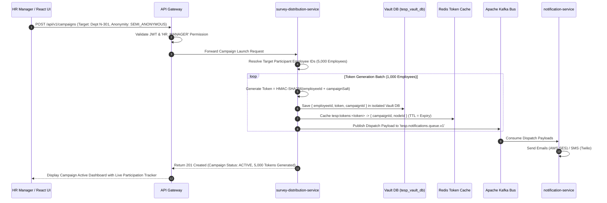
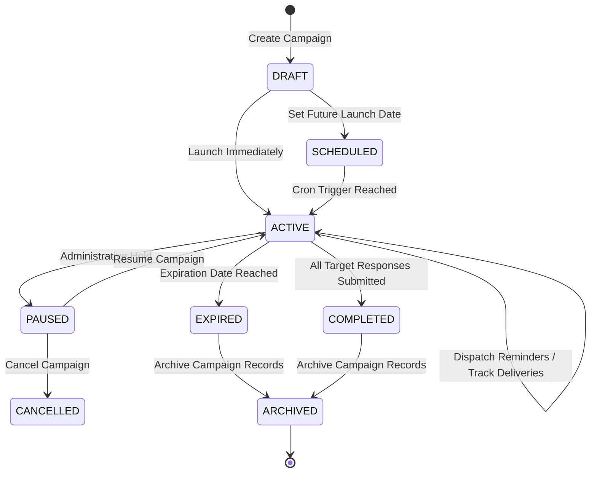

# FEAT-005: Multi-Channel Survey Distribution Engine

| Metadata Field | Value |
|---|---|
| **Feature ID** | FEAT-005 |
| **Title** | Multi-Channel Survey Distribution Engine |
| **Category** | Core Domain / Campaign Execution |
| **Version** | 1.0.0 |
| **Status** | Approved |
| **Owner** | Principal Enterprise Solution Architect |
| **Last Updated** | 2026-08-05 |
| **Dependencies** | `DOC-001-PROJECT-BLUEPRINT.md`, `DOC-002-SERVICE-ARCHITECTURE.md`, `DOC-003-DATABASE-PHILOSOPHY-AND-METAMODEL.md`, `DOC-005-SURVEY-ENGINE-ARCHITECTURE.md`, `FEAT-001-PROJECT-CONFIGURATION.md`, `FEAT-003-EMPLOYEE-MANAGEMENT`, `FEAT-004-SURVEY-BUILDER` |
| **Related Features** | `FEAT-006-RESPONSE-INTAKE`, `FEAT-007-ANALYTICS-ENGINE` |
| **Implementation Phase** | Phase 1 (Core Foundation) |

---

## 1. Feature Overview

The **Multi-Channel Survey Distribution Engine** provides the campaign scheduling, single-use token generation, multi-tier anonymity vaulting, multi-channel dispatch, and delivery tracking subsystem for TESP. Operating within `survey-distribution-service`, it enables enterprise clients to launch targeted survey campaigns to tens of thousands of employees simultaneously across diverse channels—including Email, SMS, QR Codes, On-Premise PIN Kiosks, Microsoft Teams, and Slack.

The engine manages the complete campaign lifecycle: audience selection (filtering by Organization Node or demographic attribute), cryptographic token generation tailored to the configured anonymity level (Authenticated, Semi-Anonymous, or Fully Anonymous PIN), automated reminder scheduling, real-time delivery status tracking (Sent, Delivered, Opened, Started, Completed, Expired, Failed), and rate-limited multi-channel message dispatching via Kafka queues.

---

## 2. Business Purpose

To guarantee high employee response participation rates across enterprise operational environments—from office executives on Microsoft Teams to deskless factory workers using kiosk PINs—while enforcing cryptographic anonymity protections and automated delivery tracking.

---

## 3. Business Value

- **Maximized Participation Rates**: Reach deskless, frontline, and remote employees across their native communication channels (Email, SMS, Teams, Kiosks).
- **Automated Reminder Sequences**: Boost response rates by up to 35% through non-intrusive, scheduled reminder nudges sent strictly to non-respondents.
- **Cryptographic Anonymity Trust**: Build high employee trust by decoupling identity mapping tables into isolated, secure anonymity vaults.
- **Real-Time Delivery Auditing**: Instant visibility into campaign delivery metrics, bounce rates, and channel effectiveness.

---

## 4. Problem Statement

Traditional enterprise survey tools rely strictly on email distribution, excluding deskless factory, retail, and hotel employees who lack corporate email addresses. Furthermore, legacy tools often allow administrators to inspect recipient email addresses alongside submitted answers, destroying employee trust in survey anonymity. TESP solves this through multi-channel dispatch and cryptographic token vaulting.

---

## 5. Goals / Non-Goals

### Goals
- Support 6 core Distribution Channels: Email (AWS SES/SMTP), SMS (Twilio), QR Codes, PIN Kiosks, MS Teams, and Slack.
- Generate single-use cryptographic survey tokens (HMAC-SHA256 for semi-anonymous, 6-digit PINs for kiosks).
- Maintain Redis token cache (`tesp:tokens:<token>`) for sub-millisecond token validation.
- Implement automated campaign reminder sequences targeted strictly to non-respondents.
- Publish asynchronous notification events to Kafka topic `tesp.notifications.queue.v1`.

### Non-Goals
- Survey form rendering (handled by `FEAT-006: Anonymous & Authenticated Response Intake Engine`).
- Marketing email newsletter management.

---

## 6. Dependencies

- `DOC-001-PROJECT-BLUEPRINT.md`: Master architectural blueprint.
- `DOC-002-SERVICE-ARCHITECTURE.md`: `survey-distribution-service` & `notification-service` specifications.
- `DOC-003-DATABASE-PHILOSOPHY-AND-METAMODEL.md`: `survey_campaigns` MongoDB collection schema.
- `DOC-005-SURVEY-ENGINE-ARCHITECTURE.md`: Anonymity tiers & token mechanics.
- `FEAT-003-EMPLOYEE-MANAGEMENT.md`: Target participant email and phone contacts.
- `FEAT-004-SURVEY-BUILDER.md`: Published survey versions.

---

## 7. Related Features

- `FEAT-006: Anonymous & Authenticated Response Intake Engine` (Validates and burns campaign tokens upon submission).
- `FEAT-007: Real-Time Engagement Analytics Engine` (Tracks campaign participation rate percentages).

---

## 8. User Roles & Personas

| Role Code | Role Name | Persona Description | Access Level |
|---|---|---|---|
| `PROJECT_ADMIN` | Project Administrator | HR Executive launching global corporate engagement campaigns. | Full Campaign Create, Launch, Schedule, and Cancel rights. |
| `HR_MANAGER` | HR Manager | Regional HR Director scheduling local pulse survey dispatches. | Create and Launch campaigns within assigned `nodeScope`. |
| `SURVEY_RESPONDENT` | Survey Participant | Employee receiving survey link or PIN invitation. | Single-use survey token access only. |

---

## 9. User Stories

### US-DST-001: Multi-Channel Campaign Launch
**As an** `HR_MANAGER`,  
**I want to** launch a published survey campaign to all factory employees via SMS and PIN Kiosks,  
**So that** deskless workers without corporate email addresses can participate easily.

### US-DST-002: Automated Non-Respondent Reminders
**As a** `PROJECT_ADMIN`,  
**I want to** schedule two automatic reminder nudges (Day 3 and Day 7) sent strictly to employees who have not completed the survey,  
**So that** campaign completion rates increase without spamming respondents who already submitted.

### US-DST-003: Semi-Anonymous Token Vaulting
**As a** `PROJECT_ADMIN`,  
**I want to** configure a semi-anonymous campaign with cryptographic token decoupling,  
**So that** employees trust that their individual identity cannot be linked to their submitted survey answers.

### US-DST-004: Real-Time Delivery Tracking
**As an** `HR_MANAGER`,  
**I want to** monitor a live dashboard showing email delivery rates, open rates, and completion percentages by department,  
**So that** I can identify low-participation branches and take proactive action.

---

## 10. Functional Requirements

| Requirement ID | Title | Technical Specification & Description | Priority |
|---|---|---|---|
| **FR-DST-001** | Multi-Channel Channel Router | `survey-distribution-service` must dispatch survey invitations across Email, SMS, QR Code, Kiosk PIN, MS Teams, and Slack. | Critical |
| **FR-DST-002** | Multi-Tier Cryptographic Token Generation | System must generate secure survey tokens based on campaign anonymity level: Authenticated (JWT), Semi-Anonymous (HMAC-SHA256), Fully Anonymous (Random 6-digit PIN). | Critical |
| **FR-DST-003** | In-Memory Redis Token Caching | Generated active tokens must be stored in Redis (`tesp:tokens:<token>`) with TTL equal to campaign expiration date for sub-millisecond validation. | Critical |
| **FR-DST-004** | Anonymity Vault Isolation | For semi-anonymous campaigns, the identity mapping table (`employeeId` $\leftrightarrow$ `surveyToken`) MUST be stored in an isolated database (`tesp_vault_db`) inaccessible by analytics. | Critical |
| **FR-DST-005** | Non-Respondent Reminder Engine | System must track campaign completion state per token and dispatch reminder notifications strictly to unburned/uncompleted tokens. | Critical |
| **FR-DST-006** | Asynchronous Kafka Notification Queue | Message dispatch payloads must be published to Kafka topic `tesp.notifications.queue.v1` for consumption by rate-limited notification workers. | High |
| **FR-DST-007** | Audience Target Filtering | System must allow targeting campaigns by selecting specific Organization Nodes (sub-tree materialized paths) or demographic custom attributes. | High |
| **FR-DST-008** | Real-Time Delivery Webhook Ingestion | System must process delivery status webhooks from AWS SES and Twilio, updating campaign counters (`sent`, `delivered`, `opened`, `failed`). | High |

---

## 11. Business Rules

| Rule ID | Domain | Business Rule Statement | Enforcement Logic |
|---|---|---|---|
| **BR-DST-001** | Single-Use Token Burn | A survey invitation token can ONLY be used to submit a Response once; immediately upon submission, the token MUST be invalidated/burned in Redis. | Redis atomic `DEL` command during response intake. |
| **BR-DST-002** | Anonymity Vault Unlinkability | Analytics Engine and API Gateway endpoints MUST NEVER join `tesp_response_db` with `tesp_vault_db` identity mapping tables. | Database user credential isolation & API route guard. |
| **BR-DST-003** | Campaign Expiry Guard | Submissions attempted after campaign `expirationDate` MUST be rejected with HTTP 403 Forbidden. | Token expiry timestamp assertion in `response-ingestion-service`. |
| **BR-DST-004** | Spam Guard Frequency Limit | An employee MUST NOT receive more than 1 survey invitation or reminder notification per channel within a 24-hour window. | Redis rate-limiter bucket per recipient. |

---

## 12. Validation Rules

| Validation ID | Field / Parameter | Validation Rule & Condition | Failure Action |
|---|---|---|---|
| **VR-DST-001** | `campaignId` | Must match regex `^CMP-[A-Za-z0-9_-]{3,20}$`. | HTTP 400 Bad Request ("Invalid Campaign ID format"). |
| **VR-DST-002** | `surveyVersion` | Target survey MUST be in `PUBLISHED` or `ACTIVE` state. | HTTP 400 Bad Request ("Target survey is not published"). |
| **VR-DST-003** | `expirationDate` | Expiration date must be at least 24 hours in the future and max 90 days. | HTTP 400 Bad Request ("Invalid campaign expiration date"). |
| **VR-DST-004** | `channels` | Campaign must select at least 1 valid channel (`EMAIL`, `SMS`, `KIOSK_PIN`, `TEAMS`, `SLACK`). | HTTP 400 Bad Request ("At least one channel required"). |

---

## 13. Permission Rules

| Permission ID | Role | Action Allowed | Constraint / Conditions |
|---|---|---|---|
| **PR-DST-001** | `PROJECT_ADMIN` | CREATE, LAUNCH, SCHEDULE, CANCEL Campaign | Full access across project campaign repository. |
| **PR-DST-002** | `HR_MANAGER` | CREATE, LAUNCH, SCHEDULE Campaign | Scoped to target audience within assigned `nodeScope`. |
| **PR-DST-003** | `CONSULTANT_DAASH` | READ Campaign Metrics | View delivery & participation rate metrics for client project. |
| **PR-DST-004** | `SURVEY_RESPONDENT` | NO Access to Campaign Admin API | Cannot access campaign configuration or delivery tracking APIs. |

---

## 14. Workflows & Sequence Diagrams

### Campaign Launch & Token Generation Sequence Diagram



---

## 15. State Machines

### Survey Campaign Lifecycle State Machine



---

## 16. Data Model & MongoDB Collection Relationships

### MongoDB Collection: `tesp_dist_db.survey_campaigns`

```json
{
  "$jsonSchema": {
    "bsonType": "object",
    "required": ["projectId", "campaignId", "surveyId", "surveyVersion", "title", "anonymityLevel", "channels", "status", "startDate", "expirationDate"],
    "properties": {
      "_id": { "bsonType": "objectId" },
      "projectId": { "bsonType": "string" },
      "campaignId": { "bsonType": "string" },
      "surveyId": { "bsonType": "string" },
      "surveyVersion": { "bsonType": "int" },
      "title": { "bsonType": "string" },
      "anonymityLevel": { "enum": ["AUTHENTICATED", "SEMI_ANONYMOUS", "FULLY_ANONYMOUS", "KIOSK"] },
      "channels": {
        "bsonType": "array",
        "items": { "enum": ["EMAIL", "SMS", "QR_CODE", "KIOSK_PIN", "TEAMS", "SLACK"] }
      },
      "targetAudience": {
        "bsonType": "object",
        "properties": {
          "nodeIds": { "bsonType": "array", "items": { "bsonType": "string" } },
          "demographicFilters": { "bsonType": "object" }
        }
      },
      "schedule": {
        "bsonType": "object",
        "properties": {
          "reminderDates": { "bsonType": "array", "items": { "bsonType": "date" } },
          "reminderFrequencyDays": { "bsonType": "int" }
        }
      },
      "metrics": {
        "bsonType": "object",
        "properties": {
          "totalTargeted": { "bsonType": "int" },
          "sent": { "bsonType": "int" },
          "delivered": { "bsonType": "int" },
          "opened": { "bsonType": "int" },
          "started": { "bsonType": "int" },
          "completed": { "bsonType": "int" },
          "bounced": { "bsonType": "int" }
        }
      },
      "status": { "enum": ["DRAFT", "SCHEDULED", "ACTIVE", "PAUSED", "COMPLETED", "EXPIRED", "CANCELLED"] },
      "startDate": { "bsonType": "date" },
      "expirationDate": { "bsonType": "date" },
      "isDeleted": { "bsonType": "bool" },
      "createdAt": { "bsonType": "date" },
      "updatedAt": { "bsonType": "date" }
    }
  }
}
```

---

## 17. API Requirements

### 1. Launch Survey Campaign
- **HTTP Method**: `POST`
- **Path**: `/api/v1/campaigns`
- **Request Body**:
  ```json
  {
    "projectId": "PRJ-99201",
    "campaignId": "CMP-1001",
    "surveyId": "SRV-5001",
    "surveyVersion": 1,
    "title": "Q3 Employee Pulse Survey",
    "anonymityLevel": "SEMI_ANONYMOUS",
    "channels": ["EMAIL", "TEAMS"],
    "targetAudience": {
      "nodeIds": ["N-301", "N-302"]
    },
    "schedule": {
      "reminderFrequencyDays": 4
    },
    "startDate": "2026-08-05T19:30:00Z",
    "expirationDate": "2026-08-20T23:59:59Z"
  }
  ```
- **Response**: `201 Created`

### 2. Fetch Live Campaign Metrics
- **HTTP Method**: `GET`
- **Path**: `/api/v1/campaigns/{campaignId}/metrics`
- **Response**: `200 OK` (Returns real-time sent, delivered, completed, and bounce counts)

---

## 18. Domain Events

### Kafka Event: `CampaignLaunchedEvent`
- **Topic**: `tesp.campaign.events.v1`
- **Partition Key**: `projectId`
- **Payload**:
  ```json
  {
    "eventId": "EVT-5510291",
    "eventType": "CAMPAIGN_LAUNCHED",
    "projectId": "PRJ-99201",
    "campaignId": "CMP-1001",
    "surveyId": "SRV-5001",
    "totalTargeted": 5000,
    "anonymityLevel": "SEMI_ANONYMOUS",
    "timestamp": "2026-08-05T19:30:00Z"
  }
  ```

---

## 19. UI & Dashboard Requirements

- **Technology**: React 19+, Vite, `@tanstack/react-query`, `recharts`.
- **Campaign Launch Wizard Component**:
  - Step 1: Select Survey Version & Anonymity Tier (Authenticated / Semi-Anonymous / Kiosk PIN).
  - Step 2: Target Audience Picker (Interactive Organization Node Sub-Tree selector + Demographic Filter tags).
  - Step 3: Distribution Channel Configurator (Email template preview, SMS message composer, MS Teams bot notification setup).
  - Step 4: Schedule & Reminder Configurator (Launch date, Expiry date, Reminder frequency).
- **Live Campaign Monitor Dashboard**:
  - Real-time gauge meters displaying overall Participation Rate %, Delivery Success %, Open Rate %, and Bounce Rate %.
  - Live progress bar matrix breaking down completion percentages across Organization Nodes.

---

## 20. AI Capabilities & Automation

- **AI Dispatch Timing Optimizer**: Machine learning algorithm analyzes historical email/Teams open patterns per department, automatically scheduling invitation dispatches at each employee cohort's peak engagement hour (e.g., 09:15 AM Tuesday).

---

## 21. Security & Compliance

- **Cryptographic Token Vaulting**: Identity-to-token mappings in semi-anonymous campaigns are stored in isolated, access-restricted database tables (`tesp_vault_db`) inaccessible to analytics aggregators.
- **Single-Use Token Invalidation**: Redis token keys burn immediately upon HTTP 202 response intake acceptance.

---

## 22. Performance & Scalability Requirements

- **Token Generation SLA**: `< 3.5 seconds` to generate, cryptographically hash, and store 100,000 tokens using Java Virtual Threads (Loom).
- **Redis Token Lookup SLA**: `< 1.5ms (p95)` for validating token keys during survey intake.

---

## 23. Test Cases & Acceptance Criteria

### Test Case: TC-DST-001 - Token Burn Verification
- **Given**: An active survey token `TKN-99201-XYZ` cached in Redis.
- **When**: Response intake service receives a valid response submission payload.
- **Then**: Token is atomically deleted from Redis, and subsequent intake attempts using `TKN-99201-XYZ` return HTTP 403 Forbidden.

### Test Case: TC-DST-002 - Non-Respondent Reminder Targeting
- **Given**: A campaign with 1,000 target employees where 400 have completed the survey (tokens burned).
- **When**: Automated reminder cron job executes on Day 4.
- **Then**: Exactly 600 reminder notifications are published to Kafka topic `tesp.notifications.queue.v1`; 0 reminders are sent to completed respondents.

---

## 24. Future Extensions

1. **WhatsApp & Viber Enterprise Messaging**: Integration with WhatsApp Business API for direct mobile survey dispatch in emerging markets.
2. **Dynamic QR Code Badges**: Printing unique single-use QR codes on physical employee event badges for onsite conference feedback.

---

## 25. References & Related Documents

- `DOC-001-PROJECT-BLUEPRINT.md`: Master Architecture.
- `DOC-002-SERVICE-ARCHITECTURE.md`: Microservices Topology.
- `DOC-005-SURVEY-ENGINE-ARCHITECTURE.md`: Anonymity & Token Mechanics.
- `FEAT-003-EMPLOYEE-MANAGEMENT.md`: Target Audience Dataset.
- `FEAT-004-SURVEY-BUILDER.md`: Published Survey Questionnaire payload.

---

## 26. Open Questions

| Question ID | Topic | Description | Impact |
|---|---|---|---|
| **OQ-DST-001** | Kiosk PIN Reuse Strategy | Should 6-digit PINs be recyclable after campaign completion or globally unique forever? (Current decision: Unique per campaign; recycled 90 days post-campaign archive). | PIN collision probability. |

---

## Document Status

| Field | Value |
|---|---|
| **Document Status** | Approved / Implementation-Ready |
| **Dependencies Satisfied** | `DOC-001`, `DOC-002`, `DOC-003`, `DOC-005`, `FEAT-001` to `FEAT-004` |
| **Documents Affected** | `DOCUMENT_INDEX.md`, `DOCUMENT_DEPENDENCY_GRAPH.md` |
| **Next Recommended Document** | `FEAT-006: Anonymous & Authenticated Response Intake Engine` |
