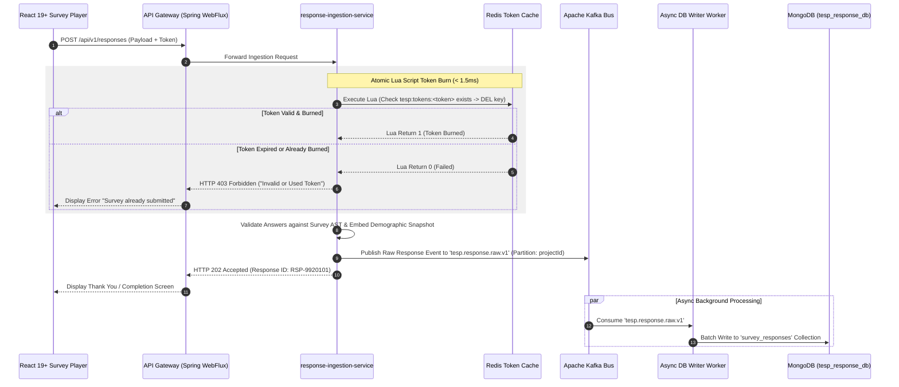
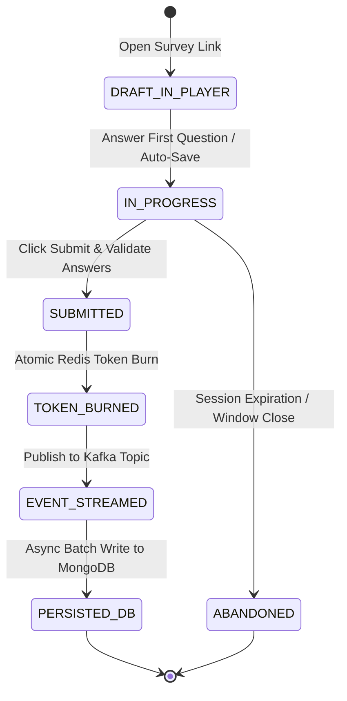

# FEAT-006: Anonymous & Authenticated Response Intake Engine

| Metadata Field | Value |
|---|---|
| **Feature ID** | FEAT-006 |
| **Title** | Anonymous & Authenticated Response Intake Engine |
| **Category** | Core Domain / Ingestion & Response Processing |
| **Version** | 1.0.0 |
| **Status** | Approved |
| **Owner** | Principal Enterprise Solution Architect |
| **Last Updated** | 2026-08-05 |
| **Dependencies** | `DOC-001-PROJECT-BLUEPRINT.md`, `DOC-002-SERVICE-ARCHITECTURE.md`, `DOC-003-DATABASE-PHILOSOPHY-AND-METAMODEL.md`, `DOC-005-SURVEY-ENGINE-ARCHITECTURE.md`, `FEAT-001-PROJECT-CONFIGURATION.md`, `FEAT-004-SURVEY-BUILDER`, `FEAT-005-SURVEY-DISTRIBUTION` |
| **Related Features** | `FEAT-007-ANALYTICS-ENGINE`, `FEAT-008-AI-ANALYTICS` |
| **Implementation Phase** | Phase 1 (Core Foundation) |

---

## 1. Feature Overview

The **Anonymous & Authenticated Response Intake Engine** provides the ultra-high-throughput survey form rendering, single-use token validation, atomic token burning, response answer payload validation, and asynchronous event streaming pipeline for TESP. Operating within `response-ingestion-service`, it handles high-volume submission spikes (up to 5,000 submissions/sec during major enterprise survey launches).

The engine supports 4 distinct Respondent Modes:
1. **Authenticated**: Respondent logs in via SSO; identity is linked to submission.
2. **Semi-Anonymous**: Single-use cryptographic token; identity is unlinked, but demographic metadata tags (`nodeId`, `Tenure`, `Gender`) are embedded for analytics slicing.
3. **Fully Anonymous**: Random PIN allocation with zero identity tracking.
4. **Kiosk Mode**: Multi-session PWA kiosk renderer for shared factory/store tablets with automatic session reset.

---

## 2. Business Purpose

To provide a frictionless, responsive, and secure survey completion experience for employees on any device (mobile web, tablet, desktop, PWA kiosk), while guaranteeing high-speed response ingestion (< 200ms SLA) and cryptographic anonymity protection.

---

## 3. Business Value

- **High Burst Capacity**: Process up to 5,000 submissions/sec without server timeouts or data loss during peak enterprise morning launches.
- **Zero Respondent Identity Exposure**: Protect employee privacy in anonymous campaigns through immediate token burning and metadata tagging.
- **Offline Kiosk Capability**: Allow deskless factory or remote employees to complete surveys on shared tablets even when internet connectivity fluctuates.
- **Immediate Data Pipeline Availability**: Stream raw responses to Apache Kafka within 5ms for real-time dashboard updates.

---

## 4. Problem Statement

During major enterprise-wide pulse survey launches, tens of thousands of employees submit responses simultaneously within a 1-hour morning window. Traditional relational database survey tools crash or experience extreme query lock contention under high write spikes. Furthermore, duplicate submissions and token replay attacks corrupt dataset accuracy. TESP solves this via asynchronous event streaming (WebFlux + Kafka) and atomic Redis token burning.

---

## 5. Goals / Non-Goals

### Goals
- Render versioned survey JSON AST payloads dynamically in a responsive React 19+ / Vite SPA player.
- Validate and burn single-use tokens atomically in Redis (`DEL tesp:tokens:<token>`) in $< 1.5\text{ ms}$.
- Support high-throughput response intake ($5,000\text{ req/sec}$) with HTTP 202 Accepted async responses.
- Embed immutable demographic snapshots (`demographicSnapshot`) on responses without attaching PII identity keys.
- Stream raw response events to Apache Kafka topic `tesp.response.raw.v1`.

### Non-Goals
- Aggregated score calculation (handled by `FEAT-007: Real-Time Engagement Analytics Engine`).
- Text sentiment NLP classification (handled by `FEAT-008: AI-Powered NLP Sentiment & Executive Insights`).

---

## 6. Dependencies

- `DOC-001-PROJECT-BLUEPRINT.md`: Master architectural blueprint.
- `DOC-002-SERVICE-ARCHITECTURE.md`: `response-ingestion-service` WebFlux microservice definition.
- `DOC-003-DATABASE-PHILOSOPHY-AND-METAMODEL.md`: `survey_responses` MongoDB collection schema.
- `DOC-005-SURVEY-ENGINE-ARCHITECTURE.md`: Survey logic rules & token mechanics.
- `FEAT-004-SURVEY-BUILDER.md`: Published Survey AST payload.
- `FEAT-005-SURVEY-DISTRIBUTION.md`: Active Campaign & Redis Token keys.

---

## 7. Related Features

- `FEAT-007: Real-Time Engagement Analytics Engine` (Consumes raw response events from Kafka for real-time metric aggregation).
- `FEAT-008: AI-Powered NLP Sentiment & Executive Insights` (Processes qualitative text answer strings).

---

## 8. User Roles & Personas

| Role Code | Role Name | Persona Description | Access Level |
|---|---|---|---|
| `SURVEY_RESPONDENT` | Survey Participant | Enterprise employee completing an active survey campaign. | Submit survey response via valid token/PIN. |
| `KIOSK_OPERATOR` | Kiosk Administrator | Factory floor HR lead setting up a shared PWA survey tablet. | Open Kiosk Mode interface & generate session PINs. |
| `SYSTEM_SERVICE` | Ingestion Gateway Service | Backend API proxy validating tokens and publishing Kafka events. | Internal system invocation. |

---

## 9. User Stories

### US-INT-001: Mobile Survey Completion
**As a** `SURVEY_RESPONDENT`,  
**I want to** open a survey link on my smartphone and complete it with smooth page transitions and autosave,  
**So that** I can give my feedback effortlessly in my native language.

### US-INT-002: Single-Use Token Security
**As a** `SURVEY_RESPONDENT`,  
**I want to** know that once I submit my survey, my unique token is invalidated immediately,  
**So that** nobody else can alter my answers or resubmit on my behalf.

### US-INT-003: Shared Kiosk PIN Mode
**As a** factory worker `SURVEY_RESPONDENT`,  
**I want to** enter a 6-digit PIN on a shared tablet, complete the survey, and have the screen automatically reset for the next worker,  
**So that** my survey experience is fast and private on a shared device.

### US-INT-004: High-Volume Morning Launch Processing
**As a** `PROJECT_ADMIN`,  
**I want to** know the platform can process 50,000 responses within 30 minutes without error messages,  
**So that** our global survey launch executes flawlessly.

---

## 10. Functional Requirements

| Requirement ID | Title | Technical Specification & Description | Priority |
|---|---|---|---|
| **FR-INT-001** | High-Throughput Async Response Intake | `response-ingestion-service` must ingest submission payloads asynchronously using Reactive WebFlux and return HTTP 202 Accepted in $< 50\text{ ms}$. | Critical |
| **FR-INT-002** | Atomic Redis Token Burn | Ingestion service MUST execute an atomic Lua script in Redis to validate token existence and delete key (`DEL tesp:tokens:<token>`) in a single network round-trip. | Critical |
| **FR-INT-003** | Server-Side Answer Validation | Service must validate submitted answer values against survey question types (`LIKERT` 1-5, `NPS` 0-10, mandatory checks) prior to event publishing. | Critical |
| **FR-INT-004** | Immutable Demographic Snapshot Tagging | For semi-anonymous surveys, system MUST copy current demographic tags (`nodeId`, `Tenure`, `Gender`) into `demographicSnapshot` without writing `employeeId`. | Critical |
| **FR-INT-005** | Real-Time Kafka Streaming | Validated raw response payloads must be published to Apache Kafka topic `tesp.response.raw.v1` with partition key `projectId`. | Critical |
| **FR-INT-006** | React 19+ / Vite Survey Player PWA | System must render survey questionnaires using a responsive React SPA featuring client-side logic AST evaluation, page progress bar, and draft auto-save. | Critical |
| **FR-INT-007** | Kiosk Mode Auto-Reset Engine | In Kiosk mode, survey player must automatically wipe local state and reset to PIN entry screen 5 seconds post-submission or after 60 seconds of inactivity. | High |
| **FR-INT-008** | Offline IndexDB Queue for Kiosks | Kiosk PWA player must queue completed submissions in local IndexDB when offline and flush to server upon network restoration. | High |

---

## 11. Business Rules

| Rule ID | Domain | Business Rule Statement | Enforcement Logic |
|---|---|---|---|
| **BR-INT-001** | Duplicate Submission Guard | A token CANNOT be used to submit a response more than once; duplicate submission requests MUST return HTTP 403 Forbidden ("Token already used"). | Atomic Redis token burn check. |
| **BR-INT-002** | Anonymity Protection Mandate | For `SEMI_ANONYMOUS` and `FULLY_ANONYMOUS` campaigns, the raw `survey_responses` document MUST NOT contain `employeeId`, `fullName`, or `email`. | Ingestion DTO sanitizer filter. |
| **BR-INT-003** | Campaign Expiry Enforcement | Responses submitted after campaign `expirationDate` MUST be rejected with HTTP 403 Forbidden ("Campaign has expired"). | Token expiry assertion check. |
| **BR-INT-004** | Response Immutability | Submitted response documents written to `tesp_response_db` are strictly read-only and CANNOT be edited or deleted via any public API. | Write-once collection security policy in MongoDB. |

---

## 12. Validation Rules

| Validation ID | Field / Parameter | Validation Rule & Condition | Failure Action |
|---|---|---|---|
| **VR-INT-001** | `responseToken` | Must exist as an active unburned key in Redis `tesp:tokens:<token>`. | HTTP 403 Forbidden ("Invalid or expired survey token"). |
| **VR-INT-002** | `answers[i].questionId` | Question ID must exist in target survey version JSON AST. | HTTP 400 Bad Request ("Unknown question ID in submission"). |
| **VR-INT-003** | `answers[i].numericValue` | For `LIKERT` scale, numeric value must be integer $1 \le V \le 5$ (or scale max); for `NPS`, $0 \le V \le 10$. | HTTP 400 Bad Request ("Numeric score out of range"). |
| **VR-INT-004** | Mandatory Questions | All questions flagged `isMandatory: true` MUST contain a valid non-null answer in submission payload. | HTTP 400 Bad Request ("Missing required mandatory question answer"). |

---

## 13. Permission Rules

| Permission ID | Role | Action Allowed | Constraint / Conditions |
|---|---|---|---|
| **PR-INT-001** | `SURVEY_RESPONDENT` | READ Survey AST, SUBMIT Response | Authorized strictly via valid campaign token or PIN. |
| **PR-INT-002** | `KIOSK_OPERATOR` | OPEN Kiosk Mode Interface | Access to kiosk initialization route only. |
| **PR-INT-003** | `PROJECT_ADMIN` | NO Direct Response Editing | Admins cannot edit or delete individual submitted response documents. |

---

## 14. Workflows & Sequence Diagrams

### High-Speed Response Intake & Token Burn Sequence Diagram



---

## 15. State Machines

### Survey Response Submission Lifecycle



---

## 16. Data Model & MongoDB Collection Relationships

### MongoDB Collection: `tesp_response_db.survey_responses`

```json
{
  "$jsonSchema": {
    "bsonType": "object",
    "required": ["projectId", "campaignId", "surveyId", "surveyVersion", "respondentType", "answers", "submittedAt"],
    "properties": {
      "_id": { "bsonType": "objectId" },
      "projectId": { "bsonType": "string" },
      "campaignId": { "bsonType": "string" },
      "surveyId": { "bsonType": "string" },
      "surveyVersion": { "bsonType": "int" },
      "respondentType": { "enum": ["AUTHENTICATED", "SEMI_ANONYMOUS", "FULLY_ANONYMOUS", "KIOSK"] },
      "responseToken": { "bsonType": "string", "description": "Hashed single-use token" },
      "nodeId": { "bsonType": "string", "description": "Associated Org Node ID" },
      "demographicSnapshot": {
        "bsonType": "object",
        "description": "Immutable key-value demographic tags at submission time e.g. { Tenure: '3-5 Years', Band: 'L3' }"
      },
      "answers": {
        "bsonType": "array",
        "items": {
          "bsonType": "object",
          "required": ["questionId", "questionType"],
          "properties": {
            "questionId": { "bsonType": "string" },
            "questionType": { "bsonType": "string" },
            "numericValue": { "bsonType": ["double", "int", "null"] },
            "textValue": { "bsonType": ["string", "null"] },
            "selectedOptions": { "bsonType": "array" }
          }
        }
      },
      "submittedAt": { "bsonType": "date" },
      "isDeleted": { "bsonType": "bool" }
    }
  }
}
```

---

## 17. API Requirements

### 1. Submit Survey Response
- **HTTP Method**: `POST`
- **Path**: `/api/v1/responses`
- **Headers**: `Content-Type: application/json`, `X-Project-ID: PRJ-99201`
- **Request Body**:
  ```json
  {
    "projectId": "PRJ-99201",
    "campaignId": "CMP-1001",
    "surveyId": "SRV-5001",
    "surveyVersion": 1,
    "responseToken": "TKN-SEMI-8810293102",
    "respondentType": "SEMI_ANONYMOUS",
    "answers": [
      {
        "questionId": "Q-101",
        "questionType": "LIKERT",
        "numericValue": 5
      },
      {
        "questionId": "Q-102",
        "questionType": "NPS",
        "numericValue": 10
      },
      {
        "questionId": "Q-103",
        "questionType": "LONG_TEXT",
        "textValue": "Great leadership support and team culture."
      }
    ]
  }
  ```
- **Response**: `202 Accepted`
  ```json
  {
    "responseId": "RSP-9920101",
    "status": "ACCEPTED",
    "message": "Survey response submitted successfully"
  }
  ```

---

## 18. Domain Events

### Kafka Event: `SurveyResponseSubmittedEvent`
- **Topic**: `tesp.response.raw.v1`
- **Partition Key**: `projectId`
- **Payload**:
  ```json
  {
    "eventId": "EVT-3310291",
    "eventType": "SURVEY_RESPONSE_SUBMITTED",
    "projectId": "PRJ-99201",
    "campaignId": "CMP-1001",
    "surveyId": "SRV-5001",
    "responseId": "RSP-9920101",
    "respondentType": "SEMI_ANONYMOUS",
    "nodeId": "N-301",
    "answerCount": 3,
    "timestamp": "2026-08-05T19:35:00Z"
  }
  ```

---

## 19. UI & Dashboard Requirements

- **Technology**: React 19+, Vite, Tailwind CSS, TanStack Query, Framer Motion.
- **Responsive Survey Player SPA Component**:
  - Clean, distraction-free UI with corporate brand colors & logo injected from `FEAT-001`.
  - Animated page transitions with smooth progress bar indicating completion percentage.
  - Autosave state persistence preserving entered answers in `sessionStorage`.
  - Full keyboard accessibility and WCAG 2.1 AA compliance for screen readers.
- **PWA Kiosk Mode Player Component**:
  - Fullscreen touch-optimized PIN entry screen for factory/store tablets.
  - Auto-reset timer resetting display 5 seconds post-submission.
  - Offline status indicator badge showing queued IndexDB submission count.

---

## 20. AI Capabilities & Automation

- **Real-Time PII Text Scrubber**: Ingestion pipeline scans open-text responses (`SHORT_TEXT`, `LONG_TEXT`), scrubbing phone numbers or email addresses before passing text to downstream sentiment processors.

---

## 21. Security & Compliance

- **Atomic Token Burn**: Single-use tokens are deleted in Redis in a single atomic Lua script call, eliminating race conditions or double-submission vulnerabilities.
- **XSS & HTML Sanitization**: All open-ended text answers are HTML-escaped and sanitized before event streaming or storage.
- **Rate-Limiting**: IP-based rate limiting (max 10 requests/sec per IP) prevents brute-force PIN submissions.

---

## 22. Performance & Scalability Requirements

- **Throughput Capacity**: System must ingest up to 5,000 response submissions per second.
- **Intake API Response SLA**: `< 50ms (p95)` HTTP 202 Accepted latency.
- **Redis Token Burn SLA**: `< 1.5ms (p95)` Lua script execution duration.

---

## 23. Test Cases & Acceptance Criteria

### Test Case: TC-INT-001 - High-Burst Concurrent Submission Ingestion
- **Given**: A k6 load test script generating 5,000 concurrent valid submission requests/sec.
- **When**: Executing against `response-ingestion-service`.
- **Then**: 100% of requests return HTTP 202 Accepted, 0 requests fail, and 95th percentile latency is $< 150\text{ ms}$.

### Test Case: TC-INT-002 - Double Submission Guard Verification
- **Given**: A valid single-use token `TKN-101`.
- **When**: Two simultaneous HTTP POST submission requests are sent with `TKN-101`.
- **Then**: Exactly one request receives HTTP 202 Accepted; the second request receives HTTP 403 Forbidden ("Token already used").

---

## 24. Future Extensions

1. **Biometric Respondent Authentication**: WebAuthn fingerprint verification for high-security internal compliance surveys.
2. **Dynamic Conversational Chatbot Player**: Conversational AI survey player rendering questions inside a interactive chat interface.

---

## 25. References & Related Documents

- `DOC-001-PROJECT-BLUEPRINT.md`: Master Architecture.
- `DOC-002-SERVICE-ARCHITECTURE.md`: Ingestion Service & Kafka Topography.
- `DOC-003-DATABASE-PHILOSOPHY-AND-METAMODEL.md`: MongoDB Schema Specifications.
- `FEAT-004-SURVEY-BUILDER.md`: Survey Question AST Payload.
- `FEAT-005-SURVEY-DISTRIBUTION.md`: Campaign Distribution & Token Mechanics.

---

## 26. Open Questions

| Question ID | Topic | Description | Impact |
|---|---|---|---|
| **OQ-INT-001** | Kafka Disk Backpressure | What happens if Kafka cluster disk reaches 90% capacity during high intake burst? (Current decision: WebFlux buffers in Redis memory queue up to 85% RAM threshold). | Memory resilience during event bus outages. |

---

## Document Status

| Field | Value |
|---|---|
| **Document Status** | Approved / Implementation-Ready |
| **Dependencies Satisfied** | `DOC-001`, `DOC-002`, `DOC-003`, `DOC-005`, `FEAT-001` to `FEAT-005` |
| **Documents Affected** | `DOCUMENT_INDEX.md`, `DOCUMENT_DEPENDENCY_GRAPH.md` |
| **Next Recommended Document** | `FEAT-007: Real-Time Engagement Analytics Engine` |
