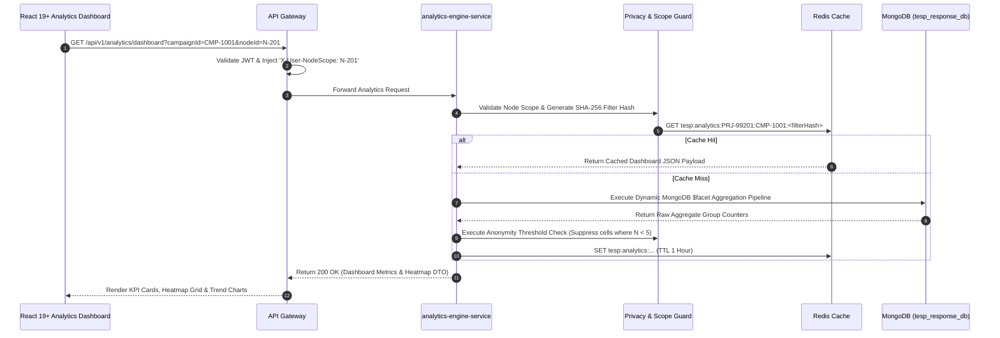
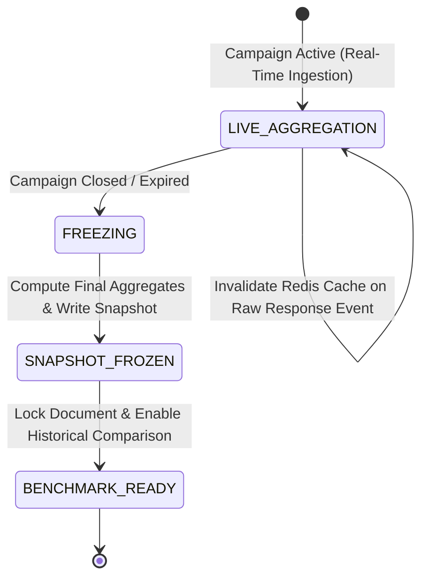

# FEAT-007: Real-Time Engagement Analytics & Heatmap Engine

| Metadata Field | Value |
|---|---|
| **Feature ID** | FEAT-007 |
| **Title** | Real-Time Engagement Analytics & Heatmap Engine |
| **Category** | Core Domain / Analytics & Insights |
| **Version** | 1.0.0 |
| **Status** | Approved |
| **Owner** | Principal Enterprise Solution Architect |
| **Last Updated** | 2026-08-05 |
| **Dependencies** | `DOC-001-PROJECT-BLUEPRINT.md`, `DOC-002-SERVICE-ARCHITECTURE.md`, `DOC-003-DATABASE-PHILOSOPHY-AND-METAMODEL.md`, `DOC-004-ORGANIZATION-AND-HIERARCHY-DOMAIN.md`, `DOC-006-ANALYTICS-ENGINE-ARCHITECTURE.md`, `FEAT-001-PROJECT-CONFIGURATION.md`, `FEAT-002-ORGANIZATION-HIERARCHY`, `FEAT-006-RESPONSE-INTAKE` |
| **Related Features** | `FEAT-008-AI-ANALYTICS`, `FEAT-009-REPORTING-ENGINE`, `FEAT-010-ACTION-PLANNING` |
| **Implementation Phase** | Phase 1 (Core Foundation) |

---

## 1. Feature Overview

The **Real-Time Engagement Analytics & Heatmap Engine** provides the quantitative metric processing, dynamic multi-dimensional slicing, 2D organizational heatmap rendering, point-in-time snapshot freezing, and benchmark comparison subsystem for TESP. Implemented in `analytics-engine-service`, it processes raw response event streams from Apache Kafka (`tesp.response.raw.v1`), aggregating eNPS, Likert 100-Point Engagement Indices, participation rates, and category scores in real time.

The engine features a dynamic MongoDB faceted aggregation query builder, Redis caching layer (`tesp:analytics:<projectId>:<campaignId>:<filterHash>`), sub-tree organizational path scoping, and automatic sample size anonymity suppression ($N < 5$) to prevent de-anonymizing small employee teams.

---

## 2. Business Purpose

To give enterprise executives, HR leaders, and line supervisors instant, actionable visibility into employee engagement metrics, eNPS scores, department comparison heatmaps, and demographic trends without waiting for manual batch processing or external data analytics consultants.

---

## 3. Business Value

- **Real-Time Decision Making**: View live participation rates and engagement scores as survey responses are submitted.
- **Interactive 2D Organizational Heatmaps**: Spot high-performing and at-risk departments across engagement themes in seconds.
- **Multi-Dimensional Slice-and-Dice**: Interactively filter scores by any combination of Organization Nodes, Tenure, Gender, Age Group, or custom attributes.
- **Anonymity Compliance Guard**: Automatic suppression of small sample sizes ($N < 5$) guarantees compliance with privacy policies.

---

## 4. Problem Statement

Enterprise executives struggle to extract meaningful insights from raw survey numbers. Standard reporting tools generate static, non-interactive summary PDFs days after survey closure. Furthermore, querying raw survey responses across multi-million row datasets causes extreme database latency. TESP solves this via faceted MongoDB aggregation pipelines, Redis caching, and interactive React 19+ widget dashboards.

---

## 5. Goals / Non-Goals

### Goals
- Compute eNPS score ($\% \text{Promoters} - \% \text{Detractors}$), Likert 100-Point Engagement Index, and Participation Rate.
- Render 2D comparative heatmaps (Organization Nodes vs Question Groups / Themes).
- Execute dynamic multi-dimensional filters (Materialized Path $\times$ Demographic Attributes).
- Automatically suppress metrics for data slices where response count $N < 5$.
- Freeze point-in-time analytical aggregates into immutable `analytical_snapshots` documents upon campaign closure.

### Non-Goals
- Natural language sentiment classification of open text (handled by `FEAT-008: AI-Powered NLP Sentiment`).
- Exporting multi-page PDF documents (handled by `FEAT-009: Dynamic White-Label Reporting`).

---

## 6. Dependencies

- `DOC-001-PROJECT-BLUEPRINT.md`: Master architectural blueprint.
- `DOC-002-SERVICE-ARCHITECTURE.md`: `analytics-engine-service` microservice definition.
- `DOC-003-DATABASE-PHILOSOPHY-AND-METAMODEL.md`: `survey_responses` and `analytical_snapshots` schemas.
- `DOC-004-ORGANIZATION-AND-HIERARCHY-DOMAIN.md`: Materialized path sub-tree filtering.
- `DOC-006-ANALYTICS-ENGINE-ARCHITECTURE.md`: Mathematical scoring formulas & pipeline specs.
- `FEAT-002-ORGANIZATION-HIERARCHY.md`: Target node scope boundaries.
- `FEAT-006-RESPONSE-INTAKE.md`: Raw response stream source.

---

## 7. Related Features

- `FEAT-008: AI-Powered NLP Sentiment & Executive Insights` (Complements quantitative scores with qualitative sentiment).
- `FEAT-009: Dynamic White-Label Reporting & Export` (Renders analytical heatmaps into PDF/XLSX files).
- `FEAT-010: Closed-Loop Action Planning & Remediation Module` (Auto-creates action plan drafts when scores drop below $60\%$).

---

## 8. User Roles & Personas

| Role Code | Role Name | Persona Description | Access Level |
|---|---|---|---|
| `EXECUTIVE` | C-Suite Executive | CEO or Chief People Officer reviewing company-wide engagement scores and heatmaps. | Global Read-only access across all organizational nodes. |
| `HR_MANAGER` | HR Director | Division HR Lead identifying low-engagement branches and analyzing demographic trends. | Full Read access within assigned regional `nodeScope`. |
| `DEPARTMENT_MANAGER` | Department Manager | Line supervisor reviewing direct team engagement scores and participation rates. | Read access restricted to assigned department sub-tree path. |

---

## 9. User Stories

### US-ANL-001: Real-Time Executive Dashboard
**As an** `EXECUTIVE`,  
**I want to** view a real-time dashboard displaying our overall corporate eNPS, engagement score cards, and overall participation rate,  
**So that** I have instant visibility into current employee sentiment during an active campaign.

### US-ANL-002: Organizational Heatmap Exploration
**As an** `HR_MANAGER`,  
**I want to** view an interactive 2D heatmap grid comparing Department Nodes (vertical axis) against Engagement Themes (horizontal axis),  
**So that** I can immediately spot which departments have low leadership or communication scores (red cells).

### US-ANL-003: Multi-Dimensional Demographic Slicing
**As an** `HR_MANAGER`,  
**I want to** filter survey scores by selecting `Tenure: 1-3 Years` AND `Location: Factory B`,  
**So that** I can investigate engagement levels for specific employee cohorts.

### US-ANL-004: Automated Privacy Suppression
**As a** `DEPARTMENT_MANAGER` of a small 3-person team,  
**I want to** see that team scores are marked as `SUPPRESSED (N < 5)` on dashboard widgets,  
**So that** team members know their individual survey responses cannot be isolated.

---

## 10. Functional Requirements

| Requirement ID | Title | Technical Specification & Description | Priority |
|---|---|---|---|
| **FR-ANL-001** | Real-Time eNPS Calculation | `analytics-engine-service` must compute eNPS ($[(\text{Promoters}/\text{Total}) - (\text{Detractors}/\text{Total})] \times 100$) returning score between -100 and +100. | Critical |
| **FR-ANL-002** | Likert 100-Point Engagement Index | System must calculate 100-point normalized engagement index scores ($\frac{V - V_{\min}}{V_{\max} - V_{\min}} \times 100$) for Likert questions and Question Groups. | Critical |
| **FR-ANL-003** | 2D Heatmap Matrix Aggregation | System must execute `$facet` MongoDB pipeline returning 2D cross-tabulation arrays of Organization Nodes vs Question Groups. | Critical |
| **FR-ANL-004** | Automatic Sample Size Suppression | Engine MUST automatically suppress score outputs and return `status: "SUPPRESSED"` for any filter combination where total responses $N < 5$. | Critical |
| **FR-ANL-005** | Materialized Path Sub-Tree Scope | Analytics queries MUST include `{ "demographicSnapshot.ancestorPaths": { $regex: "^,userNodePath," } }` to enforce RBAC data boundaries. | Critical |
| **FR-ANL-006** | Redis Analytics Caching | Aggregated metric results must be cached in Redis (`tesp:analytics:<projectId>:<campaignId>:<filterHash>`) with 1-hour TTL. | High |
| **FR-ANL-007** | Point-in-Time Snapshot Freezing | Upon campaign closure, engine must generate and write an immutable aggregate snapshot document to `analytical_snapshots`. | High |
| **FR-ANL-008** | Historical Benchmark Comparison | System must calculate baseline score variances ($\Delta$ Score vs past campaign snapshots) for longitudinal trend reporting. | High |

---

## 11. Business Rules

| Rule ID | Domain | Business Rule Statement | Enforcement Logic |
|---|---|---|---|
| **BR-ANL-001** | Sample Size Anonymity Guard | Application code MUST NEVER bypass the minimum sample size threshold ($N < 5$); numeric scores for small groups MUST be hidden. | Pre-response filter interceptor in `PrivacyGuard` service. |
| **BR-ANL-002** | Snapshot Immutability Rule | Analytical records stored in `analytical_snapshots` are strictly write-once and CANNOT be altered post-campaign closure. | MongoDB collection security permissions. |
| **BR-ANL-003** | Historical Baseline Source | Trend comparison APIs MUST query frozen `analytical_snapshots` documents, preserving past organizational state fidelity. | Trend API data source isolation. |
| **BR-ANL-004** | Node Scope Boundary Rule | Users with scoped roles (`DEPARTMENT_MANAGER`) CANNOT view aggregate metrics for organization nodes outside their authorized sub-tree path. | API Gateway ABAC filter check. |

---

## 12. Validation Rules

| Validation ID | Field / Parameter | Validation Rule & Condition | Failure Action |
|---|---|---|---|
| **VR-ANL-001** | `campaignId` | Must reference an existing campaign in `tesp_dist_db.survey_campaigns`. | HTTP 400 Bad Request ("Campaign ID does not exist"). |
| **VR-ANL-002** | `nodeId` | Must reference an existing, active Organization Node within user's authorized `nodeScope`. | HTTP 403 Forbidden ("Unauthorized node scope"). |
| **VR-ANL-003** | `minResponseThreshold` | Must be an integer $N \ge 5$. | HTTP 400 Bad Request ("Threshold cannot be less than 5"). |
| **VR-ANL-004** | Filter Combinations | Maximum 5 concurrent demographic attribute filters allowed per aggregation query. | HTTP 400 Bad Request ("Excessive filter parameters"). |

---

## 13. Permission Rules

| Permission ID | Role | Action Allowed | Constraint / Conditions |
|---|---|---|---|
| **PR-ANL-001** | `EXECUTIVE` | READ Analytics Dashboard & Heatmaps | Unrestricted global access across all organizational nodes. |
| **PR-ANL-002** | `HR_MANAGER` | READ Analytics Dashboard & Heatmaps | Scoped to assigned regional `nodeScope`. |
| **PR-ANL-003** | `DEPARTMENT_MANAGER` | READ Team Analytics | Scoped strictly to direct department sub-tree path. |
| **PR-ANL-004** | `SURVEY_RESPONDENT` | NO Access to Analytics API | Cannot access analytical endpoints. |

---

## 14. Workflows & Sequence Diagrams

### Real-Time Dashboard Query & Cache Hydration Sequence Diagram



---

## 15. State Machines

### Analytical Snapshot Lifecycle State Machine



---

## 16. Data Model & MongoDB Collection Relationships

### MongoDB Collection: `tesp_analytics_db.analytical_snapshots`

```json
{
  "$jsonSchema": {
    "bsonType": "object",
    "required": ["projectId", "campaignId", "surveyId", "snapshotDate", "totalResponses", "overallEnps", "overallEngagementIndex", "nodeAggregates"],
    "properties": {
      "_id": { "bsonType": "objectId" },
      "projectId": { "bsonType": "string" },
      "campaignId": { "bsonType": "string" },
      "surveyId": { "bsonType": "string" },
      "snapshotDate": { "bsonType": "date" },
      "totalResponses": { "bsonType": "int" },
      "overallEnps": { "bsonType": "double" },
      "overallEngagementIndex": { "bsonType": "double" },
      "participationRate": { "bsonType": "double" },
      "groupScores": {
        "bsonType": "array",
        "items": {
          "bsonType": "object",
          "properties": {
            "groupId": { "bsonType": "string" },
            "score": { "bsonType": "double" }
          }
        }
      },
      "nodeAggregates": {
        "bsonType": "array",
        "items": {
          "bsonType": "object",
          "properties": {
            "nodeId": { "bsonType": "string" },
            "nodePath": { "bsonType": "string" },
            "responseCount": { "bsonType": "int" },
            "status": { "enum": ["VALID", "SUPPRESSED"] },
            "enps": { "bsonType": ["double", "null"] },
            "engagementIndex": { "bsonType": ["double", "null"] }
          }
        }
      },
      "createdAt": { "bsonType": "date" }
    }
  }
}
```

---

## 17. API Requirements

### 1. Fetch Campaign Dashboard Metrics
- **HTTP Method**: `GET`
- **Path**: `/api/v1/analytics/dashboard`
- **Query Parameters**: `campaignId=CMP-1001&nodeId=N-201`
- **Response**: `200 OK`
  ```json
  {
    "campaignId": "CMP-1001",
    "nodeId": "N-201",
    "totalResponses": 450,
    "participationRate": 82.5,
    "eNPS": 42.0,
    "engagementIndex": 78.4,
    "groupScores": [
      { "groupId": "GRP-LEADERSHIP", "score": 81.2 },
      { "groupId": "GRP-WELLBEING", "score": 75.6 }
    ]
  }
  ```

### 2. Fetch Organizational Heatmap Matrix
- **HTTP Method**: `GET`
- **Path**: `/api/v1/analytics/heatmap`
- **Query Parameters**: `campaignId=CMP-1001&parentNodeId=N-101`
- **Response**: `200 OK` (Returns 2D grid matrix of child nodes vs question groups)

---

## 18. Domain Events

### Kafka Event: `AnalyticalSnapshotCreatedEvent`
- **Topic**: `tesp.analytics.snapshots.v1`
- **Partition Key**: `projectId`
- **Payload**:
  ```json
  {
    "eventId": "EVT-4410291",
    "eventType": "ANALYTICAL_SNAPSHOT_CREATED",
    "projectId": "PRJ-99201",
    "campaignId": "CMP-1001",
    "totalResponses": 450,
    "overallEnps": 42.0,
    "timestamp": "2026-08-05T19:40:00Z"
  }
  ```

---

## 19. UI & Dashboard Requirements

- **Technology**: React 19+, Vite, Tailwind CSS, `recharts`, `@tanstack/react-table`, `@tanstack/react-query`.
- **Interactive Executive Dashboard UI**:
  - Top Row: 4 Metric Cards (eNPS Score Gauge, Engagement Index %, Participation Rate %, Total Responses).
  - Middle Row: 2D Comparative Heatmap Component (Color-coded cells from deep red $< 50\%$ to deep green $> 85\%$, hover tooltips displaying sample size $N$).
  - Bottom Row: Demographic Slicer Control Bar (Multi-select dropdowns for Tenure, Gender, Age Group, Work Location) with real-time chart re-rendering.

---

## 20. AI Capabilities & Automation

- **Automated Trend Anomaly Detector**: AI background worker scans aggregated score changes between current and historical snapshots, raising automatic alerts for significant negative score drops ($> 10\%$ drop) in specific departments.
- **Key Driver Regression Analysis**: Multiple linear regression model identifies which Question Groups have the strongest statistical correlation with overall employee eNPS.

---

## 21. Security & Compliance

- **Differential Privacy Suppression**: Scores for small departments ($N < 5$) are strictly obscured in UI components and REST payloads (`status: "SUPPRESSED"`).
- **Materialized Path ABAC Scope Filter**: Database pipeline enforces materialized path prefix matching (`^,userNodePath,`), preventing unauthorized data leakage across enterprise divisions.

---

## 22. Performance & Scalability Requirements

- **Dashboard Page Render SLA**: `< 150ms (p95)` latency for cached dashboard endpoints.
- **Aggregation Pipeline SLA**: `< 450ms (p95)` for aggregating 100,000 raw responses across 50 organization nodes.

---

## 23. Test Cases & Acceptance Criteria

### Test Case: TC-ANL-001 - eNPS Calculation Accuracy
- **Given**: A dataset of 100 NPS responses (50 Promoters [9-10], 30 Passives [7-8], 20 Detractors [0-6]).
- **When**: Executing `analytics-engine-service` aggregation pipeline.
- **Then**: Calculated eNPS is exactly `+30.0` ($\frac{50}{100} \times 100 - \frac{20}{100} \times 100$).

### Test Case: TC-ANL-002 - Anonymity Suppression Guard Assertion
- **Given**: An Organization Node `N-999` with only 4 submitted survey responses.
- **When**: Fetching dashboard metrics for `N-999`.
- **Then**: Response payload returns `status: "SUPPRESSED"`, `eNPS: null`, and `engagementIndex: null`.

---

## 24. Future Extensions

1. **Real-Time Streaming Analytics**: Apache Flink stream processing for instant sub-second score updates during live events.
2. **Benchmarking Peer Comparison**: Opt-in anonymous cross-enterprise industry benchmark comparison overlays.

---

## 25. References & Related Documents

- `DOC-001-PROJECT-BLUEPRINT.md`: Master Architecture.
- `DOC-003-DATABASE-PHILOSOPHY-AND-METAMODEL.md`: MongoDB Schema Specifications.
- `DOC-006-ANALYTICS-ENGINE-ARCHITECTURE.md`: Analytics Engine Specification.
- `FEAT-002-ORGANIZATION-HIERARCHY.md`: Materialized Path Hierarchy.
- `FEAT-006-RESPONSE-INTAKE.md`: Raw Response Intake Stream.

---

## 26. Open Questions

| Question ID | Topic | Description | Impact |
|---|---|---|---|
| **OQ-ANL-002** | Redis Cache Invalidation Strategy | Should raw response events invalidate Redis cache keys immediately or at fixed 30-second intervals during heavy intake bursts? (Current decision: Fixed 30-second throttle interval during active ingestion spikes). | Database aggregation load during peak intake. |

---

## Document Status

| Field | Value |
|---|---|
| **Document Status** | Approved / Implementation-Ready |
| **Dependencies Satisfied** | `DOC-001` to `DOC-006`, `FEAT-001`, `FEAT-002`, `FEAT-006` |
| **Documents Affected** | `DOCUMENT_INDEX.md`, `DOCUMENT_DEPENDENCY_GRAPH.md` |
| **Next Recommended Document** | `FEAT-008: AI-Powered NLP Sentiment & Executive Insights` |
