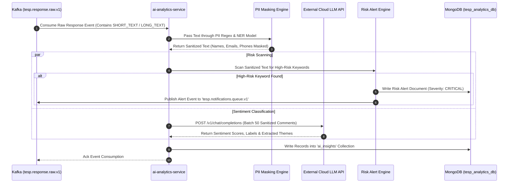
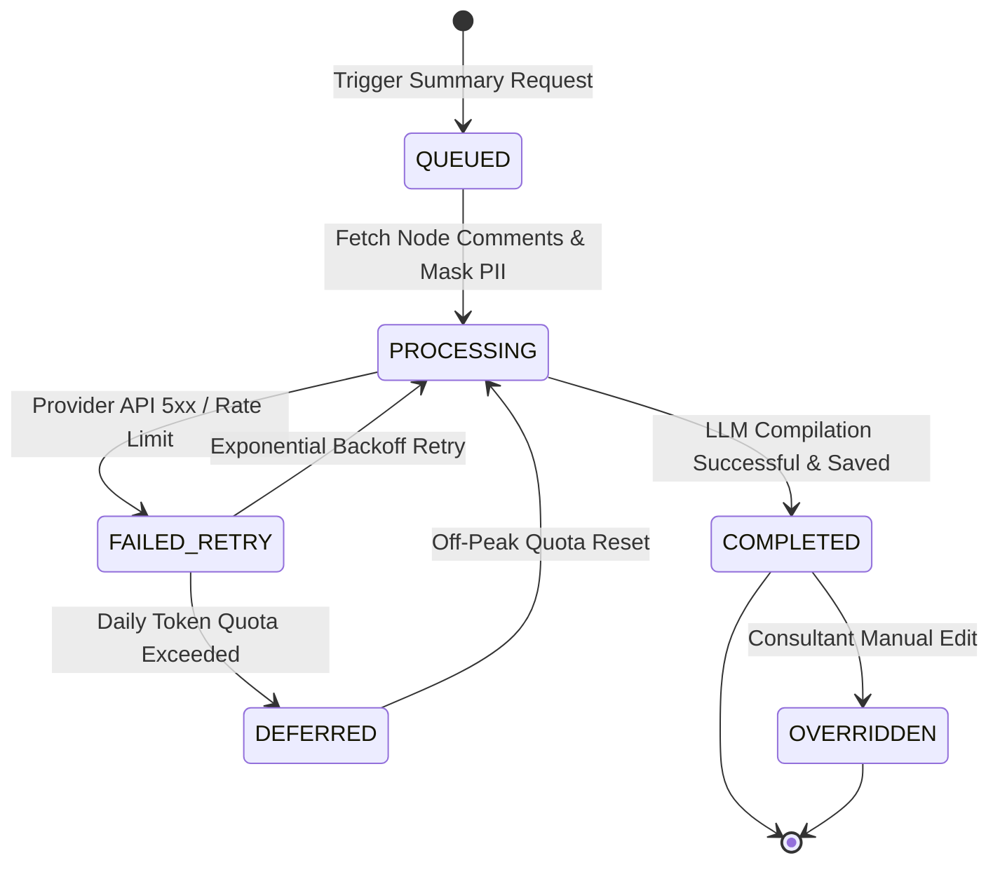

# FEAT-008: AI-Powered NLP Sentiment & Executive Insights

| Metadata Field | Value |
|---|---|
| **Feature ID** | FEAT-008 |
| **Title** | AI-Powered NLP Sentiment & Executive Insights |
| **Category** | Core Domain / AI & Intelligence |
| **Version** | 1.0.0 |
| **Status** | Approved |
| **Owner** | Principal Enterprise Solution Architect |
| **Last Updated** | 2026-08-05 |
| **Dependencies** | `DOC-001-PROJECT-BLUEPRINT.md`, `DOC-002-SERVICE-ARCHITECTURE.md`, `DOC-003-DATABASE-PHILOSOPHY-AND-METAMODEL.md`, `DOC-007-AI-ANALYTICS-AND-NLP-SPECIFICATION.md`, `FEAT-001-PROJECT-CONFIGURATION.md`, `FEAT-006-RESPONSE-INTAKE`, `FEAT-007-ANALYTICS-ENGINE` |
| **Related Features** | `FEAT-009-REPORTING-ENGINE`, `FEAT-010-ACTION-PLANNING` |
| **Implementation Phase** | Phase 1 (Advanced AI Services) |

---

## 1. Feature Overview

The **AI-Powered NLP Sentiment & Executive Insights** feature provides qualitative text feedback processing, multi-lingual sentiment classification, recurring theme extraction, workplace risk identification, PII masking pre-processing, and automated executive summary generation for TESP. Implemented within `ai-analytics-service`, it processes open-ended text answers (`SHORT_TEXT`, `LONG_TEXT`) consumed from Kafka topic `tesp.response.raw.v1`.

The subsystem utilizes a pluggable **AI Provider Adapter Architecture** supporting cloud LLMs (OpenAI GPT-4o, Google Gemini 1.5 Pro) and self-hosted local models (vLLM Llama 3). Before any text is transmitted to third-party cloud APIs, an in-memory **PII Sanitizer Engine** masks names, emails, phone numbers, and employee IDs to ensure strict GDPR compliance.

---

## 2. Business Purpose

To transform raw, unstructured employee text comments into structured sentiment scores, top recurring workplace themes, high-risk safety alerts, and concise executive summaries that complement Daash Global's consulting expertise and enable rapid leadership intervention.

---

## 3. Business Value

- **Instant Qualitative Synthesis**: Convert tens of thousands of open-ended employee comments into executive summaries in under 3 minutes.
- **Early Risk Detection**: Automatically flag critical workplace harassment, safety breaches, or extreme burnout signals before they escalate.
- **Multi-Lingual NLP Support**: Analyze employee feedback written in English, Sinhala, Tamil, Spanish, and French with equal precision.
- **Complete PII Privacy Protection**: Zero leakage of employee personal identifiers to external cloud LLM providers.

---

## 4. Problem Statement

HR teams spend hundreds of hours manually reading and categorizing open-ended survey comments, resulting in subjective bias, delayed action, and unaddressed workplace risks. Furthermore, sending unmasked employee comments to public cloud AI APIs violates enterprise security and data privacy mandates. TESP solves this via automated PII pre-sanitization, sentiment classification, theme clustering, and risk alerting.

---

## 5. Goals / Non-Goals

### Goals
- Automatically score sentiment polarity (-1.0 to +1.0) and confidence (0.0 to 1.0) for text responses.
- Mask all PII (names, emails, phone numbers, employee IDs) prior to external LLM invocation.
- Extract top 10 recurring organizational themes per Question Group across responses.
- Detect high-risk keywords (harassment, safety breaches, compliance violations) and raise instant alerts.
- Generate concise AI Executive Summaries sliced by Organization Node.

### Non-Goals
- Automated employee performance scoring.
- Direct response editing or answer tampering.

---

## 6. Dependencies

- `DOC-001-PROJECT-BLUEPRINT.md`: Master architectural blueprint.
- `DOC-002-SERVICE-ARCHITECTURE.md`: `ai-analytics-service` microservice definition.
- `DOC-003-DATABASE-PHILOSOPHY-AND-METAMODEL.md`: MongoDB collections and database boundaries.
- `DOC-007-AI-ANALYTICS-AND-NLP-SPECIFICATION.md`: AI Analytics & NLP Specification.
- `FEAT-006-RESPONSE-INTAKE.md`: Raw response text input stream.
- `FEAT-007-ANALYTICS-ENGINE.md`: Quantitative metric context for AI summaries.

---

## 7. Related Features

- `FEAT-009: Dynamic White-Label Reporting & Export` (Embeds AI executive summaries into PDF reports).
- `FEAT-010: Closed-Loop Action Planning & Remediation Module` (Links high-risk AI alerts to remedial Action Plans).

---

## 8. User Roles & Personas

| Role Code | Role Name | Persona Description | Access Level |
|---|---|---|---|
| `EXECUTIVE` | C-Suite Executive | CEO reading AI-generated executive summaries and high-level sentiment clouds. | Full Read access to global AI summaries and theme clusters. |
| `HR_MANAGER` | HR Director | HR Lead reviewing qualitative feedback, theme breakdown, and risk alerts. | Read access within assigned `nodeScope`; can override AI sentiment tags. |
| `CONSULTANT_DAASH` | Daash Global Consultant | Senior advisory consultant refining AI executive recommendations for enterprise clients. | Read and Edit access to AI executive summaries. |

---

## 9. User Stories

### US-AI-001: PII Text Masking Verification
**As an** `HR_MANAGER`,  
**I want to** know that employee names and emails are automatically scrubbed from comments before being processed by AI,  
**So that** our company complies with strict data privacy and GDPR regulations.

### US-AI-002: Workplace Risk Alert Notification
**As a** `PROJECT_ADMIN`,  
**I want to** receive an immediate high-priority alert if an open comment contains workplace safety or harassment keywords,  
**So that** HR leadership can investigate the issue immediately.

### US-AI-003: Departmental Theme Extraction
**As an** `HR_MANAGER`,  
**I want to** view the top 5 positive and negative feedback themes extracted for Factory Branch B,  
**So that** I understand the root causes behind their survey scores without reading 500 individual comments.

### US-AI-004: AI Executive Summary Generation
**As an** `EXECUTIVE`,  
**I want to** read a 3-bullet executive summary synthesizing qualitative feedback for our IT Division,  
**So that** I can grasp key employee sentiment in less than 30 seconds.

---

## 10. Functional Requirements

| Requirement ID | Title | Technical Specification & Description | Priority |
|---|---|---|---|
| **FR-AI-001** | Pre-Processing PII Text Masking | `ai-analytics-service` MUST pass open text comments through a PII Regex + NER filter, replacing emails (`[MASKED_EMAIL]`), phones (`[MASKED_PHONE]`), and names (`[MASKED_NAME]`). | Critical |
| **FR-AI-002** | Multi-Lingual Sentiment Classification | System must score sentiment polarity ($S \in [-1.0, +1.0]$) and assign labels (`POSITIVE`, `NEUTRAL`, `NEGATIVE`) with confidence scores. | Critical |
| **FR-AI-003** | Automated Theme & Keyword Clustering | System must extract top recurring themes per Question Group across responses and aggregate frequency counts into `ai_insights`. | Critical |
| **FR-AI-004** | High-Risk Keyword Alert Engine | System must scan text for safety, harassment, or compliance keywords, assigning severity (`LOW`, `MEDIUM`, `HIGH`, `CRITICAL`) and emitting audit alerts. | Critical |
| **FR-AI-005** | Pluggable AI Adapter Architecture | System must support seamless runtime switching between OpenAI GPT-4o, Google Gemini 1.5 Pro, and local self-hosted vLLM models via `AiProviderAdapter`. | High |
| **FR-AI-006** | Node Executive Summary Generator | System must generate structured JSON executive summaries (3 strengths, 3 concerns, 2 recommendations) for any designated Organization Node. | High |
| **FR-AI-007** | Manual Sentiment Override API | System must provide an API allowing authorized HR Admins or Daash Consultants to re-classify or override AI-assigned sentiment labels. | High |
| **FR-AI-008** | Asynchronous Batch Queue Processing | System must batch comments (50 items / call) and process up to 1,000 comments/minute per worker instance. | High |

---

## 11. Business Rules

| Rule ID | Domain | Business Rule Statement | Enforcement Logic |
|---|---|---|---|
| **BR-AI-001** | Zero Unmasked PII Transmission | Unmasked raw text containing employee PII MUST NEVER be transmitted across external network boundaries to third-party AI APIs. | Unit test assertion & pre-flight interceptor. |
| **BR-AI-002** | Token Budget Throttling | If project daily token budget reaches 100%, non-critical summary generation MUST defer to off-peak queue processing. | Redis token counter rate monitor. |
| **BR-AI-003** | Consultant Override Authority | Human consultant overrides MUST supersede AI-assigned tags and update aggregate sentiment counters immediately. | Audit override logger service. |
| **BR-AI-004** | High-Risk Alert Notification | Critical risk alerts (`severity: "CRITICAL"`) MUST generate immediate email notifications to designated HR compliance officers. | Event emission to `tesp.notifications.queue.v1`. |

---

## 12. Validation Rules

| Validation ID | Field / Parameter | Validation Rule & Condition | Failure Action |
|---|---|---|---|
| **VR-AI-001** | `sanitizedText` | Must contain non-empty string with at least 3 valid words. | Skip AI processing (Flag as `UNSCORED`). |
| **VR-AI-002** | `sentimentScore` | Must be a double value $-1.0 \le S \le +1.0$. | HTTP 400 Bad Request ("Invalid sentiment score range"). |
| **VR-AI-003** | `confidence` | Must be a double value $0.0 \le C \le 1.0$. | HTTP 400 Bad Request ("Invalid confidence score"). |
| **VR-AI-004** | `riskFlags.severity` | Must be one of `LOW`, `MEDIUM`, `HIGH`, `CRITICAL`. | HTTP 400 Bad Request ("Unrecognized risk severity"). |

---

## 13. Permission Rules

| Permission ID | Role | Action Allowed | Constraint / Conditions |
|---|---|---|---|
| **PR-AI-001** | `EXECUTIVE` | READ AI Summaries & Theme Clouds | Unrestricted global access across all organizational nodes. |
| **PR-AI-002** | `HR_MANAGER` | READ AI Insights, OVERRIDE Tags | Scoped strictly to nodes within assigned `nodeScope`. |
| **PR-AI-003** | `CONSULTANT_DAASH` | READ, EDIT, REGENERATE Summaries | Full editing access to AI executive recommendations for client projects. |
| **PR-AI-004** | `SURVEY_RESPONDENT` | NO Access to AI Insights API | Cannot access AI analytics endpoints. |

---

## 14. Workflows & Sequence Diagrams

### Asynchronous Text Response AI Analysis Pipeline



---

## 15. State Machines

### AI Executive Summary Processing Lifecycle



---

## 16. Data Model & MongoDB Collection Relationships

### MongoDB Collection: `tesp_analytics_db.ai_insights`

```json
{
  "$jsonSchema": {
    "bsonType": "object",
    "required": ["projectId", "campaignId", "responseId", "questionId", "sentimentScore", "sentimentLabel", "themes"],
    "properties": {
      "_id": { "bsonType": "objectId" },
      "projectId": { "bsonType": "string" },
      "campaignId": { "bsonType": "string" },
      "responseId": { "bsonType": "string" },
      "questionId": { "bsonType": "string" },
      "nodeId": { "bsonType": "string" },
      "sanitizedText": { "bsonType": "string" },
      "sentimentScore": { "bsonType": "double", "description": "Range: -1.0 to +1.0" },
      "sentimentLabel": { "enum": ["POSITIVE", "NEUTRAL", "NEGATIVE"] },
      "confidence": { "bsonType": "double" },
      "themes": {
        "bsonType": "array",
        "items": { "bsonType": "string" }
      },
      "riskFlags": {
        "bsonType": "array",
        "items": {
          "bsonType": "object",
          "properties": {
            "category": { "enum": ["SAFETY", "HARASSMENT", "BURNOUT", "COMPLIANCE"] },
            "severity": { "enum": ["LOW", "MEDIUM", "HIGH", "CRITICAL"] },
            "keyword": { "bsonType": "string" }
          }
        }
      },
      "humanOverride": {
        "bsonType": "object",
        "properties": {
          "overriddenBy": { "bsonType": "string" },
          "originalLabel": { "bsonType": "string" },
          "newLabel": { "bsonType": "string" },
          "overriddenAt": { "bsonType": "date" }
        }
      },
      "processedAt": { "bsonType": "date" }
    }
  }
}
```

---

## 17. API Requirements

### 1. Fetch AI Executive Summary for Node
- **HTTP Method**: `GET`
- **Path**: `/api/v1/ai/summaries`
- **Query Parameters**: `campaignId=CMP-1001&nodeId=N-301`
- **Response**: `200 OK`
  ```json
  {
    "campaignId": "CMP-1001",
    "nodeId": "N-301",
    "overallSentiment": "POSITIVE",
    "averageSentimentScore": 0.64,
    "topStrengths": [
      "Strong supportive team management and clear direction.",
      "High satisfaction with flexible hybrid work policies.",
      "Appreciation for recent professional development workshops."
    ],
    "topConcerns": [
      "Workload spikes during end-of-quarter financial audits.",
      "Desire for improved cross-department communication tools."
    ],
    "recommendations": [
      "Review auditing team resource allocation prior to Q4.",
      "Deploy shared inter-departmental Slack channels."
    ]
  }
  ```

### 2. Override Sentiment Tag
- **HTTP Method**: `PUT`
- **Path**: `/api/v1/ai/insights/{insightId}/override`
- **Request Body**:
  ```json
  {
    "newSentimentLabel": "NEUTRAL",
    "reason": "Comment was constructive criticism rather than negative sentiment."
  }
  ```
- **Response**: `200 OK`

---

## 18. Domain Events

### Kafka Event: `WorkplaceRiskAlertEvent`
- **Topic**: `tesp.notifications.queue.v1`
- **Partition Key**: `projectId`
- **Payload**:
  ```json
  {
    "eventId": "EVT-2210291",
    "eventType": "WORKPLACE_RISK_ALERT",
    "projectId": "PRJ-99201",
    "campaignId": "CMP-1001",
    "nodeId": "N-201",
    "category": "SAFETY",
    "severity": "CRITICAL",
    "sanitizedSnippet": "Equipment safety guard on Press 4 was bypassed...",
    "timestamp": "2026-08-05T19:42:00Z"
  }
  ```

---

## 19. UI & Dashboard Requirements

- **Technology**: React 19+, Vite, Tailwind CSS, `recharts`, `framer-motion`.
- **AI Sentiment & Insights UI Panel**:
  - Top Row: 3 Sentiment Distribution Donut Gauges (% Positive, % Neutral, % Negative) + Average Polarity Meter (-1.0 to +1.0).
  - Middle Row: Interactive Topic Cloud Component (Clickable theme chips filtering underlying comment stream).
  - Right Drawer: AI Executive Summary Card displaying 3 Strengths, 3 Concerns, and 2 Actionable Recommendations with one-click "Export to Slide" button.
  - Risk Alert Banner: Highlighting critical compliance or safety alerts with direct link to action planning module.

---

## 20. AI Capabilities & Automation

- **Automated Multi-lingual Sentiment Model**: Transformer-based NLP model scoring text in English, Sinhala, Tamil, Spanish, and French with equal baseline precision.
- **Automated PII Sanitization**: Combined Regex + Spacy NER model masking names, emails, phone numbers, and employee IDs prior to external LLM calls.

---

## 21. Security & Compliance

- **Zero-Data-Retention Contracts**: AI provider integrations (OpenAI Enterprise / GCP Vertex AI) mandate zero data retention (no storing or training on customer text comments).
- **Masked Data Audit**: PII Filter logs sanitization statistics (`emailMaskedCount`, `nameMaskedCount`) to audit trails without logging sensitive unmasked strings.

---

## 22. Performance & Scalability Requirements

- **Batch Sentiment Throughput**: Process up to 1,000 text comments per minute per worker instance.
- **Async Sentiment Completion SLA**: Sentiment results available within 60 seconds of raw response intake event emission.

---

## 23. Test Cases & Acceptance Criteria

### Test Case: TC-AI-001 - PII Sanitization Masking Assertions
- **Given**: A text comment `"Contact John Doe at john.doe@aitkenspence.com or +94771234567 regarding team issues."`.
- **When**: Passing text through `PIIFilter`.
- **Then**: Returned sanitized text is `"Contact [MASKED_NAME] at [MASKED_EMAIL] or [MASKED_PHONE] regarding team issues."`, with zero PII leaks.

### Test Case: TC-AI-002 - Critical Risk Alert Trigger
- **Given**: A text comment containing `"fire hazard safety guard broken in factory floor"`.
- **When**: Processed by `ai-analytics-service`.
- **Then**: A `WorkplaceRiskAlertEvent` is emitted to Kafka with `category: "SAFETY"` and `severity: "CRITICAL"`.

---

## 24. Future Extensions

1. **Local Fine-Tuned Llama 3 Model**: Deployment of self-hosted vLLM containers running fine-tuned open-weights models on AWS GPU instances for complete data sovereignty.
2. **Acoustic Speech Emotion Analysis**: Sentiment classification for voice-recorded survey feedback in mobile PWA applications.

---

## 25. References & Related Documents

- `DOC-001-PROJECT-BLUEPRINT.md`: Master Architecture.
- `DOC-002-SERVICE-ARCHITECTURE.md`: `ai-analytics-service` definition.
- `DOC-007-AI-ANALYTICS-AND-NLP-SPECIFICATION.md`: AI Analytics & NLP Specification.
- `FEAT-006-RESPONSE-INTAKE.md`: Raw Response Intake Stream.
- `FEAT-007-ANALYTICS-ENGINE.md`: Quantitative Metric Context.

---

## 26. Open Questions

| Question ID | Topic | Description | Impact |
|---|---|---|---|
| **OQ-AI-002** | Local vs Cloud Default | Should production default to Cloud OpenAI GPT-4o or self-hosted local vLLM models? (Current decision: Pluggable adapter defaults to Cloud OpenAI with zero-data-retention; local vLLM toggleable per Project). | Compute cost & GPU infrastructure requirements. |

---

## Document Status

| Field | Value |
|---|---|
| **Document Status** | Approved / Implementation-Ready |
| **Dependencies Satisfied** | `DOC-001` to `DOC-007`, `FEAT-001`, `FEAT-006`, `FEAT-007` |
| **Documents Affected** | `DOCUMENT_INDEX.md`, `DOCUMENT_DEPENDENCY_GRAPH.md` |
| **Next Recommended Document** | `FEAT-009: Dynamic White-Label Reporting & PDF/Excel Export` |
