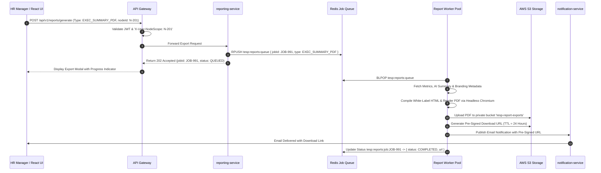
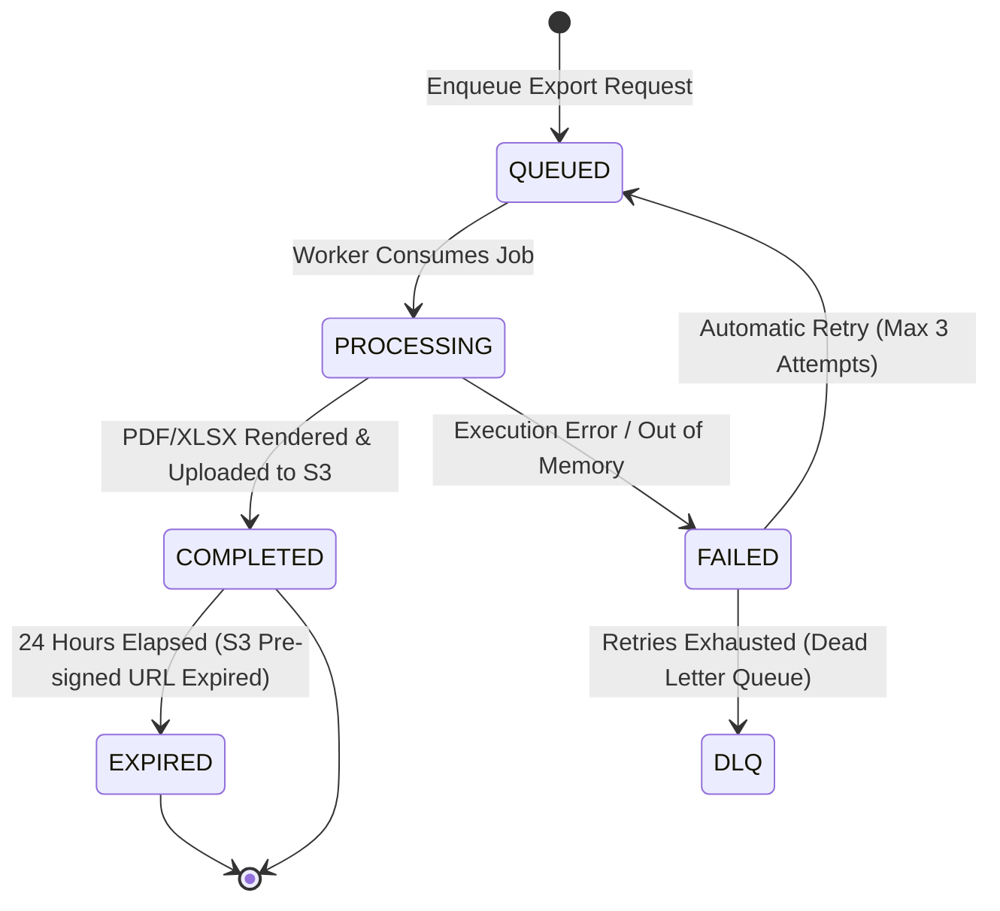

# FEAT-009: Dynamic White-Label Reporting & PDF/Excel Export

| Metadata Field | Value |
|---|---|
| **Feature ID** | FEAT-009 |
| **Title** | Dynamic White-Label Reporting & PDF/Excel Export |
| **Category** | Core Domain / Reporting & Exports |
| **Version** | 1.0.0 |
| **Status** | Approved |
| **Owner** | Principal Enterprise Solution Architect |
| **Last Updated** | 2026-08-05 |
| **Dependencies** | `DOC-001-PROJECT-BLUEPRINT.md`, `DOC-002-SERVICE-ARCHITECTURE.md`, `DOC-003-DATABASE-PHILOSOPHY-AND-METAMODEL.md`, `DOC-008-REPORTING-ENGINE-ARCHITECTURE.md`, `FEAT-001-PROJECT-CONFIGURATION.md`, `FEAT-007-ANALYTICS-ENGINE`, `FEAT-008-AI-ANALYTICS` |
| **Related Features** | `FEAT-010-ACTION-PLANNING` |
| **Implementation Phase** | Phase 1 (Core Foundation) |

---

## 1. Feature Overview

The **Dynamic White-Label Reporting & PDF/Excel Export** feature provides the asynchronous document compilation, white-label branding injection, executive PDF summary generation, streaming Excel (XLSX) raw response export, automated scheduled email distribution, and pre-signed S3 download delivery subsystem for TESP. Operating within `reporting-service`, it turns dynamic survey analytics into publication-ready documents.

The feature features an asynchronous Redis job queue (`tesp:reports:queue`), worker pool execution, HTML-to-PDF Headless Chromium compilation engine, streaming Apache POI XLSX writer (`SXSSFWorkbook`), dynamic Project branding injection (logos, primary/secondary color schemes, corporate typography), pre-signed S3 URL generation, and differential anonymity suppression ($N < 5$) inside generated report tables.

---

## 2. Business Purpose

To provide enterprise executives, HR directors, line supervisors, and Daash Global consultants with automated, publication-ready PDF executive briefings and comprehensive Excel datasets tailored with corporate white-label branding for distribution to board members, stakeholders, and leadership teams.

---

## 3. Business Value

- **White-Label Corporate Branding**: Automatically inject corporate logos, color schemes, and header/footer metadata into generated reports.
- **Automated C-Suite Executive Briefings**: Compile 10-page executive PDF summaries complete with eNPS gauge cards, heatmaps, and AI recommendations in $< 2.5\text{ seconds}$.
- **High-Volume Raw Data Exports**: Stream up to 50,000 anonymized response rows to multi-tab Excel workbooks without memory overflow.
- **Scheduled Automated Dispatch**: Automatically compile and email weekly/monthly pulse report PDFs to department heads.

---

## 4. Problem Statement

Manual preparation of executive survey slide decks and department report PDFs takes HR teams weeks after campaign closure. Furthermore, exporting large raw datasets (50,000+ responses) in legacy tools causes web server timeouts or out-of-memory crashes. TESP solves this via asynchronous job queues, streaming POI memory buffers, and automated white-label HTML-to-PDF compilation.

---

## 5. Goals / Non-Goals

### Goals
- Render Executive PDF Summaries incorporating white-label branding, eNPS cards, 2D heatmaps, and AI executive text summaries.
- Export multi-tab Excel (XLSX) workbooks containing anonymized raw response data and demographic cross-tab matrices.
- Process report generation jobs asynchronously via Redis job queue returning `202 Accepted` with `jobId`.
- Deliver generated report artifacts via AWS S3 pre-signed URLs with 24-hour expiration.
- Enforce sample size anonymity suppression ($N < 5$) inside all generated PDF/XLSX tables.

### Non-Goals
- Interactive web dashboard widget rendering (handled by `FEAT-007: Real-Time Engagement Analytics Engine`).
- Direct database backup or infrastructure snapshot exports.

---

## 6. Dependencies

- `DOC-001-PROJECT-BLUEPRINT.md`: Master architectural blueprint.
- `DOC-002-SERVICE-ARCHITECTURE.md`: `reporting-service` microservice definition.
- `DOC-003-DATABASE-PHILOSOPHY-AND-METAMODEL.md`: Analytical data source schemas.
- `DOC-008-REPORTING-ENGINE-ARCHITECTURE.md`: Reporting Engine Architecture Specification.
- `FEAT-001-PROJECT-CONFIGURATION.md`: Project branding metadata (logos, colors, typography).
- `FEAT-007-ANALYTICS-ENGINE.md`: Quantitative metric and heatmap data sources.
- `FEAT-008-AI-ANALYTICS.md`: Qualitative AI executive summaries & risk flags.

---

## 7. Related Features

- `FEAT-010: Closed-Loop Action Planning & Remediation Module` (Includes remedial Action Plan progress tables inside departmental PDF reports).

---

## 8. User Roles & Personas

| Role Code | Role Name | Persona Description | Access Level |
|---|---|---|---|
| `EXECUTIVE` | C-Suite Executive | CEO requesting global corporate executive summary PDF. | Full access to generate global reports. |
| `HR_MANAGER` | HR Director | Division HR Lead exporting departmental breakdown PDFs and Excel sheets. | Generate reports scoped to assigned `nodeScope`. |
| `CONSULTANT_DAASH` | Daash Global Consultant | Advisory consultant generating client presentation slide decks and executive PDFs. | Full access to generate and edit report layouts for client projects. |

---

## 9. User Stories

### US-RPT-001: Executive PDF Summary Generation
**As an** `EXECUTIVE`,  
**I want to** click "Export Executive PDF Report" on our dashboard,  
**So that** I receive a 10-page, white-labeled PDF briefing containing eNPS scores, department heatmaps, and AI recommendations formatted for our board meeting.

### US-RPT-002: Anonymized Excel Raw Data Export
**As an** `HR_MANAGER`,  
**I want to** export a multi-tab Excel file containing 25,000 anonymized survey responses,  
**So that** our internal data science team can perform secondary statistical analysis.

### US-RPT-003: Automated Scheduled Report Dispatch
**As a** `PROJECT_ADMIN`,  
**I want to** schedule a recurring Monday morning email dispatch of department pulse PDFs to all Branch Managers,  
**So that** supervisors receive their updated engagement metrics automatically without logging into the portal.

### US-RPT-004: Secure Pre-Signed Download Link
**As an** `HR_MANAGER`,  
**I want to** receive a secure, time-limited download link for generated reports,  
**So that** company data remains protected and links automatically expire after 24 hours.

---

## 10. Functional Requirements

| Requirement ID | Title | Technical Specification & Description | Priority |
|---|---|---|---|
| **FR-RPT-001** | Asynchronous Job Queue API | `reporting-service` must accept export requests via `POST /api/v1/reports/generate`, enqueue job to Redis (`tesp:reports:queue`), and return HTTP 202 Accepted with `jobId`. | Critical |
| **FR-RPT-002** | Executive PDF Renderer | System must compile executive PDF reports incorporating white-label branding, eNPS cards, 2D heatmaps, and AI text summaries via Headless Chromium in $< 2.5\text{ seconds}$. | Critical |
| **FR-RPT-003** | Streaming Excel (XLSX) Writer | System must generate multi-tab XLSX workbooks using Apache POI `SXSSFWorkbook` streaming 100 rows at a time to prevent out-of-memory errors on large datasets (50,000+ rows). | Critical |
| **FR-RPT-004** | Dynamic White-Label Brand Injection | System MUST fetch branding variables (logo URL, primary/secondary colors, corporate footer) from `FEAT-001` and inject them into report layouts. | Critical |
| **FR-RPT-005** | Report Anonymity Suppression | System MUST enforce sample size suppression ($N < 5$) inside generated PDF tables and Excel worksheets, replacing numeric values with `* N/A (N < 5)`. | Critical |
| **FR-RPT-006** | Pre-Signed S3 URL Delivery | System must store generated report files in a private AWS S3 bucket (`tesp-report-exports`) and issue pre-signed URLs with 24-hour expiration (`86400s`). | High |
| **FR-RPT-007** | Scheduled Cron Dispatcher | System must execute recurring scheduled report generation jobs, emailing pre-signed download links or PDF attachments to configured recipient roles. | High |
| **FR-RPT-008** | Asynchronous Kafka Event Emission | Report generation completions must publish a `ReportGeneratedEvent` to `tesp.reports.events.v1`. | High |

---

## 11. Business Rules

| Rule ID | Domain | Business Rule Statement | Enforcement Logic |
|---|---|---|---|
| **BR-RPT-001** | Anonymity Enforcement in Reports | Generated PDF/Excel reports MUST suppress numerical scores for any Organization Node or demographic cell where response count $N < 5$. | Pre-render data filter in `reporting-service`. |
| **BR-RPT-002** | Node Scope Boundary Rule | Report requests MUST be rejected with HTTP 403 Forbidden if the user requests an organizational node path outside their authorized `nodeScope`. | Ingress security interceptor check. |
| **BR-RPT-003** | Pre-Signed Link Expiration | Pre-signed S3 URLs sent via email or API MUST expire after 24 hours (`86400s`); public S3 bucket access is strictly forbidden. | AWS S3 IAM pre-signed URL parameter guard. |
| **BR-RPT-004** | Job Memory Limit Guard | Excel export worker instances MUST limit in-memory row window to 100 rows (`new SXSSFWorkbook(100)`), flushing excess rows to temporary disk storage. | Memory configuration assertion in report worker. |

---

## 12. Validation Rules

| Validation ID | Field / Parameter | Validation Rule & Condition | Failure Action |
|---|---|---|---|
| **VR-RPT-001** | `reportType` | Must be one of `EXEC_SUMMARY_PDF`, `DEPT_BREAKDOWN_PDF`, `RAW_RESPONSES_XLSX`, `AGGREGATED_SCORES_XLSX`. | HTTP 400 Bad Request ("Unrecognized report type"). |
| **VR-RPT-002** | `campaignId` | Must reference an existing campaign in `tesp_dist_db.survey_campaigns`. | HTTP 400 Bad Request ("Campaign ID does not exist"). |
| **VR-RPT-003** | `nodeId` | Must reference an active Organization Node within user's authorized `nodeScope`. | HTTP 403 Forbidden ("Unauthorized node scope for report generation"). |
| **VR-RPT-004** | `passwordProtection` | Optional password string must be $6 \le \text{length} \le 30$ characters if PDF encryption enabled. | HTTP 400 Bad Request ("Invalid PDF password length"). |

---

## 13. Permission Rules

| Permission ID | Role | Action Allowed | Constraint / Conditions |
|---|---|---|---|
| **PR-RPT-001** | `EXECUTIVE` | GENERATE & DOWNLOAD All Reports | Unrestricted access across global organization nodes. |
| **PR-RPT-002** | `HR_MANAGER` | GENERATE & DOWNLOAD Regional Reports | Scoped strictly to nodes within assigned `nodeScope`. |
| **PR-RPT-003** | `CONSULTANT_DAASH` | GENERATE & EDIT Client Reports | Access to generate and customize report layouts for client project. |
| **PR-RPT-004** | `SURVEY_RESPONDENT` | NO Access to Reporting API | Cannot access report generation endpoints. |

---

## 14. Workflows & Sequence Diagrams

### Asynchronous Report Generation & Pre-Signed S3 Delivery Sequence Diagram



---

## 15. State Machines

### Report Generation Job State Machine



---

## 16. Data Model & MongoDB Collection Relationships

### MongoDB Collection: `tesp_analytics_db.report_jobs`

```json
{
  "$jsonSchema": {
    "bsonType": "object",
    "required": ["projectId", "jobId", "reportType", "campaignId", "requestedBy", "status"],
    "properties": {
      "_id": { "bsonType": "objectId" },
      "projectId": { "bsonType": "string" },
      "jobId": { "bsonType": "string" },
      "reportType": { "enum": ["EXEC_SUMMARY_PDF", "DEPT_BREAKDOWN_PDF", "RAW_RESPONSES_XLSX", "AGGREGATED_SCORES_XLSX"] },
      "campaignId": { "bsonType": "string" },
      "nodeId": { "bsonType": "string" },
      "requestedBy": { "bsonType": "string" },
      "status": { "enum": ["QUEUED", "PROCESSING", "COMPLETED", "FAILED"] },
      "downloadUrl": { "bsonType": ["string", "null"] },
      "expiresAt": { "bsonType": ["date", "null"] },
      "errorMessage": { "bsonType": ["string", "null"] },
      "createdAt": { "bsonType": "date" },
      "completedAt": { "bsonType": ["date", "null"] }
    }
  }
}
```

---

## 17. API Requirements

### 1. Request Report Generation (Async)
- **HTTP Method**: `POST`
- **Path**: `/api/v1/reports/generate`
- **Request Body**:
  ```json
  {
    "projectId": "PRJ-99201",
    "reportType": "EXEC_SUMMARY_PDF",
    "campaignId": "CMP-1001",
    "nodeId": "N-201",
    "includeAiSummaries": true,
    "includeHeatmaps": true
  }
  ```
- **Response**: `202 Accepted`
  ```json
  {
    "jobId": "JOB-9910291",
    "status": "QUEUED",
    "estimatedDurationSeconds": 3
  }
  ```

### 2. Poll Report Job Status
- **HTTP Method**: `GET`
- **Path**: `/api/v1/reports/jobs/{jobId}`
- **Response**: `200 OK`
  ```json
  {
    "jobId": "JOB-9910291",
    "status": "COMPLETED",
    "downloadUrl": "https://tesp-report-exports.s3.amazonaws.com/PRJ-99201/exec_summary.pdf?AWSAccessKeyId=...&Expires=1785952800",
    "expiresAt": "2026-08-06T19:30:00Z"
  }
  ```

---

## 18. Domain Events

### Kafka Event: `ReportGeneratedEvent`
- **Topic**: `tesp.reports.events.v1`
- **Partition Key**: `projectId`
- **Payload**:
  ```json
  {
    "eventId": "EVT-1110291",
    "eventType": "REPORT_GENERATED",
    "projectId": "PRJ-99201",
    "jobId": "JOB-9910291",
    "reportType": "EXEC_SUMMARY_PDF",
    "fileSizeBytes": 2450192,
    "timestamp": "2026-08-05T19:30:00Z"
  }
  ```

---

## 19. UI & Dashboard Requirements

- **Technology**: React 19+, Vite, Tailwind CSS, TanStack Query.
- **Report Export Dialog & Drawer Component**:
  - Modal with format toggle: **Executive PDF Report** vs **Raw Data Excel Sheet**.
  - Section Selection Checkboxes (Include eNPS Cards, Include Heatmaps, Include AI Recommendations, Include Action Plan Table).
  - Real-Time Progress Bar indicating job status (`QUEUED` $\rightarrow$ `PROCESSING` $\rightarrow$ `COMPLETED`).
  - One-Click "Download Report" button opening pre-signed S3 URL in secure new tab.
  - "Schedule Recurring Dispatch" tab allowing configuration of weekly automated email delivery.

---

## 20. AI Capabilities & Automation

- **Automated Executive Report Narrative Generator**: AI assistant generates custom 2-paragraph intro and conclusion narratives tailored to the client's corporate tone before rendering the PDF briefing.

---

## 21. Security & Compliance

- **24-Hour Pre-Signed URL Expiration**: Generated report download links expire after 24 hours (`86400s`), eliminating stale link exposure.
- **AES-128 PDF Password Encryption**: Optional encryption securing PDF reports with recipient passwords before email attachment transmission.

---

## 22. Performance & Scalability Requirements

- **Executive PDF Compilation SLA**: `< 2.5 seconds` for 10-page white-labeled PDF using Headless Chromium pool.
- **50,000 Row Excel Export SLA**: `< 6.0 seconds` using streaming Apache POI memory buffer.

---

## 23. Test Cases & Acceptance Criteria

### Test Case: TC-RPT-001 - Pre-Signed URL Expiration Assertions
- **Given**: A generated report job with `expiresAt = NOW() + 24 hours`.
- **When**: Attempting to access the pre-signed S3 URL after 24 hours.
- **Then**: AWS S3 returns `403 AccessDenied` ("Request has expired"), verifying URL expiration security.

### Test Case: TC-RPT-002 - PDF Anonymity Suppression Assertion
- **Given**: Department `N-404` with only 3 responses ($N < 5$).
- **When**: Generating Executive Summary PDF for `N-404`.
- **Then**: All score cells for `N-404` in PDF tables display `* N/A (N < 5)`, obscuring numerical scores.

---

## 24. Future Extensions

1. **Automated Executive PPTX Slide Decks**: Direct generation of editable PowerPoint presentations for C-suite board meetings.
2. **Interactive Offline Single-File HTML Reports**: Self-contained HTML report bundles with embedded offline SVG charts.

---

## 25. References & Related Documents

- `DOC-001-PROJECT-BLUEPRINT.md`: Master Architecture.
- `DOC-002-SERVICE-ARCHITECTURE.md`: Microservices Topology.
- `DOC-008-REPORTING-ENGINE-ARCHITECTURE.md`: Reporting Engine Specification.
- `FEAT-001-PROJECT-CONFIGURATION.md`: Project White-Label Branding.
- `FEAT-007-ANALYTICS-ENGINE.md`: Quantitative Analytics.
- `FEAT-008-AI-ANALYTICS.md`: AI Executive Summaries.

---

## 26. Open Questions

| Question ID | Topic | Description | Impact |
|---|---|---|---|
| **OQ-RPT-002** | S3 File Lifecycle Cleanup | How often should temporary S3 report objects be purged from storage? (Current decision: AWS S3 Lifecycle Policy automatically deletes objects older than 30 days). | Storage cost optimization. |

---

## Document Status

| Field | Value |
|---|---|
| **Document Status** | Approved / Implementation-Ready |
| **Dependencies Satisfied** | `DOC-001` to `DOC-008`, `FEAT-001`, `FEAT-007`, `FEAT-008` |
| **Documents Affected** | `DOCUMENT_INDEX.md`, `DOCUMENT_DEPENDENCY_GRAPH.md` |
| **Next Recommended Document** | `FEAT-010: Closed-Loop Action Planning & Remediation Module` |
