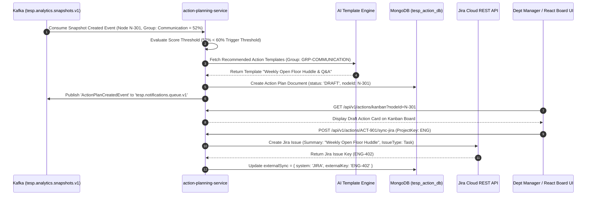
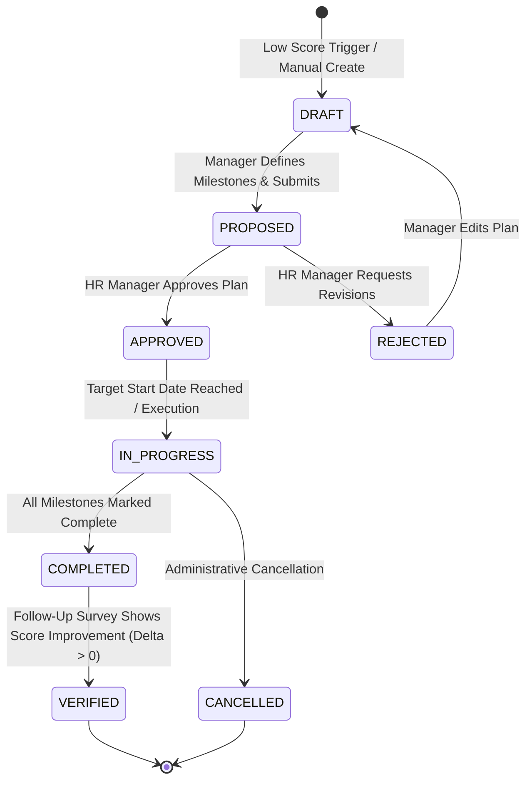

# FEAT-010: Closed-Loop Action Planning & Remediation Module

| Metadata Field | Value |
|---|---|
| **Feature ID** | FEAT-010 |
| **Title** | Closed-Loop Action Planning & Remediation Module |
| **Category** | Core Domain / Workflow & Remediation |
| **Version** | 1.0.0 |
| **Status** | Approved |
| **Owner** | Principal Enterprise Solution Architect |
| **Last Updated** | 2026-08-05 |
| **Dependencies** | `DOC-001-PROJECT-BLUEPRINT.md`, `DOC-002-SERVICE-ARCHITECTURE.md`, `DOC-003-DATABASE-PHILOSOPHY-AND-METAMODEL.md`, `DOC-009-ACTION-PLANNING-ARCHITECTURE.md`, `FEAT-001-PROJECT-CONFIGURATION.md`, `FEAT-002-ORGANIZATION-HIERARCHY`, `FEAT-007-ANALYTICS-ENGINE`, `FEAT-008-AI-ANALYTICS` |
| **Related Features** | `FEAT-009-REPORTING-ENGINE` |
| **Implementation Phase** | Phase 1 (Core Foundation Complete) |

---

## 1. Feature Overview

The **Closed-Loop Action Planning & Remediation Module** turns employee feedback insights into accountable, trackable organizational improvements. Implemented in `action-planning-service`, it enables line managers, HR directors, and executives to define, assign, monitor, and verify targeted remedial action plans linked directly to low survey engagement scores or critical AI risk alerts.

The module manages the complete action lifecycle: automated draft creation when department scores drop below designated thresholds ($< 60\%$), AI-recommended action templates based on Daash Global methodologies, milestone completion tracking, automated reminder nudges, approval workflows, bi-directional synchronization with external enterprise task management tools (Jira Cloud, Microsoft Planner), and longitudinal verification comparing pre-action and post-action survey scores.

---

## 2. Business Purpose

To bridge the gap between employee survey data and corporate execution, ensuring that employee feedback leads directly to visible workplace improvements and higher retention.

---

## 3. Business Value

- **Closed-Loop Accountability**: Ensure 100% of low-scoring departments or critical risk alerts have assigned remedial action plans with target completion dates.
- **AI-Guided Remediation**: Accelerate manager response time using pre-validated Daash Global action templates tailored to specific engagement issues (e.g., leadership communication, workload management).
- **Enterprise System Integration**: Bi-directionally sync action items to native employee workflows in Jira and Microsoft Planner.
- **ROI Impact Measurement**: Prove survey ROI by measuring longitudinal score improvements before and after action plan completion.

---

## 4. Problem Statement

Enterprises often collect employee survey data but fail to act on it ("survey fatigue"). Line managers lack HR consulting expertise and don't know how to address low team scores. Furthermore, action items tracked in offline Excel sheets are quickly forgotten. TESP solves this via automated score triggers, AI-guided action templates, Kanban tracking boards, and Jira/MS Planner integration bridges.

---

## 5. Goals / Non-Goals

### Goals
- Automatically generate Action Plan drafts when department scores drop below $60\%$ or when critical AI risk alerts are raised.
- Provide a Kanban Action Board interface with state machine progression (Draft $\rightarrow$ Proposed $\rightarrow$ Approved $\rightarrow$ In Progress $\rightarrow$ Completed $\rightarrow$ Verified).
- Support external bi-directional task synchronization with Jira Cloud REST API and Microsoft Planner Graph API.
- Publish asynchronous domain events (`ActionPlanCreated`, `ActionPlanStatusChanged`, `ActionPlanVerified`) to Kafka topic `tesp.action.events.v1`.
- Measure pre-action vs post-action score delta ($\Delta \text{Score}$) upon follow-up survey closure.

### Non-Goals
- Full Project Management software replacement (Gantt chart software development).
- Direct employee performance appraisal grading.

---

## 6. Dependencies

- `DOC-001-PROJECT-BLUEPRINT.md`: Master architectural blueprint.
- `DOC-002-SERVICE-ARCHITECTURE.md`: `action-planning-service` microservice definition.
- `DOC-003-DATABASE-PHILOSOPHY-AND-METAMODEL.md`: `action_plans` MongoDB collection schema.
- `DOC-009-ACTION-PLANNING-ARCHITECTURE.md`: Action Planning Architecture Specification.
- `FEAT-002-ORGANIZATION-HIERARCHY.md`: Node scope boundaries.
- `FEAT-007-ANALYTICS-ENGINE.md`: Score threshold triggers.
- `FEAT-008-AI-ANALYTICS.md`: AI risk alerts & text insight triggers.

---

## 7. Related Features

- `FEAT-009: Dynamic White-Label Reporting & PDF/Excel Export` (Embeds active action plan progress tables into departmental report PDFs).

---

## 8. User Roles & Personas

| Role Code | Role Name | Persona Description | Access Level |
|---|---|---|---|
| `DEPARTMENT_MANAGER` | Department Manager | Line supervisor creating and executing action items for their team. | Full CRUD & Status Update rights within assigned node sub-tree. |
| `HR_MANAGER` | HR Director | HR Lead approving proposed action plans and monitoring regional progress. | Review, Approve, and Re-assign action plans across region. |
| `EXECUTIVE` | C-Suite Executive | Chief Operating Officer viewing global action completion rates and ROI. | Read-only global visibility across enterprise action board. |

---

## 9. User Stories

### US-ACT-001: Automated Threshold Action Trigger
**As a** `DEPARTMENT_MANAGER`,  
**I want to** receive an automated notification suggesting an Action Plan draft when our team's Communication score drops below 55%,  
**So that** I am immediately prompted to take corrective measures.

### US-ACT-002: AI-Recommended Action Templates
**As a** `DEPARTMENT_MANAGER`,  
**I want to** select from pre-validated Daash Global action templates (e.g., "Implement Weekly Team Huddles"),  
**So that** I don't have to invent remedial activities from scratch.

### US-ACT-003: Bi-Directional Jira Synchronization
**As a** software team `DEPARTMENT_MANAGER`,  
**I want to** sync our Action Plan tasks directly to our team's Jira board,  
**So that** engineers can track engagement tasks inside their daily sprint workflow.

### US-ACT-004: Post-Action Verification & Impact Measurement
**As an** `HR_MANAGER`,  
**I want to** compare our department's engagement score before and after Action Plan completion,  
**So that** we can verify whether the remedial actions successfully resolved employee concerns.

---

## 10. Functional Requirements

| Requirement ID | Title | Technical Specification & Description | Priority |
|---|---|---|---|
| **FR-ACT-001** | Threshold Trigger Listener | `action-planning-service` must consume `AnalyticalSnapshotCreatedEvent` from Kafka, auto-creating Draft Action Plans for any node where category score $< 60\%$. | Critical |
| **FR-ACT-002** | Action Plan State Machine | System must enforce state transitions (`DRAFT` $\rightarrow$ `PROPOSED` $\rightarrow$ `APPROVED` $\rightarrow$ `IN_PROGRESS` $\rightarrow$ `COMPLETED` $\rightarrow$ `VERIFIED`) with role guards. | Critical |
| **FR-ACT-003** | AI Template Recommender | System must provide an API returning recommended remedial action templates filtered by Question Group and score deficit. | Critical |
| **FR-ACT-004** | Bi-Directional External Task Bridge | System must support bi-directional webhook sync with Jira Cloud REST API and Microsoft Planner Graph API (Status changes in Jira update TESP state). | Critical |
| **FR-ACT-005** | Overdue Task Escalation Nudge | System must run daily cron worker, sending reminder notifications to assignees 3 days prior to milestone due dates and escalating overdue items to HR. | High |
| **FR-ACT-006** | Post-Campaign Score Delta Verification | Upon closure of a follow-up survey campaign, system must calculate $\Delta \text{Score} = \text{Score}_{\text{post}} - \text{Score}_{\text{pre}}$, transitioning plan to `VERIFIED`. | High |
| **FR-ACT-007** | Interactive React Kanban Board | System must render an interactive drag-and-drop Kanban Action Board (`@hello-pangea/dnd`) filtered by Organization Node and Assignee. | High |
| **FR-ACT-008** | Asynchronous Kafka Event Emission | State transitions must publish an `ActionPlanStatusChangedEvent` to `tesp.action.events.v1`. | High |

---

## 11. Business Rules

| Rule ID | Domain | Business Rule Statement | Enforcement Logic |
|---|---|---|---|
| **BR-ACT-001** | Approval Requirement | An Action Plan created by a `DEPARTMENT_MANAGER` MUST be approved by an `HR_MANAGER` (`status: "APPROVED"`) before transitioning to `IN_PROGRESS`. | Role-gated state transition interceptor. |
| **BR-ACT-002** | Unique Node Assignment | An active Action Plan MUST be linked to exactly one valid `nodeId` and `groupId`. | MongoDB document schema constraint. |
| **BR-ACT-003** | Mandatory Target Completion Date | Action Plans in `PROPOSED` state MUST specify a valid future `targetCompletionDate`. | Form validation check. |
| **BR-ACT-004** | Verification Isolation | Transition to `VERIFIED` state requires a subsequent survey campaign aggregate snapshot for the same `nodeId`. | Follow-up survey snapshot assertion. |

---

## 12. Validation Rules

| Validation ID | Field / Parameter | Validation Rule & Condition | Failure Action |
|---|---|---|---|
| **VR-ACT-001** | `actionPlanId` | Must match regex `^ACT-[A-Za-z0-9_-]{3,20}$`. | HTTP 400 Bad Request ("Invalid Action Plan ID format"). |
| **VR-ACT-002** | `targetCompletionDate` | Must be at least 7 days in the future and max 365 days. | HTTP 400 Bad Request ("Completion date out of range"). |
| **VR-ACT-003** | `milestones` | Action Plan must contain at least 1 milestone task before transitioning to `PROPOSED`. | HTTP 400 Bad Request ("At least one milestone required"). |
| **VR-ACT-004** | `assigneeId` | Must reference a valid, active employee in `FEAT-003`. | HTTP 400 Bad Request ("Invalid assignee employee ID"). |

---

## 13. Permission Rules

| Permission ID | Role | Action Allowed | Constraint / Conditions |
|---|---|---|---|
| **PR-ACT-001** | `DEPARTMENT_MANAGER` | CREATE, EDIT, SUBMIT Action Plan | Restricted to assigned node sub-tree. |
| **PR-ACT-002** | `HR_MANAGER` | APPROVE, RE-ASSIGN, REJECT Action Plan | Full access across assigned regional `nodeScope`. |
| **PR-ACT-003** | `EXECUTIVE` | READ Action Board & ROI Metrics | Read-only global visibility across enterprise. |
| **PR-ACT-004** | `SURVEY_RESPONDENT` | NO Access to Action Planning API | Cannot access action planning endpoints. |

---

## 14. Workflows & Sequence Diagrams

### Automated Threshold Trigger & Action Plan Creation Sequence Diagram



---

## 15. State Machines

### Action Plan Lifecycle State Machine



---

## 16. Data Model & MongoDB Collection Relationships

### MongoDB Collection: `tesp_action_db.action_plans`

```json
{
  "$jsonSchema": {
    "bsonType": "object",
    "required": ["projectId", "actionPlanId", "nodeId", "groupId", "title", "status", "assigneeId", "targetCompletionDate"],
    "properties": {
      "_id": { "bsonType": "objectId" },
      "projectId": { "bsonType": "string" },
      "actionPlanId": { "bsonType": "string" },
      "campaignId": { "bsonType": "string" },
      "nodeId": { "bsonType": "string" },
      "groupId": { "bsonType": "string" },
      "title": { "bsonType": "string" },
      "description": { "bsonType": "string" },
      "status": { "enum": ["DRAFT", "PROPOSED", "APPROVED", "REJECTED", "IN_PROGRESS", "COMPLETED", "VERIFIED", "CANCELLED"] },
      "assigneeId": { "bsonType": "string" },
      "approverId": { "bsonType": ["string", "null"] },
      "baselineScore": { "bsonType": "double" },
      "targetScore": { "bsonType": "double" },
      "postActionScore": { "bsonType": ["double", "null"] },
      "targetCompletionDate": { "bsonType": "date" },
      "milestones": {
        "bsonType": "array",
        "items": {
          "bsonType": "object",
          "required": ["milestoneId", "title", "status", "dueDate"],
          "properties": {
            "milestoneId": { "bsonType": "string" },
            "title": { "bsonType": "string" },
            "status": { "enum": ["PENDING", "IN_PROGRESS", "COMPLETED"] },
            "dueDate": { "bsonType": "date" }
          }
        }
      },
      "externalSync": {
        "bsonType": "object",
        "properties": {
          "system": { "enum": ["NONE", "JIRA", "MS_PLANNER"] },
          "externalKey": { "bsonType": "string" },
          "lastSyncedAt": { "bsonType": "date" }
        }
      },
      "isDeleted": { "bsonType": "bool" },
      "createdAt": { "bsonType": "date" },
      "updatedAt": { "bsonType": "date" }
    }
  }
}
```

---

## 17. API Requirements

### 1. Create Action Plan from Template
- **HTTP Method**: `POST`
- **Path**: `/api/v1/actions`
- **Request Body**:
  ```json
  {
    "projectId": "PRJ-99201",
    "campaignId": "CMP-1001",
    "nodeId": "N-301",
    "groupId": "GRP-COMMUNICATION",
    "title": "Weekly Open Floor Huddle & Town Hall",
    "description": "Conduct weekly 30-min open Q&A huddle with software engineering team.",
    "assigneeId": "EMP-9021",
    "baselineScore": 52.0,
    "targetScore": 75.0,
    "targetCompletionDate": "2026-10-31T23:59:59Z",
    "milestones": [
      {
        "milestoneId": "MS-1",
        "title": "Schedule recurring calendar invite",
        "dueDate": "2026-08-15T23:59:59Z"
      }
    ]
  }
  ```
- **Response**: `201 Created`

### 2. Transition Action Plan Status
- **HTTP Method**: `POST`
- **Path**: `/api/v1/actions/{actionPlanId}/transition`
- **Request Body**:
  ```json
  {
    "targetStatus": "PROPOSED",
    "comments": "Milestones and timeline defined; requesting HR approval."
  }
  ```
- **Response**: `200 OK`

---

## 18. Domain Events

### Kafka Event: `ActionPlanStatusChangedEvent`
- **Topic**: `tesp.action.events.v1`
- **Partition Key**: `projectId`
- **Payload**:
  ```json
  {
    "eventId": "EVT-8810291",
    "eventType": "ACTION_PLAN_STATUS_CHANGED",
    "projectId": "PRJ-99201",
    "actionPlanId": "ACT-901",
    "nodeId": "N-301",
    "oldStatus": "PROPOSED",
    "newStatus": "APPROVED",
    "approverId": "EMP-1002",
    "timestamp": "2026-08-05T19:35:00Z"
  }
  ```

---

## 19. UI & Dashboard Requirements

- **Technology**: React 19+, Vite, Tailwind CSS, `@hello-pangea/dnd`, `@tanstack/react-query`.
- **Interactive Kanban Action Board UI**:
  - Columns matching state machine: **Draft**, **Proposed**, **Approved**, **In Progress**, **Completed**, **Verified**.
  - Drag-and-drop card movement with state transition approval modal.
  - Action Card details: Node badge, Category icon, Baseline vs Target Score indicator bar, Assignee avatar, Due Date countdown badge, Jira/Planner sync badge.
  - Filter Bar: Filter by Organization Node, Category Theme, Status, or Assignee.

---

## 20. AI Capabilities & Automation

- **AI Action Plan Recommender**: Machine learning model analyzes specific low-scoring question responses and suggests 3 tailored action plan templates derived from Daash Global consulting best practices.

---

## 21. Security & Compliance

- **Sub-Tree Permission Boundary**: Action plan creation, edit, and approval APIs enforce materialized path node scoping based on user's JWT `nodeScope`.
- **Audit Event Capture**: Every state transition, comment, or assignee change logs an immutable audit trail in `tesp_audit_db.audit_logs`.

---

## 22. Performance & Scalability Requirements

- **Kanban Board Load SLA**: `< 100ms (p95)` for loading 500 action plan cards using indexed query `{ projectId: 1, nodeId: 1 }`.
- **Jira/Planner Sync Webhook SLA**: `< 500ms` outbound sync latency.

---

## 23. Test Cases & Acceptance Criteria

### Test Case: TC-ACT-001 - Automated Low-Score Action Plan Trigger
- **Given**: An analytical snapshot with `nodeId: "N-301"` and `groupScores: [{ groupId: "GRP-LEADERSHIP", score: 54.0 }]`.
- **When**: `AnalyticalSnapshotCreatedEvent` is published to Kafka.
- **Then**: `action-planning-service` automatically creates a `DRAFT` Action Plan document linked to `N-301` and `GRP-LEADERSHIP`.

### Test Case: TC-ACT-002 - Post-Action Verification Math Assertion
- **Given**: Action Plan `ACT-901` with `baselineScore: 52.0` in `COMPLETED` state.
- **When**: Follow-up survey snapshot is processed with `N-301` leadership score `68.0` ($\Delta = +16.0$).
- **Then**: `ACT-901` transitions automatically to `VERIFIED` state with `postActionScore: 68.0`.

---

## 24. Future Extensions

1. **Gantt Chart Timeline View**: Dynamic timeline visualizer managing overlapping departmental action milestones.
2. **Slack & MS Teams Action Bot**: Interactive bot allowing managers to complete action milestones directly within chat.

---

## 25. References & Related Documents

- `DOC-001-PROJECT-BLUEPRINT.md`: Master Architecture.
- `DOC-002-SERVICE-ARCHITECTURE.md`: Microservices Topology.
- `DOC-009-ACTION-PLANNING-ARCHITECTURE.md`: Action Planning Specification.
- `FEAT-002-ORGANIZATION-HIERARCHY.md`: Materialized Path Hierarchy.
- `FEAT-007-ANALYTICS-ENGINE.md`: Analytical Data Source.
- `FEAT-008-AI-ANALYTICS.md`: AI Risk & Insight Triggers.

---

## 26. Open Questions

| Question ID | Topic | Description | Impact |
|---|---|---|---|
| **OQ-ACT-001** | Jira OAuth Token Management | How should Jira OAuth refresh tokens be stored per tenant workspace? (Current decision: Encrypted via AWS KMS in `tesp_config_db`). | External integration security. |

---

## Document Status

| Field | Value |
|---|---|
| **Document Status** | Approved / Implementation-Ready |
| **Dependencies Satisfied** | `DOC-001` to `DOC-009`, `FEAT-001` to `FEAT-009` |
| **Documents Affected** | `DOCUMENT_INDEX.md`, `DOCUMENT_DEPENDENCY_GRAPH.md` |
| **Next Recommended Document** | Complete Feature Documentation Library (`FEAT-001` through `FEAT-010` fully generated). Proceed to implementation phase. |
