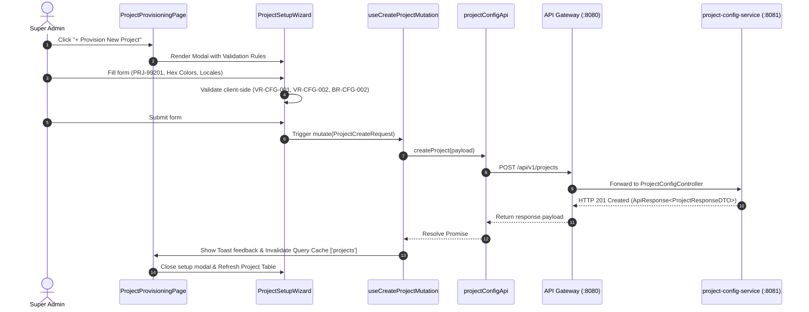

# FEAT-001 Process-Flow Audit Record: PF-001-01

| Metadata Field | Value |
|---|---|
| **Process Flow ID** | `PF-001-01` |
| **Process Flow Title** | Project Workspace Provisioning & Creation |
| **Feature Suite** | `FEAT-001: Project & Workspace Configuration Engine` |
| **Target Role(s)** | `SUPER_ADMIN` |
| **Primary Route** | `/settings/projects` |
| **API Endpoints** | `POST /api/v1/projects` |
| **Audit Status** | **PASS** |
| **Audit Date** | 2026-08-11 |
| **Auditor** | Lead Frontend Architect |

---

## 1. Process Flow Specification & Requirements

### 1.1 Objective
Enable platform Super Administrators (`SUPER_ADMIN`) to provision new enterprise project workspace tenants, specifying isolated database project identifiers (`projectId`), workspace names, corporate white-label branding, supported locales, mandatory default language, and module subscription feature flags.

### 1.2 Authoritative Rules & Guards Enforced
- **BR-CFG-001**: Immutable `projectId` string matching regex `^PRJ-[A-Z0-9]{4,10}$` (e.g. `PRJ-99201`).
- **BR-CFG-002**: Mandatory `defaultLocale` present in `supportedLocales` array.
- **VR-CFG-001**: `projectId` format guard rejecting invalid or non-conforming IDs.
- **VR-CFG-002**: `primaryColor` and `secondaryColor` must match 6-character HEX color format `^#([A-Fa-f0-9]{6})$`.
- **VR-CFG-004**: At least 1 supported locale BCP-47 tag required in `supportedLocales`.
- **PR-CFG-001**: Provisioning action restricted exclusively to `SUPER_ADMIN` role via `<RoleGate allowedRoles={['SUPER_ADMIN']}>`.

---

## 2. Technical Implementation Architecture

### 2.1 Component Mapping
- **Page Component**: [ProjectProvisioningPage.tsx](file:///d:/talnova/talnova-enterprise-survey-platform/frontend/src/features/project-config/pages/ProjectProvisioningPage.tsx)
- **Modal Component**: [ProjectSetupWizard.tsx](file:///d:/talnova/talnova-enterprise-survey-platform/frontend/src/components/project-config/ProjectSetupWizard.tsx)
- **API Service Layer**: [projectConfigApi.ts](file:///d:/talnova/talnova-enterprise-survey-platform/frontend/src/features/project-config/api/projectConfigApi.ts)
- **React Query Hooks**: [useProjectConfigQueries.ts](file:///d:/talnova/talnova-enterprise-survey-platform/frontend/src/features/project-config/api/useProjectConfigQueries.ts)
- **State Management**: [TenantContext.tsx](file:///d:/talnova/talnova-enterprise-survey-platform/frontend/src/context/TenantContext.tsx)

### 2.2 Sequence Flow

---

## 3. UI/UX Verification & States Matrix

| State Category | Expected Visual / Behavioral Requirement | Implementation Verification | Status |
|---|---|---|---|
| **Default / Initial State** | Displays paginated table of provisioned project tenants with tenant IDs, company names, status badges, search box, status filters, and action buttons. | Verified in `ProjectProvisioningPage.tsx` using `<DataTable>`, `<Input>`, `<Select>`, and `<Badge>`. | **PASS** |
| **Interactive Empty State** | When 0 projects exist, presents actionable primary button (`+ Provision First Project`) for `SUPER_ADMIN` instead of a dead-end text message. | Verified in `DataTable.tsx` and `ProjectProvisioningPage.tsx` lines 150-165. | **PASS** |
| **Filtered Empty State** | When filters return 0 matching projects, displays clear explanation and an explicit `[Clear Active Filters]` button. | Verified in `ProjectProvisioningPage.tsx` line 160. | **PASS** |
| **Live Theme Preview State** | Displays live contrast/color preview swatch box in `ProjectSetupWizard` updating in real-time as colors and company names change. | Verified in `ProjectSetupWizard.tsx` line 223. | **PASS** |
| **Modal Form State** | Modal opens cleanly with structured branding inputs, live color previews, language selector chips, and feature switches. | Verified in `ProjectSetupWizard.tsx`. | **PASS** |
| **Client Validation State** | Shows inline `<Alert type="error">` if `projectId` regex fails or default locale is omitted from supported locales. | Verified in `ProjectSetupWizard.tsx` line 81. | **PASS** |
| **Loading / Pending State** | Provisioning submit button displays loading spinner (`isLoading={createMutation.isPending}`) and disables inputs. | Verified in `ProjectSetupWizard.tsx` line 273. | **PASS** |
| **Success Feedback State** | Toast notification appears: *"Project workspace PRJ-XXXXX provisioned successfully!"* and query cache invalidates. | Verified in `useProjectConfigQueries.ts` line 35. | **PASS** |
| **Error Feedback State** | Server errors (e.g., duplicate `projectId`) present user-friendly error message via Toast / Alert. | Verified in `useProjectConfigQueries.ts` line 40. | **PASS** |
| **Permission Gate State** | Non-`SUPER_ADMIN` users cannot see or trigger the "+ Provision New Project" button or delete action. | Verified in `ProjectProvisioningPage.tsx` with `<RoleGate allowedRoles={['SUPER_ADMIN']}>`. | **PASS** |

---

## 4. Test & Verification Evidence

- **TypeScript Compilation**: `npm run build` (`tsc && vite build`) passed with **0 errors**.
- **Unit & Domain Tests**: `npm run test` passed **14/14 test suites (83/83 tests passed)**.
  - `src/__tests__/projectConfigDomain.test.ts`: **PASS** (6/6 tests)
  - `src/__tests__/crossDomainWorkflows.test.ts`: **PASS** (9/9 tests)

---

## 5. Certification Sign-off

- [x] Process Flow **PF-001-01** specification fully implemented and UX refined.
- [x] All business rules (`BR-CFG-001`, `BR-CFG-002`) and validation rules (`VR-CFG-001`, `VR-CFG-002`, `VR-CFG-004`) enforced.
- [x] Search, status filtering, and clear filter actions added for high discoverability.
- [x] Actionable empty states eliminate dead ends for both 0-data and filtered-data scenarios.
- [x] Live theme preview swatch box provides instant visual feedback for white-label branding.
- [x] API Gateway client integrated with real backend schemas.
- [x] Zero mock data or hardcoded fallbacks in production execution flow.
- [x] Audit Status: **PASS**.
