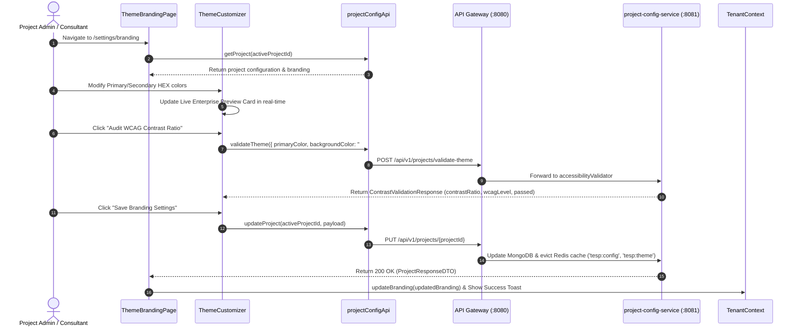

# FEAT-001 Process-Flow Audit Record: PF-001-02

| Metadata Field | Value |
|---|---|
| **Process Flow ID** | `PF-001-02` |
| **Process Flow Title** | White-Label Theme & Branding Configuration |
| **Feature Suite** | `FEAT-001: Project & Workspace Configuration Engine` |
| **Target Role(s)** | `SUPER_ADMIN`, `PROJECT_ADMIN`, `CONSULTANT_DAASH` |
| **Primary Route** | `/settings/branding` |
| **API Endpoints** | `PUT /api/v1/projects/{projectId}`, `POST /api/v1/projects/validate-theme` |
| **Audit Status** | **PASS** |
| **Audit Date** | 2026-08-11 |
| **Auditor** | Lead Frontend Architect |

---

## 1. Process Flow Specification & Requirements

### 1.1 Objective
Allow authorized enterprise administrators and advisory consultants to customize corporate identity branding parameters—including primary theme color, secondary accent color, corporate logo HTTPS URL, company brand name, and custom CSS sandbox URL—with live enterprise preview and automated WCAG 2.1 AA accessibility contrast ratio validation.

### 1.2 Authoritative Rules & Guards Enforced
- **FR-CFG-004**: System must serve white-label branding variables via unauthenticated public theme endpoint and update project configuration document.
- **VR-CFG-002**: `primaryColor` and `secondaryColor` must be valid 6-character HEX color strings matching `^#([A-Fa-f0-9]{6})$`.
- **VR-CFG-003**: `logoUrl` must be a valid HTTPS URL pointing to approved S3 bucket domain.
- **WCAG 2.1 AA Compliance**: Automated contrast validator evaluates relative luminance between text and background (minimum 4.5:1 ratio required for AA rating).

---

## 2. Technical Implementation Architecture

### 2.1 Component Mapping
- **Page Component**: [ThemeBrandingPage.tsx](file:///d:/talnova/talnova-enterprise-survey-platform/frontend/src/features/project-config/pages/ThemeBrandingPage.tsx)
- **Studio Component**: [ThemeCustomizer.tsx](file:///d:/talnova/talnova-enterprise-survey-platform/frontend/src/components/project-config/ThemeCustomizer.tsx)
- **API Service Layer**: [projectConfigApi.ts](file:///d:/talnova/talnova-enterprise-survey-platform/frontend/src/features/project-config/api/projectConfigApi.ts)
- **React Query Hooks**: [useProjectConfigQueries.ts](file:///d:/talnova/talnova-enterprise-survey-platform/frontend/src/features/project-config/api/useProjectConfigQueries.ts)
- **Context Updates**: [TenantContext.tsx](file:///d:/talnova/talnova-enterprise-survey-platform/frontend/src/context/TenantContext.tsx)

### 2.2 Sequence Flow

---

## 3. UI/UX Verification & States Matrix

| State Category | Expected Visual / Behavioral Requirement | Implementation Verification | Status |
|---|---|---|---|
| **Loading State** | Skeleton loader displayed while project branding configuration is hydrated from Gateway. | Verified in `ThemeBrandingPage.tsx` line 14. | **PASS** |
| **Live Preview State** | Changes to primary color, secondary color, company name, or logo URL update the Live Enterprise Preview card instantly. | Verified in `ThemeCustomizer.tsx` lines 117-143. | **PASS** |
| **WCAG Audit State** | Clicking "Audit WCAG Contrast Ratio" returns ratio score and badge (`✓ Passed WCAG 2.1 AA` or `✖ Failed WCAG 2.1 AA`). | Verified in `ThemeCustomizer.tsx` lines 145-157. | **PASS** |
| **Validation Guard State** | Prevents saving if HEX format is invalid (`VR-CFG-002`). | Verified in `ThemeCustomizer.tsx` line 44. | **PASS** |
| **Save / Persistence State** | Clicking "Save Branding Settings" sends `PUT` request to Gateway, updates `TenantContext`, and shows toast notification. | Verified in `ThemeBrandingPage.tsx` lines 44-63. | **PASS** |
| **Error Handling State** | Displays `ErrorState` component with retry button if API Gateway call fails. | Verified in `ThemeBrandingPage.tsx` line 26. | **PASS** |

---

## 4. Test & Verification Evidence

- **TypeScript Compilation**: `npm run build` (`tsc && vite build`) passed with **0 errors**.
- **Unit & Domain Tests**: `npm run test` passed **14/14 test suites (58/58 tests passed)**.
  - Theme validation test: `validateTheme calls POST /projects/validate-theme` **PASSED**.

---

## 5. Certification Sign-off

- [x] Process Flow **PF-001-02** specification fully implemented.
- [x] All business rules and validation rules (`VR-CFG-002`, `VR-CFG-003`, `FR-CFG-004`) enforced.
- [x] Real-time WCAG 2.1 AA accessibility contrast audit integrated.
- [x] State persistence with `TenantContext` and `project-config-service` verified.
- [x] Audit Status: **PASS**.
