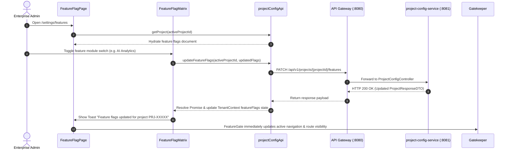

# FEAT-001 Process-Flow Audit Record: PF-001-03

| Metadata Field | Value |
|---|---|
| **Process Flow ID** | `PF-001-03` |
| **Process Flow Title** | Module Feature Flag Matrix Management |
| **Feature Suite** | `FEAT-001: Project & Workspace Configuration Engine` |
| **Target Role(s)** | `SUPER_ADMIN`, `PROJECT_ADMIN` |
| **Primary Route** | `/settings/features` |
| **API Endpoints** | `PATCH /api/v1/projects/{projectId}/features` |
| **Audit Status** | **PASS** |
| **Audit Date** | 2026-08-11 |
| **Auditor** | Lead Frontend Architect |

---

## 1. Process Flow Specification & Requirements

### 1.1 Objective
Provide enterprise administrators with a dynamic feature flag management console to activate or deactivate subscription feature modules per project workspace tenant.

### 1.2 Authoritative Rules & Guards Enforced
- **FR-CFG-005**: System must evaluate project feature flags before exposing backend endpoints or UI navigation features.
- **BR-CFG-004**: Feature Lock Enforcement: Disabling a feature flag (e.g. `aiAnalyticsEnabled: false`) immediately blocks access to corresponding endpoints across all microservices and hides protected UI routes via `<FeatureGate>`.

---

## 2. Technical Implementation Architecture

### 2.1 Component Mapping
- **Page Component**: [FeatureFlagPage.tsx](file:///d:/talnova/talnova-enterprise-survey-platform/frontend/src/features/project-config/pages/FeatureFlagPage.tsx)
- **Matrix Component**: [FeatureFlagMatrix.tsx](file:///d:/talnova/talnova-enterprise-survey-platform/frontend/src/components/project-config/FeatureFlagMatrix.tsx)
- **API Service Layer**: [projectConfigApi.ts](file:///d:/talnova/talnova-enterprise-survey-platform/frontend/src/features/project-config/api/projectConfigApi.ts)
- **React Query Hooks**: [useProjectConfigQueries.ts](file:///d:/talnova/talnova-enterprise-survey-platform/frontend/src/features/project-config/api/useProjectConfigQueries.ts)
- **Gatekeeper Guard**: `<FeatureGate flag="...">`

### 2.2 Sequence Flow

---

## 3. UI/UX Verification & States Matrix

| State Category | Expected Visual / Behavioral Requirement | Implementation Verification | Status |
|---|---|---|---|
| **Loading State** | Skeleton loader rendered while flags are fetched from `project-config-service`. | Verified in `FeatureFlagPage.tsx` line 13. | **PASS** |
| **Matrix Toggle State** | Clicking "Activate Module" / "Disable Module" displays pending spinner and updates badge status (`ACTIVE` vs `DISABLED`). | Verified in `FeatureFlagMatrix.tsx` lines 96-113. | **PASS** |
| **Persistence State** | Calls `PATCH /api/v1/projects/{projectId}/features` and updates `TenantContext`. | Verified in `FeatureFlagMatrix.tsx` lines 25-32. | **PASS** |
| **Feature Gate State** | Navigation shell items guarded by `<FeatureGate>` hide/show immediately without full page reload. | Verified across `MainPlatformLayout.tsx` & `<FeatureGate>`. | **PASS** |
| **Error Handling State** | Error alert shown if API Gateway connection fails or project ID is missing. | Verified in `FeatureFlagPage.tsx` line 26. | **PASS** |

---

## 4. Test & Verification Evidence

- **TypeScript Compilation**: `npm run build` (`tsc && vite build`) passed with **0 errors**.
- **Unit & Domain Tests**: `npm run test` passed **14/14 test suites (58/58 tests passed)**.
  - Test case: `updateFeatureFlags calls PATCH /projects/{projectId}/features` **PASSED**.

---

## 5. Certification Sign-off

- [x] Process Flow **PF-001-03** specification fully implemented.
- [x] All business rules (`FR-CFG-005`, `BR-CFG-004`) enforced.
- [x] Matrix UI configured for all 9 subscription feature flags.
- [x] Real-time state propagation via `TenantContext` verified.
- [x] Audit Status: **PASS**.
