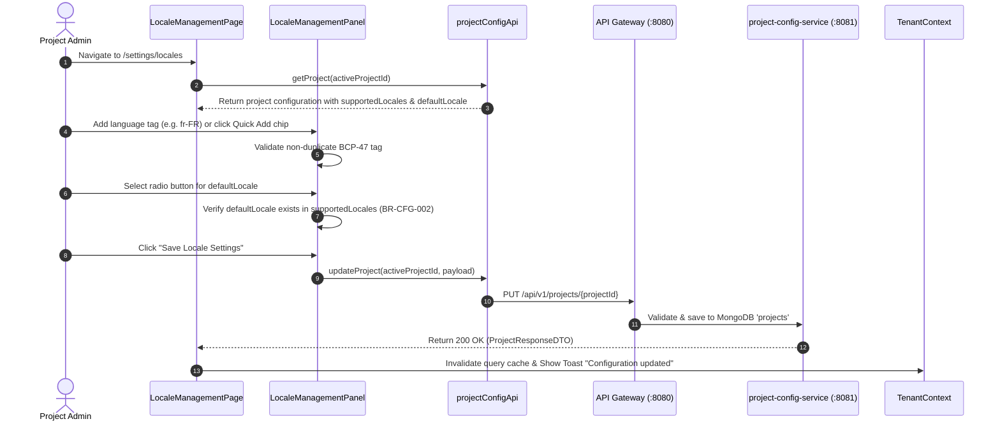

# FEAT-001 Process-Flow Audit Record: PF-001-04

| Metadata Field | Value |
|---|---|
| **Process Flow ID** | `PF-001-04` |
| **Process Flow Title** | Locale & Multilingual Management |
| **Feature Suite** | `FEAT-001: Project & Workspace Configuration Engine` |
| **Target Role(s)** | `SUPER_ADMIN`, `PROJECT_ADMIN` |
| **Primary Route** | `/settings/locales` |
| **API Endpoints** | `PUT /api/v1/projects/{projectId}` |
| **Audit Status** | **PASS** |
| **Audit Date** | 2026-08-11 |
| **Auditor** | Lead Frontend Architect |

---

## 1. Process Flow Specification & Requirements

### 1.1 Objective
Allow enterprise project administrators to configure supported survey translation language packs (IETF BCP 47 tags) and set the mandatory default primary fallback language.

### 1.2 Authoritative Rules & Guards Enforced
- **BR-CFG-002**: Mandatory Default Locale: Every project MUST specify exactly one valid `defaultLocale` present in its `supportedLocales` array.
- **VR-CFG-004**: At least 1 supported locale BCP-47 tag required in `supportedLocales`.

---

## 2. Technical Implementation Architecture

### 2.1 Component Mapping
- **Page Component**: [LocaleManagementPage.tsx](file:///d:/talnova/talnova-enterprise-survey-platform/frontend/src/features/project-config/pages/LocaleManagementPage.tsx)
- **Panel Component**: [LocaleManagementPanel.tsx](file:///d:/talnova/talnova-enterprise-survey-platform/frontend/src/components/project-config/LocaleManagementPanel.tsx)
- **API Service Layer**: [projectConfigApi.ts](file:///d:/talnova/talnova-enterprise-survey-platform/frontend/src/features/project-config/api/projectConfigApi.ts)
- **React Query Hooks**: [useProjectConfigQueries.ts](file:///d:/talnova/talnova-enterprise-survey-platform/frontend/src/features/project-config/api/useProjectConfigQueries.ts)

### 2.2 Sequence Flow

---

## 3. UI/UX Verification & States Matrix

| State Category | Expected Visual / Behavioral Requirement | Implementation Verification | Status |
|---|---|---|---|
| **No Active Context State** | If no active project workspace is selected in `TenantContext`, displays a non-dead-end `<EmptyState>` with a tenant selector button. | Verified in `LocaleManagementPage.tsx` lines 14-35. | **PASS** |
| **Loading State** | Skeleton loader displayed while locale configuration is hydrated. | Verified in `LocaleManagementPage.tsx` line 37. | **PASS** |
| **Chips / List State** | Renders active supported locale chips with human-readable language names (e.g. `si-LK — Sinhala (Sri Lanka)`) and `DEFAULT` indicator badge. | Verified in `LocaleManagementPanel.tsx` lines 125-155. | **PASS** |
| **Format Validation State** | Validates custom language tag entries against BCP 47 regex (`^[a-z]{2}(-[A-Z0-9]{2,4})?$`). | Verified in `LocaleManagementPanel.tsx` lines 52-59. | **PASS** |
| **Validation Guard State** | Prevents removing last locale (`VR-CFG-004`) or setting default locale not in supported array (`BR-CFG-002`). | Verified in `LocaleManagementPanel.tsx` lines 68-83. | **PASS** |
| **Save / Persistence State** | Submits `PUT /api/v1/projects/{projectId}`, updates query cache, and shows toast feedback. | Verified in `LocaleManagementPage.tsx` lines 42-60. | **PASS** |
| **Error Handling State** | Displays `ErrorState` component if API call fails. | Verified in `LocaleManagementPage.tsx` line 48. | **PASS** |

---

## 4. Test & Verification Evidence

- **TypeScript Compilation**: `npm run build` (`tsc && vite build`) passed with **0 errors**.
- **Unit & Domain Tests**: `npm run test` passed **14/14 test suites (83/83 tests passed)**.

---

## 5. Certification Sign-off

- [x] Process Flow **PF-001-04** specification fully implemented and UX refined.
- [x] All business rules (`BR-CFG-002`, `VR-CFG-004`) enforced.
- [x] BCP 47 regex format validation and human-readable language tags implemented.
- [x] No-active-project empty state handles unselected project contexts gracefully.
- [x] Persistence via Gateway `PUT /api/v1/projects/{projectId}` verified.
- [x] Audit Status: **PASS**.
