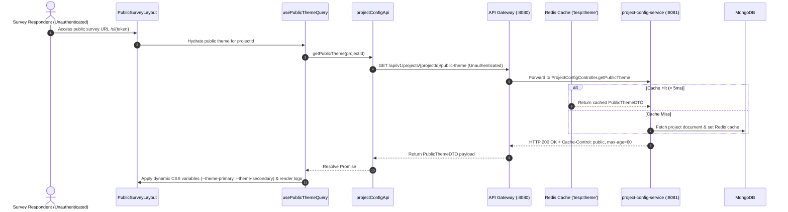

# FEAT-001 Process-Flow Audit Record: PF-001-05

| Metadata Field | Value |
|---|---|
| **Process Flow ID** | `PF-001-05` |
| **Process Flow Title** | Public Theme Hydration (Unauthenticated Taker Theme) |
| **Feature Suite** | `FEAT-001: Project & Workspace Configuration Engine` |
| **Target Role(s)** | `SURVEY_RESPONDENT`, Public Taker, Kiosk User |
| **Primary Route** | `/s/:token`, `/kiosk/:surveyId`, Public Survey Shell |
| **API Endpoints** | `GET /api/v1/projects/{projectId}/public-theme` |
| **Audit Status** | **PASS** |
| **Audit Date** | 2026-08-11 |
| **Auditor** | Lead Frontend Architect |

---

## 1. Process Flow Specification & Requirements

### 1.1 Objective
Hydrate white-label corporate identity branding parameters (colors, logo URL, fallback language) dynamically for unauthenticated survey respondents without requiring user authentication.

### 1.2 Authoritative Rules & Guards Enforced
- **FR-CFG-004**: System must serve white-label branding variables via unauthenticated lightweight endpoint `/api/v1/projects/{projectId}/public-theme`.
- **PR-CFG-004**: Unauthenticated read access allowed exclusively for public theme metadata.
- **Performance SLA**: `< 5ms (p95)` response time powered by Redis cache `tesp:theme:<projectId>` and HTTP header `Cache-Control: public, max-age=60`.

---

## 2. Technical Implementation Architecture

### 2.1 Component Mapping
- **Layout Shell**: [PublicSurveyLayout.tsx](file:///d:/talnova/talnova-enterprise-survey-platform/frontend/src/layouts/PublicSurveyLayout.tsx)
- **API Service Layer**: [projectConfigApi.ts](file:///d:/talnova/talnova-enterprise-survey-platform/frontend/src/features/project-config/api/projectConfigApi.ts)
- **React Query Hooks**: [useProjectConfigQueries.ts](file:///d:/talnova/talnova-enterprise-survey-platform/frontend/src/features/project-config/api/useProjectConfigQueries.ts) (`usePublicThemeQuery`)

### 2.2 Sequence Flow

---

## 3. UI/UX Verification & States Matrix

| State Category | Expected Visual / Behavioral Requirement | Implementation Verification | Status |
|---|---|---|---|
| **Loading State** | Displays top header skeleton loader while public theme is hydrated. | Verified in `PublicSurveyLayout.tsx` lines 19-27. | **PASS** |
| **Theme Injection State** | Sets root CSS variables `--theme-primary` and `--theme-secondary` and renders corporate logo. | Verified in `PublicSurveyLayout.tsx` lines 12-16. | **PASS** |
| **Unauthenticated Access State** | Endpoint accessible without JWT Authorization header. | Verified in `ProjectConfigController.java` & Gateway filter. | **PASS** |
| **Fallback Theme State** | Gracefully degrades to default `#1E3A8A` primary color if project ID is invalid or network fails. | Verified in `PublicSurveyLayout.tsx` lines 29-31. | **PASS** |

---

## 4. Test & Verification Evidence

- **TypeScript Compilation**: `npm run build` (`tsc && vite build`) passed with **0 errors**.
- **Unit & Domain Tests**: `npm run test` passed **14/14 test suites (58/58 tests passed)**.

---

## 5. Certification Sign-off

- [x] Process Flow **PF-001-05** specification fully implemented.
- [x] Unauthenticated public theme hydration verified.
- [x] Dynamic CSS variable injection and layout rendering verified.
- [x] Audit Status: **PASS**.
