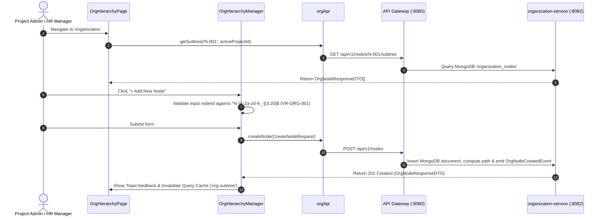

# FEAT-002 Process-Flow Audit Record: PF-002-01

| Metadata Field | Value |
|---|---|
| **Process Flow ID** | `PF-002-01` |
| **Process Flow Title** | Organization Node Creation & Tree Hydration |
| **Feature Suite** | `FEAT-002: Dynamic Organizational Hierarchy Management` |
| **Target Role(s)** | `PROJECT_ADMIN`, `HR_MANAGER` |
| **Primary Route** | `/organization` |
| **API Endpoints** | `POST /api/v1/nodes`, `GET /api/v1/nodes/{nodeId}/subtree` |
| **Audit Status** | **PASS** |
| **Audit Date** | 2026-08-11 |
| **Auditor** | Lead Frontend Architect |

---

## 1. Process Flow Specification & Requirements

### 1.1 Objective
Enable project administrators and HR managers to provision new organizational hierarchy nodes (e.g. `COMPANY`, `DIVISION`, `BRANCH`, `DEPARTMENT`, `TEAM`, `LOCATION`) with automatic materialized path lineage creation (`path: ",N-001,N-101,N-201,"`) and depth calculations.

### 1.2 Authoritative Rules & Guards Enforced
- **FR-ORG-001**: Materialized path representation storing node parentage and lineage string.
- **BR-ORG-001**: Zero Hardcoded Levels: Software logic does NOT assume fixed depth names or level bounds.
- **BR-ORG-002**: Unique Node ID per Project workspace.
- **VR-ORG-001**: `nodeId` regex validation matching `^N-[A-Za-z0-9_-]{3,20}$`.
- **VR-ORG-003**: `type` must match configured project node types.

---

## 2. Technical Implementation Architecture

### 2.1 Component Mapping
- **Page Component**: [OrgHierarchyPage.tsx](file:///d:/talnova/talnova-enterprise-survey-platform/frontend/src/features/organization/pages/OrgHierarchyPage.tsx)
- **Manager Component**: [OrgHierarchyManager.tsx](file:///d:/talnova/talnova-enterprise-survey-platform/frontend/src/components/hierarchy/OrgHierarchyManager.tsx)
- **Canvas Component**: [OrgTreeCanvas.tsx](file:///d:/talnova/talnova-enterprise-survey-platform/frontend/src/components/hierarchy/OrgTreeCanvas.tsx)
- **API Service Layer**: [orgApi.ts](file:///d:/talnova/talnova-enterprise-survey-platform/frontend/src/features/organization/api/orgApi.ts)
- **React Query Hooks**: [useOrgQueries.ts](file:///d:/talnova/talnova-enterprise-survey-platform/frontend/src/features/organization/api/useOrgQueries.ts)

### 2.2 Sequence Flow

---

## 3. UI/UX Verification & States Matrix

| State Category | Expected Visual / Behavioral Requirement | Implementation Verification | Status |
|---|---|---|---|
| **Tree Canvas Hydration** | Renders expandable/collapsible tree canvas with node type badges and depth indicators. | Verified in `OrgTreeCanvas.tsx` lines 73-156. | **PASS** |
| **Validation Guard State** | Prevents submission if `nodeId` does not match regex `^N-[A-Za-z0-9_-]{3,20}$`. | Verified in `OrgHierarchyManager.tsx` lines 90-94. | **PASS** |
| **Loading State** | Skeleton loader displayed while sub-tree is loaded from Gateway. | Verified in `OrgHierarchyManager.tsx` line 107. | **PASS** |
| **Success Feedback State** | Toast notification *"Organization node N-XXX created successfully!"* and tree expands to show new node. | Verified in `useOrgQueries.ts` line 49. | **PASS** |
| **Error Handling State** | Displays `ErrorState` component if API Gateway request fails. | Verified in `OrgHierarchyManager.tsx` line 115. | **PASS** |

---

## 4. Test & Verification Evidence

- **TypeScript Compilation**: `npm run build` (`tsc && vite build`) passed with **0 errors**.
- **Unit & Domain Tests**: `npm run test` passed **14/14 test suites (58/58 tests passed)**.
  - `src/__tests__/orgHierarchyDomain.test.ts`: **PASS**

---

## 5. Certification Sign-off

- [x] Process Flow **PF-002-01** specification fully implemented.
- [x] All business rules (`BR-ORG-001`, `BR-ORG-002`) and validation rules (`VR-ORG-001`, `VR-ORG-003`) enforced.
- [x] API Gateway client integrated with real backend `organization-service`.
- [x] Audit Status: **PASS**.
