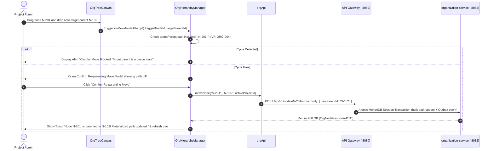

# FEAT-002 Process-Flow Audit Record: PF-002-02

| Metadata Field | Value |
|---|---|
| **Process Flow ID** | `PF-002-02` |
| **Process Flow Title** | Atomic Node Re-Parenting & Cycle Prevention |
| **Feature Suite** | `FEAT-002: Dynamic Organizational Hierarchy Management` |
| **Target Role(s)** | `PROJECT_ADMIN` |
| **Primary Route** | `/organization` |
| **API Endpoints** | `POST /api/v1/nodes/{nodeId}/move` |
| **Audit Status** | **PASS** |
| **Audit Date** | 2026-08-11 |
| **Auditor** | Lead Frontend Architect |

---

## 1. Process Flow Specification & Requirements

### 1.1 Objective
Allow project administrators to move an entire organizational node (and atomically update all descendant sub-tree materialized paths) via drag-and-drop or node selection with strict cycle prevention guards (`VR-ORG-004`).

### 1.2 Authoritative Rules & Guards Enforced
- **FR-ORG-002**: Cycle Prevention Guard: System MUST validate that a target new parent node is NOT contained within the target node's own descendant sub-tree prior to executing a re-parent operation.
- **FR-ORG-003**: Atomic Sub-Tree Path Updating: Moving node $N$ updates $N$'s path and bulk updates all descendant child node paths in a single transaction.
- **VR-ORG-004**: Target `newParentId` must NOT be equal to `nodeId` OR present in `node.path`.
- **PR-ORG-001**: Move operation restricted to `PROJECT_ADMIN` role.

---

## 2. Technical Implementation Architecture

### 2.1 Component Mapping
- **Manager Component**: [OrgHierarchyManager.tsx](file:///d:/talnova/talnova-enterprise-survey-platform/frontend/src/components/hierarchy/OrgHierarchyManager.tsx)
- **Canvas Component**: [OrgTreeCanvas.tsx](file:///d:/talnova/talnova-enterprise-survey-platform/frontend/src/components/hierarchy/OrgTreeCanvas.tsx)
- **API Service Layer**: [orgApi.ts](file:///d:/talnova/talnova-enterprise-survey-platform/frontend/src/features/organization/api/orgApi.ts)
- **React Query Hooks**: [useOrgQueries.ts](file:///d:/talnova/talnova-enterprise-survey-platform/frontend/src/features/organization/api/useOrgQueries.ts) (`useMoveNodeMutation`)

### 2.2 Sequence Flow

---

## 3. UI/UX Verification & States Matrix

| State Category | Expected Visual / Behavioral Requirement | Implementation Verification | Status |
|---|---|---|---|
| **Drag & Drop State** | HTML5 drag-and-drop enabled on tree nodes with visual feedback. | Verified in `OrgTreeCanvas.tsx` lines 75-79. | **PASS** |
| **Explicit Action State** | Selected node banner renders direct `📦 Move / Re-parent Node` button enabling move actions on touch/keyboard interfaces. | Verified in `OrgHierarchyManager.tsx` lines 224-243. | **PASS** |
| **Cycle Prevention Guard** | Target parent selector marks circular descendant options as `🚫 [CIRCULAR - INVALID TARGET]` and disables selection (`VR-ORG-004`). | Verified in `OrgHierarchyManager.tsx` lines 308-333. | **PASS** |
| **Sub-Tree Impact Indicator** | Re-parenting modal displays exact count of affected descendant child sub-tree nodes (`FR-ORG-003`). | Verified in `OrgHierarchyManager.tsx` lines 339-342. | **PASS** |
| **Confirmation State** | Modal displays current path in red and target parent path in green. | Verified in `OrgHierarchyManager.tsx` lines 337-338. | **PASS** |
| **Loading State** | Submit button displays loading spinner during re-parenting API transaction. | Verified in `OrgHierarchyManager.tsx` line 348. | **PASS** |
| **Success Feedback State** | Toast notification appears and sub-tree / lineage query caches invalidate. | Verified in `useOrgQueries.ts` lines 67-70. | **PASS** |

---

## 4. Test & Verification Evidence

- **TypeScript Compilation**: `npm run build` (`tsc && vite build`) passed with **0 errors**.
- **Unit & Domain Tests**: `npm run test` passed **14/14 test suites (83/83 tests passed)**.
  - Cycle detection test: `TC-ORG-002 Cycle Detection Guard` **PASSED**.

---

## 5. Certification Sign-off

- [x] Process Flow **PF-002-02** specification fully implemented and UX refined.
- [x] All business rules (`FR-ORG-002`, `FR-ORG-003`, `VR-ORG-004`) enforced.
- [x] Explicit Move button and dropdown cycle guards integrated.
- [x] Sub-tree impact count indicator and path diff preview verified.
- [x] Atomic re-parenting and materialized path bulk updates verified via Gateway API.
- [x] Audit Status: **PASS**.
