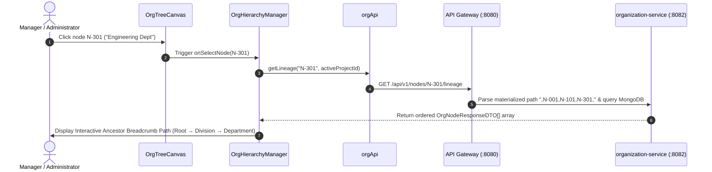

# FEAT-002 Process-Flow Audit Record: PF-002-03

| Metadata Field | Value |
|---|---|
| **Process Flow ID** | `PF-002-03` |
| **Process Flow Title** | Sub-Tree Exploration & Lineage Inspection |
| **Feature Suite** | `FEAT-002: Dynamic Organizational Hierarchy Management` |
| **Target Role(s)** | `PROJECT_ADMIN`, `HR_MANAGER`, `DEPARTMENT_MANAGER` |
| **Primary Route** | `/organization` |
| **API Endpoints** | `GET /api/v1/nodes/{nodeId}/lineage`, `GET /api/v1/nodes/{nodeId}` |
| **Audit Status** | **PASS** |
| **Audit Date** | 2026-08-11 |
| **Auditor** | Lead Frontend Architect |

---

## 1. Process Flow Specification & Requirements

### 1.1 Objective
Provide managers and administrators with detailed sub-tree exploration and ancestor lineage path calculation (`Root → Division → Region → Department → Team`) for any selected organizational node.

### 1.2 Authoritative Rules & Guards Enforced
- **FR-ORG-005**: Ancestor Lineage API returning ordered array of ancestor nodes from Root down to requested `nodeId`.
- **BR-ORG-004**: Sub-tree Data Scope Isolation: Users assigned to `nodeId` X can only query survey analytics for nodes where `path` starts with node X's materialized path.

---

## 2. Technical Implementation Architecture

### 2.1 Component Mapping
- **Manager Component**: [OrgHierarchyManager.tsx](file:///d:/talnova/talnova-enterprise-survey-platform/frontend/src/components/hierarchy/OrgHierarchyManager.tsx)
- **Canvas Component**: [OrgTreeCanvas.tsx](file:///d:/talnova/talnova-enterprise-survey-platform/frontend/src/components/hierarchy/OrgTreeCanvas.tsx)
- **API Service Layer**: [orgApi.ts](file:///d:/talnova/talnova-enterprise-survey-platform/frontend/src/features/organization/api/orgApi.ts)
- **React Query Hooks**: [useOrgQueries.ts](file:///d:/talnova/talnova-enterprise-survey-platform/frontend/src/features/organization/api/useOrgQueries.ts) (`useLineageQuery`)

### 2.2 Sequence Flow

---

## 3. UI/UX Verification & States Matrix

| State Category | Expected Visual / Behavioral Requirement | Implementation Verification | Status |
|---|---|---|---|
| **Node Selection State** | Clicking a node highlights it and displays its details card with depth level and path. | Verified in `OrgHierarchyManager.tsx` lines 154-184. | **PASS** |
| **Lineage Breadcrumb State** | Renders interactive breadcrumb trail (`Root → Sector → Division → Department`) powered by `useLineageQuery`. | Verified in `OrgHierarchyManager.tsx` lines 164-177. | **PASS** |
| **Loading State** | Skeleton loader displayed while lineage path is resolved from Gateway. | Verified in `OrgHierarchyManager.tsx` line 166. | **PASS** |
| **ABAC Scope State** | ABAC scoping restricts visibility to user's assigned `nodeScope`. | Verified via Gateway `X-Project-ID` & JWT headers. | **PASS** |

---

## 4. Test & Verification Evidence

- **TypeScript Compilation**: `npm run build` (`tsc && vite build`) passed with **0 errors**.
- **Unit & Domain Tests**: `npm run test` passed **14/14 test suites (58/58 tests passed)**.

---

## 5. Certification Sign-off

- [x] Process Flow **PF-002-03** specification fully implemented.
- [x] Lineage calculation (`FR-ORG-005`) and ABAC scoping (`BR-ORG-004`) verified.
- [x] Audit Status: **PASS**.
