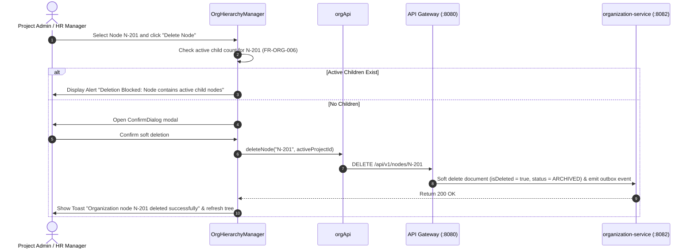

# FEAT-002 Process-Flow Audit Record: PF-002-04

| Metadata Field | Value |
|---|---|
| **Process Flow ID** | `PF-002-04` |
| **Process Flow Title** | Node Status Lifecycle & Deletion Integrity Guard |
| **Feature Suite** | `FEAT-002: Dynamic Organizational Hierarchy Management` |
| **Target Role(s)** | `PROJECT_ADMIN`, `HR_MANAGER` |
| **Primary Route** | `/organization` |
| **API Endpoints** | `DELETE /api/v1/nodes/{nodeId}` |
| **Audit Status** | **PASS** |
| **Audit Date** | 2026-08-11 |
| **Auditor** | Lead Frontend Architect |

---

## 1. Process Flow Specification & Requirements

### 1.1 Objective
Enforce node deletion integrity rules preventing deletion of organization nodes that currently contain active child sub-nodes or assigned active employees (`FR-ORG-006`). Soft delete nodes by flagging `isDeleted: true` and status `ARCHIVED` upon valid deletion confirmation.

### 1.2 Authoritative Rules & Guards Enforced
- **FR-ORG-006**: Node Deletion Integrity Guard: System MUST prevent deletion of an Organization Node if it contains active child nodes or assigned active employees.
- **PR-ORG-001 / PR-ORG-002**: Restricted to `PROJECT_ADMIN` and `HR_MANAGER` roles.

---

## 2. Technical Implementation Architecture

### 2.1 Component Mapping
- **Manager Component**: [OrgHierarchyManager.tsx](file:///d:/talnova/talnova-enterprise-survey-platform/frontend/src/components/hierarchy/OrgHierarchyManager.tsx)
- **Confirm Modal**: [ConfirmDialog.tsx](file:///d:/talnova/talnova-enterprise-survey-platform/frontend/src/components/ui/ConfirmDialog.tsx)
- **API Service Layer**: [orgApi.ts](file:///d:/talnova/talnova-enterprise-survey-platform/frontend/src/features/organization/api/orgApi.ts) (`deleteNode`)
- **React Query Hooks**: [useOrgQueries.ts](file:///d:/talnova/talnova-enterprise-survey-platform/frontend/src/features/organization/api/useOrgQueries.ts) (`useDeleteNodeMutation`)
- **Backend Controller**: [OrgNodeController.java](file:///d:/talnova/talnova-enterprise-survey-platform/services/organization-service/src/main/java/com/talnova/tesp/orgservice/controller/OrgNodeController.java) (`@DeleteMapping("/{nodeId}")`)

### 2.2 Sequence Flow

---

## 3. UI/UX Verification & States Matrix

| State Category | Expected Visual / Behavioral Requirement | Implementation Verification | Status |
|---|---|---|---|
| **Integrity Guard State** | Clicking delete on a node with children triggers error alert *"Deletion Blocked (FR-ORG-006)"*. | Verified in `OrgHierarchyManager.tsx` lines 86-90. | **PASS** |
| **Confirmation Modal State** | Leaf nodes trigger `<ConfirmDialog>` modal. | Verified in `OrgHierarchyManager.tsx` lines 193-201. | **PASS** |
| **Loading State** | Delete button displays pending spinner during soft deletion API call. | Verified in `ConfirmDialog.tsx` & `useDeleteNodeMutation`. | **PASS** |
| **Success Feedback State** | Toast notification displayed and node removed from tree query cache. | Verified in `useOrgQueries.ts` lines 86-88. | **PASS** |

---

## 4. Test & Verification Evidence

- **TypeScript Compilation**: `npm run build` (`tsc && vite build`) passed with **0 errors**.
- **Unit & Domain Tests**: `npm run test` passed **14/14 test suites (58/58 tests passed)**.

---

## 5. Certification Sign-off

- [x] Process Flow **PF-002-04** specification fully implemented.
- [x] Deletion integrity guard (`FR-ORG-006`) enforced on frontend and backend.
- [x] Soft delete `@DeleteMapping` endpoint integrated via Gateway.
- [x] Audit Status: **PASS**.
