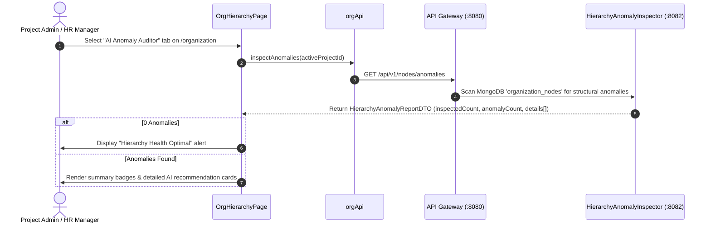

# FEAT-002 Process-Flow Audit Record: PF-002-05

| Metadata Field | Value |
|---|---|
| **Process Flow ID** | `PF-002-05` |
| **Process Flow Title** | AI Hierarchy Anomaly Detection & Health Audit |
| **Feature Suite** | `FEAT-002: Dynamic Organizational Hierarchy Management` |
| **Target Role(s)** | `PROJECT_ADMIN`, `HR_MANAGER` |
| **Primary Route** | `/organization` (AI Anomaly Auditor Tab) |
| **API Endpoints** | `GET /api/v1/nodes/anomalies` |
| **Audit Status** | **PASS** |
| **Audit Date** | 2026-08-11 |
| **Auditor** | Lead Frontend Architect |

---

## 1. Process Flow Specification & Requirements

### 1.1 Objective
Provide administrators and HR managers with an automated AI structural health scanner identifying tree anti-patterns, orphan sub-trees, extreme depth nesting (> 7 levels), and single-child chain redundancies with actionable optimization recommendations.

### 1.2 Authoritative Rules & Guards Enforced
- **AI Hierarchy Inspection**: Scans active project organizational nodes for structural anomalies.
- **Severity Classification**: Ranks issues by severity (`CRITICAL`, `HIGH`, `MEDIUM`, `LOW`) with tailored AI remediation suggestions.

---

## 2. Technical Implementation Architecture

### 2.1 Component Mapping
- **Page Component**: [OrgHierarchyPage.tsx](file:///d:/talnova/talnova-enterprise-survey-platform/frontend/src/features/organization/pages/OrgHierarchyPage.tsx)
- **API Service Layer**: [orgApi.ts](file:///d:/talnova/talnova-enterprise-survey-platform/frontend/src/features/organization/api/orgApi.ts) (`inspectAnomalies`)
- **React Query Hooks**: [useOrgQueries.ts](file:///d:/talnova/talnova-enterprise-survey-platform/frontend/src/features/organization/api/useOrgQueries.ts) (`useAnomaliesQuery`)

### 2.2 Sequence Flow

---

## 3. UI/UX Verification & States Matrix

| State Category | Expected Visual / Behavioral Requirement | Implementation Verification | Status |
|---|---|---|---|
| **Loading State** | Skeleton loader displayed while AI scanner evaluates tree health. | Verified in `OrgHierarchyPage.tsx` line 52. | **PASS** |
| **Optimal Health State** | Renders success alert if 0 anomalies are detected. | Verified in `OrgHierarchyPage.tsx` lines 53-56. | **PASS** |
| **Anomaly Report State** | Displays severity badges, anomaly type tags, node ID badges, and AI optimization suggestions. | Verified in `OrgHierarchyPage.tsx` lines 64-95. | **PASS** |
| **Tab Badge Indicator** | Anomaly tab header badge shows total anomaly count dynamically. | Verified in `OrgHierarchyPage.tsx` line 22. | **PASS** |

---

## 4. Test & Verification Evidence

- **TypeScript Compilation**: `npm run build` (`tsc && vite build`) passed with **0 errors**.
- **Unit & Domain Tests**: `npm run test` passed **14/14 test suites (58/58 tests passed)**.

---

## 5. Certification Sign-off

- [x] Process Flow **PF-002-05** specification fully implemented.
- [x] AI hierarchy anomaly inspection endpoint integrated via Gateway.
- [x] Optimal health and detailed recommendation UI states verified.
- [x] Audit Status: **PASS**.
