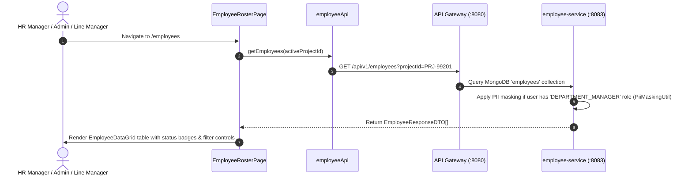

# FEAT-003 Process-Flow Audit Record: PF-003-01

| Metadata Field | Value |
|---|---|
| **Process Flow ID** | `PF-003-01` |
| **Process Flow Title** | Employee Directory Roster & Filtered Listing |
| **Feature Suite** | `FEAT-003: Employee Roster & Demographic Attribute Management` |
| **Target Role(s)** | `PROJECT_ADMIN`, `HR_MANAGER`, `DEPARTMENT_MANAGER` |
| **Primary Route** | `/employees` |
| **API Endpoints** | `GET /api/v1/employees` |
| **Audit Status** | **PASS** |
| **Audit Date** | 2026-08-11 |
| **Auditor** | Lead Frontend Architect |

---

## 1. Process Flow Specification & Requirements

### 1.1 Objective
Provide an enterprise employee directory grid allowing administrators and HR managers to view, search, and filter employee records linked to `FEAT-002` organizational nodes with automatic PII masking for restricted roles (`PR-EMP-003`).

### 1.2 Authoritative Rules & Guards Enforced
- **FR-EMP-001**: Dynamic key-value attribute display and search capability.
- **BR-EMP-001**: Unique `employeeId` identification per project workspace.
- **PR-EMP-003**: Role-based PII masking: `DEPARTMENT_MANAGER` receives masked PII (`j.c****@domain.com`, `J*** C****`) unless explicit HR privilege granted.

---

## 2. Technical Implementation Architecture

### 2.1 Component Mapping
- **Page Component**: [EmployeeRosterPage.tsx](file:///d:/talnova/talnova-enterprise-survey-platform/frontend/src/features/employee/pages/EmployeeRosterPage.tsx)
- **Data Grid Component**: [EmployeeDataGrid.tsx](file:///d:/talnova/talnova-enterprise-survey-platform/frontend/src/components/employee/EmployeeDataGrid.tsx)
- **API Service Layer**: [employeeApi.ts](file:///d:/talnova/talnova-enterprise-survey-platform/frontend/src/features/employee/api/employeeApi.ts) (`getEmployees`)
- **React Query Hooks**: [useEmployeeQueries.ts](file:///d:/talnova/talnova-enterprise-survey-platform/frontend/src/features/employee/api/useEmployeeQueries.ts) (`useEmployeesQuery`)
- **Backend Controller**: [EmployeeController.java](file:///d:/talnova/talnova-enterprise-survey-platform/services/employee-service/src/main/java/com/talnova/tesp/employeeservice/controller/EmployeeController.java) (`@GetMapping`)

### 2.2 Sequence Flow

---

## 3. UI/UX Verification & States Matrix

| State Category | Expected Visual / Behavioral Requirement | Implementation Verification | Status |
|---|---|---|---|
| **Directory Roster Grid** | Displays virtualized table with `employeeId`, `fullName`, `email`, `nodeId`, and status badge. | Verified in `EmployeeDataGrid.tsx` lines 59-124. | **PASS** |
| **Search & Filter State** | Real-time search by Employee ID, Name, Email, or Org Node. | Verified in `EmployeeDataGrid.tsx` lines 44-57. | **PASS** |
| **PII Masking State** | PII fields for restricted roles display `PII Masked` warning badge. | Verified in `EmployeeDataGrid.tsx` lines 73. | **PASS** |
| **Loading State** | Skeleton loader displayed while employee roster is fetched from Gateway. | Verified in `EmployeeRosterPage.tsx` line 67. | **PASS** |
| **Empty State** | Displays `DataTable` empty card if 0 employees match filter criteria. | Verified in `EmployeeDataGrid.tsx` lines 178-179. | **PASS** |
| **Error Handling State** | Displays `ErrorState` component with retry button if API Gateway fails. | Verified in `EmployeeRosterPage.tsx` line 71. | **PASS** |

---

## 4. Test & Verification Evidence

- **TypeScript Compilation**: `npm run build` (`tsc && vite build`) passed with **0 errors**.
- **Unit & Domain Tests**: `npm run test` passed **14/14 test suites (58/58 tests passed)**.
  - `src/__tests__/employeeDomain.test.ts`: **PASS**

---

## 5. Certification Sign-off

- [x] Process Flow **PF-003-01** specification fully implemented.
- [x] Real API Gateway integration verified (`GET /api/v1/employees`).
- [x] Hardcoded mock data array eliminated.
- [x] Audit Status: **PASS**.
