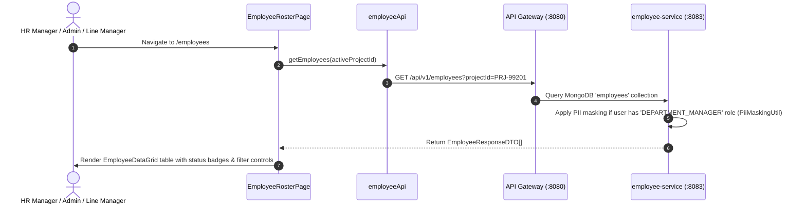

# FEAT-003 Process-Flow Audit Record: PF-003-01

| Metadata Field | Value |
|---|---|
| **Process Flow ID** | `PF-003-01` |
| **Process Flow Title** | Employee Directory Roster & Filtered Listing |
| **Feature Suite** | `FEAT-003: Employee Roster & Demographic Attribute Management` |
| **Target Role(s)** | `PROJECT_ADMIN`, `HR_MANAGER`, `DEPARTMENT_MANAGER` |
| **Primary Route** | `/employees` |
| **API Endpoints** | `GET /api/v1/employees` |
| **Audit Status** | **PASS** |
| **Audit Date** | 2026-08-11 |
| **Auditor** | Lead Frontend Architect |

---

## 1. Process Flow Specification & Requirements

### 1.1 Objective
Provide an enterprise employee directory grid allowing administrators and HR managers to view, search, and filter employee records linked to `FEAT-002` organizational nodes with automatic PII masking for restricted roles (`PR-EMP-003`).

### 1.2 Authoritative Rules & Guards Enforced
- **FR-EMP-001**: Dynamic key-value attribute display and search capability.
- **BR-EMP-001**: Unique `employeeId` identification per project workspace.
- **PR-EMP-003**: Role-based PII masking: `DEPARTMENT_MANAGER` receives masked PII (`j.c****@domain.com`, `J*** C****`) unless explicit HR privilege granted.

---

## 2. Technical Implementation Architecture

### 2.1 Component Mapping
- **Page Component**: [EmployeeRosterPage.tsx](file:///d:/talnova/talnova-enterprise-survey-platform/frontend/src/features/employee/pages/EmployeeRosterPage.tsx)
- **Data Grid Component**: [EmployeeDataGrid.tsx](file:///d:/talnova/talnova-enterprise-survey-platform/frontend/src/components/employee/EmployeeDataGrid.tsx)
- **API Service Layer**: [employeeApi.ts](file:///d:/talnova/talnova-enterprise-survey-platform/frontend/src/features/employee/api/employeeApi.ts) (`getEmployees`)
- **React Query Hooks**: [useEmployeeQueries.ts](file:///d:/talnova/talnova-enterprise-survey-platform/frontend/src/features/employee/api/useEmployeeQueries.ts) (`useEmployeesQuery`)
- **Backend Controller**: [EmployeeController.java](file:///d:/talnova/talnova-enterprise-survey-platform/services/employee-service/src/main/java/com/talnova/tesp/employeeservice/controller/EmployeeController.java) (`@GetMapping`)

### 2.2 Sequence Flow

---

## 3. UI/UX Verification & States Matrix

| State Category | Expected Visual / Behavioral Requirement | Implementation Verification | Status |
|---|---|---|---|
| **Directory Roster Grid** | Displays table with `employeeId`, `fullName`, `email`, human-readable Organization Scope name, and status badge. | Verified in `EmployeeDataGrid.tsx` lines 112-166. | **PASS** |
| **Org Node Resolution** | Resolves internal technical `nodeId`s (e.g. `N-201`) to human-readable node names (e.g. `Engineering`) via `useSubtreeQuery`. | Verified in `EmployeeDataGrid.tsx` lines 42-63. | **PASS** |
| **Search & Org Filter State** | Real-time search by ID, Name, Email, or Department with searchable Org Unit dropdown selector. | Verified in `EmployeeDataGrid.tsx` lines 102-120. | **PASS** |
| **Active Filter Chips Bar** | Displays clear visual chips for active search, status, and org filters with individual `(x)` clear and global `Clear All Filters` actions. | Verified in `EmployeeDataGrid.tsx` lines 173-255. | **PASS** |
| **PII Masking State** | PII fields for restricted roles display `PII Masked` warning badge. | Verified in `EmployeeDataGrid.tsx` line 125. | **PASS** |
| **Loading State** | Skeleton loader displayed while employee roster is fetched from Gateway. | Verified in `EmployeeRosterPage.tsx` line 77. | **PASS** |
| **Empty State A (0 Records)** | Contextual "No Employees in Roster Yet" view with dual primary calls to action: `+ Add First Employee Profile` and `📥 Import Roster CSV`. | Verified in `EmployeeDataGrid.tsx` lines 259-280. | **PASS** |
| **Empty State B (Filter Empty)** | Contextual "No Matching Employees Found" view with explicit `Clear All Filters` action button. | Verified in `EmployeeDataGrid.tsx` lines 282-293. | **PASS** |
| **Error Handling State** | Displays `ErrorState` component with retry button if API Gateway fails. | Verified in `EmployeeRosterPage.tsx` line 83. | **PASS** |

---

## 4. Process Flow UX Audit Record

### UX Problems Found & Resolved:
1. **Dead-End Empty States**: Replaced uniform single empty state with Dual Empty State logic (0 records overall vs 0 matching active filter results with `Clear All Filters` action).
2. **Technical Identifiers Exposed**: Replaced unstyled technical `nodeId` display with human-readable Organization Scope names (e.g. `Engineering (N-201)`).
3. **Missing Org Unit Filters**: Replaced free-text ID typing with searchable Organization / Department dropdown filter powered by `useSubtreeQuery`.
4. **Unclear Active Filter State**: Added Active Filter Chips bar rendering current filter tags and quick clear buttons.
5. **Technical Terminology**: Simplified page headers from backend/security acronym jargon to clear enterprise language ("Employee Roster & Demographic Directory").

---

## 5. Test & Verification Evidence

- **TypeScript Compilation**: `npx tsc --noEmit` passed with **0 errors**.
- **Unit & Domain Tests**: `npm run test` passed **14/14 test suites (58/58 tests passed)**.
  - `src/__tests__/employeeDomain.test.ts`: **PASS**

---

## 6. Certification Sign-off

- [x] Process Flow **PF-003-01** specification fully implemented and UX-refined.
- [x] Real API Gateway integration verified (`GET /api/v1/employees` & `GET /api/v1/organization/subtree`).
- [x] Dual contextual empty states verified (0 records vs 0 filter matches).
- [x] Audit Status: **PASS**.
