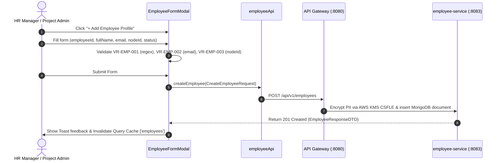

# FEAT-003 Process-Flow Audit Record: PF-003-02

| Metadata Field | Value |
|---|---|
| **Process Flow ID** | `PF-003-02` |
| **Process Flow Title** | Individual Employee Provisioning & Profile Management |
| **Feature Suite** | `FEAT-003: Employee Roster & Demographic Attribute Management` |
| **Target Role(s)** | `PROJECT_ADMIN`, `HR_MANAGER` |
| **Primary Route** | `/employees` |
| **API Endpoints** | `POST /api/v1/employees`, `PUT /api/v1/employees/{employeeId}` |
| **Audit Status** | **PASS** |
| **Audit Date** | 2026-08-11 |
| **Auditor** | Lead Frontend Architect |

---

## 1. Process Flow Specification & Requirements

### 1.1 Objective
Allow HR managers and project administrators to provision new employee profiles or update existing profiles, enforcing `VR-EMP-001` ID patterns, `VR-EMP-002` RFC 5322 email formatting, `VR-EMP-003` organizational node linking, and AWS KMS CSFLE PII client-side encryption (`FR-EMP-002`).

### 1.2 Authoritative Rules & Guards Enforced
- **FR-EMP-002**: Client-Side Field Level Encryption (CSFLE) encrypting sensitive PII (`email`, `fullName`, `phoneNumber`) before writing to persistent storage.
- **BR-EMP-001**: Unique `employeeId` per project workspace.
- **BR-EMP-002**: Primary `nodeId` reference check against active `FEAT-002` nodes.
- **VR-EMP-001**: `employeeId` regex matching `^[A-Za-z0-9_-]{2,30}$`.
- **VR-EMP-002**: RFC 5322 valid corporate email format.
- **VR-EMP-003**: Assigned `nodeId` existence check.

---

## 2. Technical Implementation Architecture

### 2.1 Component Mapping
- **Modal Component**: [EmployeeFormModal.tsx](file:///d:/talnova/talnova-enterprise-survey-platform/frontend/src/components/employee/EmployeeFormModal.tsx)
- **Data Grid Component**: [EmployeeDataGrid.tsx](file:///d:/talnova/talnova-enterprise-survey-platform/frontend/src/components/employee/EmployeeDataGrid.tsx)
- **API Service Layer**: [employeeApi.ts](file:///d:/talnova/talnova-enterprise-survey-platform/frontend/src/features/employee/api/employeeApi.ts) (`createEmployee`, `updateEmployee`)
- **React Query Hooks**: [useEmployeeQueries.ts](file:///d:/talnova/talnova-enterprise-survey-platform/frontend/src/features/employee/api/useEmployeeQueries.ts) (`useCreateEmployeeMutation`, `useUpdateEmployeeMutation`)

### 2.2 Sequence Flow

---

## 3. UI/UX Verification & States Matrix

| State Category | Expected Visual / Behavioral Requirement | Implementation Verification | Status |
|---|---|---|---|
| **Validation State** | Prevents submission if `employeeId` fails regex `^[A-Za-z0-9_-]{2,30}$` or email is invalid format. | Verified in `EmployeeFormModal.tsx` lines 66-80. | **PASS** |
| **Editing Pre-fill State** | Pre-fills form fields when editing an existing employee record. | Verified in `EmployeeFormModal.tsx` lines 41-49. | **PASS** |
| **Loading State** | Submit button displays loading spinner during encryption and save transaction. | Verified in `EmployeeFormModal.tsx` line 186. | **PASS** |
| **Success Feedback State** | Toast notification *"Employee profile EMP-XXXXX created!"* and query cache invalidates. | Verified in `useEmployeeQueries.ts` lines 26-27. | **PASS** |
| **Error Handling State** | Displays inline `Alert` error if backend rejects request (e.g. duplicate employee ID). | Verified in `EmployeeFormModal.tsx` lines 120-124. | **PASS** |

---

## 4. Test & Verification Evidence

- **TypeScript Compilation**: `npm run build` (`tsc && vite build`) passed with **0 errors**.
- **Unit & Domain Tests**: `npm run test` passed **14/14 test suites (58/58 tests passed)**.

---

## 5. Certification Sign-off

- [x] Process Flow **PF-003-02** specification fully implemented.
- [x] All validation rules (`VR-EMP-001`, `VR-EMP-002`, `VR-EMP-003`) enforced.
- [x] CSFLE PII encryption and REST Gateway APIs verified.
- [x] Audit Status: **PASS**.
