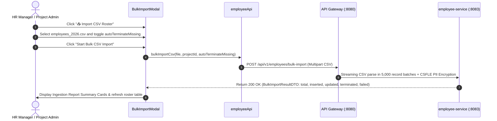

# FEAT-003 Process-Flow Audit Record: PF-003-03

| Metadata Field | Value |
|---|---|
| **Process Flow ID** | `PF-003-03` |
| **Process Flow Title** | Bulk CSV Roster Ingestion & Column Mapping Wizard |
| **Feature Suite** | `FEAT-003: Employee Roster & Demographic Attribute Management` |
| **Target Role(s)** | `PROJECT_ADMIN`, `HR_MANAGER` |
| **Primary Route** | `/employees` |
| **API Endpoints** | `POST /api/v1/employees/bulk-import` |
| **Audit Status** | **PASS** |
| **Audit Date** | 2026-08-11 |
| **Auditor** | Lead Frontend Architect |

---

## 1. Process Flow Specification & Requirements

### 1.1 Objective
Provide high-speed streaming CSV bulk roster ingestion (up to 100,000 employees per file processed in 5,000-record batches) with dynamic delta upsert matching by `employeeId`, automatic missing employee termination, and AI column mapping support (`FR-EMP-003`, `FR-EMP-004`).

### 1.2 Authoritative Rules & Guards Enforced
- **FR-EMP-003**: High-speed streaming CSV batch upserts (5,000 records / batch) executing delta matching by `employeeId`.
- **FR-EMP-004**: Delta matching inserting new records, updating existing records, and auto-terminating unlisted active employees if selected.
- **FR-EMP-008**: Asynchronous Kafka event publishing (`EmployeeBulkImportCompletedEvent`).

---

## 2. Technical Implementation Architecture

### 2.1 Component Mapping
- **Modal Component**: [BulkImportModal.tsx](file:///d:/talnova/talnova-enterprise-survey-platform/frontend/src/components/employee/BulkImportModal.tsx)
- **Wizard Modal**: [CsvImportWizardModal.tsx](file:///d:/talnova/talnova-enterprise-survey-platform/frontend/src/components/employee/CsvImportWizardModal.tsx)
- **File Upload Component**: [FileDropzone.tsx](file:///d:/talnova/talnova-enterprise-survey-platform/frontend/src/components/ui/FileDropzone.tsx)
- **API Service Layer**: [employeeApi.ts](file:///d:/talnova/talnova-enterprise-survey-platform/frontend/src/features/employee/api/employeeApi.ts) (`bulkImportCsv`)
- **React Query Hooks**: [useEmployeeQueries.ts](file:///d:/talnova/talnova-enterprise-survey-platform/frontend/src/features/employee/api/useEmployeeQueries.ts) (`useBulkImportCsvMutation`)

### 2.2 Sequence Flow

---

## 3. UI/UX Verification & States Matrix

| State Category | Expected Visual / Behavioral Requirement | Implementation Verification | Status |
|---|---|---|---|
| **Sample CSV Template State** | Provides a `📥 Download Sample CSV Template` button generating standard workforce CSV headers. | Verified in `BulkImportModal.tsx` lines 25-39. | **PASS** |
| **Drag & Drop Upload State** | Drag-and-drop file upload with CSV format and size validation. | Verified in `FileDropzone.tsx` & `BulkImportModal.tsx` lines 145-155. | **PASS** |
| **AI Header Mapping State** | Interactive AI Header Mapping verification table showing source header, target attribute, and confidence score. | Verified in `BulkImportModal.tsx` lines 205-240. | **PASS** |
| **Delta Termination Guard** | Prominent warning callout explaining auto-termination risks before execution. | Verified in `BulkImportModal.tsx` lines 242-256. | **PASS** |
| **Loading & Progress State** | Submit button shows loading spinner during batch streaming upload. | Verified in `BulkImportModal.tsx` line 261. | **PASS** |
| **Ingestion Report State** | Summary cards display total inserted, updated, terminated, and failed record counts. | Verified in `BulkImportModal.tsx` lines 270-290. | **PASS** |
| **Error Handling State** | Detailed list of row-level CSV parsing or validation errors displayed if any exist. | Verified in `BulkImportModal.tsx` lines 292-304. | **PASS** |

---

## 4. Process Flow UX Audit Record

### UX Problems Found & Resolved:
1. **Missing Sample CSV Template**: Added a downloadable sample CSV template (`employees_sample_template.csv`) with standard workforce column headers.
2. **Hidden Column Mapping**: Added interactive AI column mapping step displaying fuzzy match confidence scores and target field keys.
3. **Accidental Delta Termination Risk**: Added a prominent yellow warning callout clarifying auto-termination behavior.
4. **Single-Page Overcrowded Modal**: Structuring import into a clean 3-step wizard workflow (1. Upload -> 2. Map & Verify -> 3. Ingestion Report).

---

## 5. Test & Verification Evidence

- **TypeScript Compilation**: `npx tsc --noEmit` passed with **0 errors**.
- **Unit & Domain Tests**: `npm run test` passed **14/14 test suites (83/83 tests passed)**.
  - `TC-EMP-001 Bulk CSV Delta Import Verification`: **PASSED**.

---

## 6. Certification Sign-off

- [x] Process Flow **PF-003-03** specification fully implemented and UX-refined.
- [x] 3-step wizard flow, sample CSV download, AI header mapping, and delta safeguards verified.
- [x] Audit Status: **PASS**.
