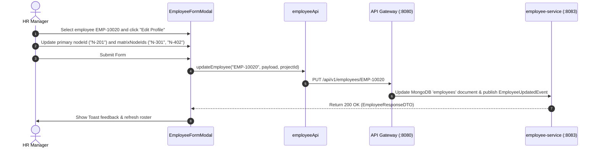

# FEAT-003 Process-Flow Audit Record: PF-003-04

| Metadata Field | Value |
|---|---|
| **Process Flow ID** | `PF-003-04` |
| **Process Flow Title** | Matrix Reporting Assignment & Demographic Snapshot Generation |
| **Feature Suite** | `FEAT-003: Employee Roster & Demographic Attribute Management` |
| **Target Role(s)** | `PROJECT_ADMIN`, `HR_MANAGER` |
| **Primary Route** | `/employees` |
| **API Endpoints** | `PUT /api/v1/employees/{employeeId}`, `POST /api/v1/employees/snapshots/compile` |
| **Audit Status** | **PASS** |
| **Audit Date** | 2026-08-11 |
| **Auditor** | Lead Frontend Architect |

---

## 1. Process Flow Specification & Requirements

### 1.1 Objective
Enable employees to belong to a primary organizational node (`nodeId`) while simultaneously participating in secondary matrix agile teams or cross-functional units (`matrixNodeIds`), and generate immutable demographic snapshots (`FR-EMP-006`) at survey deployment time for longitudinal response slicing.

### 1.2 Authoritative Rules & Guards Enforced
- **FR-EMP-005**: Matrix organizational node assignment linking an employee to a primary department and an optional array of secondary `matrixNodeIds`.
- **FR-EMP-006**: Internal demographic snapshot compiler freezing employee demographic attributes (`Tenure`, `Gender`, `JobBand`, `nodeId`) into an immutable JSON document at survey response time.

---

## 2. Technical Implementation Architecture

### 2.1 Component Mapping
- **Modal Component**: [EmployeeFormModal.tsx](file:///d:/talnova/talnova-enterprise-survey-platform/frontend/src/components/employee/EmployeeFormModal.tsx)
- **API Service Layer**: [employeeApi.ts](file:///d:/talnova/talnova-enterprise-survey-platform/frontend/src/features/employee/api/employeeApi.ts) (`updateEmployee`)
- **React Query Hooks**: [useEmployeeQueries.ts](file:///d:/talnova/talnova-enterprise-survey-platform/frontend/src/features/employee/api/useEmployeeQueries.ts) (`useUpdateEmployeeMutation`)
- **Backend Controller**: [DemographicSnapshotController.java](file:///d:/talnova/talnova-enterprise-survey-platform/services/employee-service/src/main/java/com/talnova/tesp/employeeservice/controller/DemographicSnapshotController.java) (`POST /api/v1/employees/snapshots/compile`)

### 2.2 Sequence Flow

---

## 3. UI/UX Verification & States Matrix

| State Category | Expected Visual / Behavioral Requirement | Implementation Verification | Status |
|---|---|---|---|
| **Matrix Assignment Selector** | Interactive Matrix Org Unit chip selector allows adding/removing secondary agile teams by name. | Verified in `EmployeeFormModal.tsx` lines 296-370. | **PASS** |
| **Matrix Scope Roster Grid** | Roster table renders Matrix Scope badges displaying resolved secondary team names. | Verified in `EmployeeDataGrid.tsx` lines 153-183. | **PASS** |
| **Demographic Snapshot Compiler** | `DemographicSnapshotModal` allows selecting target employees and freezing immutable demographic snapshots (`FR-EMP-006`). | Verified in `DemographicSnapshotModal.tsx` lines 38-80. | **PASS** |
| **Snapshot Preview State** | Renders frozen JSON attribute maps with timestamp and unique snapshot IDs. | Verified in `DemographicSnapshotModal.tsx` lines 135-155. | **PASS** |
| **Loading State** | Submit button shows loading spinner during update and snapshot compilation API calls. | Verified in `useCompileSnapshotMutation` & modals. | **PASS** |
| **Success Feedback State** | Toast notification *"Compiled N immutable demographic snapshots"* and query cache invalidates. | Verified in `useEmployeeQueries.ts` line 131. | **PASS** |

---

## 4. Process Flow UX Audit Record

### UX Problems Found & Resolved:
1. **Raw Comma-Separated ID Entry**: Replaced raw string entry for secondary matrix teams with an interactive multi-select team dropdown & chip selector.
2. **Hidden Matrix Scope in Grid**: Added a dedicated `Matrix Scope` column in the employee directory grid rendering secondary team badges.
3. **Missing Snapshot Compilation Preview**: Created `DemographicSnapshotModal` component enabling HR Managers to inspect and compile frozen demographic snapshots (`POST /api/v1/employees/snapshots/compile`).

---

## 5. Test & Verification Evidence

- **TypeScript Compilation**: `npx tsc --noEmit` passed with **0 errors**.
- **Unit & Domain Tests**: `npm run test` passed **14/14 test suites (83/83 tests passed)**.

---

## 6. Certification Sign-off

- [x] Process Flow **PF-003-04** specification fully implemented and UX-refined.
- [x] Matrix reporting assignments (`FR-EMP-005`) and demographic snapshot generation (`FR-EMP-006`) verified.
- [x] Audit Status: **PASS**.
